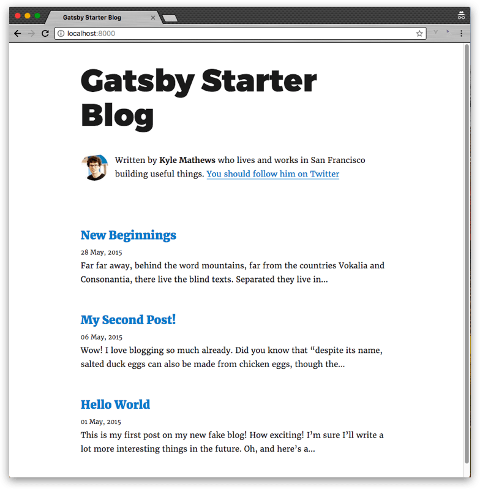

## ブログ開設手順
Gatsbyってなにって状態から30分程度でブログを開設できました。
下記にそのときの手順をメモしておきます。

## 0. 前提条件
Git、Node、npmは事前にインストールしておいてください。

## 1. ブログのスターターキットを起動
Gatsbyはブログをすぐ始められるようにスターターキット(スキャフォールド)を用意しています。
まずはそれを使ってローカルでブログを起動してみます。

### 1-1. Gatsbyインストール

```bash
npm install -g gatsby
```

### 1-2. プロジェクト生成
```bash
gatsby new blog https://github.com/gatsbyjs/gatsby-starter-blog
```

### 1-3. ローカルで起動
```bash
cd blog
npm run dev
```

[http://localhost:8000](http://localhost:8000/)にアクセスするとブログが表示されます。



## 2. ブログの記事などを自分仕様にカスタマイズ
現状だと、ブロガーがKyle Mathews氏(Gatsbyの作者)になっていたり、仮の記事が3つある状態なので、
自分仕様にカスタマイズします。
<small>ここでは僕の例を示します。</small>


### 2-1. ブラウザタブのタイトル修正
`gatsby-config.js`の`siteMetadata`を下記のように修正します。
なお`siteUrl`はGitHub Pagesでの公開を想定したものです。


```js{3-6}:title=gatsby-config.js
module.exports = {
  siteMetadata: {
    title: 'Takumon Blog',
    author: 'Takuto Inoue',
    description: '日々の作業をつづっていきます。',
    siteUrl: 'https://takumon.github.io/blog',
  },
  ・・・
};
```

### 2-2. 画面タイトル修正
`src/layouts/index.js`を修正します。
`Gatsby Starter Blog`となっている部分が2カ所あるので、自分のブログ名に修正します。
僕は`Takumon Blog`にしました。


### 2-3. プロフィール修正
`src/components/Bio.js`のアバター(imgタグ)と自己紹介文(pタグ)を修正します。

```html{2-9,13}:title=src/components/Bio.js

<p>
  Written by <strong>Takuto Inoue</strong> who lives and works in Tokyo building useful things.
</p>
```

### 2-4. 余計な記事を削除
記事は`src/page`配下にフォルダ分けされて存在します。
1つ目以外の記事は不要なのでフォルダごと削除します。
あと1つ目の記事て使っている画像も削除します。

```bash{5-9}
src/
├── pages
│   ├── hello-world
│   │   ├── index.md
│   │   └── salty_egg.jpg ・・・削除対象
│   ├── hi-folks          ・・・削除対象
│   │   └── index.md
│   └── my-second-post    ・・・削除対象
│       └── index.md
```

### 2-5. 記事を編集
1つめの記事`src/pages/hello-world/index.md`を編集します。
マークダウンファイル上部にメタ情報としてタイトルと作成日時を、その下に本文を記載しましょう。

```markup{2-3,6}:title=src/pages/hello-world/index.md
---
title: Hello World
date: "2018-09-10T12:00:00.000Z"
---

Gatsbyでブログ始めました！
```

### 2-6. ローカルで起動

この状態で`npm run dev`して[http://localhost:8000](http://localhost:8000)を見てみると下記のようになっています。

記事一覧


記事詳細


ここまでで一通り自分のブログをローカルで作ることができました。

## 3. GitHub Pagesにブログを公開
Gatsbyを使うとnpmスクリプト一発でGitHub Pageに公開ができます。
ここではGitHubでのリポジトリ作成などの事前準備も含めて手順を示します。


### 3-1. GitHubにリポジトリ作成
GitHubにリポジトリを作り、手順2で作成した資産をプッシュしてください。

### 3-2. GitHub Pagesの設定
GitHubのリポジトリ > settings > GitHub Pages > Source で`gh-pages branch`を選択します。

### 3-3. メタ情報の修正
手順2によりローカルでブログを起動できるようになりましたが、GitHub Pagesに公開するには、まだ少し修正が必要です。

#### gatsby-config.jsのpathPrefixの修正
ブログのコンテキストURLは、現状だとスターターキットの値なので修正します。
これを指定するとブログのURLが`https://[オーナー名].github.io/[pathPrefixの値]/`のようになります。
僕の場合は`https://takumon.github.io/blog`のようになります。


```js{3}:title=gatsby-config.js
module.exports = {
  ・・・
  pathPrefix: '/blog',
  ・・・
}
```

#### package.json、pacakge-lock.json、README.mdのメタ情報修正
上記3ファイルにおいて、プロジェクト名や、管理者、ブログのURLなどが、すべてスターターキットの状態になっているので
自分仕様に修正します。


### 3-4. 資産をgh-pagesブランチにプッシュ
`git push origin master`でマスターに最新資産をプッシュします。

`npm run deploy`を実行します。実態は`gatsby build && gh-pages -d public`というコマンドです。これを実行するとgatbyコマンドによりビルド資産をgh-pagesブランチにプッシュしてくれます。


### 3-5. 公開できたことを確認
GitHub Pagesの公開URLをブラウザでたたき、自分のブログが公開されていることを確認します。


## まとめ
以上でブログの公開手順は終了です。
Gatsbyを使えばとても簡単にブログを始められます。
みなさんもGatsbyでブログ始めてみてはいかがでしょうか🍅

## 参考記事
- [React.js製の静的サイトジェネレーターGatsbyに移行した](https://qiita.com/jaxx2104/items/5f28915355a85d36e38a)
  - Gatsbyを始めるきっかけとなった記事です。この記事のおかげで簡単にGatsby製ブログを開設できました。


