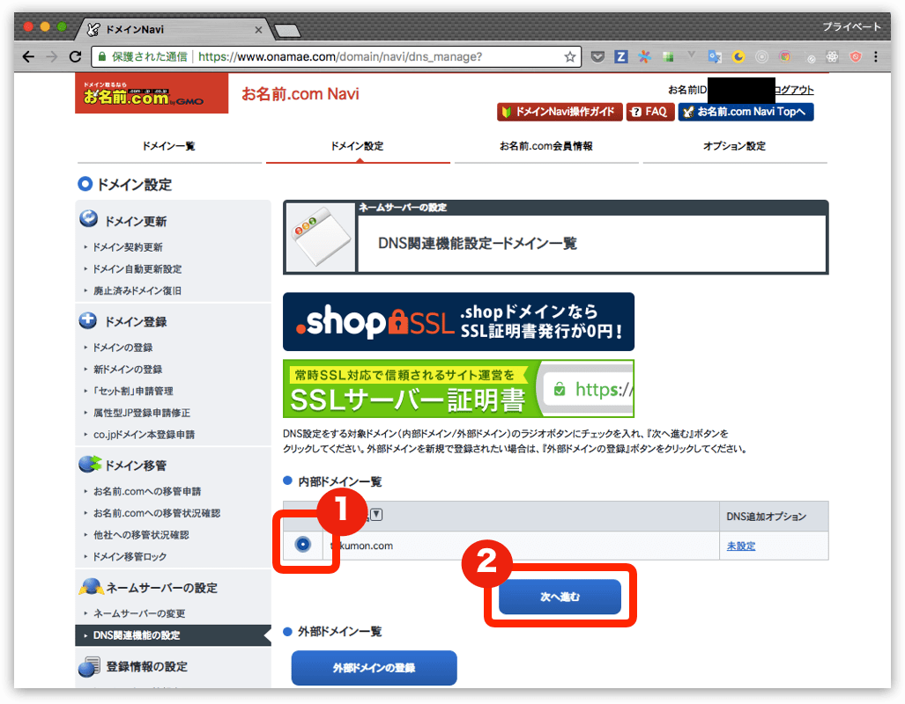
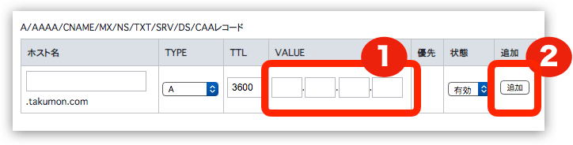
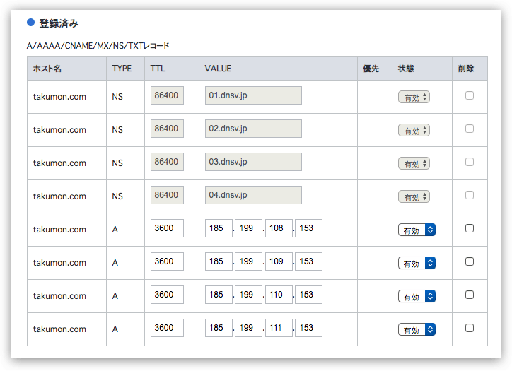
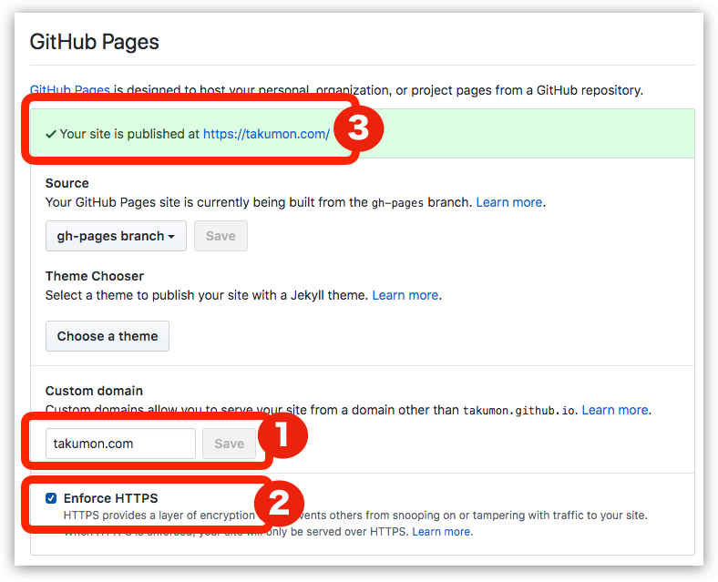

## なにこれ
GitHub Pagesでブログを開設した後、
どうせならURLも短く覚えてもらいやすいものにしようと思い独自ドメインに切り替えました。
その方法のメモです。　※（注意）独自ドメイン取得はお金がかかります！！！

## 手順
### 1. 独自ドメインを取得する
いつくかサービスはありますが、有名どころの[お名前.com](https://www.onamae.com/)で取得します。アクセスして検索窓に、自分のほしい独自ドメインを入力し検索してみます。
他の人が既に取得していなければ、そのまま手続きに進みます。<br />
「早い者勝ちです。」と煽っているわりには　`takumon.com`は誰も使ってなかったので、よほど(`taro.com`みないなの)でない限り、
自分のほしいドメインはゲットできるのではないでしょうか。


### 2. DNSレコードを設定する
独自ドメインに対してGitHubがあらかじめ用意しているDNSレコードを設定します。
* お名前.comでドメインが取得できると[お名前.com Navi](https://navi.onamae.com/)という管理コンソールにログインできるようになるので、まずはそこにアクセスします。

* DNSタブを選択し、ドメインのDNS関連機能設定を選択し、次へボタンをクリックします。


* 下記画面で対象の独自ドメインを選択し、次へ進むボタンをクリックします。


* `DNSレコード設定を利用する`の設定ボタンをクリックします。


* [GitHub 公式サイト](https://help.github.com/articles/setting-up-an-apex-domain/)に載っている4つのレコードを登録します
  * 登録する4つのレコード
      * `185.199.108.153`
      * `185.199.109.153`
      * `185.199.110.153`
      * `185.199.111.153`
  * 具体的には下記にDNSレコードを指定して、追加ボタンをクリックします。
    
  * 4つ追加すると下記のような感じになるので、画面下部の確認画面へすすむボタンをクリックします。
    

* こんな感じになっていることを確認して設定するボタンをクリックします。
  

お名前.comの設定は以上です。

### 3. GitHub Pagesの設定を変更する(Https対応も含む)
いままで http://takumon.github.io/ のようはGitHub Pages標準のURLだったところを準備した独自ドメインに変更します。

1. GitHubでブログリポジトリのsettingsタブを開き　GitHub Pages > Custom domain に準備した独自ドメインを入力しSaveボタンをクリックします。
    * しばらく待ってSettingsタグを開き直すとhttp://独自ドメイン でブログにアクセスできるようになります。
2. その後 GitHub Pages > Enforce HTTPS にチェックを入れます。
3. またしばらく待つと https://独自ドメイン でブログにアクセスできるようになります。

※GitHub Pagesの設定は反映までに少し時間がかかったりするので、設定直後はエラーまたは警告メッセージが表示されますが、しばらくたつと解消するので2〜3分ほど待ってみてください。

### 4. ブログリポジトリにて独自ドメインを設定する
手順3で独自ドメインにアクセスできるようになりますが、再度ブログを記事を更新してgh-pagesブランチにブログをデプロイすると
GitHub Pagesの独自ドメイン設定がもとに戻ってしまいます。<br />
これを防ぐためにはブログのリポジトリの`static`フォルダに`CNAME`というファイルを格納し、
下記のように独自ドメインを定義します。

```
takumon.com
```
そうすることで次回以降デプロイ時もGitHub Pagesの独自ドメイン設定が保たれるようになります。

## まとめ
GitHub Pagesの方がHttps対応は用意してくれているので、独自ドメインに対するドメインレコードの設定さえできれば、あとは簡単に、独自ドメイン化+Https化を実現できました🍅

## 参考
* [GitHub Pages + 独自ドメイン + HTTPS (SSL) のサポートをGitHubが提供開始](https://qiita.com/foobaron/items/cd9cfc403defa706372b)
  * Qiitaで参考にした記事です。
* [GitHub 公式サイト](https://help.github.com/articles/setting-up-an-apex-domain/)
  * 英語ですが、、、色々ちゃんと書いてありますね。
* [Gatsby 公式サイト](https://www.gatsbyjs.org/docs/how-gatsby-works-with-github-pages/#custom-domains)
  * GitHub Pagesで独自ドメインを設定する時の注意事項が記されています。
