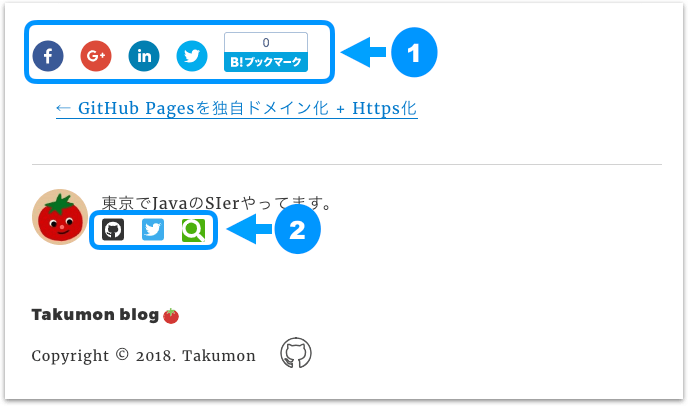
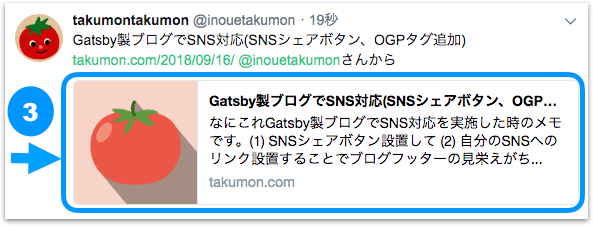
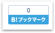
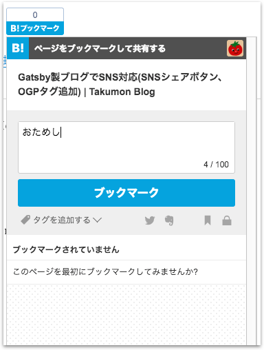
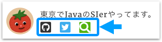
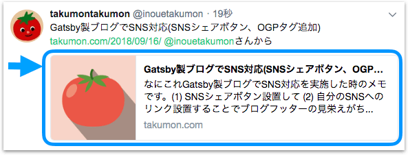

## なにこれ
Gatsby製ブログ(Reactアプリ)でSNS対応した時のメモです。<br>
**(1) SNSシェアボタン**と**(2) 自分のSNSへのリンク**を設置して、ブログの記事をSNSでシェアできるように、、、<br>
また、**(3) OGPタグを設定し**、SNSでシェアするときにイメージ画像や、タイトル、記事概要を表示できるようにしました。
* ブログのフッター
  
* Twitterの呟き
  

##  1. SNSシェアボタンを設置


### Facebook、Google、Linkedin、Twitterシェアボタン
[react-share](https://github.com/nygardk/react-share)でめっちゃ簡単にできます。<br>
それぞれ専用タグが用意されているので<br>
`url`属性に記事のURL、`icon`属性にアイコンサイズを指定するだけです。<br>
Linkedinアイコンはそれに加えて`title`属性に記事タイトルを<br>
Twitterアイコンは`via`属性に自分のTwitterアカウント名、`title`属性に記事タイトルを指定します。<br>
※下記コード中の`articleUrl`は記事URL、`articleTitle`は記事タイトルです。

```html{10,13}
<FacebookShareButton url={articleUrl}>
  <FacebookIcon size={32} round />
</FacebookShareButton>

<GooglePlusShareButton url={articleUrl}>
  <GooglePlusIcon size={32} round />
</GooglePlusShareButton>

<LinkedinShareButton url={articleUrl}>
  <LinkedinIcon title={articleTitle} size={32} round />
</LinkedinShareButton>

<TwitterShareButton title={articleTitle} via="@inouetakumon" url={articleUrl}>
  <TwittearIcon size={32} round />
</TwitterShareButton>
```

<br>
すると下記のように画面にSNSシェアアイコンが表示されます。


### はてブ追加ボタン
`bookmark_button.js`というJavaScriptファイルを読み込んで、リンクタグを設置するだけです。
```jsx
<Helmet>
  <script type="text/javascript" src="//b.st-hatena.com/js/bookmark_button.js" charset="utf-8" async="async" />
</Helmet>
<a
  href="http://b.hatena.ne.jp/entry/"
  className="hatena-bookmark-button"
  data-hatena-bookmark-layout="vertical-normal"
  data-hatena-bookmark-lang="ja"
  title="このエントリーをはてなブックマークに追加"
  >
  
</a>
```

<br>
すると下記のように画面にはてブ追加アイコンが表示されます。


クリックするとウィジェットが表示されます。(`bookmark_button.js`がやってくれています。)



## 2. 自分のSNSへのリンクを設置
SNSへのリンクアイコンは[react-fontawesome](https://github.com/FortAwesome/react-fontawesome)を使いました。<br>
まずはreact-fontawesomeをインストールします。

```bash
npm install --save @fortawesome/react-fontawesome
npm install --save @fortawesome/fontawesome-svg-core
npm install --save @fortawesome/free-brands-svg-icons
npm install --save @fortawesome/free-solid-svg-icons
npm install --save @fortawesome/free-regular-svg-icons
```

<br>
実装は下記のようにします。スタイルの細かい部分は省略していますが、ざっくり書きのような感じです。Qiitaだけ小細工してます。

|||
|:-|:-|
|GitHub|Font Awsomeアイコン使用。背景をダークグレイ。|
|Twitter|Font Awsomeアイコン使用。背景を水色。|
|Qiita|Font Awsomeに用意がないので、**代わりに虫眼鏡アイコン使用。背景を黄緑にしてQiitaっぽくする**|

```js{13-17,19-23,25-37}
・・・

import { FontAwesomeIcon } from '@fortawesome/react-fontawesome';
import { faGithubSquare, faTwitterSquare } from '@fortawesome/free-brands-svg-icons'
import { faSearch } from '@fortawesome/free-solid-svg-icons'

・・・

class Bio extends React.Component {
  render() {
    return (
      ・・・
      <a href="https://github.com/Takumon">
       <FontAwesomeIcon
         color="#333"
         icon={faGithubSquare} />
      </a>

      <a href="https://twitter.com/inouetakumon">
        <FontAwesomeIcon
          color="#3eaded"
          icon={faTwitterSquare} />
      </a>

      <a href="https://qiita.com/Takumon">
        <FontAwesomeIcon
          color="white"
          style={{
            overflow: 'hidden',
            height: '0.9em',
            width: '0.9em',
            backgroundColor: '#4cb10d',
            borderRadius: '2px',
            marginTop: '2px',
          }}
          icon={faSearch} />
      </a>

      ・・・
    );
  }
}
```

<br>
ここまでくると、下記のようなアイコンが画面に追加されています。




## 3. OGPタグを設定
OGPとは、「Open Graph Protcol」の略でFacebookやTwitterなどのSNSでシェアした際に、
WEBページのタイトルやイメージ画像、説明文などをわかりやすく伝えるためのHTML要素です。
OGPをWebページで設定することでユーザーに対してWEBページの内容を詳しく伝えることができます。

### OGPタグを定義
Reactアプリだと、[ReactHelmet](https://github.com/nfl/react-helmet)を使います。<br>
今回はOgpタグを作りました。ただブログのトップと記事詳細で設定する値が違うので、そこはコンポーネントの引数で受け取れるようにしています。<br>
※`blog-config.js`はブログタイトルなどの設定しているファイルです。

```js{4-11,13,18-27}
import React from 'react'
import Helmet from 'react-helmet'

import {
  blogTitle,
  blogUrl,
  blogDescription,
  blogImageUrl,
  facebookAppId,
  blogAuthorTwitterUserName,
} from '../config/blog-config.js';

export default function Ogp({isRoot, title, description}) {
  const type = isRoot ? 'website' : 'article';

  return(
    <Helmet>
      <meta property="og:title" content={title || blogTitle} />
      <meta property="og:description" content={description || blogDescription} />

      <meta property="og:url" content={blogUrl} />
      <meta property="og:type" content={type} />
      <meta property="og:site_name" content={blogTitle} />
      <meta property="og:image" content={blogImageUrl} />
      <meta property="fb:app_id" content={facebookAppId} />
      <meta name="twitter:card" content="summary" />
      <meta name="twitter:site" content={`@${blogAuthorTwitterUserName}`} />
    </Helmet>
  )
}
```

<br>
いろいろあるプロパティは下記の通り
<br>
<br>

|プロパティ名|説明|
|:--|:--|
|og:title|ページのタイトル。SNS共有時は、headのtitleタグよりも優先して使われます。|
|og:description|ページの説明。|
|og:url|ページのURL。|
|og:type|ページの属性、だいたい`website`か`article`を指定します。詳細は[ココ](http://ogp.me/#types)参照|
|og:site_name|Webサイト名。|
|og:image|ページのイメージ画像|
|fb:app_id|FacebookのアプリID。FacebookでOGPを表示させる際に必須。アプリIDの取り方は[FacebookのOGP設定に必要なfb:app IDの取得方法](https://design-plus1.com/tcd-w/2018/01/facebook_app_id.html)参照。|
|twitter:card|OGPのレイアウトのタイプ。詳細は[【2018年版】Twitterカードとは？使い方と設定方法まとめ](https://saruwakakun.com/html-css/reference/twitter-card)参照。|
|twitter:site|Twitterのユーザ名。|


### OGPタグ呼び出し

こんどは作ったOgpタグを呼び出す側の実装です。
Gatsby製ブログではトップページとブログ議事ページの2カ所で呼び出します。

#### ブログトップページでの呼び出し
**src/layouts/index.js**<br>
全体のテンプレートなのでURLがブログトップページの時のみOGPタグを呼び出します。
```jsx
<Ogp isRoot={isRoot} />
```

#### ブログ記事ページでの呼び出し

```html{4}:title=src/templates/blog-post.js
<Ogp isRoot={isRoot} />
  isRoot={false}
  title={`${post.frontmatter.title} | ${siteTitle}`}
  description={sumarrize(post.html)}/>
```

4行目の`sumarrize`メソッドではブログ記事(HTML形式)から[striptags](https://github.com/ericnorris/striptags)というライブラリを使ってテキストを抽出し、冒頭120文字を1行にして返すようにしています。
```js
function sumarrize(html) {
  const postContent = striptags(html).replace(/\r?\n/g, '').trim();
  return postContent.length <= 120
    ? postContent
    : postContent.slice(0, 120) + '...';
}
```
<br>

※[striptags](https://github.com/ericnorris/striptags)は非常に便利なライブラリですが、1点だけ注意点があって、最新バージョンの3系(2018/9/16現在)はGatsbyビルド時にエラーになるため**2系を使用してください**。Gatsbyではビルド時に[Uglifyjs](https://github.com/mishoo/UglifyJS2)を使用しているためES6のコードをコンパイルできません。

<br>

これでTwitterなどでシェアするとイメージ画像とタイトル、記事概要を表示してくれるようになります。
  

開発中に下記サイトで実際にどんな感じになるかを確認できます。
* Twitter → [Card validator](https://cards-dev.twitter.com/validator)
* Facebook → [シェアデバッガー](https://developers.facebook.com/tools/debug/)

## まとめ
今回はReactアプリでSNSシェアボタンや自分のSNSへのリンクを設置し、さらにOGPタグを設置して
Twitterなどでのシェアをより効果的にする方法をメモに残しました。
Reactだと、かなり簡単に実現できるし、グっと今時のWebサイトっぽくなるので是非みなさんも試してみてください🍅

## 参考
* [react-share](https://github.com/nygardk/react-share)
* [react-fontawesome](https://github.com/FortAwesome/react-fontawesome)
* [ReactHelmet](https://github.com/nfl/react-helmet)
* [Facebook・TwitterのOGP設定方法まとめ｜ferret フェレット](https://ferret-plus.com/610)
* [React Helmetを使ってOGP対応した | akameco Blog](https://akameco.github.io/blog/react-helmet/)
* [FacebookのOGP設定に必要なfb:app IDの取得方法](https://design-plus1.com/tcd-w/2018/01/facebook_app_id.html)
* [Card validator](https://cards-dev.twitter.com/validator)
  * Twitterシェア時にOGP領域プレビュー確認サイト
* [シェアデバッガー](https://developers.facebook.com/tools/debug/)
  * Facebookシェア時にOGP領域プレビュー確認サイト
* [striptags](https://github.com/ericnorris/striptags)
    * HTML文字列から単純テキストを抽出してくれるライブラリで
* [GatsbyはES6未対応 | GitHub issues](https://github.com/gatsbyjs/gatsby/issues/3780)
    * GatsbyはビルドでJSファイル最初化時にUglifyを使っており、uglifyがES6未対応なのでES6のコードをコンパイルしようとするとエラーになってしまいます。
