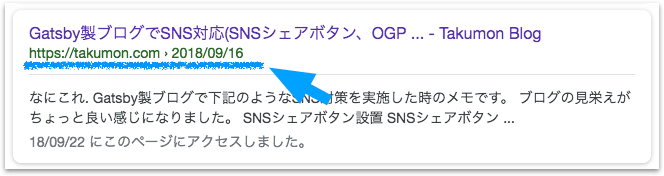
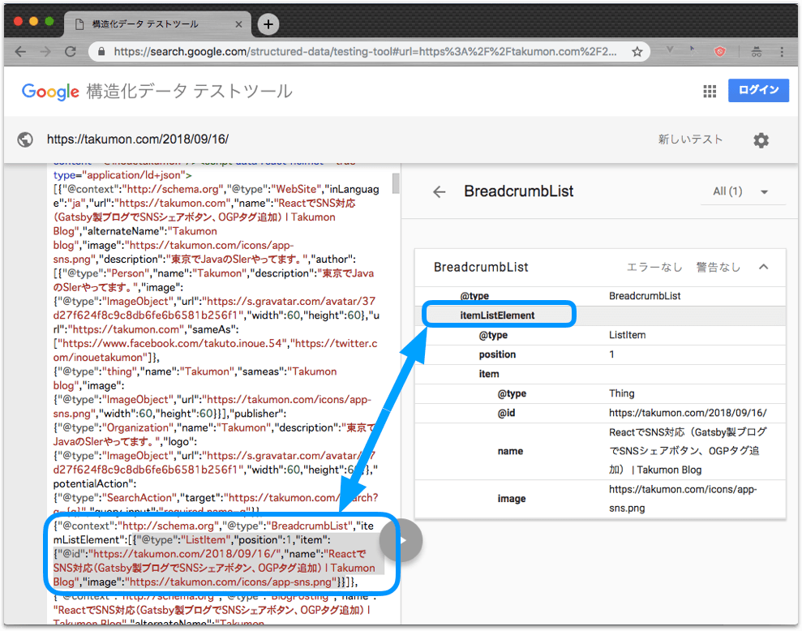
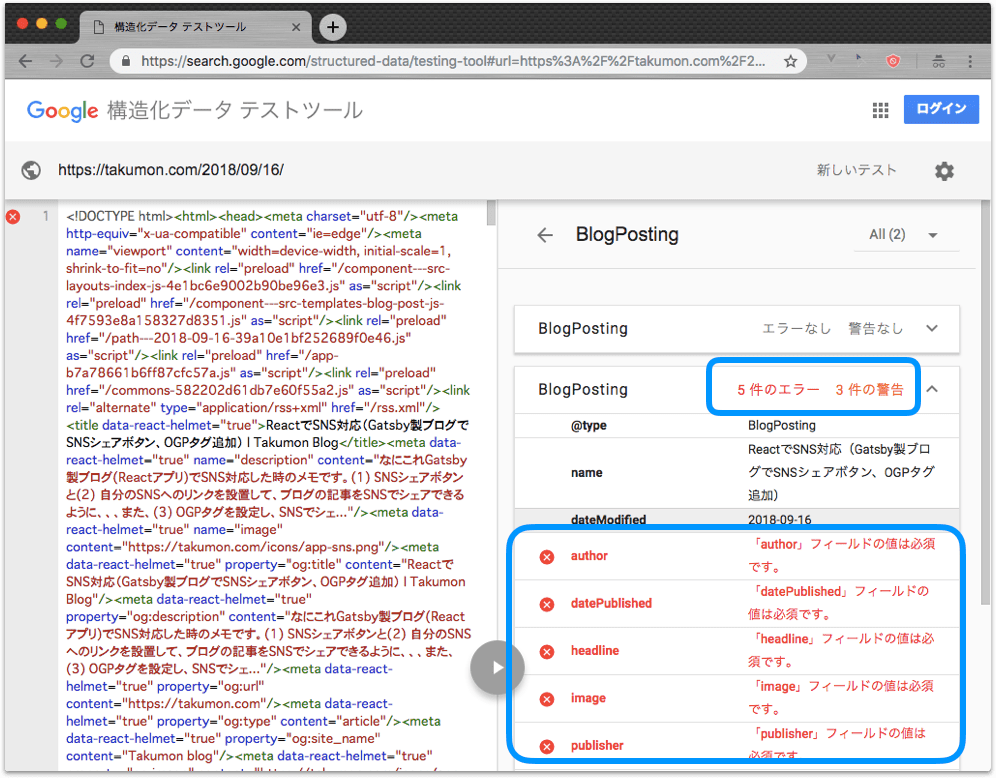

## なにこれ
**ググった時に自分のブログ(React製)でパンくずを表示させたい**
ということでJSON-LD対応しました。<br>


JSON+LDについてググると色々良い記事がでてきて一通り学ぶことができました。
ここでは、それら記事の紹介を兼ねて、構造化データの説明からパンくず実現方法についてまでを記します。


## 構造化データについて
グーグルなどの検索エンジンは、Webサイトに構造化マークアップが定義されているとパンくずやイメージ画像を表示してくれます。
構造化マークアップというのはschema.orgという大手検索エンジン(Google、Yahoo、Bing)で定めた規格にしたがったマークアップのことです。検索時だけでなく、検索エンジンがクロールするときにも、Webサイトのメタ情報としてマークアップを認識させることができ、「検索に優しいWebサイト」を作れます。

この構造化マークアップを実現するにはRDFa、Microdata、JSON-LDの3種類があります。
今回は、(1)JSON-LDはGoogleが推奨していることと、(2)JSON書きやすい、という理由からJSON+LDを使いました。

なお3種の違いについては[[構造化データ初級者向け] schema.orgとMicrodata、RDFaって何が違うの？](https://www.suzukikenichi.com/blog/difference-between-schemaorg-microdata-and-rdfa/)に詳しく書かれていました。


## JSON+LDについて
てっとり早く理解したい時は下記サイトがおすすめです。
* [Google推奨「JSON-LD」で構造化マークアップ | Qiita](https://qiita.com/narumana/items/b66969b80cce848b2ddf)
  *  Qiitaの記事です。ユースケース別に、簡単な設定例とググった時の実際のイメージが載っていてわかりやすいです。
* [構造化データをまとめてみた(JSON-LD + schema.org)](https://webnooboegaki.com/others/jsonld-schemaorg)
  * こちらもユースケース別ですが、上記Qiita記事よりも実用レベルの設定例が載っていて参考になります。

さらに理解を深めたい場合は下記サイトがおすすめです。

* [schema.org](https://schema.org)
  * 細かい仕様など、正しい仕様を把握する時に参考にしました。ググって調べたブログ記事などには古いバージョンだったり間違った情報が載ってたりするので、最終的にはココで確認してました。
* [Google Search](https://developers.google.com/search/docs/guides/)
  * このサイトの`左メニュー > Structured data > Future guies`にグーグル検索の表示結果の仕様が載っています。ただコレに従ったとしても、**必ずしも検索結果でそれ通りに表示されるわけではない**点に注意が必要です。


### 構造化テストツール
JSON+LDの概要を把握したら、実際に作ってみるのがイイです。
その時、便利なのが[構造化テストツール](https://search.google.com/structured-data/testing-tool)です。これはGoogleが提供しているWebサイトの構造化データを検証するためのツールです。
自分の作った構造化データが正しいかは、ここを見ながら作成しました。


#### 使い方
設定を貼り付けるか、URLを指定するかして、`テストを実行`ボタンをクリックすると

<br>

構造化データの解析結果を画面右半分に表示してくれます。
プロパティを選択すると対応するJSON+LDの部分がハイライトされるので便利です。

<br>


また、必須プロパティが抜けていたりすると下記のようにエラーで知らせてくれます。

<br>


#### 構造化テストツールのプレビュー機能は廃止されている
ググると構造化テストツールのプレビュー機能の情報がでてきますが、
プレビューと実際のグーグル検索結果が違うなどの問題があって現在のバージョンでは廃止されているみたいです実際のインターネットじゃないと確認できないのはちょっと残念ですね。<br>
参考：[旧構造化データテストツールの提供をGoogleが終了、リッチスニペットのプレビューができなくなった](https://www.suzukikenichi.com/blog/rip-rich-snippet-testing-tool/)


### ReactでJSON+LD
Reactだと[React Helmet](https://github.com/nfl/react-helmet)で簡単に対応でます。
こんな感じのコンポーネントを作って、どこかで呼び出してあげればいいです。<br>
下記例は自分のブログ用で、トップページと記事ページ毎に設定を切り替えています。<br>
<small>※blog-config.jsはブログの設定値を集約したものです</small>


```javascript{numberLines: true}{80-95}
import React from 'react'
import Helmet from 'react-helmet'
import * as config from '../config/blog-config.js';

export default function createJSONLDTag({
  isRoot,      // ブログトップページか（記事ページの場合false）
  title,       // 記事タイトル（記事ページの時のみ指定）
  description, // 記事概要（記事ページの時のみ指定）
  postUrl,     // 記事URL（記事ページの時のみ指定)
  postDate,    // 記事更新日（記事ページの時のみ指定）
}) {

  // ブログ管理者（自分）
  const author = [
    {
      '@type': 'Person',
      name: config.blogAuthor,
      description: config.blogAuthorDescription,
      image: {
        '@type': 'ImageObject',
        url: config.blogAuthorAvatarUrl,
        width: 60,
        height: 60
      },
      'url': config.blogUrl,
      "sameAs": [
        config.blogAuthorFacebookUrl,
        config.blogAuthorTwitterUrl,
      ]
    },
    {
      '@type': 'thing',
      name: config.blogAuthor,
      sameas: config.blogTitle,
      url: config.blogURL,
      image: {
        '@type': 'ImageObject',
        url: config.blogImageUrl,
        width: 60,
        height: 60
      }
    }
  ];

  // ブログ発行者（自分）
  const publisher = {
    '@type': 'Organization',
    name: config.blogAuthor,
    description: config.blogAuthorDescription,
    logo: {
      '@type': 'ImageObject',
      url: config.blogAuthorAvatarUrl,
      width: 60,
      height: 60
    }
  }

  // JSON+LDの設定
  const jsonLdConfigs = [
    {
      '@context': 'http://schema.org',
      '@type': 'WebSite',
      inLanguage: 'ja',
      url: config.blogUrl,
      name: title,
      alternateName: config.blogTitle,
      image: config.blogImageUrl,
      description: config.blogAuthorDescription,
      author,
      publisher,
      potentialAction: {
        '@type': "SearchAction",
        target: `${config.blogUrl}/search?q={q}`,
        'query-input': 'required name=q'
      }
    }
  ];

  if (!isRoot) {
    // パンくずリスト表示用の設定
    jsonLdConfigs.push({
        '@context': 'http://schema.org',
        '@type': 'BreadcrumbList',
        itemListElement: [
          {
            '@type': 'ListItem',
            position: 1,
            item: {
              '@id': postUrl,
              name: title,
              image: config.blogImageUrl,
            },
          },
        ],
    }),
    jsonLdConfigs.push({
        '@context': 'http://schema.org',
        '@type': 'BlogPosting',
        url: config.blogURL,
        name: title,
        alternateName: config.blogTitle,
        headline: title,
        image: {
          '@type': 'ImageObject',
          url: config.blogImageUrl,
        },
        description,
        datePublished: postDate,
        dateModified: postDate,
        mainEntityOfPage: {
          '@type': 'WebPage',
          '@id': config.blogUrl
        },
        author,
        publisher,
      });
  };

  return (
    <Helmet>
      <script type="application/ld+json">{JSON.stringify(jsonLdConfigs)}</script>
    </Helmet>
  )
}
```


80-95行目の設定をすると下記のようにグーグルの検索結果にパンくずリストが表示されます。


### まとめ
今回はschema.orgやJSON+LDについての簡単なメモと
ReactでJSON+LDを実現する具体例を紹介しました。
なお学習時は、[クックパッド](https://cookpad.com/)や[Pinterest](https://www.pinterest.jp/)など検索結果がリッチなWebサイトの構造化マークアップをのぞいてみると面白いかもしれません🍅