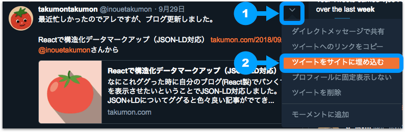

## なにこれ
ブログに良くあるYouTubeやTwitterの埋め込みをGatsbyでやる方法のメモです。<br>
こんな感じで埋め込めるようになります。

* YouTube

`youtube:https://www.youtube.com/embed/z8Kt1gXL_2M`

* Twitter

<blockquote class="twitter-tweet" data-lang="ja"><p lang="ja" dir="ltr">最近忙しかったのでアレですが、ブログ更新しました。<br><br>Reactで構造化データマークアップ（JSON-LD対応） <a href="https://t.co/7V49VqH9WI">https://t.co/7V49VqH9WI</a> <a href="https://twitter.com/inouetakumon?ref_src=twsrc%5Etfw">@inouetakumon</a>さんから</p>&mdash; takumontakumon (@inouetakumon) <a href="https://twitter.com/inouetakumon/status/1046062825037344770?ref_src=twsrc%5Etfw">2018年9月29日</a></blockquote>


## やり方
### YouTube
#### 環境設定
[公式ページ](https://www.gatsbyjs.org/packages/gatsby-remark-embed-youtube/?=youtube)で紹介されているように,
[gatsby-remark-embed-youtube](https://github.com/ntwcklng/gatsby-remark-embed-youtube)というプラグインを使います。<br>
<br>

* プラグインをインストールして

```bash
npm install --save gatsby-remark-embed-youtube
```

<br>

* `gatsby-config.js`の`gatsby-transformer-remark`にオプションとして追加します。

```javascript{7-13}
plugins: [
  // ・・・
  {
    resolve: "gatsby-transformer-remark",
    options: {
      plugins: [
        {
          resolve: "gatsby-remark-embed-youtube",
          options: {　// 固定サイズにする場合に指定
            width: 800,
            height: 400
          }
        }
      ]
    }
  },
  // ・・・
}
```

<br>

* もし`gatsby-transformer-remark`のオプションに`gatsby-remark-responsive-iframe`を指定している場合は、それより前に指定しましょう。

```javascript{2}
plugins: [
  "gatsby-remark-embed-youtube",     // 先
  "gatsby-remark-responsive-iframe"  // 後
]
```

<br>
これで準備が整いました。

#### マークダウンでの書き方

下記のように指定します。<br>
<small>
z8Kt1gXL_2Mの部分が動画のIDに当たります。<br>
例えば今見ている動画のURLがhttps://www.youtube.com/watch?v=z8Kt1gXL_2M&t=8635sとすると動画IDはz8Kt1gXL_2Mです。
</small>


```
`youtube:https://www.youtube.com/embed/z8Kt1gXL_2M`
```

<br>

するとこんな感じで表示されます。

`youtube:https://www.youtube.com/embed/z8Kt1gXL_2M`


### Twitter
#### 環境設定

こちらも[gatsby-plugin-twitter](https://github.com/gatsbyjs/gatsby/tree/master/packages/gatsby-plugin-twitter)というプラグインを使います。<br>
<br>

* プラグインをインストールして

```bash
npm install --save gatsby-plugin-twitter
```

<br>

* `gatsby-config.js`に追加します。

```javascript{3}
plugins: [
  // ・・・
  "gatsby-plugin-twitter",
  // ・・・
}
```

#### マークダウンでの書き方

* 載せたいTwitterの埋め込み用スクリプトをコピーします。




* マークダウン記事にペーストします。**ただし最後の行は削除しましょう。**Twitterウィジェット用スクリプト読み込みであり、プラグインがやってくれるので。

```html{12}
<blockquote class="twitter-tweet" data-lang="ja">
  <p lang="ja" dir="ltr">
    最近忙しかったのでアレですが、ブログ更新しました。<br><br>
    Reactで構造化データマークアップ（JSON-LD対応）
    <a href="https://t.co/7V49VqH9WI">https://t.co/7V49VqH9WI</a>
    <a href="https://twitter.com/inouetakumon?ref_src=twsrc%5Etfw">@inouetakumon</a>さんから
  </p>
  &mdash;
  takumontakumon (@inouetakumon)
  <a href="https://twitter.com/inouetakumon/status/1046062825037344770?ref_src=twsrc%5Etfw">2018年9月29日</a>
</blockquote>
<script async src="https://platform.twitter.com/widgets.js" charset="utf-8"></script> <!-- この行は削除 -->
```

<br>
するとこんな感じで表示されます。
<br>

<blockquote class="twitter-tweet" data-lang="ja"><p lang="ja" dir="ltr">最近忙しかったのでアレですが、ブログ更新しました。<br><br>Reactで構造化データマークアップ（JSON-LD対応） <a href="https://t.co/7V49VqH9WI">https://t.co/7V49VqH9WI</a> <a href="https://twitter.com/inouetakumon?ref_src=twsrc%5Etfw">@inouetakumon</a>さんから</p>&mdash; takumontakumon (@inouetakumon) <a href="https://twitter.com/inouetakumon/status/1046062825037344770?ref_src=twsrc%5Etfw">2018年9月29日</a></blockquote>


## まとめ
YouTubeとTwitter埋め込みともに、Gatsbyではプラグインが用意されているのでとても簡単に実現できました。
というか大抵の機能はプラグインが用意されていて、自分で特にやることがないという感じですね。
今後は、もうちょいReact勉強するために、本格的にブログを改造していきたいです！

