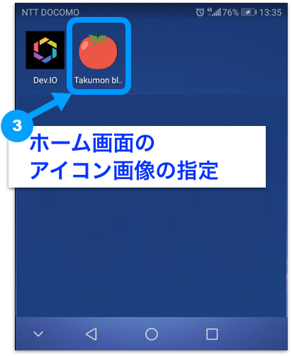
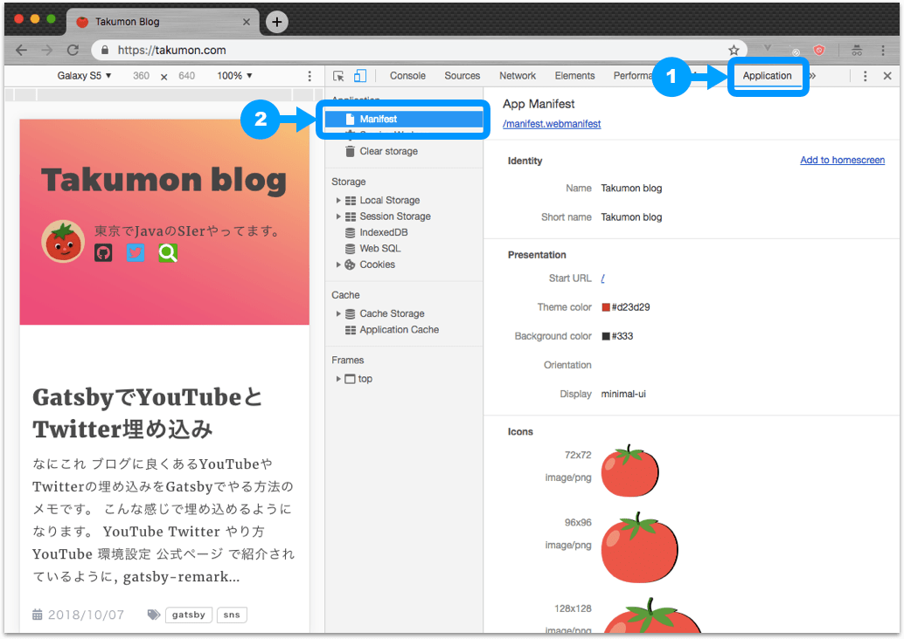

## なにこれ
スマホでネイティブアプリっぽいUXを実現するため、GatsbyでPWA対応した時のメモです。
以下の4つが可能になりました。


<br>


<br>


## 前提
* ServiceWorkerを利用するため、SSL化が必須です。そのためブログはhttpsでアクセスできるようにしておく必要があります。

## 対応概要
Gatsbyは[スターター](https://github.com/gatsbyjs/gatsby-starter-default)の時点で、PWA用のプラグイン下記2つが導入済みなので、設定を少々いじるだけで素敵なPWA対応ができます。
* [gatsby-plugin-manifest](https://github.com/gatsbyjs/gatsby/tree/master/packages/gatsby-plugin-manifest)
* [gatsby-plugin-offline](https://github.com/gatsbyjs/gatsby/tree/master/packages/gatsby-plugin-offline)

上記両方のプラグインを`gatsby-config.js`に定義する場合、`gatsby-plugin-manifest`を必ず先にする必要があります。


## gatsby-plugin-manifestの設定
PWAで必須の`manifest.webmanifest`を生成してくれるプラグインです。<br>
サイトに`manifest.webmanifest`を配置することで、スマホでブログを見たときに、ネイティブアプリのようなUXを実現できます。

### manifest.webmanifestとは
下記3サイトで概要を理解しました。
* [W3C ウェブアプリマニフェスト仕様書](https://www.w3.org/TR/appmanifest/)
* [Google ウェブアプリマニフェスト](https://developers.google.com/web/fundamentals/engage-and-retain/web-app-manifest/?hl=ja)
* [MDN ウェブアプリマニフェスト](https://developer.mozilla.org/ja/docs/Web/Manifest)

とくにGoogleのサイトでは、設定ごとにどのようなUXになるかをアニメーションで示しているので、イメージをつかみやすいです。

### アイコン画像は全サイズ用意した
`manifest.webmanifest`ではサイズ別アイコンを指定する必要があります。
プラグインでは1つ大きなアイコンを用意すれば、全サイズ自動生成してくれる...とありますが、僕はビルド時にエラーが出たので、
やむなく全サイズのアイコンを用意しました。
ただ全部手動でというわけではなく、[Web App Manifest Generator](https://app-manifest.firebaseapp.com/)という便利なサイトを使いました。アイコンを放り込むと全サイズのアイコンを作ってくれます。

参考：[3分でPWAのmanifest.jsonと各サイズのアイコンを作るApp Manifest Generatorの紹介 | Qiita](https://qiita.com/shisama/items/d4d0b24980beaea57231)

作ったアイコンは、`static/icons`配下に格納します。

```
├── static
    ├── icons
    │   ├── app-sns.png
    │   ├── icon-128x128.png
    │   ├── icon-144x144.png
    │   ├── icon-152x152.png
    │   ├── icon-192x192.png
    │   ├── icon-384x384.png
    │   ├── icon-512x512.png
    │   ├── icon-72x72.png
    │   └── icon-96x96.png
```


### gatsby-config.jsの設定
下記のようにしました。

```javascript:title=gatsby-config.js
  plugins: [
    // ・・・
    {
      resolve: 'gatsby-plugin-manifest',
      options: {
        name: 'Takumon blog',
        short_name: 'Takumon blog',
        start_url: '/?utm_source=homescreen',
        background_color: '#333', // アプリ起動時の背景色
        theme_color: '#d23d29', // ブラウザツールバーの色
        display: 'minimal-ui',　// アプリのスタイル
        "icons": [ // アイコン設定(サイズ別アイコン自動生成機能を使わない場合は、サイズ毎に設定が必要)
          {
            "src": "icons/icon-72x72.png",
            "sizes": "72x72",
            "type": "image/png"
          },
          {
            "src": "icons/icon-96x96.png",
            "sizes": "96x96",
            "type": "image/png"
          },
          // サイズ別のアイコン設定
        ],
      },
    },
    // ・・・
  }
```

### 設定のテスト
実際スマホからアクセスして試すこともできますが、
正しくマニフェストがブラウザに読み込まれているかは、PCからChrome開発者ツールの`Application` > `Manifest`で確認できます。




## gatsby-plugin-offlineの設定
ネットワークにつながりにくい環境、オフライン環境でもGatsbyのサイトが動くようにServiceWorkerを生成するためのプラグインです。
`gatsby-plugin-manifest`とあせて使う場合は、必ずこのプラグインを後に定義する必要があります。
このプラグインは[Workbox](https://developers.google.com/web/tools/workbox/modules/workbox-build)の設定を従っており、必要に応じて`gatsby-config.js`で上書くという感じです。
Workboxは宣言的な記述だけで最適なServiceWorkerのコードが生成できるライブラリで、下記にわかりやすく書かれていました。<br>
参考：[ServiceWorkerを簡単に書けるworkbox-swの使い方 | Qiita](https://qiita.com/nazonohito51/items/32b61cabdac8b24769bd)


### gatsby-config.jsの設定
とくに何もいじってません。<br>
複雑なオフライン処理をするなら修正するかもしれませんが、基本的にWorkboxに従っておけば問題なさそうでした。

```javascript:title=gatsby-config.js
  plugins: [
    // ・・・
    `gatsby-plugin-offline`,　// 必ずgatsby-plugin-manifestの後に定義する
    // ・・・
  }
```

## まとめ
これまたプラグインで簡単にPWA対応できてしまいました。（あまりプログラミングをしてる感じがありません...）<br>
次あたりは、プログラミングっぽい記事を書きたいと思います🍅