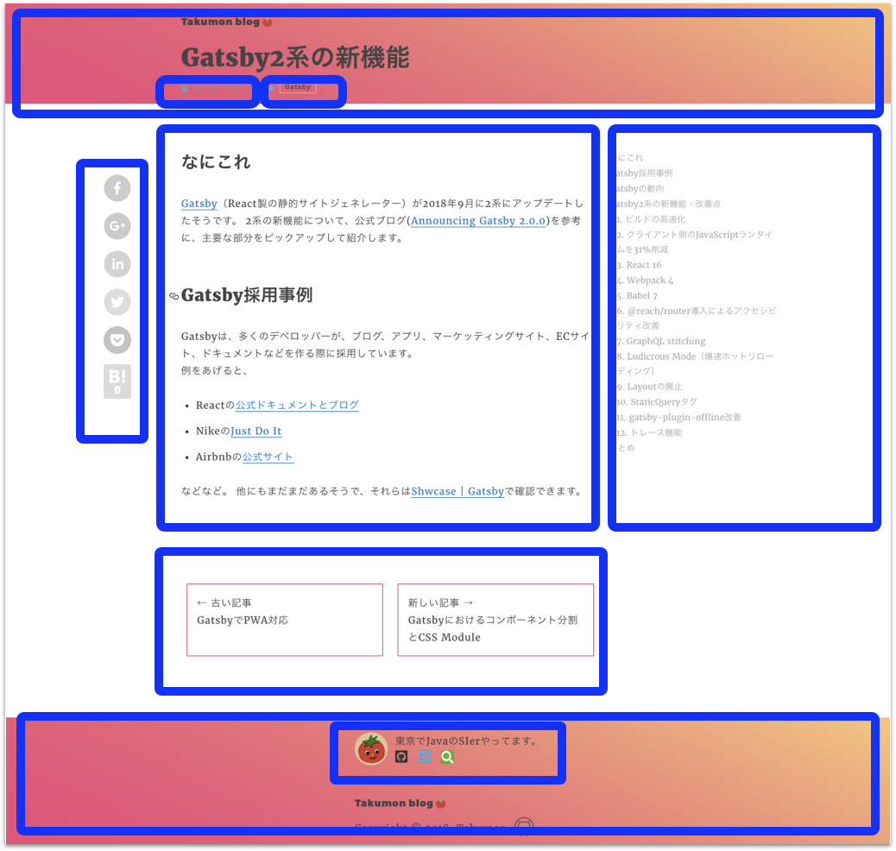

## なにこれ
[Gatsby](https://www.gatsbyjs.org/)でブログを作っていて、機能拡張とともにテンプレートが肥大化してきたので、下記図の青枠単位でコンポーネント分割しました。
あわせてCSS Moduleも採用しました。そのときのメモです。




## CSSをコンポーネントスコープにする方法
コンポーネントを分割する際、CSSもあわせて分割が必要です。その場合、グローバルスコープだとスタイルがコンポーネントに限定されなくなってしまうので、コンポーネントスコープにする必要があります。Gatsbyはコンポーネントスコープの実現方法が3つ用意されています。

* [CSS Modules](https://www.gatsbyjs.org/docs/css-modules/)
* [Using CSS-in-JS library Glamor](https://www.gatsbyjs.org/docs/glamor/)
* [Using CSS-in-JS library styled components](https://www.gatsbyjs.org/docs/styled-components/)

僕はスタイルをHTMLやJSの中に書くのを躊躇してしまう人（古い時代の人）なので、スタイルをCSSファイルに書けるCSS Moduleを採用しました。
流行はStyled Componentsなんでしょうか?

### CSS Module
CSSファイルのクラス名、アニメーション名をローカルスコープで使えるようにする仕組みです。
CSSファイルは通常のCSSと同じ文法で書くことができて、ICSSまたはInteroperable CSSと呼ばれる形式にコンパイルすることでローカルスコープを実現します。
JavaScriptファイルでCSS Moduleを使う場合、ローカル変数名をつけてインポートし、DOMのクラス名には`変数名.クラス名`のように指定します。

```js
import styles from "./style.css";

element.innerHTML = '<div class="' + styles.className + '">';
```

参考：[公式ページ](https://github.com/css-modules/css-modules)

### GatsbyでCSS Module
CSSファイル名を`XXX.module.css`のようにしてコンポーネントでインポートするだけでCSS Moduleが使えます。<br />
<br />

例えば下記のようなCSSがあるとしたら
```css:title=src/components/container.module.css
.container {
  margin: 3rem auto;
  max-width: 600px;
}
```
<br>

JavaScriptでこのように読み込みます。
```javascript{2,5}:title=src/components/container.js
import React from "react"
import styles from "./container.module.css"

export default ({ children }) => (
  <div className={styles.container}>{children}</div>
)
```

## コンポーネント分割
CSSがコンポーネントスコープにできたところで、ようやくコンポーネントを分割できるようになります。
純粋にReactの作法に従って分割します(Gatsbyは特に関係ありません)。<br>
ここでは、テンプレートから記事部分を分割するケースについて説明しましょう。<br>

**テンプレート(分割前)**
```javascript{11-14}:title=src/templates/blog-post.js
import styles from 'blog-post.module.css';

class BlogPostTemplate extends React.Component {

  render() {
    const post = this.props.data.markdownRemark

    return (
      <Layout>
        <h1 className={styles.blogTitle}>Takumon Blog</h1>
        <article>
          <h1 className={styles.postTitle}>{post.frontmatter.title}</h1>
          <div className={styles.postContent} dangerouslySetInnerHTML={{ __html: post.html }} />
        </article>
      </Layout>
    )
  }
}

export default BlogPostTemplate

export const pageQuery = graphql`
  query($slug: String!) {
    markdownRemark(fields: { slug: { eq: $slug } }) {
      html
      frontmatter {
        title
      }
    }
  }
`
```

```javascript{5-13}:title=src/templates/blog-post.module.css
.blogTitle {
  color: red
}

.postTitle {
  color: blue;
}

.postContent {
  color: green;
}
```


<hr>

分割後は下記のようになります。
なお分割したコンポーネントに記事情報を渡すための属性を定義します。ここではpostという属性名にしています。<br>
テンプレートにて記事コンポーネントのpost属性に記事情報を指定すると、
記事コンポーネントでは`this.props.post`で受け取れるようになります。

**テンプレート(分割後)**
```javascript{2,12}:title=src/templates/blog-post.js
import styles from 'blog-post.module.css';
import Post from '../components/post';

class BlogPostTemplate extends React.Component {

  render() {
    const post = this.props.data.markdownRemark

    return (
      <Layout>
        <h1 className={styles.blogTitle}>Takumon Blog</h1>
        <Post post={post} />
      </Layout>
    )
  }
}

export default BlogPostTemplate

export const pageQuery = graphql`
  query($slug: String!) {
    markdownRemark(fields: { slug: { eq: $slug } }) {
      html
      frontmatter {
        title
      }
    }
  }
`
```

```javascript:title=src/templates/blog-post.module.css
.blogTitle {
  color: red
}
```
<br>

**記事コンポーネント**
```javascript{1,6}:title=src/components/post.js
import styles from 'post.module.css';

class Post extends React.Component {

  render() {
    const post = this.props.post;

    return (
      <article>
        <h1 className={styles.postTitle}>{post.frontmatter.title}</h1>
        <div className={styles.postContent} dangerouslySetInnerHTML={{ __html: post.html }} />
      </article>
    )
  }
}

export default Post
```

```javascript:title=src/components/post.module.css
.postTitle {
  color: blue;
}

.postContent {
  color: green;
}
```

<hr>

なお分割したことにより`src/components/post.module.css`が「記事に対するスタイル」ということは自明になるので、クラス名をより簡潔にできます。

**記事コンポーネント(CSSリファクタリング後)**
```javascript{10-11}:title=src/components/post.js
import styles from 'post.module.css';

class Post extends React.Component {

  render() {
    const post = this.props.post;

    return (
      <article>
        <h1 className={styles.title}>{post.frontmatter.title}</h1>
        <div className={styles.content} dangerouslySetInnerHTML={{ __html: post.html }} />
      </article>
    )
  }
}

export default Post
```

```javascript{1,5}:title=src/components/post.module.css
.title {
  color: blue;
}

.content {
  color: green;
}
```

以上の手順を繰り返すことで、コンポーネントを細かく分割できます。

## まとめ
コンポーネントを細かく分割することで、再利用性が向上し、画面レイアウトを組みやすくなりました。
ReactのWebアプリケーションの場合は、Reduxのステート用コールバック関数の受け渡しなどで複雑になりますが、
Gatsbyのような静的Webサイトの場合、単純な分割だけで事足りるかなーと。
分割設計については[Atomic Design ~堅牢で使いやすいUIを効率良く設計する](https://www.amazon.co.jp/Atomic-Design-%E5%A0%85%E7%89%A2%E3%81%A7%E4%BD%BF%E3%81%84%E3%82%84%E3%81%99%E3%81%84UI%E3%82%92%E5%8A%B9%E7%8E%87%E8%89%AF%E3%81%8F%E8%A8%AD%E8%A8%88%E3%81%99%E3%82%8B-%E4%BA%94%E8%97%A4-%E4%BD%91%E5%85%B8/dp/477419705X)を参考にしたいところです。まだ読んでない...
