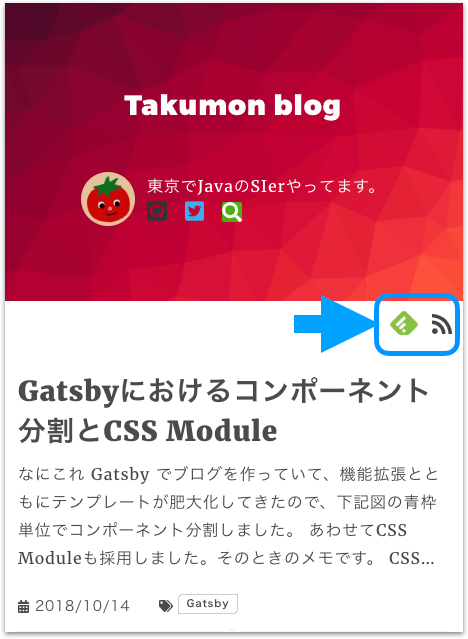
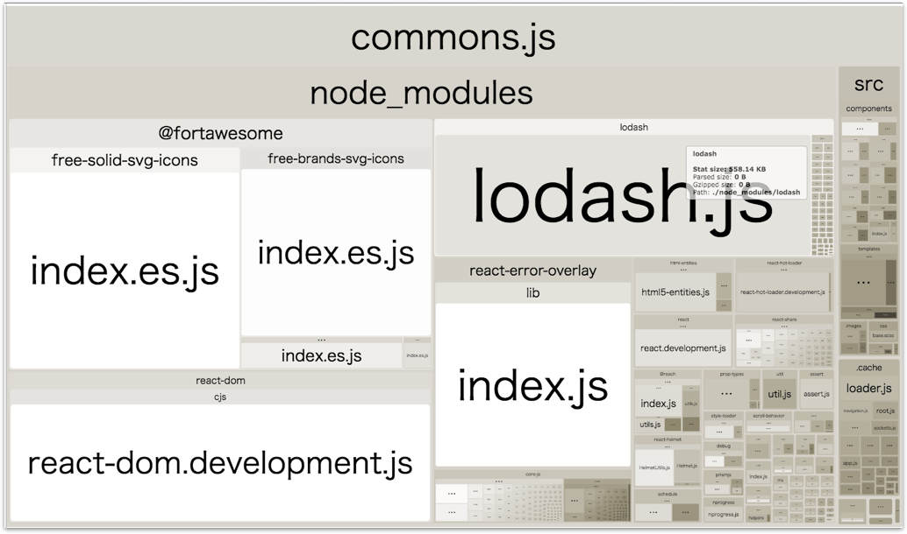

## なにこれ
[Gatsby](https://www.gatsbyjs.org/)はプラグインが充実しているので、欲しいと思った機能はだいたいプラグインにあります。
[Gatsbyの公式プラグイン](https://github.com/gatsbyjs/gatsby/tree/master/packages)とコミュニティのプラグインを合わせると
[公式サイト](https://www.gatsbyjs.org/plugins/)に登録済のプラグインは全部で502個もあるようです。<br>
今回はその中でおすすめプラグイン46個をユースケース毎にご紹介します。

## ユースケース別目次
<small>※クリックすると説明セクションにとべます。</small>

**[マークダウン系](#マークダウン系)**
* [PrismJsを使ってコードブロックでシンタックスハイライトできるようにする](#gatsby-remark-prismjs)
* [コードブロックにタイトルを表示できるようにする](#gatsby-remark-code-titles)
* [見出しにGitHub風ホバーリンクをつける](#gatsby-remark-autolink-headers)
* [絵文字が使えるようにする](#gatsby-remark-emojis)
* [Graphviz(dot言語で記述されたグラフ構造を任意のフォーマットの画像ファイルへ出力するツール)を使えるようにする](#gatsby-remark-graphviz)
* [数式が使えるようにする](#gatsby-remark-katex)
* [JavaSriptファイルなどを読み込んでコードブロックに埋め込む](#gatsby-remark-embed-snippet)
* [リンクや画像で使われているPDFや動画などをビルド時にpublicフォルダにコピーする](#gatsby-remark-copy-linked-files)
* [画像をスマートに表示できるようにする](#gatsby-remark-images)
* [iframeタグを縦横比固定でレスポンシブにする](#gatsby-remark-responsive-iframe)
* [Youtubeを埋め込めるようにする](#gatsby-remark-embed-youtube)
* [Twitterの埋め込み用スクリプトを記述できるようにする](#gatsby-plugin-twitter)

**[UI系](#ui系)**
* [ローディングに時間がかかっている時にプログレスバーを表示する](#gatsby-plugin-nprogress)
* [aタグでローカル遷移する時にリロードを抑止してヒストリーAPIで遷移できるようにする](#gatsby-plugin-catch-links)
* [1系のレイアウト機能を2系でも使えるようにする](#gatsby-plugin-layout)

**[SEO系](#seo系)**
* [React Helmetを使えるようにする](#gatsby-plugin-react-helmet)
* [低速ネットワーク環境やオフライン環境でもWebサイトをスムーズに見れるようにする](#gatsby-plugin-offline)
* [アプリをPWA対応にする（manifest.webmanifestを生成する）](#gatsby-plugin-manifest)
* [サイトマップを生成する](#gatsby-plugin-sitemap)
* [canonical linksを追加する](#gatsby-plugin-canonical-urls)
* [RSSフィードを生成する](#gatsby-plugin-feed)
* [robots.txtを生成する](#gatsby-plugin-robots-txt)

**[開補補助系](#開補補助系)**
* [ビルド時のlodashのサイズを小さくする](#gatsby-plugin-lodash)
* [webpack-bundle-analyzerを使ってbundle.jsの中身のサイズを可視化する](#gatsby-plugin-webpack-bundle-analyzer)
* [Google Analyticsを使えるようにする](#gatsby-plugin-google-analytics)
* [Facebook Analyticsを使えるようにする](#gatsby-plugin-facebook-analytics)

**[ファイル系](#ファイル系)**
* [JSONファイルをパースする](#ファイル系)
* [XMLファイルをパースする](#ファイル系)
* [Yamlファイルをパースする](#ファイル系)
* [CSVファイルをパースする](#ファイル系)
* [ファイルを読み取りGatsby上で扱えるFileノードを生成する](#gatsby-source-filesystem)
* [マークダウンファイルをパースする（MarkdownRemarkノードに変換する）](#gatsby-transformer-remark)
* [画像読み込みを最適化する](#gatsby-image)
* [画像読み込みでImageSharpノードを生成する](#gatsby-transformer-sharp)
* [Sharp(画像圧縮ライブラリ)を使えるようにする](#gatsby-plugin-sharp)

**[CSS系](#css系)**
* SASS/SCSSを使えるようにする
* Styled Componentsを使えるようにする
* Glamorとglamorousを使えるようにする
* Emotionを使えるようにする
* PostCSSを使えるようにする
* [Typography.js(文章のスタイルを設定するライブラリ)を使えるようにする](#gatsby-plugin-typography)

**[外部連携系](#外部連携系)**<br>
* Mediumのデータを引っ張ってくる
* WordPressのデータを引っ張ってくる
* contentfulのデータを引っ張ってくる
* [esa.ioのデータを引っ張ってくる](#gatsby-source-esa)


<br><hr>
## マークダウン系
### [gatsby-remark-prismjs](https://www.gatsbyjs.org/packages/gatsby-remark-prismjs)
**マークダウンのコードブロックでシンタックスハイライトできるようにする**
* PrismJsを使ってシンタックスハイライトしますGatsbyでブログを作るなら、このプラグインが一番重要だと思います。

#### 設定

`gatsby-config.js`に本プラグインを宣言します。
重要なオプションは`showLineNumbers`だけです。これを`true`にするとコードブロックの行数表示を有効にできます。ただ行数表示するには、これ以外にも設定が必要です。それは後述します。


```javascript{12}:title=gatsby-config.jsの一部
plugins: [
  {
    resolve: `gatsby-transformer-remark`,
    options: {
      plugins: [
        {
          resolve: `gatsby-remark-prismjs`,
          options: {
            classPrefix: "language-",
            inlineCodeMarker: null,
            aliases: {},
            showLineNumbers: true,
            noInlineHighlight: false,
          },
        },
      ],
    },
  },
]
```
<br>

若干めんどくさいですが、`gatsby-config.js`以外にもやることがあります。<br>
`gatsby-browser.js`でPrismJSのテーマを読み込みます

```javascript:title=gatsby-browser.js
require("prismjs/themes/prism-solarizedlight.css")
```
<br>

特定の行を強調表示させるにはCSSで設定が必要です。

```css
.gatsby-highlight-code-line {
  background-color: #feb;
  display: block;
  margin-right: -1em;
  margin-left: -1em;
  padding-right: 1em;
  padding-left: 0.75em;
  border-left: 0.25em solid #f99;
}

.gatsby-highlight {
  background-color: #fdf6e3;
  border-radius: 0.3em;
  margin: 0.5em 0;
  padding: 1em;
  overflow: auto;
}

.gatsby-highlight pre[class*="language-"] {
  background-color: transparent;
  margin: 0;
  padding: 0;
  overflow: initial;
  float: left; /* 1 */
  min-width: 100%; /* 2 */
}
.gatsby-highlight pre[class*="language-"].line-numbers {
  padding-left: 2.8em; /* 3 */
}
```

<br>
行数を表示するには、専用のCSSを読み込みます。

```js:title=src/components/layout.jsの一部
import 'prismjs/plugins/line-numbers/prism-line-numbers.css';

```

#### 使い方
##### 通常の場合
* 記述方法

~~~
```javascript
// In your gatsby-config.js
plugins: [
  {
    resolve: `gatsby-transformer-remark`,
    options: {
      plugins: [
        `gatsby-remark-prismjs`,
      ]
    }
  }
]
```
~~~

* 表示結果

```javascript
// In your gatsby-config.js
plugins: [
  {
    resolve: `gatsby-transformer-remark`,
    options: {
      plugins: [
        `gatsby-remark-prismjs`,
      ]
    }
  }
]
```

##### 行数表示をする場合
* 記述方法

~~~
```javascript{numberLines: true}
// In your gatsby-config.js
plugins: [
  {
    resolve: `gatsby-transformer-remark`,
    options: {
      plugins: [
        `gatsby-remark-prismjs`,
      ]
    }
  }
]
```
~~~

* 表示結果

```javascript{numberLines: true}
// In your gatsby-config.js
plugins: [
  {
    resolve: `gatsby-transformer-remark`,
    options: {
      plugins: [
        `gatsby-remark-prismjs`,
      ]
    }
  }
]
```

##### 開始行数を指定して行数表示をする場合
* 記述方法

~~~
```javascript{numberLines: 5}
// In your gatsby-config.js
plugins: [
  {
    resolve: `gatsby-transformer-remark`,
    options: {
      plugins: [
        `gatsby-remark-prismjs`,
      ]
    }
  }
]
```
~~~

* 表示結果

```javascript{numberLines: 5}
// In your gatsby-config.js
plugins: [
  {
    resolve: `gatsby-transformer-remark`,
    options: {
      plugins: [
        `gatsby-remark-prismjs`,
      ]
    }
  }
]
```

##### 指定した行数を強調して表示をする場合
* 記述方法

~~~
```javascript{1,5-9}
// In your gatsby-config.js
plugins: [
  {
    resolve: `gatsby-transformer-remark`,
    options: {
      plugins: [
        `gatsby-remark-prismjs`,
      ]
    }
  }
]
```
~~~

* 表示結果

```javascript{1,5-9}
// In your gatsby-config.js
plugins: [
  {
    resolve: `gatsby-transformer-remark`,
    options: {
      plugins: [
        `gatsby-remark-prismjs`,
      ]
    }
  }
]
```

##### 全部の組み合わせ
* 記述方法（1つの括弧の中にカンマ区切りで指定します。）

~~~
```javascript{1,5-9,numberLines: 5}
// In your gatsby-config.js
plugins: [
  {
    resolve: `gatsby-transformer-remark`,
    options: {
      plugins: [
        `gatsby-remark-prismjs`,
      ]
    }
  }
]
```
~~~

* 表示結果

```javascript{1,5-9,numberLines: 5}
// In your gatsby-config.js
plugins: [
  {
    resolve: `gatsby-transformer-remark`,
    options: {
      plugins: [
        `gatsby-remark-prismjs`,
      ]
    }
  }
]
```


<br><hr>
### [gatsby-remark-code-titles](https://www.gatsbyjs.org/packages/gatsby-remark-code-titles/?=gatsby-remark-code-titles)
**マークダウンでコードブロックにタイトルを表示できるようにする**

#### 設定
* 前述のgatsby-remark-prismjsとあわせて使います。

`gatsby-config.js`で`gatsby-transformer-remark`オプションとして一番最初に定義する必要があります。

```javascript{6}:title=gatsby-config.jsの一部
  plugins: [
    {
      resolve: `gatsby-transformer-remark`,
      options: {
        plugins: [
          `gatsby-remark-code-titles`,
          {
            resolve: `gatsby-remark-prismjs`,
            options: {
              classPrefix: "language-",
              inlineCodeMarker: null,
              aliases: {},
              showLineNumbers: true,
            },
          },
        ],
      },
    },
  ]
```

さらにCSSでスタイルを指定します。

```css
.gatsby-code-title {
  background: #f3e3b9;
  color: #b38383;
  margin-bottom: -0.65em;
  padding: 0.7rem 1.05rem;
  font-size: 0.8em;
  line-height: 0.2;
  font-family: SFMono-Regular,Menlo,Monaco,Consolas,Liberation Mono,Courier New,monospace;
  font-weight: 600;
  border-radius: 8px 8px 0 0;
  display: table;
}
```

#### 使い方

##### 通常の場合
* マークダウンでコードブロックの一行目に`:title=タイトル名`と記述します。

~~~
```javascript:title=gatsby-config.js
// In your gatsby-config.js
plugins: [
  {
    resolve: `gatsby-transformer-remark`,
    options: {
      plugins: [
        `gatsby-remark-prismjs`,
      ]
    }
  }
]
```
~~~

* 表示結果

```javascript:title=gatsby-config.js
// In your gatsby-config.js
plugins: [
  {
    resolve: `gatsby-transformer-remark`,
    options: {
      plugins: [
        `gatsby-remark-prismjs`,
      ]
    }
  }
]
```

##### 強調行指定との組み合わせ
* 強調行の後にタイトルを記述します。

~~~
```javascript{1, 5-9}:title=gatsby-config.js
// In your gatsby-config.js
plugins: [
  {
    resolve: `gatsby-transformer-remark`,
    options: {
      plugins: [
        `gatsby-remark-prismjs`,
      ]
    }
  }
]
```
~~~

* 表示結果

```javascript{1,5-9}:title=gatsby-config.js
// In your gatsby-config.js
plugins: [
  {
    resolve: `gatsby-transformer-remark`,
    options: {
      plugins: [
        `gatsby-remark-prismjs`,
      ]
    }
  }
]
```

##### 行数表示との組み合わせ
なぜかできませんでした...プラグインの相性が悪いのかもしれません。


<br><hr>
### [gatsby-remark-autolink-headers](https://www.gatsbyjs.org/packages/gatsby-remark-autolink-headers)
**マークダウンで見出しにGitHub風ホバーリンクをつける**

見出しにマウスをあわせると下記のように鎖アイコンリンクが表示されます。<br>
このリンクを指定すると、初期表示時に対象の見出しまでスクロースしてくれるので便利です。


#### 設定
gatsby-transformer-remarkとあわせて使います。

```javascript{5}:title=gatsby-config.jsの一部
  plugins: [
    {
      resolve: `gatsby-transformer-remark`,
      options: {
        plugins: [`gatsby-remark-autolink-headers`],
      },
    },
  ],
```

<br>
アイコン、アイコンの位置、アイコンのクラス名を指定できます。

```javascript{9-11}:title=gatsby-config.jsの一部
  plugins: [
    {
      resolve: `gatsby-transformer-remark`,
      options: {
        plugins: [
          {
            resolve: `gatsby-remark-autolink-headers`,
            options: {
              offsetY: `100`,
              icon: `<svg aria-hidden="true" height="20" version="1.1" viewBox="0 0 16 16" width="20"><path fill-rule="evenodd" d="M4 9h1v1H4c-1.5 0-3-1.69-3-3.5S2.55 3 4 3h4c1.45 0 3 1.69 3 3.5 0 1.41-.91 2.72-2 3.25V8.59c.58-.45 1-1.27 1-2.09C10 5.22 8.98 4 8 4H4c-.98 0-2 1.22-2 2.5S3 9 4 9zm9-3h-1v1h1c1 0 2 1.22 2 2.5S13.98 12 13 12H9c-.98 0-2-1.22-2-2.5 0-.83.42-1.64 1-2.09V6.25c-1.09.53-2 1.84-2 3.25C6 11.31 7.55 13 9 13h4c1.45 0 3-1.69 3-3.5S14.5 6 13 6z"></path></svg>`,
              className: `custom-class`,
            },
          },
        ],
      },
    },
  ],
```

#### 補足
[公式サイト](https://www.gatsbyjs.org/packages/gatsby-remark-autolink-headers/#how-to-use)には下記記述がありますが<br>
起因となった[issue 5764](https://github.com/gatsbyjs/gatsby/issues/5764)はもう解決済みたいなので、定義順は特に気にする必要ななさそうです。

> gatsby-remark-prismjsと一緒に使う場合は必ず後に定義してください。


<br><hr>
### [gatsby-remark-emojis](https://www.gatsbyjs.org/packages/gatsby-remark-emojis)
**マークダウンで絵文字が使えるようにする**<br>

* 絵文字は画像ファイルではなく、base64形式で埋め込みます。

```html{5}:title=HTMLファイル中に埋め込まれる絵文字
<img
  class="emoji-icon"
  data-icon="emoji-100"
  style="display: inline; margin: 0; margin-top: 1px; position: relative; top: 5px; width: 25px"
  src="data:image/png;base64, iVBORw0KGgoAAAANSUhEUgAAAEAAAABACAYAAACqaXHeAAAMMUlEQVR4Ae3YhXtcx90o4HfOnhVZlpntkMN0nTK3TsrMzPdjZmZmvh8zM5SZuQ04zInMsiVb0kq7e2jmPnBRj11t5HLy/gcz88Px4PaQhwRf5Q6xJQFTViAc9OWV2FVyVc6tq5hEZXlj0zylxxNKzkr0hng7/nMdo6OkQIFkGXnbl95mwn1c1mFvyWWBqxpuq/k13Oz0bOeyeZ5Z8eKaR9a0ARtyPpy4aophfBhdywj7fOGt5ZySrTUziQPoAwyxteDJJc+teXnBUAQEvnML78BQn5M4ArCGUHPhAt9d8LKS9RGBMjCVeMsovz3KD3cZrvkeTFlG3vWFs47xkkfP85zIwxpuj/wWbocxtvV4c8l39NgcgTrQCZzIaNW8MHFRw3vxz7CBrM+mgu/o8uqK1WgCdwf2tbg2510ZWY9rKhb6rDKAvOfMXUS2yLo+T6/4/YK1NVo8OvI23L6D8Q6vKPixPiNIgfnAvowbW3y2zTv7/Ejk+ZE7AXqM1Dx7kVfXrIaMycivXMff30WB9Houx9bIbM3orxKQOL38F52Zv6DVZUfJq0q+q8eaBIj0a9IjCEd4Rs3r+4xAoJPxlgV+LOPoBM0mth/hrJrViVHYSTbPtprvqhhPCFT4pxbveQT9R+AswmHaEYl2ZPhJg1zAk6zcq2iVnNfnG7t8Y8lYIgBSxoEhjvdZt8DVJVcAKuyb4+f6HELTwVb2JM5uCBkjEFnX4qXznJ/IkQKfyXgnDgNEVo9y1QIhUOU0Ocky8twZedI839Fjb814AgAEbsH0LC9oeFpFDoH7Mn43cv8QDUDFeYHNgdkWx6DDpoZXxv8nchr+YIHPIQKsZ0vimQ2txGgiRMvLo5V5Ga+e51t67ImsOsXh+yVvW82JeR5bcw4EOhmf6PG+EUoAmOfKhq2J+cjoYwn72F1wcSJDzHhn4LPj9ACgYSxxViIgS6Sjlpcf9cB8P5fO8aI5XlZyWUNuKZqMzzZcu55Lj3NJTRtwZ+IfRjhpiZK1kTbKRO8+zm7xmooRpECn4V8jBywRyRMTgGw1F7+Bu7Ho9ORvMJh15ImHH+fba66p2BoRaDLm0GpYAyga/jJw/yKvi1yaECgDtxR8whLnsesoayIC7YywwJaKpyWgCdzUsA89S+SUkWlA1mJ3xsiyF5AZTMFQ4vUFL60ZBtyaeG+L4cArGiBmHFvkExez4TiPaVgP2N/i42MsWIoGCTCacW6kU7ARUODtQ0w7hUATKAGpoQgky8gbg6lJiZPYH5hI3Jj4+1V8KOM5JV8PKPCREToFz6w5JwIxcH2bDziFjBMtOhENApdiy/97qTXvi3ScQs3amrMBqeTuPj3LyBcMZoh+4teHmKrZ2OMtuHYdj57juRUtwHzNPyZO9LkmsjWixULgpoK7ndpFGROAAltqzk1AHZhM7A/UlriMsaNcWLELAWWXyf+gbxn5PxhYwkn8LsBP0p7m4Q2PS0ATONjjhnMY6XBBZCwgcGiI+51GyeMj50VkzCXUnA2oA/cPUzmFDmdHri4ZRhOYyum+jGQZ+cusXM1ZFY8omIBAt8W+TfTa7K3ZFAGR2xtudgqbyDs8pWZ7RJteoFfTAnQi/xboOoVFzqt5RgKqFjePM2sA+biVK3gMHhuBhKmGt+Y0NY9NTECgjFzb5SZLnE2G3QXnR4YDArOJuQYQWFzk5i6VJR5Odow1NZsAZeBzgb4B5MHK9djdsDshY7bFuxven9FUXIhRCBxrc7BNbYlIhidENkQE6hbtwASgCUxH5kaIluKynGf1CICy4loUBpCXVuYcdkxxQU07AJMN/4xOzSpsSrQhcKTFcaewQNbieZHNgE7GIoYgULY4PE7hFGa5tOJJCUiBk13umaUygPyIldnOExJXNgjAzAL7YJiAjWj9PxcwY4kNtGseMcMVkREIHMw4FDkPkGE4d2oFGxu2A7oZn8uZ3kg0gHyjlVngUZHdCYF+xtQBClgHDCcCoMgoLFGRJ17YsDEhIPLhjLsjFwJakXEEANhJXvHoWa6pyQHTDX87TNeA8mEP3FlcfJQralYF4N7EO9s0kCylSFQAsJV2j0sWeGZiDAJTkY+1WahpQSJEhgtqAGiz6SQvq9gbESgDdxzlY/PUBpTf6YHbxEsjl0cgJm7t8Y4dVE5tKNACgFlW1XxdlwsTOeBDLfbl7EIDyLBuA/9tHSfaFInRBfYW7K1YCzgWeMduFpAMKL/K4NYQsHmWqyPbINAJ3D3GCQBAAMAliceM089oAqnDI0teWzMMGYcTb9nPPZsZTxwGBOwo+b45ZhKdjLU1j49cCIEC1y/wnwskg5MfM7hxQuA5BefUANyZ8SkAyEiJk9iBVs0VGd/S52osBpqG51WMA8rAf+R8cjfVRm6b5UMZeyMTibGCl9VoEJAAaHBrxr9+gANIBif8oMG9iaHI78zyipq1gSrxW9fzE+gDXM1w4rs7fGvDDgQkJABkgH7GtRXfPcnnkOBRXN7le3u8ODGODAAQUWTcE/jTm/lDFB6g8EcG81Syhp3z/GefPZGQcW2Ln8d/WGIVYxW/1OdlDRuQIwASInotPt3nJ2f5HAqAS2lVnF3yhj6vj2xAQEDKmM74eOLvT/JB9KxAeJvBXMhI4jtn+N6aTYGY+KVZfhWzTmEX6xPPqHh5zSMiGxPtQCfj9sB7Kv5ugftRWuJcWn3GF1nTZ11D3mZrw2xgZoSTLebQt0LhEwazitV4S4fHRYYC70z8/P/gE0hO4ycZX2RjwZqK8chIRtliZojjh5hBtIx9hDHCHoZmqFE7c8LfDRb+4Rg7e3ysYBcWEz+c8RdYNDi/Q0DyFSK83PJ+hXaXR83ynw0bMybxzXinM+c81k5QonuQx7U4F/2aNW3ua3PfOo7NcU6i3Ml9aJw5+T9Z3iRDOZdE8oTAVIt5K7CLbX1297m4oVWz5ijbJkmJ+RaPztiZKBLjOBw5eJSZwI5EdZybRvngBm5C1xnIj1texVDDJWhD5AZMWcZljMyys2BLl2012w9zduBS7Im0IusTrRpQIyEBAhdBCxHQ0K954hy/gfc7A+FTljfBxobfmeWFWEh8W8Vb0QOAKwld1lVsX2RLwzkZD09cUnNpzeYGEQnBaaVAjQBIaLCAk4HhRBH55U/z50hWKP+I5T2bVmIDQotPRG4dpgcAZ5PPsLPi+XhazeNK1tdIlpIySpTI0EGT6GMxcDLQQQCkQA+TQ9ycMVFzuMdnEc7oAgygZihyMVoZ+07zN7+m4SUL/GJFjgCAGiXKQC8wHTja4giG8NkW8wX3d7i7y3Sg2EwEQIJEQkAaJT3ZmcmfbHkZDaaxYYGPTzFtia2kSF3TABrEQDdjMnBTxh2RW6a5bgOziAhokBATsSQhHXBayRdIfq/lXUkv8IEWWWDm72ks8WRmI+8Z5dkl3RY3N0wW3Bo4MMxioApU91HcR/LlJ/y25T2bdsVli7yx4Tew3ykM08bOPrFNt6Y4SQ+VZVzCeEZ7DfOzjGPoLGYOMYYFgMTqnSwiOnNCMpi7GeqwM3AIhRXaQ+sgOyq2VuwNzCVGKi7qsjMxhKGGLKNAnugOcxCrarY0yJka4a5hPrmGT2PeCoQpXzwl2xLbe+zpc2XF+P/u/ZgI7E70kWN9wwQkJAQAZHQxlMgTAiljGpOBD67mb3CTByjc4gvjUlqHuKhmU5eLFtmOsxMbcWHi/EiWEJGQAAkQfH4B6GacwGxiBE3G+0b4A9ziAcoLK7ObdoftfXb12HoDuxJXYWvkipqtEc3nP2AM1IEmsIATWIgcQxMYbzgYqCHQD8zkTGVMR4YTZeSmD3OnFQi/aXAvJU9s6rG54OLEoxJX1VzcsK06zZQXKNELdBIFmsi9gZOBMqPb4jgOtJgpuKumGmPD9dxUUEACyi95F4BnkWNPyTMbHlfyiJJNjaXUgQL9xFxgJnAw52hgMnEiUNzDW2boRaDwZZIbUGQ48S3zvLRmNQAiKvQxnzGZcTjjvsinulw/x5GlX+a7Sbt9+YVPG8wqxvBzc7y2YQIlqoy5wF2BT0c+vMjnxilzYkOzSET0FSq812C2ESLrSn6sZqLPO/vcntPP6QzTayhQ+ioSPuaBGWNLRdZl7pP0EX0VC7/gwS3zIPfQBTx0AQ9yD12AB7mHLsCD3EMX4EHufwJIOEs9kLQJngAAAABJRU5ErkJggg=="
>
```

* (注意点）コードブロック中の記述も絵文字に変換しようとするので気をつけてください。

#### 設定

```javascript{5-20}:title=gatsby-config.jsの一部
    {
      resolve: `gatsby-transformer-remark`,
      options: {
        plugins: [
          {
            resolve: 'gatsby-remark-emojis',
            options: {
              active : true,
              size   : 64,
              styles : {
                display      : 'inline',
                margin       : '0',
                'margin-top' : '1px',
                position     : 'relative',
                top          : '5px',
                width        : '25px'
              }
            }
          }
        ]
      }
    }
```


#### 使い方
マークダウンにて`:XXX:`のような形式で記述します。<br>
\:100\: → :100:


<br><hr>
### [gatsby-remark-graphviz](https://www.gatsbyjs.org/packages/gatsby-remark-graphviz)
**マークダウンで[Graphviz](https://www.graphviz.org/)(dot言語で記述されたグラフ構造を任意のフォーマットの画像ファイルへ出力するツール)を使えるようにする**<br>
* 内部的には[viz.js](https://github.com/mdaines/viz.js/)でコードブロックをSVGファイルに変換しています。

#### 設定

`gatsby-remark-prismjs`のようなコードブロックを編集するプラグインよりは先に定義してください。

```javascript:title=gatsby-config.jsの一部
plugins: [
  {
    resolve: 'gatsby-transformer-remark',
    options: {
      plugins: [
        'gatsby-remark-graphviz'
      ]
    }
  }
],
```

#### 使い方

マークダウンで下記のように言語を`dot`としてコードブロックを記述します。
~~~

~~~

すると下記のように表示されます。


<br><hr>
### [gatsby-remark-katex](https://www.gatsbyjs.org/packages/gatsby-remark-katex)
**マークダウンで数式が使えるようにする**<br>


#### 設定

`gatsby-config.js`に宣言を追加します。

```javascript:title=gatsby-config.jsの一部
  plugins: [
    {
      resolve: 'gatsby-transformer-remark',
      options: {
        plugins: [
          `gatsby-remark-katex`,
        ]
      }
    }
  ],
```

CSSをテンプレートで読み込みます。

```javascript:title=テンプレート
import 'katex/dist/katex.min.css';
```


#### 使い方
方程式を '$'で囲みます。
```
$
f(x) = \int_{-\infty}^\infty\hat f(\xi)\,e^{2 \pi i \xi x}\,d\xi
$
```

すると下記のように表示されます。

$
f(x) = \int_{-\infty}^\infty\hat f(\xi)\,e^{2 \pi i \xi x}\,d\xi
$


<br><hr>
### [gatsby-remark-embed-snippet](https://www.gatsbyjs.org/packages/gatsby-remark-embed-snippet)
**マークダウンでJavaSriptファイルなどを読み込んでコードブロックに埋め込む**<br>

#### 設定
`directory`は読み込み対象ファイルがあるディレクトリを指摘します。
`gatsby-remark-prismjs`よりも前に指定します。


```javascript{6-12,14}:title=gatsby-config.jsの一部
  plugins: [
    {
      resolve: `gatsby-transformer-remark`,
      options: {
        plugins: [
          {
            resolve: "gatsby-remark-embed-snippet",
            options: {
              classPrefix: "language-",
              directory: `${__dirname}/examples/`,
            },
          },
          {
            resolve: `gatsby-remark-prismjs`,
            options: {
              classPrefix: "language-",
              inlineCodeMarker: null,
              aliases: {},
              showLineNumbers: true,
            },
          },
        ]
      }
    }
  ]
```

#### 使い方
マークダウンで\`embed:設定で指定したディレクトリからの相対パス\`のように指定します。
指定行の強調は、ファイル中にコメントで記述します。

#### JavaScriptファイル
##### 読み込むファイル
```javascript:title=examples/2018/10/21/sample.js
import React from "react"
import ReactDOM from "react-dom"

const name = "Brian"

// highlight-range{2-3}
ReactDOM.render(
  <div><h1>Hello, ${name}!</h1></div>,
  document.getElementById("root")
);
```

##### マークダウン記述

~~~
`embed:2018/10/21/sample.js`
~~~

##### 表示結果
`embed:2018/10/21/sample.js`

#### CSSファイル
##### 読み込むファイル
```javascript:title=examples/2018/10/21/sample.css
html {
  /* highlight-range{1-2} */
  height: 100%;
  width: 100%;
}

* {
  box-sizing: border-box; /* highlight-line */
}
```

##### マークダウン記述
~~~
`embed:2018/10/21/sample.css`
~~~

##### 表示結果
`embed:2018/10/21/sample.css`

#### HTMLファイル
##### 読み込むファイル
```html:title=examples/2018/10/21/sample.html
<html>
  <body>
    <h1>highlight me</h1> <!-- highlight-line -->
    <p>
      <!-- highlight-next-line -->
      And me
    </p>
  </body>
</html>
```

~~~
`embed:2018/10/21/sample.html`
~~~

##### 表示結果
`embed:2018/10/21/sample.html`


#### YAML
##### 読み込むファイル
```yaml:title=examples/2018/10/21/sample.yaml
foo: "highlighted" # highlight-line
bar: "not highlighted"
# highlight-range{1-2}
baz: "highlighted"
quz: "highlighted"
```

##### マークダウン記述
~~~
`embed:2018/10/21/sample.yaml`
~~~

##### 表示結果
`embed:2018/10/21/sample.yaml`


<br><hr>
### [gatsby-remark-copy-linked-files](https://www.gatsbyjs.org/packages/gatsby-remark-copy-linked-files)
**マークダウンのリンクや画像で使われているPDFや動画などをビルド時にpublicフォルダにコピーする**

#### 設定
`gatsby-config.js`に下記のように設定します。

```javascript{5}:title=gatsby-config.jsの一部
  plugins: [
    {
      resolve: `gatsby-transformer-remark`,
      options: {
        plugins: ["gatsby-remark-copy-linked-files"],
      },
    },
  ]
```

<br>
コピー先をpublic以外にしたい場合

```javascript{9}:title=gatsby-config.jsの一部
  plugins: [
    {
      resolve: `gatsby-transformer-remark`,
      options: {
        plugins: [
          {
            resolve: 'gatsby-remark-copy-linked-files',
            options: {
              destinationDir: 'path/to/dir',
            }
          }
        ]
      }
    }
  ]
```

<br>

コピー対象外ファイルを変更したい場合は`ignoreFileExtensions`を設定します。
このプロパティのデフォルト値は[`png`, `jpg`, `jpeg`, `bmp`, `tiff`]です。
これらのファイルはgatsby-remark-imagesを使って自動的にレスポンシブな画像が生成されることを前提にしています。
もしgatsby-remark-imagesを使わずにpublicファイルへの単純コピーにしたい場合は下記のように設定してください。

```javascript{9}:title=gatsby-config.jsの一部
  plugins: [
    {
      resolve: `gatsby-transformer-remark`,
      options: {
        plugins: [
          {
            resolve: "gatsby-remark-copy-linked-files",
            options: {
              ignoreFileExtensions: [],
            },
          },
        ],
      },
    },
  ]
```


<br><hr>
### [gatsby-remark-images](https://www.gatsbyjs.org/packages/gatsby-remark-images)
**マークダウンで画像をスマートに表示できるようにする**<br>
* 画像ロード後に高さが画像分だけずれるなどのレイアウト変更が発生しないように、ロード中に画像の大きさ分の空要素を表示しておく
* ブラウザ幅別に画像を生成し`img`タグの`srcset`属性と`sizes`属性を設定します
* 画像を20px幅に小さくしたものを、画像ロードが終わるまで、プレースホルダーとしてほかして表示します。これはMediumとFacebookで使われているテクニックです。

#### 設定・使い方
`gatsby-remark-images`、`gatsby-plugin-sharp`とあわせて使います。
プラグインはmaxWidthの指定に従って、色々なサイズの画像を生成します。

```javascript:title=gatsby-config.jsの一部
  plugins: [
    `gatsby-plugin-sharp`,
    {
      resolve: `gatsby-transformer-remark`,
      options: {
        plugins: [
          {
            resolve: `gatsby-remark-images`,
            options: {
              maxWidth: 590,
            },
          },
        ],
      },
    },
  ]
```


<br><hr>
### [gatsby-remark-responsive-iframe](https://www.gatsbyjs.org/packages/gatsby-remark-responsive-iframe)
**マークダウンでiframeタグを縦横比固定でレスポンシブにする**

#### 使い方
縦横比を明確にするためマークダウン中のiframeにはwidthとheigth属性を必ず指定してください。

```markdown{3}:tile=マークダウンサンプル
This is a beautiful iframe:

<iframe url="http://www.example.com/" width="600" height="400"></iframe>
```


<br><hr>
### [gatsby-remark-embed-youtube](https://www.gatsbyjs.org/packages/gatsby-remark-embed-youtube)
**マークダウンでYoutubeを埋め込めるようにする**

#### 設定
`gatsby-transformer-remark`とあせて使います。

```javascript{6-12}:title=gatsby-config.jsの一部
  plugins: [
    {
      resolve: "gatsby-transformer-remark",
      options: {
        plugins: [
          {
            resolve: "gatsby-remark-embed-youtube",
            options: {
              width: 800,
              height: 400
            }
          }
        ]
      }
    },
  ]
```

<br>

`gatsby-remark-responsive-iframe`をあわせて使う場合は必ずその前に定義してください。

```javascript{2-3}:title=gatsby-config.jsの一部
        plugins: [
          "gatsby-remark-embed-youtube",
          "gatsby-remark-responsive-iframe"
        ]
```

#### 使い方
マークダウンで下記のように記載します。URLの最後は動画のIDです。

```markdown{3}:tile=マークダウンサンプル
# Look at this Video:

`youtube:https://www.youtube.com/embed/2Xc9gXyf2G4`
```


<br><hr>
### [gatsby-plugin-twitter](https://www.gatsbyjs.org/packages/gatsby-plugin-twitter)
**マークダウンでTwitterの埋め込み用スクリプトを記述できるようにする**<br>

こちらのプラグインもう少しスマートになってほしいです（ちょっとめんどくさいです）。<br>
使い方は過去記事[GatsbyでYouTubeとTwitter埋め込み | Takumon Blog](2018/10/07/#twitter)を参照してください。


<br><hr>
## UI系
### [gatsby-plugin-nprogress](https://www.gatsbyjs.org/packages/gatsby-plugin-nprogress)
**ローディングに時間がかかっている時にプログレスバーを表示する**<br>
* [NProgress](http://ricostacruz.com/nprogress/)を使って、リンククリックから1秒たってもローディング中の時にプログレスバーを表示します。

#### 設定・使い方
下記のように設定します。`color`でバーの色を変えれます。
また[NProgress](https://github.com/rstacruz/nprogress#configuration)のオプションは全てココで指定できるようになっています。

```javascript:title=gatsby-config.jsの一部
  plugins: [
    {
      resolve: `gatsby-plugin-nprogress`,
      options: {
        color: `#444`,
        showSpinner: false,
      },
    },
  ]
```


<br><hr>
### [gatsby-plugin-catch-links](https://www.gatsbyjs.org/packages/gatsby-plugin-catch-links)
**aタグでローカル遷移する時にリロードを抑止してヒストリーAPIでSPAっぽく遷移できるようにする**

Gatsby(React製)はSPAなので、ローカル遷移はブラウザのヒストリーAPIを使うべきで、リロードは避けたいところですが、
`<a href="tags/react" >ローカル遷移のリンク</a>`のような**a**タグの場合、クリック時に（ブラウザのでフォルの挙動により）リロードしてしまいます。<br>

このプラグインを使えば、**a**タグの場合でもローカル遷移であればリロードを抑止し、ヒストリーAPIを使ってSPAのように遷移できるようになります。<br>
リンクに[Gatsby-Link](https://www.gatsbyjs.org/docs/gatsby-link/#programmatic-navigation)を使っていればヒストリーAPIでの遷移になるの問題ないのですが、どうしても**a**タグしか使えない場合は、このプラグインが役立つでしょう。


<br><hr>
### [gatsby-plugin-layout](https://www.gatsbyjs.org/packages/gatsby-plugin-layout)
**1系のレイアウト機能を2系でも使えるようにする**<br>

* 1系から2系に移行したときに、レイアウト機能(2系では削除された機能)をそのまま使えるようにするために使います。

#### 設定・使い方
* レイアウト用ファイル`src/layouts/index.js`を作成し`gatsby-config.js`に追加します


<br><hr>
## SEO系
### [gatsby-plugin-react-helmet](https://www.gatsbyjs.org/packages/gatsby-plugin-react-helmet)
**React HelmetをGatsbyビルド時使えるようにする**<br>

* 実用例は[Reactで構造化データマークアップ（JSON-LD対応](../../09/29)を参照してください。
* ※gatsby-starter-blogインストール済


<br><hr>
### [gatsby-plugin-offline](https://www.gatsbyjs.org/packages/gatsby-plugin-offline)
**低速ネットワーク環境やオフライン環境でもWebサイトをスムーズに見れるようにする**<br>

* ビルド時にサービスワーカーを生成してくれます。
* `gatsby-plugin-manifest`との併用推奨です。
* このプラグインは[Workbox](https://developers.google.com/web/tools/workbox/modules/workbox-build)の設定を従っており、必要に応じて`gatsby-config.js`で上書くという感じです。Workboxは宣言的な記述だけで最適なServiceWorkerのコードが生成できるライブラリで、下記にわかりやすく書かれていました。
  * 参考：[ServiceWorkerを簡単に書けるworkbox-swの使い方 | Qiita](https://qiita.com/nazonohito51/items/32b61cabdac8b24769bd)


<br><hr>
### [gatsby-plugin-manifest](https://www.gatsbyjs.org/packages/gatsby-plugin-manifest)
**アプリをPWA対応にする（manifest.webmanifestを生成する）**<br>

* サイトに`manifest.webmanifest`を配置することで、スマホでブログを見たときに、ネイティブアプリのようなUXを実現できます。
* `gatsby-plugin-offline`との併用推奨です。
* 詳細は[GatsbyでPWA対応 |Takumon Blog](https://takumon.com/2018/10/08/#gatsby-plugin-manifest%E3%81%AE%E8%A8%AD%E5%AE%9A)参照してください。


<br><hr>
### [gatsby-plugin-sitemap](https://www.gatsbyjs.org/packages/gatsby-plugin-sitemap)
**サイトマップを生成する**<br>


#### 設定・使い方
プラグインで[いい感じの設定](https://github.com/gatsbyjs/gatsby/blob/master/packages/gatsby-plugin-sitemap/src/internals.js#L34)があらかじめされているので、最低限設定するならsiteUrlを指定するだけです。個別にオプションを設定する場合は、[いい感じの設定](https://github.com/gatsbyjs/gatsby/blob/master/packages/gatsby-plugin-sitemap/src/internals.js#L34)を参考にしましょう。

```javascript{2}:title=gatsby-config.jsの一部
  siteMetadata: {
    siteUrl: `https://www.example.com`,
  },
  plugins: [`gatsby-plugin-sitemap`]
```
<br>
これだけでサイトマップが生成できます。

```xml
<urlset
  xmlns="http://www.sitemaps.org/schemas/sitemap/0.9"
  xmlns:news="http://www.google.com/schemas/sitemap-news/0.9"
  xmlns:xhtml="http://www.w3.org/1999/xhtml"
  xmlns:mobile="http://www.google.com/schemas/sitemap-mobile/1.0"
  xmlns:image="http://www.google.com/schemas/sitemap-image/1.1"
  xmlns:video="http://www.google.com/schemas/sitemap-video/1.1">
  <url>
    <loc>https://takumon.com//2018/10/14/</loc>
    <changefreq>daily</changefreq>
    <priority>0.7</priority>
  </url>
  <url>
    <loc>https://takumon.com//2018/10/12/</loc>
    <changefreq>daily</changefreq>
    <priority>0.7</priority>
  </url>
  <url>
    <loc>https://takumon.com//2018/10/08/</loc>
    <changefreq>daily</changefreq>
    <priority>0.7</priority>
  </url>
  <!-- ・・・ -->
  <!-- Webサイト上の全てのURL定義 -->
  <!-- ・・・ -->
</urlset>
```


<br><hr>
### [gatsby-plugin-canonical-urls](https://www.gatsbyjs.org/packages/gatsby-plugin-canonical-urls)
**canonical linksを追加する**<br>
* canonical linksは検索エンジンに対して、プロコトルが違ったりクエリストリングがついていても同一のサイトのURLだということを宣言するためのリンクです。それを生成してくれます。

#### 設定・使い方
オプションとしてsiteUrlを指定します。

```javascript{5}:title=gatsby-config.jsの一部
  plugins: [
    {
      resolve: `gatsby-plugin-canonical-urls`,
      options: {
        siteUrl: `https://www.example.com`,
      },
    },
  ]
```

<br>
すると下記リンクタグがHTML内に埋め込まれます。

```html
<link rel="canonical" href="http://www.example.com/about-us/" />
```


<br><hr>
### [gatsby-plugin-feed](https://www.gatsbyjs.org/packages/gatsby-plugin-feed)
**RSSフィードを作る**

#### 設定
`gatsby-config.js`でsiteMetadataを設定しプラグインを定義するだけでOKです。
するとビルド時にpublic配下にrss.xmlが生成されます。


```javascript:title=gatsby-config.jsの一部
  siteMetadata: {
    title: `GatsbyJS`,
    description: `Blazing fast modern site generator for React`,
    siteUrl: `https://www.gatsbyjs.org`
  },
  plugins: [
    {
      resolve: `gatsby-plugin-feed`
    }
  ]
```

rss.xmlのURLをユーザに伝えることで、ユーザは自分のRSSフィードにWebサイトを登録できます。<br>
自分の場合はFeedlyの登録ボタンと、rss.xmlへのリンクをブログのトップに設けています。




<br><hr>
### [gatsby-plugin-robots-txt](https://www.gatsbyjs.org/packages/gatsby-plugin-robots-txt)
**`robots.txt`を生成する**<br>

* robots.txtは検索エンジンのクロールを最適化するためのテキストファイルです。SEO対策に使われます。


#### 設定・使い方

オプションでホストURLやサイトマップを指定できます。

```javascript:title=gatsby-config.jsの一部
module.exports = {
  plugins: [
    {
      resolve: 'gatsby-plugin-robots-txt',
      options: {
        host: 'https://www.example.com',
        sitemap: 'https://www.example.com/sitemap.xml',
        policy: [{ userAgent: '*', allow: '/' }]
      }
    }
  ]
};
```

<br>

Netlfyで[Deploy Preview機能](https://www.netlify.com/blog/2016/07/20/introducing-deploy-previews-in-netlify/)を使うなら下記のような設定にします。

```javascript:title=gatsby-config.jsの一部
const {
  NODE_ENV,
  URL: NETLIFY_SITE_URL = 'https://www.example.com',
  DEPLOY_PRIME_URL: NETLIFY_DEPLOY_URL = NETLIFY_SITE_URL,
  CONTEXT: NETLIFY_ENV = NODE_ENV
} = process.env;
const isNetlifyProduction = NETLIFY_ENV === 'production';
const siteUrl = isNetlifyProduction ? NETLIFY_SITE_URL : NETLIFY_DEPLOY_URL;

module.exports = {
  siteMetadata: {
    siteUrl
  },
  plugins: [
    {
      resolve: 'gatsby-plugin-robots-txt',
      options: {
        resolveEnv: () => NETLIFY_ENV,
        env: {
          production: {
            policy: [{ userAgent: '*' }]
          },
          'branch-deploy': {
            policy: [{ userAgent: '*', disallow: ['/'] }],
            sitemap: null,
            host: null
          },
          'deploy-preview': {
            policy: [{ userAgent: '*', disallow: ['/'] }],
            sitemap: null,
            host: null
          }
        }
      }
    }
  ]
};
```

<br>

オプションを指定しない場合は、siteMetadataにsiteUrlを指定します。

```javascript:title=gatsby-config.jsの一部
module.exports = {
  siteMetadata: {
    siteUrl: 'https://www.example.com'
  },
  plugins: ['gatsby-plugin-robots-txt']
};
```

<br>

ビルドするとpublicフォルダ配下に`robot.txt`が生成されます。

```txt:title=robot.txtの例
User-agent: *
Disallow:
Sitemap: https://takumon.com/sitemap.xml
```


<br><hr>
## 開補補助系
### [gatsby-plugin-lodash](https://www.gatsbyjs.org/packages/gatsby-plugin-lodash)
**ビルド時のlodashのサイズを小さくする**<br>

#### 設定・使い方

オプションで[モジュール](https://github.com/lodash/lodash-webpack-plugin#feature-sets)を削ってさらにサイズを小さくできます。

```javascript{5-8}:title=gatsby-config.jsの一部
  plugins: [
    {
      resolve: `gatsby-plugin-lodash`,
      options: {
        disabledFeatures: [
          `shorthands`,
          `cloning`
        ],
      },
    },
  ]
```


<br><hr>
### [gatsby-plugin-webpack-bundle-analyzer](https://www.gatsbyjs.org/packages/gatsby-plugin-webpack-bundle-analyzer)
**[webpack-bundle-analyzer](https://github.com/webpack-contrib/webpack-bundle-analyzer)を使ってbundle.jsの中身のサイズを可視化する**<br>
* webpack-bundle-analyzerはパフォーマンスチューニングでbundle.jsのサイズを減らそうと思ったときに便利なライブラリです。ライブラリorコンポーネント毎にサイズをグラフィカルに示してくれます。

### 設定

このプラグインは内部webpack-bundle-analyzerというライブラリを使っており、
[webpack-bundle-analyzerのオプション(https://github.com/webpack-contrib/webpack-bundle-analyzer#options-for-plugin)なら何でも指定できます。<br>

デフォルトだと`gatsby develop`するたびにブラウザが開くので、
それがいやなら下記のようにすると良いでしょう。

```javascript{4}:title=gatsby-config.jsの一部
    {
      resolve: `gatsby-plugin-webpack-bundle-analyzer`,
      options: {
        openAnalyzer: false
      }
    }
```

### 使い方
`gatsby develop`して`http://localhost:8888`にアクセスします。




<br><hr>
### [gatsby-plugin-google-analytics](https://www.gatsbyjs.org/packages/gatsby-plugin-google-analytics)
**[Google Analytics](https://analytics.google.com/analytics/web/)を使えるようにする**<br>

#### 設定・使い方
`gatsby-config.js`でトラッキングIDを設定するだけです。
gatsby-starter-blogの時点ではコメントアウトされているので、Google AnalyticsでトラッキングIDを発行して設定しましょう。

```javascript{5}:title=gatsby-config.jsの一部
  plugins: [
    {
      resolve: `gatsby-plugin-google-analytics`,
      options: {
        trackingId: "YOUR_GOOGLE_ANALYTICS_TRACKING_ID",
      },
    },
  ]
```


<br><hr>
### [gatsby-plugin-facebook-analytics](https://www.gatsbyjs.org/packages/gatsby-plugin-facebook-analytics/)
**[Facebook Analytics](https://developers.facebook.com/docs/analytics/?locale=ja_JP)を使えるようにする**<br>

#### 設定・使い方

```javascript:title=gatsby-config.jsの一部
  plugins: [
    {
      resolve: `gatsby-plugin-facebook-analytics`,
      options: {
        appId: "あなたのAPP ID",
        // 開発時も解析対象とするか
        // デフォルトはfalseでプロダクションのみ解析対象とします
        includeInDevelopment: false,
        // SDKのデバックバージョンを含めるか
        // デフォルトはfalseでライブラリはsdk.jsをロードします。
        debug: false,
        // 言語を指定。デフォルトはenglish
        language: "ja-jp",
      },
    },
  ]
```


<br><hr>
## ファイル系

JSON,XML,YAML,CSVのパースは使い方はほぼ一緒なのでまとめて説明します。

* [gatsby-transformer-json](https://www.gatsbyjs.org/packages/gatsby-transformer-json)
  * **JSONファイルをパースする**
* [gatsby-transformer-xml](https://www.gatsbyjs.org/packages/gatsby-transformer-xml)
  * **XMLファイルをパースする**
* [gatsby-transformer-yaml](https://www.gatsbyjs.org/packages/gatsby-transformer-yaml)
  * **Yamlファイルをパースする**
* [gatsby-transformer-csv](https://www.gatsbyjs.org/packages/gatsby-transformer-csv)
  * **CSVファイルをパースする**


これらはgatsby-source-filesystemとあわせて使います。

```javascript:title=gatsby-config.jsの一部
  plugins: [
    `gatsby-transformer-json`,
    {
      resolve: `gatsby-source-filesystem`,
      options: {
        path: `./src/data/`,
      },
    },
  ],
```


### [gatsby-source-filesystem](https://www.gatsbyjs.org/packages/gatsby-source-filesystem)
**ファイルを読み取りGatsby上で扱えるFileノードを生成する**<br>

* `transformer`プラグイン（ファイルノードをファイル形式毎に最適化したノードに変換するプラグイン）と併用します。例えば[gatsby-transformer-json](https://www.gatsbyjs.org/packages/gatsby-transformer-json)はJSONファイルをJSONノードに変換し、[gatsby-transformer-remark](https://www.gatsbyjs.org/packages/gatsby-transformer-remark/?=gatsby-transformer-remark)はマークダウンファイルをMarkdownRemarkノードに変換します。
* ※gatsby-starter-blogインストール済

### 設定方法・使い方
* `gatsby-config.js`では読み込み対象のフォルダパスを指定します。

```javascript:title=gatsby-config.js
module.exports = {
  plugins: [
    {
      resolve: `gatsby-source-filesystem`,
      options: {
        name: `pages`,
        path: `${__dirname}/src/pages/`,
      },
    },
    {
      resolve: `gatsby-source-filesystem`,
      options: {
        name: `data`,
        path: `${__dirname}/src/data/`,
        ignore: [`**/\.*`], // ドット始まりのファイルは無視
      },
    },
  ],
}
```

* 読み取ったファイルノードはGraphQLで取得できます。

```graphql
{
  allFile {
    edges {
      node {
        extension
        dir
        modifiedTime
      }
    }
  }
}
```

* JavaScriptの関数 `createFilePath` を用意しています。実際`gatsby-config.js`ではマークダウン読み込みで使っています。


```javascript{5}:title=gatsby-config.js
exports.onCreateNode = ({ node, actions, getNode }) => {
  const { createNodeField } = actions

  if (node.internal.type === `MarkdownRemark`) {
    const value = createFilePath({ node, getNode })
    createNodeField({
      name: `slug`,
      node,
      value,
    })
  }
}
```

* 同じく関数`createRemoteFileNode`を用意しています。こちらは名前の通り、リモートのファイル読み込みで使用します。コレについては[]()で詳細を説明します。


<br><hr>
### [gatsby-transformer-remark](https://www.gatsbyjs.org/packages/gatsby-transformer-remark)
**マークダウンファイルをパースする（MarkdownRemarkノードに変換する）**<br>

* ※gatsby-starter-blogインストール済

#### 使い方
* MarkdownRemarkノードはGraphQLで取得可能です。

```graphql
{
  allMarkdownRemark {
    edges {
      node {
        html
        headings {
          depth
          value
        }
        frontmatter {
          # Assumes you're using title in your frontmatter.
          title
        }
      }
    }
  }
}
```

* 目次も取得できます。目次のURLは`slug`ですが`pathToSlugField`でカスタム可能です。

```graphql{6}
{
  allMarkdownRemark {
    edges {
      node {
        html
        tableOfContents(pathToSlugField: "frontmatter.path")
        frontmatter {
          # Assumes you're using path in your frontmatter.
          path
        }
      }
    }
  }
}
```

* 要約も取得できます。デフォルト120文字ですが、`pruneLength`でカスタム可能です。
```graphql{6}
{
  allMarkdownRemark {
    edges {
      node {
        html
        excerpt(pruneLength: 500)
      }
    }
  }
}
```


<br><hr>
### [gatsby-image](https://www.gatsbyjs.org/packages/gatsby-transformer-remark)
**画像読み込みを最適化する**

* gatsby-plugin-sharpと併せて使用します
* Webサイトにおいて画像読み込みの最適化はかなり手間がかかりますが、それらをよしなりやってくれるのがこのプラグインです。GraphQLとSharpを使ったGatsbyのネイティブ画像処理機能とシームレスに連携するように設計されています。

#### 設定・使い方
* `gatsby-plugin-sharp`、`gatsby-transformer-sharp`と一緒に使います。下記のように設定します。

```javascript{6-11}:title=gatsby-config.js
const path = require(`path`)

module.exports = {
  plugins: [
    {
      resolve: `gatsby-source-filesystem`,
      options: {
        name: `images`,
        path: path.join(__dirname, `src`, `images`),
      },
    },
    `gatsby-plugin-sharp`,
    `gatsby-transformer-sharp`,
  ],
}
```

* 実際使う場合はコンポーネント内でHTMLの`img`タグの代わりにgatsby-imageの`Img`タグを使います。

```javascript{7,13-20}
import React from "react"
import Img from "gatsby-image"

export default ({ data }) => (
  <div>
    <h1>Hello gatsby-image</h1>
    
  </div>
)

export const query = graphql`
  query {
    file(relativePath: { eq: "blog/avatars/kyle-mathews.jpeg" }) {
      childImageSharp {
        fixed(width: 125, height: 125) {
          ...GatsbyImageSharpFixed
        }
      }
    }
  }
`
```


<br><hr>
### [gatsby-transformer-sharp](https://www.gatsbyjs.org/packages/gatsby-transformer-sharp)
**画像読み込みでImageSharpノードを生成する**<br>

* `gatsby-plugin-sharp`と併用する。


<br><hr>
### [gatsby-plugin-sharp](https://www.gatsbyjs.org/packages/gatsby-plugin-sharp)
**[Sharp](https://github.com/lovell/sharp)(画像圧縮ライブラリ)を使えるようにする**<br>

* Gatsbyエンドユーザーが使うというよりは、プラグインの一部で使う低レイヤーのプラグイン


<br><hr>
## CSS系
SASSやCSS in JSのライブラリ用のプラグインは一通り用意されています。
プラグインを入れるだけで簡単に使えるので設定や使い方は省略します。

* [gatsby-plugin-sass](https://www.gatsbyjs.org/packages/gatsby-plugin-sass)
  * **GatsbyでSASS/SCSSを使えるようにする**
  * `node-sass`をあわせてインストールしてください。
  * CSS Moduleを使う場合、拡張子を`module.scss`、`module.sass`などとしてください。
* [gatsby-plugin-styled-components](https://www.gatsbyjs.org/packages/gatsby-plugin-styled-components)
  * **[Styled Components](https://github.com/styled-components/styled-components)を使えるようにする**
* [gatsby-plugin-glamor](https://www.gatsbyjs.org/packages/gatsby-plugin-glamor)
  * **[Glamor](https://github.com/threepointone/glamor)と[glamorous](https://github.com/paypal/glamorous)を使えるようにする**
* [gatsby-plugin-emotion](https://www.gatsbyjs.org/packages/gatsby-plugin-emotion/)
  * **[Emotion](https://github.com/emotion-js/emotion)を使えるようにする**
* [gatsby-plugin-postcss](https://www.gatsbyjs.org/packages/gatsby-plugin-postcss)
  * **[PostCSS](https://postcss.org/)が使えるようにする**

### [gatsby-plugin-typography](https://www.gatsbyjs.org/packages/gatsby-plugin-typography)
**[Typography.js](https://kyleamathews.github.io/typography.js/)(文章のスタイルを設定するライブラリ)を使えるようにする**<br>
* Typography.jsはフォント、フォントサイズ、line-heigth等のパラメータを設定すると、それに従ってCSSを生成してくれるライブラリです。CSSよりも管理が楽になる上、様々なテーマが提供されているので、それを使って簡単にスタイルを設定できます。

#### 設定・使い方

スタイル指定用のJavaScriptを作成します。
テーマを使うと作成が楽です。どんなテーマがあるかは[Typography.js](https://kyleamathews.github.io/typography.js/)の右上にある`Pick theme`プルダウンで確認できます。お気に入りのテーマを選んで、npmインストールして使いましょう。

```javascript:title=src/utils/typography.js
import Typography from "typography"
import grandViewTheme from "typography-theme-grand-view"

const typography = new Typography(grandViewTheme)

const { rhythm, scale } = typography;
export { rhythm, scale, typography as default };
```

<br>

JavaScriptでテーマの設定を上書くこともできます。

```javascript{4-15}:title=src/utils/typography.js
import Typography from "typography"
import grandViewTheme from "typography-theme-grand-view"

grandViewTheme.overrideThemeStyles = () => ({
  'html,body,h1,h2,h3,h4,h5,h6': {
    color: '#444',
    fontFamily: [
      '-apple-system',
      'BlinkMacSystemFont',
      'Segoe UI',
      'Helvetica Neue'
      'Hiragino Kaku Gothic ProN',
      '"Yu Gothic"',
      'YuGothic',
      'Verdana',
      'Meiryo'
      '"M+ 1p"',
      'sans-serif'
    ].join(','),
  },
})

const typography = new Typography(grandViewTheme)

const { rhythm, scale } = typography;
export { rhythm, scale, typography as default };
```

<br>

作ったスタイル指定用のJavaScriptを`gatsby-config.js`で指定します。

```javascript{5}:title=gatsby-config.jsの中
  plugins: [
    {
      resolve: `gatsby-plugin-typography`,
      options: {
        pathToConfigModule: `src/utils/typography`,
      },
    },
  ],
```


<br><hr>
## 外部連携系

ブログなどからデータをひっぱってきてGraphQLで扱えるようにするプラグイン群です。
他にも様々ありますが、有名どころとの連携プラグインは下記のようなものがあります。
各プラグインの使い方は、かなりがっつりしたものになるのでココでは省略します。

* [gatsby-source-medium](https://www.gatsbyjs.org/packages/gatsby-source-medium)
  * [Medium](https://medium.com/)の記事を引っ張ってきてGraphQLで扱えるようにする
* [gatsby-source-wordpres](https://www.gatsbyjs.org/packages/gatsby-source-wordpres)
  * WordPress](https://ja.wordpress.org/)の記事を引っ張ってきてGraphQLで扱えるようにする
* [gatsby-source-contentful](https://www.gatsbyjs.org/packages/gatsby-source-contentful)
  * [contentful](https://www.contentful.com/)からデータを引っ張ってきてGraphQLで扱えるようにする

### [gatsby-source-esa](https://www.gatsbyjs.org/packages/gatsby-source-esa)
**[esa API](https://docs.esa.io/posts/102)を使って[esa.io](https://esa.io/)のデータを引っ張ってきてGraphQLで扱えるようにする**<br>

#### 設定

```javascript:title=gatsby-config.jsの一部
  plugins: [
    {
      resolve: `gatsby-source-esa`,
      options: {
        // (必須)トークン
        // https://[YOUR_TEAM_NAME].esa.io/user/applications からトークンを取得できます。
        // なおオーナでないとトークンは取得できません
        accessToken: `YOUR_PERSONAL_ACCESS_TOKEN`,
        // (必須)チーム名
        teamName: `YOUR_TEAM_NAME`,
        // (任意)検索クエリ
        // 詳細は https://docs.esa.io/posts/104 参照
        // 例 : 'in:public' や 'wip:false in:public'　など
        q: '',
        // (任意)ベースカテゴリ
        // 例 : 'public'
        baseCategory: ''
      }
    }
  ]
```

#### 使い方
GraphQLで下記スキーマにて取得します。

```graphql
{
  allEsaPost {
    edges {
      node {
        number
        name
        body_md
        body_html
        category
        relative_category
        tags
      }
    }
  }
}
```


## まとめ
もともと自分のブログで使っていたものも多数ありますが、
調べてみると、いろいろ便利なプラグインを発見できました。<br>
Gatsbyはプラグインの他にも、

* [Starter一覧](https://www.gatsbyjs.org/starters/)
* [Gatsby採用事例一覧](https://www.gatsbyjs.org/showcase/)

など参考になるサイトとソースコードが充実しているのでこれから詳しく見ていこうと思います。
