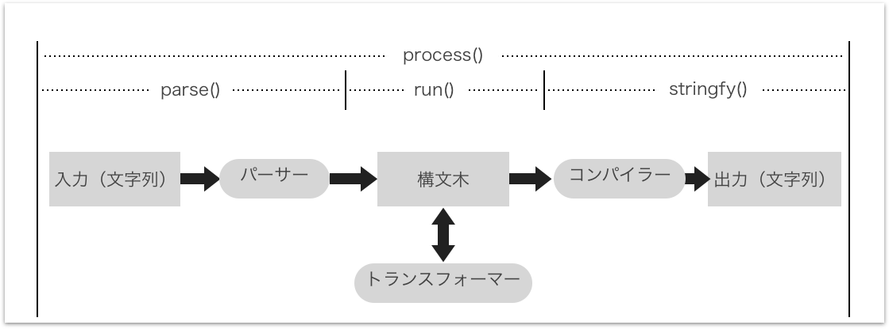

## なにこれ
自分のブログの目次をQiitaっぽくしたい...現在表示中の章をハイライトする目次を作りたい...ということで作りました。
マークダウンをHTMLに変換するのに[unified](https://unified.js.org/)という構文解析ライブラリを使っています。<br>
メモ用にReactサンプルアプリも作りました ⇒ [ソース](https://github.com/Takumon/react-markdown-sync-toc)と[デモ](https://takumon.github.io/react-markdown-sync-toc/)


## ポイント
* マークダウンのHTML化と目次抽出には[unified](https://unified.js.org/)を使いました。
* スクロールの度に現在表示中の章をチェックして目次ハイライトを更新します。
  * スクロール処理は高負荷なので負荷軽減のために[Lodashのthrottle](https://lodash.com/docs/4.17.10#throttle)を使いました。
  * 表示中の章が切り替わるごとに再描画するためにReactのstateを使いました。

以下で詳細を説明していきます。


## unified
アプリの実装を説明する前にマークダウンの構文解析に使っているunifiedについて説明します。<br>
unified自体はただのインターフェースです。構文解析ロジックはもっておらず、構文木を使ってテキストを処理するフローを提供します。
1. `parse`: 文字列をパーサーで構文木に変換
2. `run`: 必要に応じて構文木をトランスフォーマーで変換
3. `stringfy`: 構文木をコンパイラーで文字列に出力




### ライブラリ群
unifiedが提供するインターフェースの実装（プロセッサー）は、マークダウン用、HTML用、テキスト用の3種類があります。
プロセッサーごとに、構文定義、パーサー、コンパイラーが用意されています。
構文定義の方法は3種類の間で統一されており、マークダウンからHTMLなど相互変換が可能です。

|解析対象|プロセッサー|構文定義|パーサー|コンパイラー|
|-|-|-|-|-|
|マークダウン|[remark](https://github.com/remarkjs/remark)|[mdast](https://github.com/syntax-tree/mdast)|[remark-parse](https://github.com/remarkjs/remark/tree/master/packages/remark-parse)|[remark-stringify](https://github.com/remarkjs/remark/tree/master/packages/remark-stringify)|
|HTML|[rehype](https://github.com/rehypejs/rehype)|[hast](https://github.com/syntax-tree/hast)|[rehype-parse](https://github.com/rehypejs/rehype/tree/master/packages/rehype-parse)|[rehype-stringify](https://github.com/rehypejs/rehype/tree/master/packages/rehype-stringify)
|テキスト|[retext](https://github.com/retextjs/retext)|[nlcst](https://github.com/syntax-tree/nlcst)|[retext-latin](https://github.com/retextjs/retext/tree/master/packages/retext-latin)|[retext-stringfy](https://github.com/retextjs/retext/tree/master/packages/retext-stringify)


ライブラリごとにプラグインが山ほどあって、例えばHMTLをミニファイしたり、マークダウンをリントしたり、文章中の`a`と`an`を識別したり、いろんなことができます。
汎用的なAPIで独自ロジック実装できる! といった拡張性の高さもポイントです。

### 使い方
unifiedがパイプラインになっていて必要なライブラリをメソッドチェーンで順番に設定していきます。
パーサーとコンパイラーは1個つずつ、トランスフォーマーは任意の個数を指定してください。
パーサーとコンパイラー未指定だと実行時エラーになるので気をつけましょう。


```javascript:title=実装例
var unified = require('unified')
var markdown = require('remark-parse')
var remark2rehype = require('remark-rehype')
var doc = require('rehype-document')
var format = require('rehype-format')
var html = require('rehype-stringify')
var report = require('vfile-reporter')

unified()
  .use(markdown)      // パーサー（マークダウン文字列を構文木に変換）
  .use(remark2rehype) // トランスフォーマー（マークダウンからHTMLに変換）
  .use(doc)           // トランスフォーマー（HTMLタグなどでラップ）
  .use(format)        // トランスフォーマー（HTMLをフォーマット）
  .use(html)          // コンパイラー（rehypeの構文木を文字列に変換）
  .process('# Hello world!', function(err, file) {
    console.error(report(err || file))
    console.log(String(file))
  })
```

```text:title=実行結果
no issues found
<!DOCTYPE html>
<html lang="en">
  <head>
    <meta charset="utf-8">
    <meta name="viewport" content="width=device-width, initial-scale=1">
  </head>
  <body>
    <h1>Hello world!</h1>
  </body>
</html>
```

### unified採用の経緯
このブログ(Gatsby製)は[gatsby-trasform-remark](https://github.com/gatsbyjs/gatsby/tree/master/packages/gatsby-transformer-remark)というプラグインでマークダウン情報を取得しています。ただ目次情報についてはHTML化した目次しか取得できません。
Qiitaっぽい目次作成には少々難ありです。<br>
そんなこんなで悩んでいたところ[プラグインのソース](https://github.com/gatsbyjs/gatsby/blob/master/packages/gatsby-transformer-remark/src/extend-node-type.js#L20)を見てみたらマークダウン文字列解析にunifiedを使っていることに気づきました。
幸いプラグインで生のマークダウン文字列を取得できたので、unidiedで目次情報を抽出して実現できそうだと考え、採用に至りました。

## 実装
ポイントを載せていきます。詳細は[ソースコード](https://github.com/Takumon/react-markdown-sync-toc)を見てください。

### マークダウンをHMTL化する

マークダウン文字列を読み込んでHTML文字列に変換します。
現在画面に表示中の章を判定するために[remark-slug](https://github.com/remarkjs/remark-slug)を使って章にidを付与しています。
ちなみにこの[remark-slug](https://github.com/remarkjs/remark-slug)は[mdast-util-to-string](https://github.com/syntax-tree/mdast-util-to-string)と[github-slugger](https://github.com/Flet/github-slugger)を使ってidを付与しています。<br>

*※実際はReactコンポーネントですが簡単のためソースコードを一部省略しています。*


```javascript
import unified from 'unified'
import markdown from 'remark-parse'       // パーサー(文字列をremarkの構文木に変換)
import slug from 'remark-slug'            // トランスフォーマー(章にidをつける)
import remark2rehype from 'remark-rehype' // トランスフォーマー(マークダウンからHTMLに変換)
import html from 'rehype-stringify'       // コンパイラー(HTML構文木を文字列に変換)

const rawMarkdownBody = `## なにこれ
ReactでMarkdownファイルを読み込んで表示するアプリ。\n
目次も表示します。特徴としては目次においてスクロールに応じて現在表示中のセクションがハイライトされます。

## 大セクション その1`
･
･
･
`;

const { contents } =
  unified()
    .use(markdown)        // パーサー(文字列をremarkの構文木に変換)
    .use(slug)            // トランスフォーマー(章にidをつける)
    .use(remark2rehype)   // トランスフォーマー(マークダウンからHTMLに変換)
    .use(html)            // コンパイラー(HTML構文木を文字列に変換)
    .processSync(rawMarkdownBody)
```

<br>


```text:title=変換の流れ
マークダウン文字列
│
│ ←　remark-parse(パーサー)
↓
mdast構文木
│
│ ←　remark-slug(トランスフォーマー)
↓
章にidをつけたmdast構文木
│
│ ← remark-rehype(トランスフォーマー)
↓
hast構文木
│
│ ← rehype-stringify(コンパイラー)
↓
HTML文字列
```

### マークダウンから目次情報を抽出する
remarkのparseメソッドを使うと簡単にマークダウン構文木を取得できます。
そして取得した構文木から独自ロジックで目次情報を抽出します。
具体的には構文木を再帰的に捜査できるプラグイン[unist-util-visit](https://github.com/syntax-tree/unist-util-visit)を使って目次情報を抽出しました。<br>
id付与のロジックはマークダウン生成時のロジック(remark-slugのロジック）とあわせています。<br>

*※実際はReactコンポーネントですが簡単のためソースコードを一部省略しています。*


```javascript{12-22}
import remark from 'remark'
import visit from 'unist-util-visit'
import mdastToString from 'mdast-util-to-string';
import GithubSlugger from 'github-slugger';
const githubSlugger = new GithubSlugger()

// マークダウン文字列から目次情報を抽出する
function _extractToc(rawMarkdownBody) {
  githubSlugger.reset();

  const result = []
  const ast = remark().parse(rawMarkdownBody);
  visit(ast, 'heading', child => {
    const value = child.children[0].value
    const id = githubSlugger.slug(value || mdastToString(child))
    const depth = child.depth
    result.push({
      value,
      id,
      depth
    })
  })

  return result
}
```


この後さらに目次情報を加工していきますが説明が長くなるので省略します。詳細は[ソースコード](https://github.com/Takumon/react-markdown-sync-toc/blob/master/src/scroll-sync-toc.js#L87-L169)をご覧ください。

### スクロール毎に表示中の章を判定する
Reactのコンポーネントで実装します。
スクロールイベントは`componentDidMount`で購読を開始し`componentWillUnmount`で破棄します。<br>
**スクロール処理は高負荷なので[Lodashのthrottle](https://lodash.com/docs/4.17.10#throttle)で100ミリ秒ごとに間引いています。**
現在表示中の章の情報はsetStateでstateに格納しています。これにより表示中の章が切り替わった時にReactが再描画してくれます。


```javascript{20,23-26,28-30,38-66}
import React from 'react';
import { throttle } from 'lodash';
import Toc from './toc';

const githubSlugger = new GithubSlugger()


class ScrollSyncToc extends React.Component {
  constructor(props, context) {
    super(props, context);

    this.toc = _getToc(this.props.rawMarkdownBody)

    this.state = {
      activeItemIds: [],
      itemTopOffsets: [],
    };

    this.calculateItemTopOffsets = this.calculateItemTopOffsets.bind(this);
    this.handleScroll = throttle(this.handleScroll.bind(this), 100) // 負荷軽減のため間引く
  }

  componentDidMount() {
    this.calculateItemTopOffsets();
    window.addEventListener(`scroll`, this.handleScroll);
  }

  componentWillUnmount() {
    window.removeEventListener(`scroll`, this.handleScroll);
  }

  calculateItemTopOffsets() {
    this.setState({
      itemTopOffsets: _getElementTopOffsetsById(this.toc),
    });
  }

  handleScroll() {
    const { itemTopOffsets } = this.state;

    const item = itemTopOffsets.find((current, i) => {
      const next = itemTopOffsets[i + 1]

      // 自章よりもスクロールしている
      // かつ 次章まではスクロールしていない 場合は
      // 自章が表示されているとみなす
      return next
        ? window.scrollY >= current.offsetTop &&
            window.scrollY < next.offsetTop
        : window.scrollY >= current.offsetTop;
    })

    // Qiitaっぽく自章とあわせて親章をハイライトさせたいので
    // itemTopOffsetsでは親章の参照も持たせておき
    // ここでactiveItemIdsに格納しています。
    const activeItemIds =
      item
        ? item.parents
          ? [item.id, ...item.parents.map(i => i.id)]
          : [item.id]
        : [];

    // setStateを介してstateを変更することで
    // 表示中の章に変更があった場合にのみ再描画が走ります。
    this.setState({activeItemIds});
  }

  render() {
    const { activeItemIds } = this.state;
    return <Toc activeItemIds={activeItemIds} toc={this.toc} {...this.props} />;
  }
}

```

<br>

実際の目次コンポーネントでは、
`toc`(目次情報)と`activeItemIds`(現在表示中の章)をインプットに目次を描画します。
このとき表示中の章には`active`クラスをつけて描画しています。

```javascript{17}
import React from 'react'
import { HashLink as Link } from 'react-router-hash-link';

class Toc extends React.Component {
  render() {
    const { toc, activeItemIds } = this.props;
    const items = toc.map(item => {
      return (
        <li style={{
          textAlign: 'left',
          marginLeft: `${(item.depth - 2) * 24}px`,
          listStyle: 'none'
          }}>
          <Link
            key={item.id}
            to={`#${item.id}`}
            className={activeItemIds.includes(item.id) ? 'active' : ''}>{item.value}</Link>
        </li>
      )
    })

    return (
      <ul style={{padding: '12px', background: '#eee'}}>
        {items}
      </ul>
    );
  }
}

export default Toc;
```


## まとめ
Qiitaっぽい目次を作れたことよりも[unified](https://unified.js.org/)の便利さに驚きました。
これを使えば解析ツールなども簡単に実装できそうなので踏み込んで調べてみたいです。

