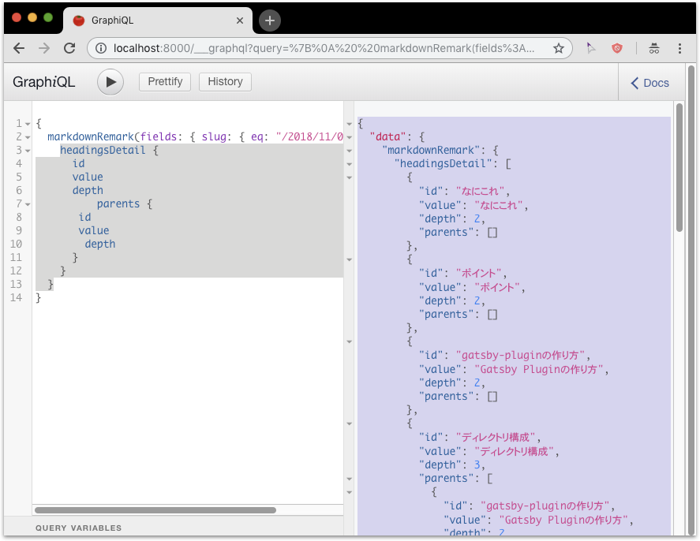

## なにこれ
前回の[unifiedでMarkdownをHTMLに変換 & ReactでQiitaっぽい目次を作る](../../10/28)で、GraphQLで取得したヘッダー情報をReactコンポーネントで加工していましたが、
あらかじめGraphQLのデータとして扱えるように、加工処理をPluginに移行しました。
その結果、ヘッダー情報がMarkdownRemarkスキーマのフィールドとして取得できるようになりました。

*※ 下記図でheadingsDetailが加工したヘッダー情報*



## ポイント
* Gatsby Pluginの作り方
* Gatsby PluginでのGraphQLデータ追加方法
* Gatsby PluginでのGraphQLスキーマ定義方法

※ 今回はローカルで作りました。npmパッケージで公開はしていません。

## Gatsby Pluginの作り方
以前[Gatsbyプラグインの使い方･作り方･公開方法](../../10/20)で概要は紹介しました。今回は実例です。


### ディレクトリ構成
Plugin名は`gatsby-remark-headings-detail`としました。
構成を以下に示します。
```
プロジェクトルート
└── plugins/
    └── gatsby-remark-headings-detail
        ├── gatsby-node.js ･･･(1)
        ├── package.json ･･･ (2)
        ├── package-lock.json
        └── node_modules
```

<br>

1. gatsby-node.js
    * Gatsby Pluginを作る時は`gatsby-node.js`、`gatsby-ssr.js`、`gatsby-browser.js`の3つうち必要なものを定義します。今回はノード加工処理なので`gatsby-node.js`です。
2. package.json
    * 依存ライブラリを定義します。
    * 依存ライブラリは、`plugins/gatsby-remark-headings-detail`直下で`npm install`します。プロジェクトの依存ライブラリとは別管理です。
    * npm公開する場合は`name`、`version`、`keyword`が必要ですが今回ローカルのPluginなので不要です。

### 設定ファイルでプラグイン使用を宣言
プロジェクトルート配下の`gatsby-config.js`にて下記のようにプラグインのフォルダ名を指定します。
また今回のプラグインはgatsby-transformer-remarkで生成されたMarkdownRemarkノードをインプットとするので、
下記のように定義しています。

```javascript{9-10}:title=gatsby-config.jsの一部
module.exports = {
  plugins: [
    {
      resolve: `gatsby-transformer-remark`,
      options: {
        // ･･･
      }
    },
    // gatsby-transformer-remarkよりも後
    `gatsby-remark-headings-detail`,
    // ･･･
  ]
}
```


## GraphQLデータの追加
Gatsby Node APIの[setFieldsOnGraphQLNodeType](https://www.gatsbyjs.org/docs/node-apis/#setFieldsOnGraphQLNodeType)を使います。<br>
このAPIは、GraphQLスキーマ生成時に呼び出され、スキーマに新しいフィールドを追加できます。
例えばFileノードに`newField`という名前のフィールドを追加する場合、以下のようになります。

```javascript{numberLines: true}{1,8-20}
import { GraphQLString } from "gatsby/graphql"

exports.setFieldsOnGraphQLNodeType = ({ type }) => {
  if (type.name !== `File`) {
    return {}
  }

  return {
    newField: {
      type: GraphQLString,
      args: {
        myArgument: {
          type: GraphQLString,
        }
      },
      resolve: (source, fieldArgs) => {
        return `Id of this node is ${source.id}. Field was called with argument: ${fieldArgs.myArgument}`
      }
    }
  }
}
```

<br>

* 1行目
    * `gatsby/graphql`はプラグインの依存ライブラリに追加しません。プロジェクト本体がプラグインを含む全スキーマーを統括します。
* 8-20行目
    * 戻り値は[GraphQLFieldConfigMap](https://graphql.org/graphql-js/type/#graphqlobjecttype)型に従います。
    * `resolve`にて対象スキーマに紐付くノードが引数として渡されます。


## GraphQLスキーマの定義
上記の例のように文字列や数値なら簡単に定義できますが、複雑な構造のスキーマは、
スキーマ定義用の型(GraphQLObjectType、GraphQLEnumTypeなど)を使って
[GraphQLFieldConfigMap](https://graphql.org/graphql-js/type/#graphqlobjecttype)の記法に沿ったオブジェクトを定義しなければなりません。<br>
今回のプラグインでは下記のようにしました。

*NOTE:* ほぼ、[gatsby-transformer-remark](https://github.com/gatsbyjs/gatsby/blob/master/packages/gatsby-transformer-remark/src/extend-node-type.js#L319-L347)のパクリです:sweat_smile:

```javascript
// スキーマ定義に必要な型はGatsbyが用意してくれている
const {
  GraphQLString,
  GraphQLInt,
  GraphQLObjectType,
  GraphQLEnumType,
  GraphQLList,
} = require('gatsby/graphql')


const HeadingLevels = new GraphQLEnumType({
  // 他プラグインも含めて一意な名前をつける
  // 名前重複するとビルド時にエラーになる
  name: `LinkHeadingLevels`,
  values: {
    h1: { value: 1 },
    h2: { value: 2 },
    h3: { value: 3 },
    h4: { value: 4 },
    h5: { value: 5 },
    h6: { value: 6 },
  },
})


// 親ヘッダー情報
const ParentHeadingType = new GraphQLObjectType({
  name: `MarkdownParentLinkHeadings`,
  fields: {
    value: {
      type: GraphQLString,
      resolve: ({value}) => value,
    },
    id: {
      type: GraphQLString,
      resolve: ({id}) => id,
    },
    depth: {
      type: GraphQLInt,
      resolve: ({depth}) => depth,
    },
  }
})


// ヘッダー情報（親参照付き）
const HeadingType = new GraphQLObjectType({
  name: `MarkdownLinkHeading`,
  fields: {
    value: {
      type: GraphQLString,
      resolve(heading) {
        return heading.value
      },
    },
    id: {
      type: GraphQLString,
      resolve(heading) {
        return heading.id
      },
    },
    depth: {
      type: GraphQLInt,
      resolve(heading) {
        return heading.depth
      },
    },
    parents: {
      type: new GraphQLList(ParentHeadingType),
      resolve(heading) {
        return heading.parents
      },
    },
  },
})
```


<br>
これらの型定義を使って下記のようにreturnします。

```javascript{numberLines: true}{10}
  return {
    headingsDetail : {
      type: new GraphQLList(HeadingType),
      args: {
        depth: {
          type: HeadingLevels,
        },
      },
      resolve(markdownNode, { depth }) {
        const result = _attachParents(_getHeaders(markdownNode))
        return result
      },
    },
  }
```

*NOTE:* 10行目でMarkdownRemarkノードからヘッダー情報を抽出しています。
前回記事でReactコンポーネントに定義してあったものの流用です。ここでは説明を省略します。


## まとめ
データ加工をPluginに寄せたので、Reactコンポーネントとの責務が分かれてコードがスッキリしました。
npmパッケージとして公開するには、汎用性を考えロジックを精査する必要がありますが、ローカルPluginなら気軽に作れますね。
ソースコードを分割し、責務の棲み分けをはっきりさせるという点においてローカルのPluginsを活用するのはとても良い手法だと思います。


