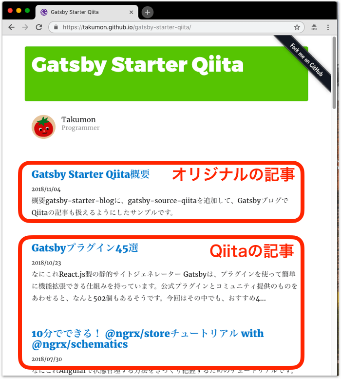
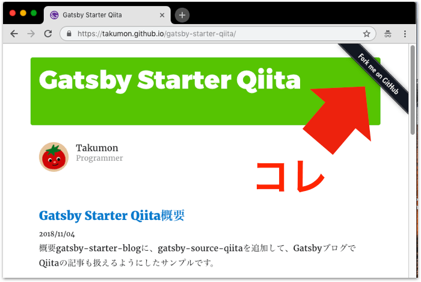

## なにこれ
GatsbyにQiitaの記事を取り込めるプラグイン([gatsby-source-qiita](https://www.gatsbyjs.org/packages/gatsby-source-qiita/))を作って、自分のブログに適用しました。
QiitaからGatsbyに乗り換えようと考えている方で、Qiitaの記事を引き継ぎたい場合に便利なプラグインです。サンプル([gatsby-starter-qiita](https://takumon.github.io/gatsby-starter-qiita/))も用意してます。
今回はこのプラグインとサンプルについて紹介します。





## 概要
* プラグイン作成の経緯と最近のQiita
* [gatsby-source-qiita](https://www.gatsbyjs.org/packages/gatsby-source-qiita/)
    * 使い方
    * 実装ポイント
        * プラグイン公開手順
        * gatsby/graphql not found
        * 目次情報作成
* [gatsby-starter-qiita](https://takumon.github.io/gatsby-starter-qiita/)
    * 概要
    * 実装ポイント
        * シンタックスハイライトのスタイル
        * オリジナル記事とQiita記事のスキーマ統一
        * Github-rebbons便利
* まとめ


## プラグイン作成の経緯と最近のQiita
最近Qiitaが微妙なので、Qiitaとブログを別々に管理するより、ブログにまとめたほうが良さそうと思ったのと、
1つぐらい[Gatsby公式サイト](https://www.gatsbyjs.org/plugins/)で公開してみたいという思いから作りました。
大枠は[mottox2](https://github.com/mottox2)さんの[gatsby-source-esa](https://www.gatsbyjs.org/packages/gatsby-source-esa/)を参考にして、
[gatsby-transform-remark](https://www.gatsbyjs.org/packages/gatsby-transformer-remark)
、[Qiita APIドキュメント](https://qiita.com/api/v2/docs)を見ながら実装してます。


余談ですが、最近のQiitaはポエムが乱立していて、変な方向に向かっていますね。<br>
かつては有用な技術記事がたくさん投稿されているイメージでしたが、トレンド機能を導入してからでしょうか？<br>
昔に戻ってもらえるとうれしいです。来月のQiita Advent Calendarに期待です！！<br>
とはいえ、今でも良記事もたくさんあって、`Angualr`とかで絞ると結構見つかります。
最近、これは！と思った記事は、[「Angularで、Angular Materialのテーマに対応するライブラリを作る」](https://qiita.com/shibukawa/items/6eeaace2a130a0213386)などです。このような記事こそQiitaにあるべきだと思います。


## [gatsby-source-qiita](https://github.com/Takumon/gatsby-source-qiita)

### 使い方
インストールします。
```
npm install --save gatsby-source-qiita
```
<br>


アクセストークやユーザ名を設定します。

```javascript:title=gatsby-config.jsの一部
module.exports = {
  plugins: [
    {
      resolve: `gatsby-source-qiita`,
      options: {
        accessToken: `YOUR_PERSONAL_ACCESS_TOKEN`,
        userName: `YOUR_UAWE_NAME`,
        fetchPrivate: false,
        excludedPostIds: ['da8347f81a9f021b637f']
      }
    }
  ]
}
```


* accessToken
  * 【必須】API認証用のQiitaアクセストークンです。`Qiitaの設定ページ >  アプリケーション > 新しくトークンを発行する`で発行してください。
* userName
  * 【必須】Qiitaアカウント名です。ここで指定したアカウントに紐付く記事を引っ張ってきます。
* fetchPrivate
  * 【任意】限定公開記事も取得するかを設定します。デフォルトはfalseです。
* excludedPostIds
  * 【任意】除外したい記事をid配列で指定します。デフォルトは何も除外しません。


<br>

これでQiitaの記事をGraphQLで取得できるようになります。
取得情報はほぼQiita APIのまんまですが、目次情報(headings)を追加しています。


```json{7-16}:title=Qiita記事取得用のクエリ
{
  allQiitaPost {
    edges {
      node {
        id
        title
        headings {
          value
          id
          depth
          parents {
            value
            id
            depth
          }
        }
        rendered_body
        body
        comments_count
        created_at
        likes_count
        reactions_count
        tags {
          name
        }
        updated_at
        url
        user {
          id
        }
      }
    }
  }
}
```


### 実装のポイント


#### プラグイン公開手順
いきなしnpmパッケージで開発を始めるより、下記のように段階を経て動作確認していく方が楽でした。

1. (Gatsby APIを使わない処理について)コンポーネントで実装
2. アプリケーション自体の`gatsby-node.js`や`gatsby-browser.js`で実装
3. ローカルプラグインに切り出して`gatsby-node.js`や`gatsby-browser.js`で実装
4. 別プロジェクトに切り出してnpmパッケージとして実装、　アプリケーション側からは`npm install ../gatsby-source-qiita`のようにローカルnpmインストール
5. npm公開
6. アプリケーション側で`npm install gatsby-source-qiita`のようにnpmインストール

#### プラグインをローカルインストールするとgatsby/graphql not found
> Gatsbyではプラグインで`gatsby/graphql`を使う場合でも依存ライブラリには追加しません。
> ビルド時にアプリ側の`gatsby/graphql`を使ってプラグインも含め全体をコントロールするからです。

のはずなんですが、プラグインをnpmでローカルインストールする(`npm install ../gatsby-source-qiita`する)と
ビルド時に「gatsby/graphql not found」と怒られました。
しょうがないので動作確認時だけローカルプラグインとして扱う(アプリのplugins配下に置く)ことで回避しました。
npm公開版だと問題なく動いたのですが... 最後まで謎でした。


### 目次情報作成
QiitaAPIで取得するHTMLは既にリンクが埋め込まれていたので、HTMLから目次を抽出しています。
HTML構文解析には[unified](https://github.com/unifiedjs/unified)の[rehype](https://github.com/rehypejs/rehype)を使いました。


```javascript:title=HTMLから目次情報抽出する処理
import rehype from 'rehype'
import visit from 'unist-util-visit'
import hastToString from 'hast-util-to-string'

const MIN_HEADER_DEPTH = 1
const HEADER_TYPE_IN_HAST = 'element'
const HEADER_TAG_NAMES_IN_HAST = ['h1', 'h2', 'h3', 'h4', 'h5', 'h6']

function _extractHeadingDetails(htmlStr) {
  // HAST形式の抽象構文木に変換
  const htmlAst = rehype.parse(htmlStr)

  // ヘッダータグ(h1〜h6タグ)を探す
  const result = []
  visit(htmlAst, HEADER_TYPE_IN_HAST, node => {
    if (!HEADER_TAG_NAMES_IN_HAST.includes(node.tagName)) {
      return
    }

    // ヘッダータグから深さとタイトルを抽出
    const heading = {
      depth: Number(node.tagName[1]),
      value: hastToString(node).replace('\n', '')
    }
    // aタグのうちhref属性が#始まりのものを探しidを抽出
    node.children.filter(c => _isHeaderIdLink(c)).forEach(c => {
      heading.id = decodeURI(c.properties.href.split('#')[1])
    });

    result.push(heading)
  })

  return result
}

function _isHeaderIdLink(node) {
  return node.tagName === 'a'
          && node.properties.href
          && node.properties.href.startsWith('#')
}
```


## [gatsby-starter-qiita](https://www.gatsbyjs.org/docs/create-source-plugin/)

### 概要
Gatsbyの一番ベーシックなサンプル([gatsby-starter-blog](https://github.com/gatsbyjs/gatsby-starter-blog))をベースに、gatsby-source-qiitaを導入し、オリジナルの記事とQiitaの記事を一緒くたに扱えるサンプルです。
[デモ](https://takumon.github.io/gatsby-starter-qiita/)もあります。


### 実装ポイント

#### シンタックスハイライトのスタイル
Qiita APIで取得するHMTLのソースコードブロックは、Qiitaで想定してるシンタックスハイライト用クラスが付与されています。
そのためスタイルはQiitaのサイトで開発者ツールで該当のCSS開いてほぼ流用しました。


### オリジナル記事とQiita記事のスキーマを統一したい
オリジナル記事とQiita記事でスキーマが違うため、ソースコードで一緒くたに扱おうとするとif文だらけになって扱いづらい状態でした。
対策として[スキーマ統一用ローカルプラグイン](https://github.com/Takumon/blog/tree/master/plugins/gatsby-remark-and-qiita/gatsby-node.js)を作りました。ローカルプラグインなので名前はテキトーですが...<br>
Gatsbyプラグインでは、[createNodeField](https://www.gatsbyjs.org/docs/actions/#createNodeField)というAPIでノードのfieldsに自由にプロパティが追加できます。
今回は[onCreateNode](https://www.gatsbyjs.org/docs/node-apis/#onCreateNode)(ノード生成時に呼ばれるAPI)時にcreateNodeFieldを使ってfieldsにタイトルや作成日など共通プロパティを追加することでスキーマの差異を吸収しています。


```javascript{8-30,32-37}
exports.onCreateNode = ({ node, actions, getNode }) => {
  const { createNodeField } = actions

  if (node.internal.type !== `MarkdownRemark` && node.internal.type !== `QiitaPost`) {
    return
  }

  // ここで差異を吸収
  const [
    slug,
    title,
    date,
    excerpt,
    tags,
  ] =
    node.internal.type === `MarkdownRemark`
      ? [
        createFilePath({ node, getNode }),
        node.frontmatter.title,
        node.frontmatter.date,
        _excerptMarkdown(node.rawMarkdownBody, 120),
        node.frontmatter.tags
      ]
      :[
        `/${node.id}/`,
        node.title,
        node.created_at,
        _excerptHtml(node.rendered_body, 120),
        [...(node.tags.map(tag => tag.name) || []), 'Qiita'] // Qiitaタグを追加
      ]

  // ノードのfieldsにプロパティを追加
  createNodeField({ name: `slug`,     node,   value: slug     })
  createNodeField({ name: `title`,    node,   value: title    })
  createNodeField({ name: `date`,     node,   value: date     })
  createNodeField({ name: `excerpt`,  node,   value: excerpt  })
  createNodeField({ name: `tags`,     node,   value: tags     })
}
```


#### Github-ribbons便利
GitHub Pagesなどでサンプル公開したときに、ソースコードのリンクを貼り付けたくなりますが、
その時に便利なのが[Github-ribbons](https://blog.github.com/2008-12-19-github-ribbons/)です。
いろんなところで見かけるこのリボン、実はコピペで簡単に実装できたんですね。知らなかった。




Github-rebbonsで紹介されているコードを少しReactベースに修正して貼り付けました。

```html
<a href="https://github.com/Takumon/gatsby-starter-qiita">
  
</a>
```


## まとめ
今回はQiitaから記事を取得するGatsbyプラグインを作りました。
自分のプラグインが[Gatsbyのサイト](https://www.gatsbyjs.org/packages/gatsby-source-qiita/)で検索できるようになったときは、ちょっと感動しました。(まぁ審査とか無しで登録できるので全然すごくないんですけどね)


