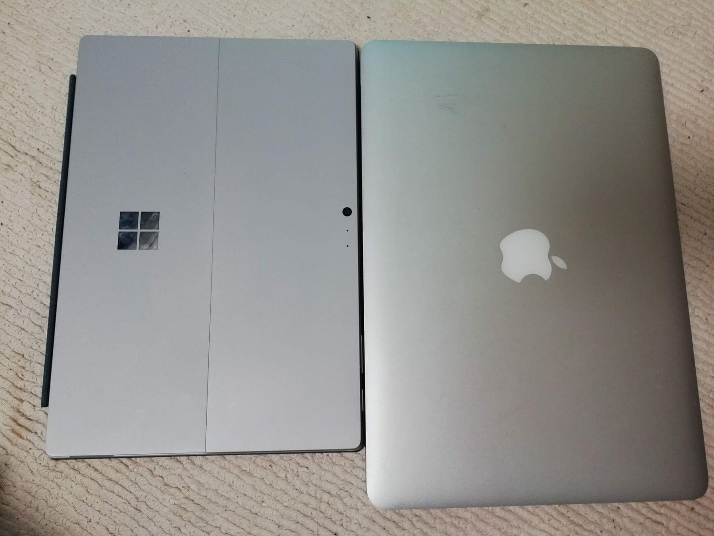
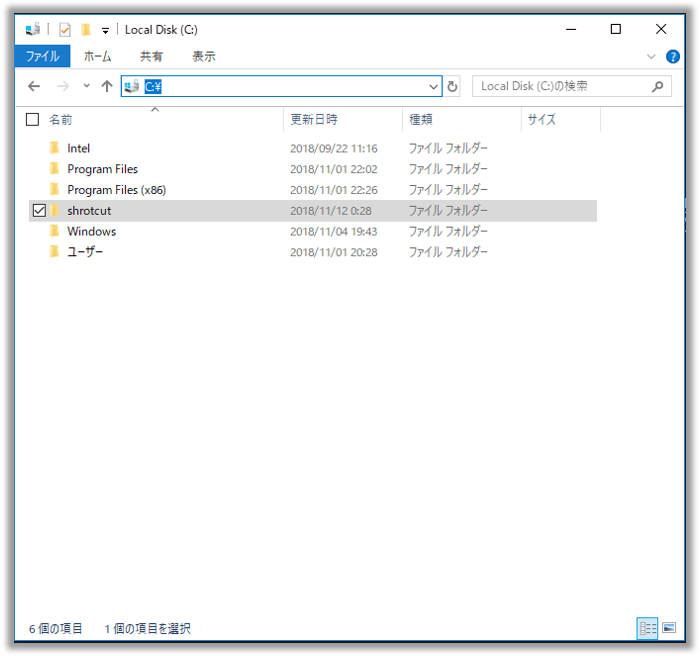
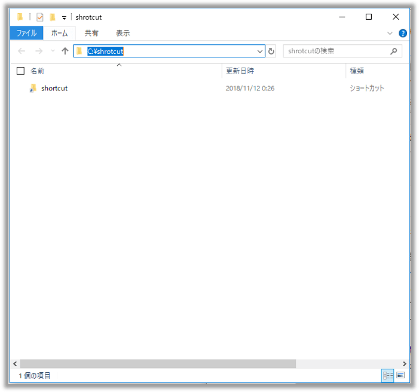

## なにこれ

便利なランチャーは色々ありますが、Windows PCだと僕はファイル名を指定して実行（`windows + r`）をランチャー代わりにしています。
この方法は、どんなWindows PCでもすぐに使えるというのが最大の利点です。
PCリプレースしたときや、ネットにつながらない環境でアプリをインストールできない場合でも適用できます。
ただこのやり方、会社の同僚などで使ってる人に遭遇したことはありません。マイナーなんですかね:cry:
つい最近Surface Pro 6を買ったついでに、今回は`windows + r`ランチャーの設定方法・使い方を紹介します。


## 余談
Surface Pro 6買いました。




4年前くらいのMBA（リンゴが光る世代のやつ）を今は使っていて、ちょうど[MBAの新型が発表されたし](https://www.apple.com/jp/macbook-air/)購入を迷っていたんですが、会社のリモートワーク用端末としてはWindowsが良さそうだし、IEとEdgeの検証環境ほしいってことで[Surface Pro 6](https://www.microsoft.com/ja-jp/p/surface-pro-6/8zcnc665slq5?activetab=pivot%3aoverviewtab)を買いました。基本リモート接続で使うので最低スペックのやつです。
一週間使ってみたところ、サブPCとしてはとてもいい感じです！

### メリット

* 軽い（784g 自分のMBA(1350g)に比べるとかなり軽い）
* 電源コードがマグセーフ形式で脱着が容易
* 顔認証ログインができるのでログインが簡単
* タブレットとしても使用可能（家で漫画やYouTube見るのに最適）

### デメリット

* 別売りキーボードは２万円とお高め（東プレのREALFORCE並み）
* ベゼルが大きい（最近のPCならもうちょっとベゼルレスにしてほしい
* Cortanaが邪魔

### Cortanaを消す

購入して真っ先にCortanaを消しました。
ただ設定とかでは消せなくてレジストリをいじる必要がありました。

* [Windows 10 Cortana を停止して無効化する | Pasoble](https://www.pasoble.jp/windows/10/cortana-mukouka.html)

以下本題です。


## windows + rランチャーの仕組み・初期設定

パスの通ったランチャー専用のフォルダをつくって、
そこにフォルダショートカット、アプリショートカット、バッチを配置します。
そうすると`windows + r`で呼び出せるという仕組みです。

まずはランチャー専用のフォルダを作成します。自分は`C:\shrotcut`としました。



次に「システムのプロパティ」 > 環境変数 > ユーザー環境変数　> Path を選択して編集で<br>
ランチャー専用フォルダのパスを追加します。


これで設定は完了です。あとはどんどんショートカットをランチャー専用フォルダに追加していきましょう。
ショートカットのファイル名がそのままコマンド名になるのでファイル名は自分の好きなようにしてください（例えばよく使うコマンドはファイル名を短くするなど）。


## windows + rランチャーの使いどころ

### フォルダ・ファイルを開く

試しに「ランチャー専用フォルダ」自身のショートカットを配置してみましょう。ショートカット名は`shortcut`にします。



`windows + r` → `shortcut`と入力 →　`Enter`キー　でショートカット専用フォルダが開けば設定成功です。

この要領でショートカットやバッチを追加していくと、いろんなことが`windows + r`で実行できるようになります。

### アプリを起動する

exeファイルへのショートカットを作成すればアプリを起動できます。
例えばサクラエディタの場合、exeファイルを右クリック → ショートカットの作成　を選択し、


ランチャー専用フォルダに配置します。ここの例ではショートカット名を`sakura`にしています。


`windows + r` → `sakura`と入力 → `Enter`キー でサクラエディタが開けば設定成功です。
ちょっとしたメモの時に、素早くサクラエディタが開けるようになります。

なおWindows10なら「スタートメニュー」→「すべてのアプリ」からアプリを選択し、アプリアイコンをドラッグ＆ドロップでショートカットを簡単に作成できます。
* 参考：　[Windows 10 アプリのショートカットをデスクトップに表示したい！ | Tanweb.net](http://tanweb.net/2015/08/17/4715/)

### アプリを引数付きで起動する

例えばVisual Studio Codeで特定のフォルダを開きたい場合は、ショートカットにアプリ引数を指定します。
アプリのパスの後にスペース区切りで指定できます。具体的には下記のような感じです。

```txt
"C:\Users\xxx\AppData\Local\Programs\Microsoft vS code\Code.exe" C:\Users\xxx\workspace\memo
```

Chromeで特定のサイトを開きたいときも同様です。

```txt
"C:\Program Files (x86)\Google\Chrome\Application\chrome.exe" https://soundcloud.com
```

作成したショートカットをランチャー専用フォルダに格納すればVSCodeやChromeなどが`windows + r`で呼び出せるようになります。

### コントロールパネルの設定を起動する

コントロールパネルを開いてドラック＆ドロップでショートカットが作れます。
作成したショートカットを好きな名前にリネームしてランチャー専用フォルダに格納すればサウンド設定などが`windows + r`で呼び出せるようになります。


### デフォルトで用意されているコマンドを使う

デフォルトでいくつかコマンドが用意されています。
使いそうなものだけ下記に列挙します。<br>
※電卓、メモ帳、ペイントあたりは列挙していません。

#### ファイル系

* `\`
    * Cドライブを開きます。
* `.`
    * ログインユーザのフォルダを開きます。
* `shell:desktop`
    * デスクトップを開きます。
* `shell:recent`
    * 最近使ったファイル一覧を開きます。

#### オフィス系

* `excel`
    * Excelを起動します。
* `winword`
    * Wordを起動します。`word`ではなく `win`を頭に付けます。
* `explore`
    * Internet Explorerを起動します。
* `powerpnt`
    * PowerPointを開きます。なぜか後半略語です。

#### その他

* `cmd`
    * コマンドプロンプトを起動します。
* `control`
    * コントロールパネルを開きます。
* `mstsc`
    * リモートデスクトップ接続を開きます。これは使用頻度高です。
* `winver`
    * Windowsのバージョン情報を開きます。
* `desk.cpl`
    * 画面のプロパティを開きます。
* `sysdm.cpl`
    * システムのプロパティを開きます。
* `msconfig`
    * システム構成を開きます。
* `netstat`
    * ネットワークのアクティブな接続をコマンドプロンプトで確認します。
* `regedit`
    * レジストリエディタを開きます。

### ms-settingsでシステム設定などを起動する

Windowsの設定は`ms-settings:URL`コマンドで開けます。
例えば下記のようなバッチファイルを作成してランチャー専用フォルダに配置します。ここではファイル名を`blue.bat`とします。

```batch:title=blue.bat
start ms-settings:bluetooth
```

これで`windows + r` → `blue`と入力 → `Enterキー` でブルートゥース設定が開けます。


#### ms-settingsコマンド一覧

ms-setttings:URLはsystemsettings.dllに定義されています。Stringsコマンドで確認できます。

```batch
strings C:\Windows\ImmersiveControlPanel\systemsettings.dll | Find /I "ms-settings:"
```

Stringsはファイルから表示可能な文字だけ出力するコマンドです。Linux環境ではインストールされています。
マイクロソフトがWindows向けのStringコマンドを配布しています。以下のサイトからインストール可能です。

https://technet.microsoft.com/ja-jp/sysinternals/strings.aspx


主要なものを下記に列挙します。

|ms-settings:URI|設定の場所|
|-|-|
|ms-settings:about| システム・バージョン情報|
|ms-settings:activation| 更新とセキュリティ・ライセンス認証|
|ms-settings:appsfeatures| アプリ・アプリと機能|
|ms-settings:appsforwebsites| アプリ・Web サイト用のアプリ|
|ms-settings:backup| 更新とセキュリティ・バックアップ|
|ms-settings:batterysaver| システム・バッテリー|
|ms-settings:batterysaver-settings| システム・バッテリー|
|ms-settings:batterysaver-usagedetails| システム・バッテリー・アプリによるバッテリーの使用|
|ms-settings:bluetooth| デバイス・Bluetoothとその他のデバイス|
|ms-settings:colors| 個人用設定・色|
|ms-settings:connecteddevices| デバイス・Bluetoothとその他のデバイス|
|ms-settings:crossdevice| システム・共有エクスペリエンス|
|ms-settings:datausage| ネットワークとインターネット・データ使用状況|
|ms-settings:dateandtime| 時刻と言語・日付と時刻|
|ms-settings:defaultapps| アプリ・既定のアプリ|
|ms-settings:developers| 更新とセキュリティ・開発者向け|
|ms-settings:deviceencryption| システム・バージョン情報（デバイスの暗号化）|
|ms-settings:devices-touchpad| デバイス・タッチパッド|
|ms-settings:display| システム・ディスプレイ|
|ms-settings:easeofaccess-closedcaptioning| 簡単操作・字幕|
|ms-settings:easeofaccess-highcontrast| 簡単操作・ハイコントラスト|
|ms-settings:easeofaccess-keyboard| 簡単操作・キーボード|
|ms-settings:easeofaccess-magnifier| 簡単操作・拡大鏡|
|ms-settings:easeofaccess-mouse| 簡単操作・マウス|
|ms-settings:easeofaccess-narrator| 簡単操作・ナレーター|
|ms-settings:easeofaccess-otheroptions| 簡単操作・その他のオプション|
|ms-settings:emailandaccounts| アカウント・メール＆アプリのアカウント|
|ms-settings:findmydevice| 更新とセキュリティ・デバイスの検索|
|ms-settings:gaming-broadcasting| ゲーム・ブロードキャスト|
|ms-settings:gaming-gamebar| ゲーム・ゲーム バー|
|ms-settings:gaming-gamedvr| ゲーム・ゲーム DVR|
|ms-settings:gaming-gamemode| ゲーム・ゲーム モード|
|ms-settings:lockscreen| 個人用設定・ロック画面|
|ms-settings:maps| アプリ・オフライン マップ|
|ms-settings:maps-downloadmaps| アプリ・オフライン マップ・地図のダウンロード|
|ms-settings:mousetouchpad| デバイス・マウス|
|ms-settings:multitasking| システム・マルチタスク|
|ms-settings:network| ネットワークとインターネット（・状態）|
|ms-settings:network-airplanemode| ネットワークとインターネット・機内モード|
|ms-settings:network-cellular| ネットワークとインターネット・携帯ネットワーク|
|ms-settings:network-dialup| ネットワークとインターネット・ダイヤルアップ|
|ms-settings:network-directaccess| ネットワークとインターネット・DirectAccess|
|ms-settings:network-ethernet| ネットワークとインターネット・イーサネット|
|ms-settings:network-mobilehotspot| ネットワークとインターネット・モバイル ホットスポット|
|ms-settings:network-proxy| ネットワークとインターネット・プロキシ|
|ms-settings:network-status| ネットワークとインターネット・状態|
|ms-settings:network-vpn| ネットワークとインターネット・VPN|
|ms-settings:network-wifi| ネットワークとインターネット・Wi-Fi|
|ms-settings:network-wifisettings| ネットワークとインターネット・Wi-Fi・既知のネットワークの管理|
|ms-settings:notifications| システム・通知とアクション|
|ms-settings:optionalfeatures| アプリ・アプリと機能・オプション機能の管理|
|ms-settings:otherusers| アカウント・家族とその他のユーザー|
|ms-settings:pen| デバイス・ペンと Windows Ink|
|ms-settings:personalization| 個人設定（・背景）|
|ms-settings:personalization-background| 個人用設定・背景|
|ms-settings:personalization-colors| 個人用設定・色|
|ms-settings:personalization-start| 個人用設定・スタート|
|ms-settings:powersleep| システム・電源とスリープ|
|ms-settings:printers| デバイス・プリンターとスキャナー|
|ms-settings:privacy| プライバシー（・全般）|
|ms-settings:privacy-accountinfo| プライバシー・アカウント情報|
|ms-settings:privacy-appdiagnostics| プライバシー・アプリの診断|
|ms-settings:privacy-backgroundapps| プライバシー・バックグラウンド アプリ|
|ms-settings:privacy-calendar| プライバシー・カレンダー|
|ms-settings:privacy-callhistory| プライバシー・通話履歴|
|ms-settings:privacy-contacts| プライバシー・連絡先|
|ms-settings:privacy-customdevices| プライバシー・他のデバイス|
|ms-settings:privacy-email| プライバシー・メール|
|ms-settings:privacy-feedback| プライバシー・フィードバックと診断|
|ms-settings:privacy-general| プライバシー・全般|
|ms-settings:privacy-location| プライバシー・位置情報|
|ms-settings:privacy-messaging| プライバシー・メッセージング|
|ms-settings:privacy-microphone| プライバシー・マイク|
|ms-settings:privacy-notifications| プライバシー・通知|
|ms-settings:privacy-radios| プライバシー・無線|
|ms-settings:privacy-speechtyping| プライバシー・音声認識、手書き入力、入力の設定|
|ms-settings:privacy-tasks| プライバシー・タスク|
|ms-settings:privacy-webcam| プライバシー・カメラ|
|ms-settings:project| システム・このPCへのプロジェクション|
|ms-settings:proximity| ネットワークとインターネット・機内モード|
|ms-settings:recovery| 更新とセキュリティ・回復|
|ms-settings:regionlanguage| 時刻と言語・地域と言語|
|ms-settings:regionlanguage-chsime-pinyin| 時刻と言語・地域と言語|
|ms-settings:regionlanguage-chsime-wubi| 時刻と言語・地域と言語|
|ms-settings:screenrotation| システム・ディスプレイ|
|ms-settings:signinoptions| アカウント・サインイン オプション|
|ms-settings:signinoptions-launchfaceenrollment| アカウント・サインイン オプション・Windows Hello セットアップ（顔認証）|
|ms-settings:signinoptions-launchfingerprintenrollment| アカウント・サインイン オプション・Windows Hello セットアップ（指紋認証）|
|ms-settings:speech| 時刻と言語・音声認識|
|ms-settings:storagepolicies| システム・ストレージ（ストレージセンサー）・空き領域を増やす方法を変更する|
|ms-settings:storagesense| システム・ストレージ|
|ms-settings:sync| アカウント・同期|
|ms-settings:tabletmode| システム・タブレット モード|
|ms-settings:taskbar| 個人用設定・タスク バー|
|ms-settings:themes| 個人用設定・テーマ|
|ms-settings:troubleshoot| 更新とセキュリティ・トラブルシューティング|
|ms-settings:typing| デバイス・入力|
|ms-settings:usb| デバイス・USB|
|ms-settings:windowsdefender| 更新とセキュリティ・Windows Defender|
|ms-settings:windowsinsider| 更新とセキュリティ・Windows Insider Program|
|ms-settings:windowsupdate| 更新とセキュリティ・Windows Update|
|ms-settings:windowsupdate-action| 更新とセキュリティ・Windows Update・更新プログラムのチェック|
|ms-settings:windowsupdate-history| 更新とセキュリティ・Windows Update・更新の履歴|
|ms-settings:windowsupdate-options| 更新とセキュリティ・Windows Update・詳細オプション|
|ms-settings:windowsupdate-restartoptions| 更新とセキュリティ・Windows Update・再起動のオプション|
|ms-settings:workplace| アカウント・職場または学校にアクセスする|
|ms-settings:yourinfo| アカウント・ユーザーの情報|

### その他（シャットダウンなど）

バッチファイルやパワーシェルファイルをランチャー専用フォルダに配置すれなんでもできます。
例えばshutdownコマンドでシャットダウンや再起動ができます。下記のようなバッチを作ってランチャー専用フォルダに配置しましょう。

```bat:title=sd.bat
shutdown -s -t 0
```

```bat:title=restart.bat
shutdown -r -t 0
```

<br>

これで`windows + r` → `sb`と入力 → `Enterキー` でPCが即シャットダウンできます。
気軽にシャットダウンできる反面、誤爆も増えます。間違ってシャットダウンしてしまって、いままで作業していたエクセルがパー...のようになりかねないので、会社のPCでは設定していません。

### 管理者権限で実行

管理者権限で実行したい場合、<br>
`windows + r` → コマンド入力 → `Enter` の代わりに<br>
`windows + r` → コマンド入力 → `ctrl + shift + Enter` で実行できます。<br>
コマンドプロンプト実行などで使う機会があるかと。

## 自分の設定

Surface Pro 6では下記のように設定しました。

### フォルダショートカット系

* `shortcut`
    * ランチャー専用フォルダを開きます。
* `w`
    * 作業フォルダを開きます。

### アプリ起動系

* `chrome`
    * クロームを開きます。
* `sakura`
    * サクラエディタを開きます。

### アプリ起動系（起動引数付き）

* `soundcloud`
    * サウンドクラウドをクロームで開きます。
* `blog`
    * ブログをVSCodeで開きます。
* `memo`
    * メモ用フォルダをVSCodeで開きます。

### ms-settings系

* `blue`
    * ブルートゥース設定を開きます。
* `display`
    * ディスプレイ設定を開きます。
* `proxy`
    * プロキシ設定を開きます。
* `soundsetting`
    * サウンド設定を開きます。
* `wifi`
    * WiFi設定を開きます。
* `wuapp`
    * Windows update画面を開きます。`ms-settings:windowsupdate`をバッチでたたいています。
* `wuappaction`
    * Windows updateで更新ファイルがないかチェックします。`ms-settings:windowsupdate-action`をバッチでたたいています。

### バッチ系

* `sd`
    * シャットダウンします。
* `restart`
    * 再起動します。

## まとめ
今回は`windows + r`をランチャーとして使う方法を紹介しました。
Windows10からは`ms-settins`も加わって用途が拡大されているので、ますます便利になりました。
バッチファイル起動もできるので、ちょっと込み入ったことをするならPowerShellでスクリプトを書けばなんでもできそうですね🍅

## 参考
* [Winキー＋R をもっと活用しよう！| 平凡かつフツーな日記](http://imanyu.blog86.fc2.com/blog-entry-308.html)
* [良く使うWindowsのファイル名を指定して実行コマンドのまとめ | 本多コンサルティング](http://honda-consulting.com/win-r/)
* [この人デキる…！一目置かれるキー操作](https://azby.fmworld.net/usage/closeup/20150325/)
* [Windows の「ファイル名を指定して実行」を使いこなす！ ～ 知ってるとはかどるよく使う機能の呼び出し方を紹介します。 【Windows10 対応】 | カモメのリズム](http://www.kamomer.com/entry/windows10-run-filename)
* [「ファイル名を指定して実行」の意外に便利な使い方 | ロジウム株式会社](http://rhodium.co.jp/%E3%80%8C%E3%83%95%E3%82%A1%E3%82%A4%E3%83%AB%E5%90%8D%E3%82%92%E6%8C%87%E5%AE%9A%E3%81%97%E3%81%A6%E5%AE%9F%E8%A1%8C%E3%80%8D%E3%81%AE%E6%84%8F%E5%A4%96%E3%81%AB%E4%BE%BF%E5%88%A9%E3%81%AA%E4%BD%BF/)
* [Windowsの「ファイル名を指定して実行」を256倍快適にする | hibomaのはてなダイアリ](http://d.hatena.ne.jp/hiboma/20070311/1173592731)
* [Windows10で「ファイル名を指定して実行」からWindows Updateを実行する方法 | BIZLOG.TECH](https://bizlog.tech/windows10-wuapp/)
* [ms-setting:UIL一覧](http://www.atmarkit.co.jp/ait/articles/1707/11/news009_2.html)
* [Windows 10のショートカット「ms-settings:URI」は使い始めると止められない| @IT](http://www.atmarkit.co.jp/ait/articles/1707/11/news009.html)
* [Windows10「Fall Creators Update」で使える「ms-settings」コマンド一覧 | iBitzEdge](https://i-bitzedge.com/tips/ms-settings-command)
* [管理者権限で「ファイル名を指定して実行」するには](https://news.mynavi.jp/article/win10tips-283/)
* [Stringsコマンドのインストール](https://linuxfan.info/strings-on-windows)
