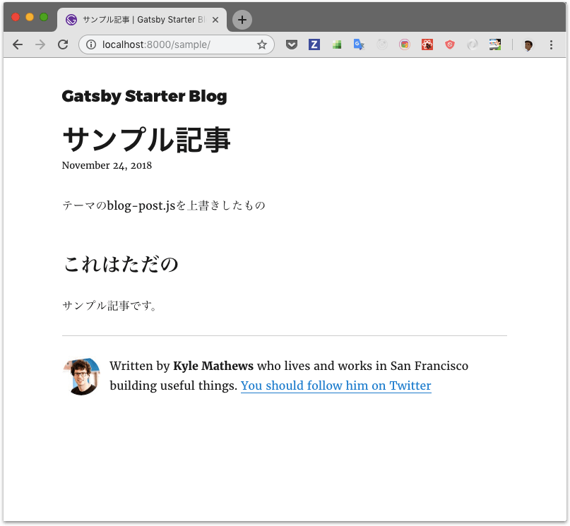

## なにこれ

下記の[記事](https://www.gatsbyjs.org/blog/2018-11-11-introducing-gatsby-themes/)を読んで、
実験的に追加されたGatsby themeで何ができるのか[サンプル](chrome://flags/#enable-ephemeral-flash-permission)作って試してみました。そのときのメモです。

<blockquote class="twitter-tweet" data-lang="ja"><p lang="en" dir="ltr">Excited to talk a bit about something I&#39;ve been working on a lot lately<br><br>Introducing <a href="https://twitter.com/gatsbyjs?ref_src=twsrc%5Etfw">@gatsbyjs</a> Themes <a href="https://t.co/ysDITHlbsV">https://t.co/ysDITHlbsV</a></p>&mdash; :party-corgi: (@chrisbiscardi) <a href="https://twitter.com/chrisbiscardi/status/1062426813840814080?ref_src=twsrc%5Etfw">2018年11月13日</a></blockquote>


## Gatsby themeはどんな問題を解決してくれるか

Gatsbyはスキャフォールド機能があって初期導入が非常に簡単です。最小構成のものから、かなりデザインが作り込まれたものまで65個(2018/11/24現在)のスキャフォールドが存在し、[Gatsby Starter](https://www.gatsbyjs.org/starters/?v=2)から好きなものを選べます。<br>
ただし初期導入後はスキャフォールドのアップデートに追従できませんし、途中で別のものに変更することも容易ではありません。変更できたとしても実質作り直しと同じくらい改修が必要でしょう。（スキャフォールドなんであたりまえですが...）
テーマを容易に変更できるようなWordPressなどに比べると拡張性の面で劣っています。<br>
Gatsby themeはこれらの問題を解決するための機能です。


## Gatsby themeの概要

* テーマでは下記を定義でき、Gatsbyの資産の大部分をコンテンツから切り離してnpmパッケージとして管理できます。
    * 依存関係（package.json）
    * 設定ファイル（gatsby-config.js）
    * ページ（blog-post.jsやindex.jsなど）
    * コンポーネント（Bio.jsやLayout.jsなど）
* コンテンツ側は、今までのように`package.json`で大量のGatsbyプラグインの依存関係を定義したり、`gatsby-config.js`で大量のプラグイン設定を定義する必要がなくなります、使用テーマの宣言とコンテンツの定義だけで、Webサイトを構築できます。
* テーマの設定は引数を許容するので、コンテンツ側から指定した値を設定値に反映できます。
* テーマで用意しているページやコンポーネントは、コンテンツ側で上書きでき、別途追加作成も可能です。　※現時点では若干自力実装が必要ですが...


## Gatsby themeの作り方

ここでは2種類のテーマと3種類のブログを作ります。<br>
<small>※ソースは[GitHub](https://github.com/Takumon/my-gatsby-theme-sample)参照</small>


### 1. とりあえずテーマを作る

[gatsby-starter-blog](https://github.com/gatsbyjs/gatsby-starter-blog)を最小限の修正でテーマ化します。<br>
<small>※[ソース](https://github.com/Takumon/my-gatsby-theme-sample/tree/master/themes/gatsby-blog-theme)、[参考コミット](https://github.com/Takumon/my-gatsby-theme-sample/commit/10b68c4f3ad5158973952432da2b4d518570f53d)</small>


#### 1-1. 設定ファイル(gatsby-config.js)修正

コンテンツ側のルートパスを受け取り、それを元にファイルパスを組み立てるようにします。

```javascript{3-4,10-11,18-22,25-31}:title=gatsby-config.jsの一部
const path = require('path')

// ユーザ側からルートディレクトリを指定して、それをもとに設定の中でパスを組み立てる
module.exports = ({ root }) => ({
  // ･･･
  plugins: [
    {
      resolve: `gatsby-source-filesystem`,
      options: {
        // ページはコンテンツ側の資産を読み込む
        path: `src/pages`,
        name: 'pages',
      },
    },
    {
      resolve: 'gatsby-plugin-typography',
      options: {
        // typographyはテーマで用意した資産を使うのでrootからの相対パスを指定する
        pathToConfigModule: path.relative(
          root,
          require.resolve('./src/utils/typography')
        ),
      },
    },
    // ページとして、テーマで用意した資産を読み込む
    {
      resolve: `gatsby-plugin-page-creator`,
      options: {
        path: require.resolve(`./src/pages`),
      },
    },
  ],
})
```


#### 1-2. ファイルパス設定ユーティリティ(with-theme-path.js)作成

パス指定時に、コンテンツ側資産を優先的に使い、無ければテーマ側資産を使うようするユーティリティを作成します。※自力で実装します。

```javascript:title=with-theme-path.js
const path = require('path')

/**
 * テーマで用意したページをユーザが上書き可能にするためのファイルパス解決ユーティリティ
 *
 * 指定した相対パスから
 * 1. ユーザが作成したファイルのパスを返却する
 * 2. ユーザが作成したファイルがなければテーマで用意しているパスを返却する
 * 3. テーマでもファイルを用意していない場合、指定した相対パスをそのまま返却する
 */
module.exports = relativePath => {
  let pathResolvedPath = path.resolve(relativePath)
  let finalPath = pathResolvedPath

  try {
    // ファイル読み込み時にユーザが作成したファイルがあるかチェック
    require.resolve(pathResolvedPath)
    // 1. ユーザが作成したファイルのパスを返却する
    finalPath = pathResolvedPath
  } catch (e) {
    try {
      // 2. ユーザが作成したファイルがなければテーマで用意しているパスを返却する
      finalPath = require.resolve(relativePath)
    } catch (e) {
      // 3. テーマでもファイルを用意していない場合、指定した相対パスをそのまま返却する
      console.log(e)
      return relativePath
    }
  }

  return finalPath
}
```

#### 1-3. gatsby-node.js修正

先ほど作ったwith-theme-pash.jsを使ってページを読み込むようにします。
またnpmパッケージ公開用のビルド設定を追加します。
※ここらへんも自力実装です。

```javascript{2,8-9,18-35,37-45}:title=gatsby-node.jsの一部
const fs = require('fs')
const withThemePath = require('./with-theme-path')

exports.createPages = ({ graphql, actions }) => {
  const { createPage } = actions

  return new Promise((resolve, reject) => {
    // withThemePathを使って、ユーザが作成したページまたはテーマで用意しているページを読み込む
    const blogPost = withThemePath('./src/templates/blog-post.js')
    resolve(
        // ･･･
    )
  })
}

// ･･･

/*
 * Gatsbyテーマのビルド方法をwebpackに設定しています。
 * NPMモジュールの公開時は、(1)事前コンパイルするか、(2)コンパイル方法の設定追加 どちらかが必要です。
 * Gatsbyテーマの場合(2)が可能なので、ここで設定しています。
 */
exports.onCreateWebpackConfig = ({ stage, loaders, actions }) => {
  actions.setWebpackConfig({
    module: {
      rules: [
        {
          test: /\.js$/,
          include: path.dirname(require.resolve('gatsby-blog-theme')),
          use: [loaders.js()],
        },
      ],
    },
  })
}

// ユーザがsrc/pages未作成の場合にエラーになるのを防ぐため、無ければ作成する
exports.onPreBootstrap = ({ store }) => {
  const { program } = store.getState()
  const dir = `${program.directory}/src/pages`

  if (!fs.existsSync(dir)) {
    fs.mkdirSync(dir)
  }
}
```

#### 1-4. index.js作成

npmパッケージ公開用に空のindex.jsを作成します。


#### 1-5. src/components/Layout.js修正

ESLintエラーを解消すための設定を追加します。

```javascript{1}:title=src/components/Layout.jsの一部
/* eslint-disable */
// 冒頭に上記コメントを追加
```

<br>

これでテーマ化完了です。

### 2. とりあえずテーマを使ってみる

前手順で作ったテーマを使って最小構成でブログを作ります。<br>
<small>[ソース](https://github.com/Takumon/my-gatsby-theme-sample/tree/master/ui-surfaces/blog-minimal)、[参考コミット](https://github.com/Takumon/my-gatsby-theme-sample/commit/72b955f8d82dfca2ff009c477e72f53386e4a6a7)</small>


#### 2-1. 設定ファイル(gatsby-config.js)作成

ここがGatsby themeにおいて肝となる機能で、
`__experimentalThemes`プロパティで使用テーマを指定できます。
ここでは使用テーマに前手順で作った`gatsby-blog-theme`を指定します。
その際、`gatsby-blog-theme`は設定引数としてルートディレクトリをとるので、それも指定します。※ここはGatsby側でよしなりやってくれます。

```javascript:title=gatsby-config.js
module.exports = {
  // テーマを指定する
  __experimentalThemes: [
    {
      // テーマにgatsby-blog-themeを指定する
      resolve: "gatsby-blog-theme",
      // テーマgatsby-blog-themeではrootをオプションで受け取る想定なので本ブログのルートフォルダを指定する
      options: { root: __dirname }
    }
  ]
};
```


#### 2-2. package.json作成

`gatsby`と`gatsby-blog-theme`を依存関係に指定するだけの簡単なpackage.jsonを作成します。


```javascript{7-10}:title=package.json
{
  "name": "blog-minimal",
  "scripts": {
    "develop": "gatsby develop",
    "build": "gatsby build"
  },
  "dependencies": {
    "gatsby": "^2.0.19",
    "gatsby-blog-theme": "*"
  }
}
```


#### 2-3. src/pages配下に記事作成

文字通り、テキトーにマークダウンファイルの記事を作成します。


#### 2-4. src/assets/gatsby-icon.png配置

本編とはあまり関係無い修正ですが、テーマからコンテンツ側のアイコン資産読み込みを期待しているので、これがないとエラーで落ちます。　※工夫次第でこれも「なければテーマ側の資産を使う」ようにはできるのでしょうが本記事ではそこまで触れていません。


#### 2-5. 動作確認

この状態でブログを起動すると、下記のような画面が表示できます。


従来のGatsbyであれば、一覧用ページ、記事詳細ページ、その他コンポーネントなどなど非常に多くの資産を必要としますが、
テーマを使えば、ほぼgatsby-node.jsとpackage.jsonだけでブログが完成します。<br>
またテーマ側がアップデートした場合も依存パッケージのバージョンを上げればいいだけなので常に最新のテーマを適用できます。


### 3. テーマのページを上書きしてみる

最小構成のブログにページを追加してテーマで用意しているページを上書きします。<br>
<small>[ソース](https://github.com/Takumon/my-gatsby-theme-sample/tree/master/ui-surfaces/blog-override-page)、[参考コミット](https://github.com/Takumon/my-gatsby-theme-sample/commit/7a09088d774035f3cbf370730e7af9ac6869849b)</small>

#### 3-1. 記事詳細ページ作成

ページはテーマと同じ相対パスに配置します。with-theme-pathによりコンテンツ側のページが優先的に読み込まれます。

```javascript{1-4}:title=src/templates/blog-post.jsの一部
// 上書きページではテーマで用意しているコンポーネントを使用できる
import Bio from 'gatsby-blog-theme/src/components/Bio'
import Layout from 'gatsby-blog-theme/src/components/Layout'
import { rhythm, scale } from 'gatsby-blog-theme/src/utils/typography'

class BlogPostTemplate extends React.Component {
  render() {
      // テーマのblog-post.jsと同じ実装
  }
}
```

#### 3-2. 動作確認

これでブログを立ち上げると、記事詳細のページが差し替わっているのが確認できます。




### 4. コンポーネント差し替え可能なテーマを作る

今まで作ったテーマでは、ページで使うコンポーネントだけをを差し替えるようなことはできません。
ここではコンポーネントだけを差し替えられるようなテーマを作ります。<br>
<small>[ソース](https://github.com/Takumon/my-gatsby-theme-sample/tree/master/themes/gatsby-blog-component-replacement-theme)、[参考コミット](https://github.com/Takumon/my-gatsby-theme-sample/commit/c9a14eb985ffcbc7c639ae82512c8a507ad149e1)</small>


#### 4-1. gatsby-node.js修正

gatsby-node.jsでコンポーネントだけ差し替えられるようにします。このときコンテンツ側の差し替え資産配置場所を決めます。
ここでは`src/components/gatsby-blog-component-replacement-theme--component`を指定しています。
またエイリアスを設定して`gatsby-blog-component-replacement-theme--component/コンポーネント名`でimportできるようにしています。
※これも自力実装です。


```javascript{1-4,8-16}:title=gatsby-node.jsの一部
// テーマ差し替え用フォルダを指定して
// ユーザがフォルダ配下にコンポーネントを配置している場合、テーマで用意したものと差し替えるようにする
const THEME_PREFIX = 'gatsby-blog-component-replacement-theme--component'
const RELATIVE_DIR_PATH_OF_REPLACEMENT_COMPONETS = `./src/components/${THEME_PREFIX}`

exports.onCreateWebpackConfig = ({ actions, store }) => {

  // ユーザが作成したコンポーネント読み込んで
  // エイリアスを作成する
  const userComponents = fs
    .readdirSync(path.resolve(RELATIVE_DIR_PATH_OF_REPLACEMENT_COMPONETS))
    .reduce(
      (acc, componentName) => ({
        ...acc,
        [`${THEME_PREFIX}/${componentName.substr(0, componentName.lastIndexOf('.'))}`]: path.resolve(
          `${RELATIVE_DIR_PATH_OF_REPLACEMENT_COMPONETS}/${componentName}`
        ),
      }),
      {}
    )

  // エイリアス設定でユーザが作成したコンポーネントを先に定義することで
  // ユーザが作成したコンポーネントを優先的に読み込むようにする
  actions.setWebpackConfig({
    resolve: {
      alias: {
        ...userComponents,
        [THEME_PREFIX]: path.join(__dirname, './src/components'),
      },
    },
  })
}


// ユーザがsrc/pages未作成の場合にエラーになるのを防ぐため、無ければ作成する
// RELATIVE_DIR_PATH_OF_REPLACEMENT_COMPONETSも同様
exports.onPreBootstrap = ({ store }) => {
  const { program } = store.getState()

  const pageDir = `${program.directory}/src/pages/`
  const componentDir = `${program.directory}/src/components/`
  const replaceComponentDir = `${componentDir}/${THEME_PREFIX}/`

  mkdir(pageDir)
  mkdir(componentDir)
  mkdir(replaceComponentDir)
}

function mkdir(path) {
  if (!fs.existsSync(path)) {
    fs.mkdirSync(path)
  }
}
```


#### 4-2. ページ修正

各ページのimport文を上記で指定したエイリアスに修正します。


```javascript:title=src/pages/404.jsの一部
// コンポーネント読み込みはgatsby-node.jsで指定したファイルパスから読み込む
import Layout from 'gatsby-blog-component-replacement-theme--component/Layout'
```

```javascript:title=src/pages/index.jsの一部
// コンポーネント読み込みはgatsby-node.jsで指定したファイルパスから読み込む
import Bio from 'gatsby-blog-component-replacement-theme--component/Bio'
import Layout from 'gatsby-blog-component-replacement-theme--component/Layout'
```

```javascript:title=src/templates/blog-post.jsの一部
// コンポーネント読み込みはgatsby-node.jsで指定したファイルパスから読み込む
import Bio from 'gatsby-blog-component-replacement-theme--component/Bio'
import Layout from 'gatsby-blog-component-replacement-theme--component/Layout'
```


### 5. コンポーネントを差し替えてみる

前手順で作ったテーマを使い、コンポーネントのみを差し替えてみます。<br>
<small>[ソース](https://github.com/Takumon/my-gatsby-theme-sample/tree/master/ui-surfaces/blog-component-replacement)、[参考コミット](https://github.com/Takumon/my-gatsby-theme-sample/commit/c9a14eb985ffcbc7c639ae82512c8a507ad149e1)</small>


#### 5-1. コンポーネント作成

src/components/gatsby-blog-component-replacement-theme--component/Bio.jsを作成します。

```javascript:title=src/components/gatsby-blog-component-replacement-theme--component/Bio.jsの一部
// 上書きするコンポーネントからもテーマ資産は使える
import profilePic from 'gatsby-blog-component-replacement-theme/src/components/profile-pic.jpg'
import { rhythm } from 'gatsby-blog-component-replacement-theme/src/utils/typography'

// テーマ側で指定したフォルダ配下にテーマ資産と同名でコンポーネントを作成して上書きする
class Bio extends React.Component {
  render() {
      // ･･･
  }
}
```

#### 5-2. 動作確認

これでブログを立ち上げると、記事一覧ページでBioコンポーネントだけ差し替わっていることが確認できます。


## まとめ
Gatsby themeは発展途上の機能なので、パス設定などは自力でやる必要があります。ただこれらについても積極的に開発が行われているようです。
将来的にはGatsby Starterのように全テーマ一覧が開設されて、すきなテーマを選べる、かつ気軽に変更できる、かつ気軽にコンテンツ側でカスタマイズできるみたいなことを期待しています🍅


## 参考
* [Gatsby theme | Gatsby blog](https://www.gatsbyjs.org/blog/2018-11-11-introd ucing-gatsby-themes/)
    * [ChristopherBiscardi](https://github.com/ChristopherBiscardi)さんが書いたGastby themeの紹介ブログです。
* [gatsby-theme-examples | GitHub](https://github.com/ChristopherBiscardi/gatsby-theme-examples)
    * [Gatsby-starter-blog](https://github.com/gatsbyjs/gatsby-starter-blog)をtheme化したサンプルです。
* [gatsby-theme-blog | npm](https://www.npmjs.com/package/gatsby-theme-blog)
    * 上記サンプルのthemeがnpmライブラリとして公開されています。
* [gatsby-themes | spectrum](https://spectrum.chat/gatsby-themes)
    * 最新情報はspectrumで入手できます。
