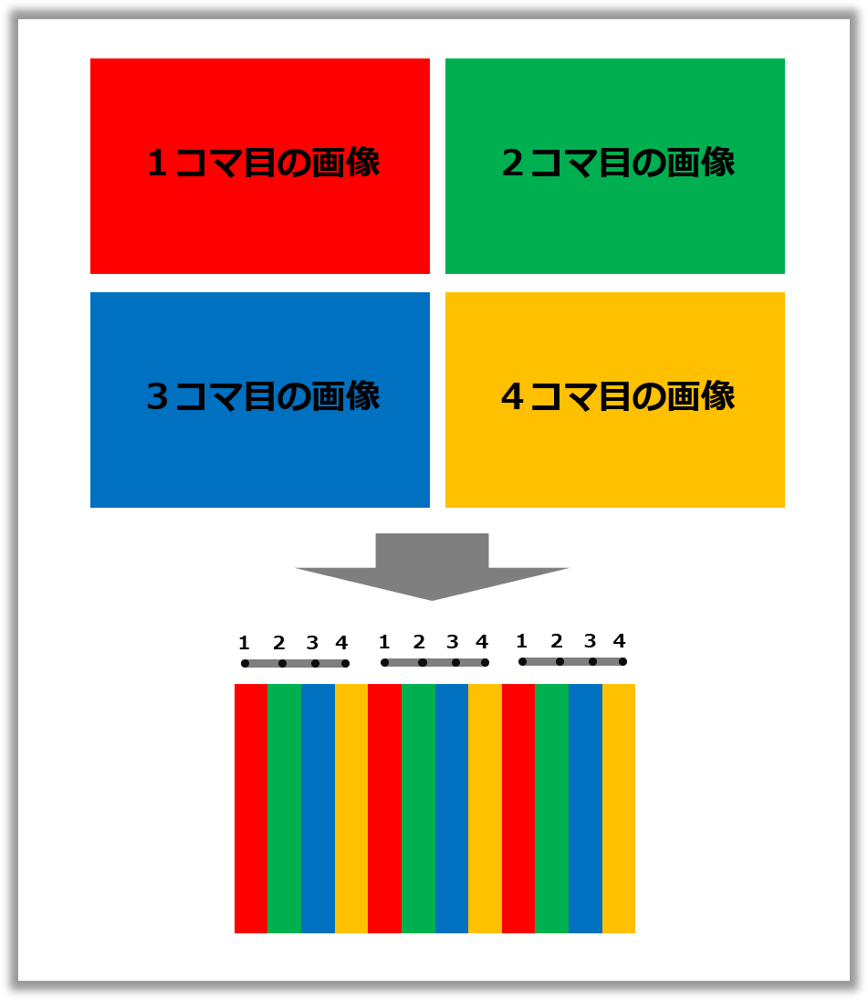
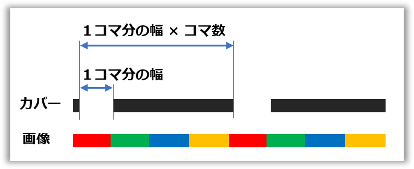
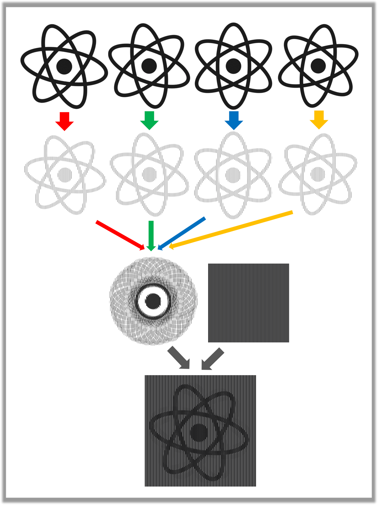
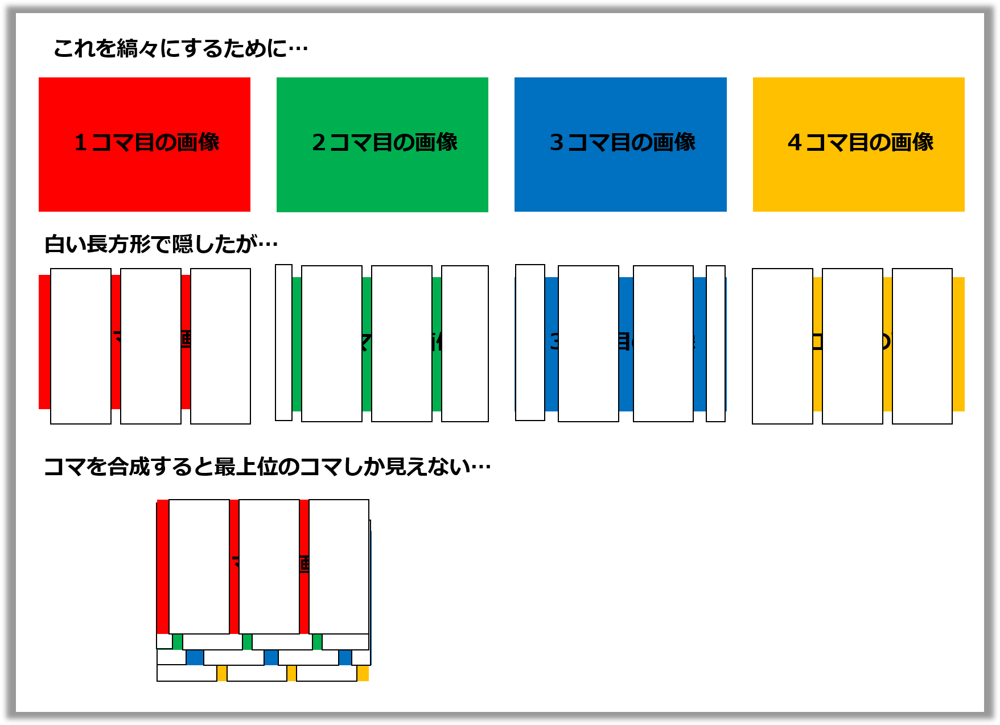
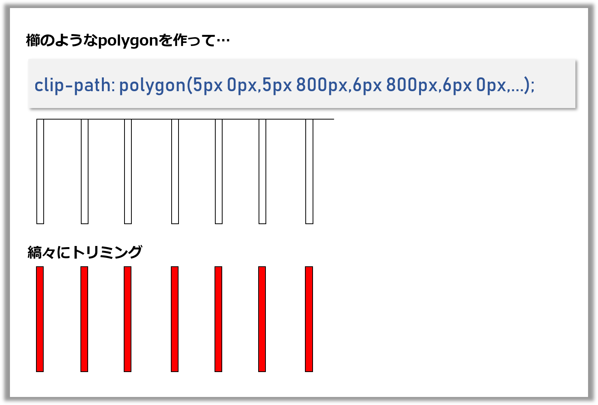

## なにこれ

Slit Animationを実現するReactコンポーネントをCSSのclip-pathを使って作りました。
Slit Animation(スリットアニメーション)は下記のようなものです。
コマ画像を縞々にして合成した画像に、スリットを持つカバーを被せて横にスライドさせることでパラパラ漫画のようなアニメーションを実現します。

デモはこちら ⇒ https://takumon.github.io/react-slit-animation/ <br>
コンポーネントはnpmから落とせます ⇒ [@takumon/react-slit-animation](https://www.npmjs.com/package/@takumon/react-slit-animation)


## Slit Animationの原理
CSSやReactコンポーネントなどの説明の前に、純粋にSlit Animationの原理を説明します。
Slit Animationは何個かのコマ画像を合成した画像とカバーから成り立ちます。以下では簡単のため４コマで説明します。

### コマ画像
それぞれのコマ画像を縞々にして１つの画像に合成します。


### カバー
カバーには等間隔で隙間があります。隙間幅は`縞々１個分`で間隔は`縞々１個分×コマ数`です。 


### アニメーション
合成画像にカバーを被せて横にスライドさせます。すると、カバーの隙間部分から`1→2→3→4→1→2→3→4→...`のようにコマが順番に繰り返し見えることになります。これによってパラパラ漫画のように見えるのです。


### 例
最初にお見せしたRreactのロゴがくるくる回るSlit Animationは下記のような構成になっています。コマを縞々にして合成、隙間のあるカバーを作成し上に被せています。



## 縞々をclip-pathで実現する
今回コンポーネント化にともない「画像を縞々にする」という課題がありました。
最初は、画像要素に白い長方形のdivタグをたくさん並べてトライしましたが、それだとコマ合成時に下の画像ごと隠れてしまいます。



合成時に他の画像に干渉しないようにするには、隠すのではなく存在を消す必要があります。
CSSの[clip-path](https://developer.mozilla.org/ja/docs/Web/CSS/clip-path)はまさにこのようなトリミング機能を実現するためのプロパティです。丸や楕円、任意の形にトリミングできます。


今回は任意の形にトリミングできる`polygon`を使って
`clip-path: polygon(5px 0px,5px 800px,6px 800px,6px 0px,11px 0px,11px 800px,...)`のようにして縞々化を実現しました。
これについても最初は、複数の長方形を指定しようとしましたが、polygonは１つの閉じた図形でなければならないという制約があり困りました。
ちょっと悩んだ末、ハック的に櫛型の図形を指定することで解決しました。




## Reactコンポーネント

### 実装
縞々化の`polygon`を組み立てロジックは、Slit Animationの原理で説明したようなロジックをもとに、先に説明したCSSのclip-pathで実現しました。


```javascript:title=縞々生成ロジック
function craeteFramePolygonPoints(
  coverSlitWidth,  // カバーの隙間幅
  coverWidth,      // カバー全体の幅
  coverHeight,     // カバー全体の高さ
  frameCount,      // コマ数
  frameIndex       // 何番目のコマか
) {

  // カバーの隙間を配置する間隔
  const unitWidth = coverSlitWidth * frameCount;
  // 隙間を何個並べるか
  const unitCount = Math.floor(coverWidth / unitWidth);

  // 櫛型とpolygonを生成
  return range(unitCount)
    .map(i =>
      range(frameCount, 1)
        .filter(i => i % frameCount === frameIndex  % frameCount)
        .map(countInUnit => {
          const offset = i * unitWidth
          const offsetInUnit = (countInUnit - 1) * coverSlitWidth
          const xStart =  offset + offsetInUnit
          const xEnd = xStart + coverSlitWidth
          const yStart = 0
          const yEnd = coverHeight

          return `${xStart}px ${yStart}px,` +
            `${xStart}px ${yEnd}px,` +
            `${xEnd}px ${yEnd}px,` +
            `${xEnd}px ${yStart}px`
        })
        .join(`,`)
    )
    .join(`,`);
}

// 補助関数
function range(size, startAt = 0) {
  return [...Array(size).keys()].map(i => i + startAt);
}
```

縞々ロジックが確立してしまえば後は簡単で、淡々とコンポーネントを作成していきます。

縞々画像のコンポーネント

```javascript:title=縞々画像のコンポーネント
import styled from 'styled-components'

const SlitAnimationFrame = (props) => {

  const {
    coverSlitWidth = 1,
    imageWidth = 500,
    imageHeight = 500,
    frameIndex,
    frameCount,
    image
  } = props;

  if (!frameIndex && frameIndex !== 0) {
    throw 'You need to set frameIndex.';
  }

  if (!frameCount) {
    throw 'You need to set frameCount.';
  }

  if (frameCount - 1 < frameIndex) {
    throw 'You need to set frameIndex which is smaller then lastIndex of frame.';
  }

  if (!image) {
    throw 'You need to set image.';
  }

  // 縞々ロジックを使う
  const freamePolygonPoints = craeteFramePolygonPoints(
    coverSlitWidth,
    imageWidth,
    imageHeight,
    frameCount,
    frameIndex
  );


  const FrameImage = styled.img`
    position: absolute;
    width: ${imageWidth}px;
    height: ${imageHeight}px;
    display: block;
    top: 50%;
    left: 50%;
    -webkit-transform: translateX(-50%) translateY(-50%);
    -ms-transform: translateX(-50%) translateY(-50%);
    transform: translateX(-50%) translateY(-50%);
    -webkit-clip-path: polygon(${freamePolygonPoints});
    clip-path: polygon(${freamePolygonPoints});
  `;

  return <FrameImage key={frameIndex} src={image} />;
}
```

<br>

続いてカバーのコンポーネント

```javascript:title=カバーのコンポーネント
import styled from 'styled-components'

const SlitAnimationCover = (props) => {

  const {
    frameCount, //required
    coverWidth = 500,
    coverHeight = 500,
    coverColor = '#000',
    coverSlitWidth = 1,
    startAt = 0,
    endAt = coverWidth,
    duration = 50,
  } = props;

  if (!frameCount && frameCount !== 0) {
    throw 'You need to set frameCount.';
  }

  // ここでも縞々ロジックを使う
  const coverPolygonPoints = craeteCoverPolygonPoints(
    coverSlitWidth,
    coverWidth,
    coverHeight,
    frameCount,
  );

  const CoverDiv = styled.div`
    top: 0;
    left: 0;
    position: absolute;
    width: ${coverWidth}px;
    height: ${coverHeight}px;
    overflow: hidden;
    &:after {
      top: 0;
      left: ${startAt}px;
      position: absolute;
      content: '';
      display: block;
      width: ${coverWidth}px;
      height: ${coverHeight}px;
      background: ${coverColor};
      -webkit-clip-path: polygon(${coverPolygonPoints});
      clip-path: polygon(${coverPolygonPoints});
    }
    &:hover:after {
      left: ${endAt}px;
      transition: left ${duration}s linear;
    }
  `;

  return <CoverDiv />;
}
```

<br>
最後に全体を取りまとめるコンポーネント。<br>
縞々画像とカバーを重ねて表示します。<br>
ホバー時にカバーを横スライドするようにしました。

```javascript
import React, { Component } from 'react';
import styled from 'styled-components'


const SlitAnimation = (props) =>  {
  const {
    images, // required
    imageWidth = 500,
    imageHeight = 500,
    coverWidth = imageWidth,
    coverHeight = imageHeight,
    coverColor = '#000',
    coverSlitWidth = 1,
    startAt = 0,
    endAt = coverWidth,
    duration = 50,
  } = props;

  if (!images || images.length === 0) {
    throw 'You need to set images.';
  }

  const frameCount = images.length;

  const cover = <SlitAnimationCover {...{
    frameCount,
    coverWidth,
    coverHeight,
    coverColor,
    coverSlitWidth,
    startAt,
    endAt,
    duration
  }}/>;

  const frame = range(frameCount).map(frameIndex =>
    <SlitAnimationFrame {...{
      coverSlitWidth,
      imageWidth,
      imageHeight,
      frameCount,
      frameIndex,
      image: images[frameIndex]
    }} />
  );

  const Container = styled.div`
    position: relative;
    width: ${coverWidth}px;
    height: ${coverHeight}px;
    overflow: hidden;
  `;

  return <Container>{frame}{cover}</Container>;
}
```

これで完成です。

### 使い方

```
npm i @takumon/react-slit-animation
```

でインストールして下記のように使えます。

```javascript
import SlitAnimation from '@takumon/react-slit-animation'

import parrot1 from './images/parrot/1.png'
import parrot2 from './images/parrot/2.png'
import parrot3 from './images/parrot/3.png'
import parrot4 from './images/parrot/4.png'
import parrot5 from './images/parrot/5.png'
import parrot6 from './images/parrot/6.png'
import parrot7 from './images/parrot/7.png'
import parrot8 from './images/parrot/8.png'
import parrot9 from './images/parrot/9.png'
import parrot10 from './images/parrot/10.png'

<SlitAnimation {...{
    imageWidth: 800,
    imageHeight: 800,
    images: [
      parrot1,
      parrot2,
      parrot3,
      parrot4,
      parrot5,
      parrot6,
      parrot7,
      parrot8,
      parrot9,
      parrot10,
    ],
    duration: 40,
    coverColor: '#444'
}} />
```


### いけてないところ
スリット幅、カバーの色、カバーのスライド速度など調整できるようにはしていますが色々と難点があります。
* 使う画像ごとに、うまく調整しないとなかなか動いているように見えない
* ピクセル幅にシビアなのでサイズをレスポンシブにできない
* モバイルで見ると固まる（レンダリングがかなり高負荷）

などなど実用的なコンポーネントとは程遠いです:cold_sweat:


## まとめ
思い付きで作ってみて一応Reactコンポーネント化できたのはとてもうれしかったです。
最近のCSS周りは、なんでもできるようになってて楽しいですね🍅
