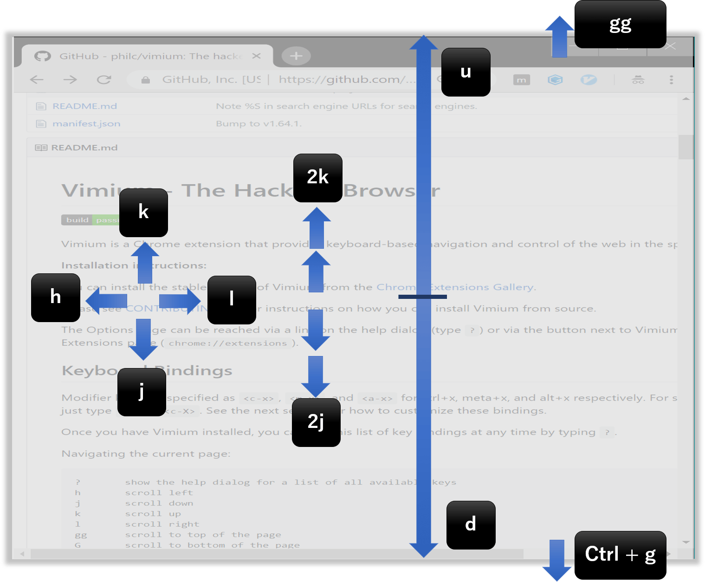

## なにこれ

最近DockerまわりをやっていてLinux上でDockerfileなどを編集するのがつらいので、ちゃんとVimを覚えようと思い立ち、
とっかかりとして下記４点取り組みました。整理もかねて本記事にまとめます。

1. vimtutor実施
2. [Vim日本語ドキュメント](https://vim-jp.org/vimdoc-ja/)読む
3. Qiitaの主要記事を読む
4. Chromeに[Vimium](https://chrome.google.com/webstore/detail/vimium/dbepggeogbaibhgnhhndojpepiihcmeb/related)導入

## 1. vimtutor実施

Vimをインストールすると`:vimtutor`で開くチュートリアルです。
実際に手を動かしながら説明を上から下に読み進めると、最低限の操作を覚えられます。
Vimを始めたらまずコレをやるのがVimを理解する一番の近道だと思います。 
1回チュートリアルを実践してみたら、後述する[Vim日本語ドキュメント](#2-vim日本語ドキュメント読む)や[Vimium](#4-chromeにvimium導入)を一通り使ってから再度挑戦すると良いです。
私も初回はおぼつかなかったですが、再度試した時はだいぶ直感通りに操作することができVimが少しできるようになったことを実感しました。

### 要約

章末に要約があってとても分かりやすいです。各章だいたいこんな感じでした。

* 【1章】上下左右の移動、保存して終了、破棄して終了、削除、ノーマルモードと挿入モードの切り替え
* 【2章】行先頭、末尾への移動、単語ごとの移動、モーションと組み合わせた削除、アンドゥ、リドゥ
* 【3章】ペースト、置換、変更 
* 【4章】ファイル先頭、末尾への移動、括弧間の移動、検索・置換
* 【5章】外部コマンド実行、外部ファイル読み込み、ビジュアルモード
* 【6章】行挿入、コピペ、置換モード、検索時のオプション
* 【7章】ヘルプの使い方、vimrc設定方法

## 2. Vim日本語ドキュメント読む

[Vim日本語ドキュメント](https://vim-jp.org/vimdoc-ja/) 

vimtutorで概要を掴み、実践的な操作を学習するためのサイトです。
初級者編が12章分、上級者編が13章分、その他もろもろ章があって充実しています。
自分は初心者編12章を読みました。時間があるときに上級者のほうも読みたいです。

## 3. Qiitaの主要記事を読む

ささーっと下記記事を読みました。記事を見てるとフォローしている人の中に、大抵の記事にイイねしている人が何人かいて「この人はVim派なんだな～」というのが見えてちょっと面白かったです。

* [新人達を1ヶ月でガチvimmerにした方法](https://qiita.com/nyantera/items/4bf29ca6f11bc797a9cb)
  * 行末移動は編集する場合がほとんどだから`g $`よりも`A`を使ったほうが断然楽というのが目から鱗でした。
* [Vim幼稚園からVim小学校へ](https://qiita.com/hachi8833/items/7beeee825c11f7437f54)
* [Vimの便利な画面分割＆タブページと、それを更に便利にする方法](https://qiita.com/tekkoc/items/98adcadfa4bdc8b5a6ca)
  * こんなリッチな機能があることにびっくりしました。VSCodeさながらです。
* [【入門】Vimで高速で移動 プラグインなしでの移動まとめ](https://qiita.com/takeharu/items/9d1c3577f8868f7b07b5)
  * `{`と`}`で段落ごとの移動、`zz`カーソルの位置をウィンドウの中心に移動、`z Enter`カーソルの位置をウィンドウの最上部に移動という便利コマンドが勉強になりました。

## 4. ChromeにVimium導入

[Vimium | Chrome Web Store](https://chrome.google.com/webstore/detail/vimium/dbepggeogbaibhgnhhndojpepiihcmeb/related) 

後輩に「Vim始めた」と言ったら、めちゃめちゃ勧められたのがこのChromeエクステンションです。ブラウザ操作をVim化できるという優れものです。
ネットサーフィンで日頃からVim操作に慣れておけば、いざLinuxでファイル編集する時も手が動くようにするためでもあります。
早速2～3日ってみたところ、ネットサーフィンでほとんどマウスを触らなくなりました。
スクロール、タブ移動、履歴移動などの操作一通りを、ホームポジションから手を動かすことなく実現できます。

### リンククリック

めっちゃ便利です。
`f`を押すと下記のように全リンクにショートカットキーが割り当てられ
キー入力でリンククリックができます。
`f`で自タブ遷移、`F`で新規タブ遷移です。

### スクロール

* `k`、`j`、`h`、`l`で上下左右にスクロール
* `2k`、`2j` など数字指定で大きくスクロール可能
* `u`、`d`で画面半分スクロール
* `gg`で最上部へスクロール
* `G`で最下部へスクロール

### タブ移動

* `J`で左隣に移動
* `K`で右隣に移動
* `g 0`で最左に移動
* `g $`で最右に移動

### タブ操作

* `t`で新規タブ開く
* `x`で現在のタブを閉じる

### 更新・戻る・進む

* `r`で更新
* `H`で戻る
* `L`で戻る

### 注意点
たまに入力項目にフォーカスが当たっている場合などは、操作が効かなくなるので、その時はブラウザのデフォルトショートカットを使うことをお勧めします。

## その他

最低限マークダウンを編集できるように[plasticboy/vim-markdown](https://github.com/plasticboy/vim-markdown)を導入しました。 
デフォルトのVimだとマークダウンのシンタックスハイライトは効きますがVSCodeに比べると若干編集しづらいところがありました。
導入後は箇条書きリストで改行したときにインデントを保ったまま`* `を付けてくれたりと軽快に編集できるようになりました。 
プラグインはGitHubからZIPでダウンロードして解凍したものをvimフォルダ配下の`plugins`に突っ込めば普通に動きました。
※`vimrc`で`plugins`配下を全部読み込むような設定になっているようですね。

## まとめ

昔、同期が「Vim最高！！」とか言ってて当時は全く理解できませんでしたが、今ならわかるような気がします。
そこまで使いこなせていませんが、Vimの考え方などは非常に共感できるし、基本操作さえ覚えてしまえば、あとは組み合せで対応できる点が大変気に入っています。カーソル移動がとにかく楽ですね。 
Vimiumを日頃から使っていれば操作は忘れないし、今後はLinux上で恐れることなくVimを使っていけそうな気がしました🍅