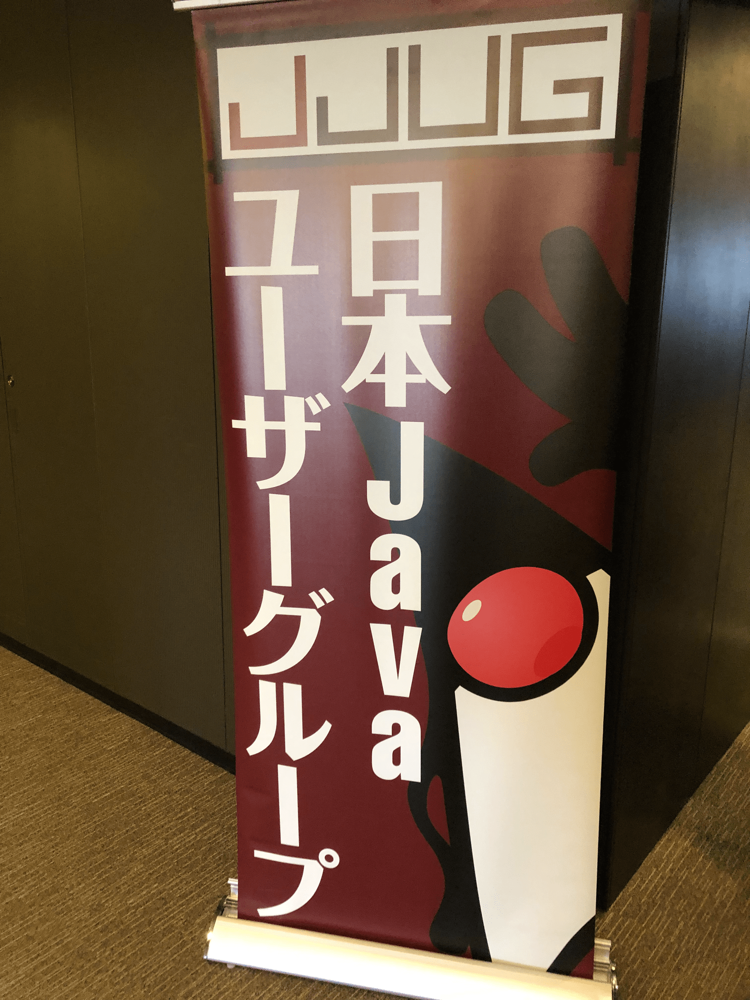
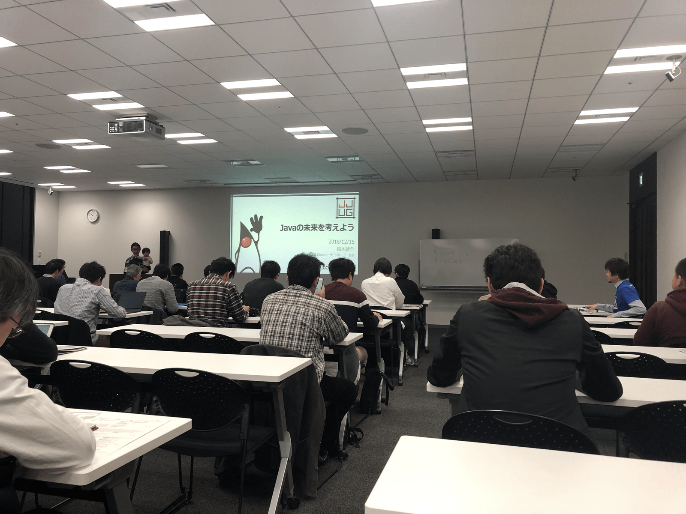

## なにこれ



Java CCC 2018 Fallに参加してきました。
見てきたセッションは以下の通りです。


1. 【JJUG基調講演】Javaの未来を考えよう 
   * [セッション概要](http://www.java-users.jp/ccc2018fall/#/sessions/e1dbadf5-158a-4138-a3fa-f139329b2cdf)
   * [#ccc_e1](https://twitter.com/search?q=%23ccc_e1)
2. マネーフォワードのアカウントアグリゲーションの現状と課題点について／Selenium WebDriverとヘッドレスChromeを用いたスクレイピング
   * [セッション概要](http://www.java-users.jp/ccc2018fall/#/sessions/2f1cc228-b536-4775-8dad-5cbafffab39e)
   * [#ccc_g2](https://twitter.com/search?q=%23ccc_g2)
3. 思考停止しないアーキテクチャ設計
   * [セッション概要](http://www.java-users.jp/ccc2018fall/#/sessions/d4cbd28c-0028-46d7-9589-5883af93825c) 
   * [スライド](https://www.slideshare.net/kawasima/jjug-ccc-2018-fall)
   * [#ccc_e3](https://twitter.com/search?q=%23ccc_e3) 
4. エムスリーでのKotlinへの取り組み
   * [セッション概要](http://www.java-users.jp/ccc2018fall/#/sessions/331c1102-be76-4e17-bf7c-43f55dbc73da)
   * [スライド](https://speakerdeck.com/m3_engineering/jjug-ccc-2018fall-kotlin-in-m3?slide=69)
   * [#ccc_a4](https://twitter.com/search?q=%23ccc_a4) 
5. 既存アプリケーションでKotlinを導入してみた
   * [セッション概要](http://www.java-users.jp/ccc2018fall/#/sessions/9f265f00-8a25-40e2-9ca3-c701bb5154e4) 
   * [スライド](https://docs.google.com/presentation/d/1wTm_eSbsM2ihfz27QpSHzuRcCIhcRYKom-Vx_-FfUts)
   * [#ccc_c5](https://twitter.com/search?q=%23ccc_c5) 
6. コードをどまんなかに据えた設計アプローチ(irof)
   * [セッション概要](http://www.java-users.jp/ccc2018fall/#/sessions/536c5e49-1730-430c-811e-c38a77cedd45) 
   * [スライド](https://speakerdeck.com/irof/kodowodomannakaniju-etashe-ji-apuroti)
   * [#ccc_e6](https://twitter.com/search?q=%23ccc_e6) 
7. 「マイクロソフト牛尾さん渡米直前記念」外資系企業で働くエンジニアの生産性向上物語(日本マイクロソフト株式会社)
   * [セッション概要](http://www.java-users.jp/ccc2018fall/#/sessions/b0657145-4de3-4a64-b02b-83fbc2fdc6b9)
   * [#ccc_g7](https://twitter.com/search?q=%23ccc_g7)


それぞれの感想を下記に示します。


## イベント概要

* 公式サイト
  * [JJUG CCC 2018 Fall](http://www.java-users.jp/ccc2018fall)
* 開催日時
  * 2018/012/15(土) 09:30 - 21:00
* 開催場所
	*  [ベルサール新宿グランド　コンファレンスセンター ](https://www.bellesalle.co.jp/shisetsu/shinjuku/bs_shinjukugrand/)
*  ハッシュタグ
   * [#jjug_ccc](https://twitter.com/search?q=%23jjug_ccc)


## 【JJUG基調講演】Javaの未来を考えよう

※スライドなし（いまのところ）



<br />

CCCには過去4回ほど午後からグダグダ参加でしたが、今回初めて朝一で基調講演を聞きに行きました。
前半は、鈴木会長(withお子様)のお話で、後半は、せろさん、じゅくちょーさん、きしださんのによるパネルディスカッションでした。

ところで毎回JJUGで思うのですが、@nakayama_san さんの絵がすごいです。これを見るとJJUG来たなーって感じます。

<blockquote class="twitter-tweet" data-lang="ja"><p lang="ja" dir="ltr">Javaの未来を考えよう を聞いてきたメモ<a href="https://twitter.com/hashtag/ccc_e1?src=hash&amp;ref_src=twsrc%5Etfw">#ccc_e1</a> <a href="https://twitter.com/hashtag/jjug_ccc?src=hash&amp;ref_src=twsrc%5Etfw">#jjug_ccc</a> <a href="https://t.co/rc8m8EmUvT">pic.twitter.com/rc8m8EmUvT</a></p>&mdash; Nakayama san (@nakayama_san) <a href="https://twitter.com/nakayama_san/status/1073756080910430209?ref_src=twsrc%5Etfw">2018年12月15日</a></blockquote>
<script async src="https://platform.twitter.com/widgets.js" charset="utf-8"></script>


#### Javaの歴史

正直Sun時代のJavaの歴史などは、自分の中で曖昧だったので、サクッと知れ良かったです。
Javaのサポートについては、Oracleから配布されているJDK使っていればOKという状況ではなくなっているので、
有償サポート・無償サポートなどの状況を正確に把握する必要があるなぁと感じました。


```markdown:title=Javaの歴史
* 1999年
    * Apatch Jakarta ProjectからTomcatがリリース
    * Java OSSの受け皿としてApack Jakarta Project開始
        * 今のJavaの技術の基礎を作った
    * 2011年に役目を終えた（全プロジェクトがトップレベルに移行）
* 2004年
    * Eclipse Foundation が非営利団体として設立
* 2006年
    * SunがOpen JDKを公開（GPLv2ライセンス）
* 2010年
    * OracleがSunを74億ドルで買収
* 2016年
    Java EE Guardians
    * OracleのJava EE仕様策定遅延を懸念し、Java EEを守ろうとする団体が発足
* 2017年9月
    * Java EE オープンソース化しEclipse Foundationへ移管
    * EE4J(Eclipse Enterprise for Java)発足
* 2017年9月以降～現在
    * Eclipse MicroProfile発足
    * Java SEリリースモデル変更
        * 半年に一回のバージョンアップ
        * サポートは次バージョンが出るまで
        * 3年置おきの長期間サポートバージョンの提供
    * 有償・無償など
        * 有償：Oracle, IBM, RedHat, Azul
        * 無償：AdoptOpenJDK HotSpot/OpenJ9, Amazon Corretto
        * 条件付き無償：Azure上の Azul Systems Zulu Enterprise
    * 買収
        * IBMがRedHat買収
        * MicrosoftがGitHub買収 などなど
```


#### パネルディスカッション

コミュニティ活性化への熱い思いを感じました。
確かに、フリーライドするだけでなく、コミュニティに貢献したり、プルリク出したりと、自分から積極的に関わることが重要だと思います。
またブログの重要性についても触れていて、きしださんの「ブログ書くと他人に影響を与えられて、自分の都合のいい世界になっていく」という言葉が印象的でした。


```markdown:title=パネルディスカッション
* 「Java有償化」というワードの一人歩き
* VM
  * JVM実行環境が変わってきている。GraalVM登場、動的型付け言語をサポート
  * Project Metropolis
    * C++で書かれているJVMをJavaで書き換えようというプロジェクト
  * 個人で作るときはJavaは配布がめんどい、Nativeコンパイルが流行ってくれていれば
      * Javaもそうなろうとしている
  * AWS Lamdaなどのファンクションとして起動するものが増えてきた。Javaもそれに合わせて変わってきている
    * JITコンパイル時にNativeコードに変換するから起動が早くなってる
    * Javaのコアモジュールの分割
      * モジュール分割されて　必要最低限のコアモジュールだけ取り込むことが可能
* Javaコミュニティ
  * Javaライフサイクル短縮により、情報をより頻繁に取り入れる必要が出てくるため。コミュニティ活性化につながる。国際交流の機会が増える。
  * 日本の新元号がJava11で組み込まれているけど　メーリングリストではあまり話題にならなかったなぁ。日本の人が声を上げないと不都合な変更がそのままになる
  * StrutsのEOL
    * 日本人でコミッターがいれば日本で引き継げたのかも
  * フリーライドするだけでもいいが、積極的に貢献することも重要
  * ブログを書く
    * 自分から情報を公開すると自分の都合のいい世界に変わっていく
  * 積極的にコミュニティにかかわっていってください
* QA
  * 各人のNextStepは何ですか
    * きしださん
      * 朝起きれる人になりたい
    * じゅくちょーさん
      * JVMになりたい
      * 読むだけではなくコントリビュートしたい
    * せろさん
      * エンターテイメントに関わっていきたい。を盛り上げたい
```


## マネーフォワードのアカウントアグリゲーションの現状と課題点について／Selenium WebDriverとヘッドレスChromeを用いたスクレイピング

※スライドなし(いまのところ)

マネーフォワードさんではお金に関する４つのサービスを提供しているそうです。
今回はそのうちの１つ「Money Forword Home」のアプリについてのお話でした。

```markdown:title=会社概要
* マネーフォワードが提供しているサービス
  * Money Forword Home
    * 個人向け　家計簿　スマホアプリ
  * Noney Forword Business
    * 法人向け お金の状態を可視化するアプリ
  * Money Forword X
    * パートナーとともにサービスを提供する
  * Money Forward Finance
```

<br />

HtmlUnitってテストライブラリじゃないの!?と思いましたが、マネーフォワードさんではスクレイピングに使用しているそうです。
確かにそんな使い方もできないことはないけれど...ちょっとびっくりです。
最新ブラウザとの挙動を合わせるためにHtmlUnitにコミットしたり、スクレイピング対象のサイトがリニューアルしたら、スクレイピングのロジックを変えたりと、地道な努力が伝わってきました。

```markdown:title=現状のスクレイピング
* 自動家計簿
  * インターネットサービス上に散らばったお金のやり取りの情報を集約・自動分類して家計簿を出力するサービス
  * Java8で動いている
  * HtmlUnitでスクレイピングしてお金のやり取り情報を収集する

* HtmlUnitでのスクレイピング
  * HtmlUnitはUnitテストで使うことが多いが、マネーフォワードでは、スクレイピングに使っている
  * HtmlUnitを拡張してスクレイピングに特化した機能を追加している
  * メリット
    * 通常のスクレイピングと違い、ブラウザ操作と同じ仕組みでスクレイピングできるので、Webブラウジングの根っこの部分からハンドリングできる
  * デメリット
    * HtmlUnitは独自ブラウザを使っているので、最新のChromeと挙動が違ったりする
      * 特にJavaScriptで動的にレンダリングする部分
      * 挙動が違う場合、HTMLUnitにコミットして最新のブラウザに仕様を追従させる必要がある
```

<br />

後半は、「HtmlUnitだとつらいのでSelenium WebDriverかヘッドレスChromeを検討中」というお話でした。
コチラも、Selenium WebDriverを使う場合に、ファイルダウンロード完了通知の仕組みを自分たちで考えたりと、地道な努力が伝わってきました。

```markdown:title=Selenium WebDriverとヘッドレスChromeを用いたスクレイピング
* 脱HtmlUnit計画
  * HtmlUnitだと最新ブラウザのAPIに追従していないのでスクレイピング時にエラーが発生する。つらい。
  * Selenimu WebDriverかヘッドレスChromeを検討
* ヘッドレスChroem(Chrome DevTools Protocol)
  * 仕組み
    * |App| ====CDP====> |Chrome|
  * 検証した感じ
    * 結構ローレベルなAPIしかないので処理が煩雑になる
    * 学習コスト高
* Selenium WebDriver
  * 仕組み
    * |App| ====HTTP====> |ChromeDriver| =====CDP====> |Chrome|
  * 検証した感じ
    * マルチデバイスでスクレイピングできていいね
    * WebDriver標準API以外にもいろんなエンドポイントを受け付けることが可能
    * APIの粒度はCDP程細かくなくイイ感じ
  * 業務要件にマッチしているか
    * プロキシ設定できるか ⇒ 〇
    * Cookie使えるか ⇒ 〇
    * ファイルダウンロード使えるか ⇒ △ ファイルダウンロードはできるがアプリ側にダウンロード完了を伝える仕組みがない
      * ⇒ 自分たちで実装
        * Seleniumの場合、アプリとは別プロセスでブラウザが起動しているため、ファイルシステムを介してやり取りすることにした
        * ダウンロード中のファイル名を決めておき、それがファイルがなくなったら、ダウンロード完了とみなす
  * 残課題
    * WebDriverのバージョンアップ対応
    * Chromeバージョンアップへの対応
```

<br />

技術的に突出して新しいものを使っているわけではありませんが、開発現場のリアルな試行錯誤が聞けて大変楽しいセッションでした。


## 思考停止しないアーキテクチャ設計

<iframe src="//www.slideshare.net/slideshow/embed_code/key/il0sIDu2XdnYo6" width="595" height="485" frameborder="0" marginwidth="0" marginheight="0" scrolling="no" style="border:1px solid #CCC; border-width:1px; margin-bottom:5px; max-width: 100%;" allowfullscreen> </iframe>
<div style="margin-bottom:5px">
	<strong>
		<a href="//www.slideshare.net/kawasima/jjug-ccc-2018-fall" title="思考停止しないアーキテクチャ設計 ➖ JJUG CCC 2018 Fall" target="_blank">思考停止しないアーキテクチャ設計 ➖ JJUG CCC 2018 Fall</a>
		</strong> from <strong>
		<a href="https://www.slideshare.net/kawasima" target="_blank">Yoshitaka Kawashima</a>
	</strong>
</div>

<br />


元T社の川島さんのセッション。一番広い部屋でしたが、立ち見が出るほど人気でした。
お話の内容はかなり抽象度が高く上級者向けで、わからない単語もチラホラ出てきました。
川島さんは、応募時点で無職、現在は[ウルフチーフ](https://www.wolfchief.jp/about/)という個人の会社を設立されています。
セッション冒頭紹介があった「企業クエスト」やってみましたが確かに企業はめんどくさそうですね（したことないからわかりませんが...）

<blockquote class="twitter-tweet" data-partner="tweetdeck"><p lang="ja" dir="ltr">吉祥寺.pm16で発表した「起業クエスト」を公開しました！<br>かなりの難度のゲームです。<a href="https://t.co/JMARTHIHxU">https://t.co/JMARTHIHxU</a><br>回線容量喰うので、おうちでお試しください！</p>&mdash; :craftsman/kawasima (@kawasima) <a href="https://twitter.com/kawasima/status/1073595586199187457?ref_src=twsrc%5Etfw">December 14, 2018</a></blockquote>
<script async src="https://platform.twitter.com/widgets.js" charset="utf-8"></script>


セッション中の「The Patterns of Stop Thinking」は[思考停止の分類 | はてな匿名ダイアリー](https://anond.hatelabo.jp/20150805115616)に詳細が記載されています。
自分も無意識のうちに思考停止になってないか、チェックする時にコレを使ってみようと思います。


## エムスリーでのKotlinへの取り組み

<div style="left: 0; width: 100%; height: 0; position: relative; padding-bottom: 74.9288%;"><iframe src="//speakerdeck.com/player/e2d72cafdacd458280575d5cd4838863" style="border: 0; top: 0; left: 0; width: 100%; height: 100%; position: absolute;" allowfullscreen scrolling="no" allow="autoplay; encrypted-media"></iframe></div>

<br />

エムスリーさんではAndriod、サーバーサイドの両方で、積極的にJavaからKotlinへ移行しているようです。

```markdown:title=Kotlinとエムスリー
* だんだんとKotlinの導入が進んでいる(約6グループ)
* Andriod、サーバーサイドともに導入が進んでいる
* Kotlin導入理由
  * Better Javaとして
  * エンジニアとして新しいものに挑戦したい欲求
  * Andriodで導入済なのでサーバサイドに導入してオールKotlinにしたい
  * 他プロジェクトでの導入成功事例があるため
* 技術選定はチームごとに自由
  * 自分のチームはKotlin, Go, React が主流
```

<br />

移行方法は大きく3パターンあり、刷新する方法について詳しく説明されていました。
テストコードはJavaのまま。リグレッションテストはGolden file testingを使用するなど素早く移行するためのノウハウを聞くことができました。


```markdown:title=【サーバーサイド】JavaからKotlinの移行方法
* 移行方法
  * 段階的
  * なかったことにする
  * 刷新
    * IntelliJで自動コンバートして、なんとかする
      * 他機能開発と調整が必要
        * `xxx.java`から`xxx.kt`になるためGitで差分が見づらい
          * 差分が見づらいゆえ、他で同時に機能開発が走っている場合、デグレの可能性がある
    * リグレッションテストをたくさん作っておく
      * テストコードはJavaのまま
    * 自動コンバートをレビューしても仕方がない
    * Golden file testingを用いたリグレッションテスト
      * APIのレスポンスとGolden fileと比較してレスポンスがかわらないことを確認する
        * assert地獄から解放される
    * Swagger Codege, UI (Open API)
      * ソースコードからクライアントライブラリとドキュメント生成
```

<br />

発表者の方が「エムスリー社内Slackの`#spring-boot`チャンネルに質問したら、有識者が回答がかえってきてすぐに解決した。」と言っていて、
こういう風に社内で横断的にコミュニケーションがとれる文化は素晴らしいなぁと思いました。


## 既存アプリケーションでKotlinを導入してみた

<div style="left: 0; width: 100%; height: 0; position: relative; padding-bottom: 56.2493%; padding-top: 30px;"><iframe src="https://docs.google.com/presentation/d/1wTm_eSbsM2ihfz27QpSHzuRcCIhcRYKom-Vx_-FfUts/preview?usp=embed_googleplus" style="border: 0; top: 0; left: 0; width: 100%; height: 100%; position: absolute;" allowfullscreen scrolling="no" allow="autoplay; encrypted-media"></iframe></div>

<br />

フリューさんのピクトリンクをJavaからKotlinに移行したというお話でした。
ピクトリンクとはプリ画のSNSだそう。僕が高校生の頃はプリクラ手帳とかで物理的にやっていましたが、今はWebでSNSでできちゃうんですね。
JavaとKotlinのソースコードの比較と、デモを織り交ぜながら、初心者にも非常にわかりやすい説明でした！


```markdown:メモ
* 使う理由
  * Javaから移行簡単
  * SpringでもKotlinサポートしている
* 便利な書き方
  * 用法要領をまもろう
    * みじかくかける != わかりやすい
    * it多様すると記述量は少なくなるけど、可読性が落ちる場合がある
  * 分割宣言はpublicAPIでは使いにくいので気を付けよう
  * alsoというスコープ関数便利
  * DataClass
    * cloneやtoStringメソッドがあらかじめある。Lombokみたいな感じ
  * 拡張関数
    * 既存クラスに対して　関数を追加できる
    * Nullableクラスに対しても追加できる
    * 注意点
      * mixinのようとでガンガン追加するとオレオレになってしまう
      * カオスになる要因なので、ルールを決めて使いましょう
  * Smart Cast
    * このパターンだったらコレで大丈夫的なやつをDSLで定義する
    * これもカオスになる要因。できればインターフェース設計とかで解決したい
* ツールサポート
  * IntelliJ IDEA を使ったJava to Kotlinの自動変換が便利
  * Gralde Kotlin DSL
    * GradleをKotlinでかける、既存Gradleファイルと共存可能
* 注意点
  * Java側がNullを返すパターンがややこしい
    * コンパイルは通るが実行時例外になるケースがある
  * バージョンアップが激しい
    * 結構非互換ある
    * チームのスキルセットと相談
```


## コードをど真ん中に据えた設計アプローチ

<div style="left: 0; width: 100%; height: 0; position: relative; padding-bottom: 74.9288%;"><iframe src="//speakerdeck.com/player/a8bb0866f87c4c1da18793db49f5b9e0" style="border: 0; top: 0; left: 0; width: 100%; height: 100%; position: absolute;" allowfullscreen scrolling="no" allow="autoplay; encrypted-media"></iframe></div>

<br />

「ソースコードを読むときに、だいたいIDEを使う。IDEのおかげで括弧の強調表示や、メソッドにジャンプが可能になる。
この発展系で、コードをドキュメントのように見せることができれば、コードをど真ん中に見据えた設計ができるのではないか」
この仮説のもと、コードをど真ん中に見据えた設定を実現を補助するツール、[JIG](https://github.com/dddjava/Jig)(Java Instant-document Gazer)の紹介という流れでした。


※このセッションのメモはありません。疲れてきたからメモを取らなかったとかいう理由では決してありません。


## 「マイクロソフト牛尾さん渡米直前記念」外資系企業で働くエンジニアの生産性向上物語

最後のセッション。当初はScalaの話でも聞こうかと思っていましたが、疲れ切っていたのでこのセッションを見ることにしました。
寺田さんと牛尾さんの掛け合いで、とても面白い話を聞くことができました。

「外資はいいぞ」という話をしていたのですが、そんなに変わるものなんでしょうか？ 
僕は日本企業しか経験がないので、ぜひ外資の知り合いに聞いてみたいですね。
あとは<br />
(1) 英語力を身に着けてインプットを加速させる<br />
(2) ブログを書いてアウトプットする<br />
この２点の重要性について語られていました。<br />
僕もブログは書いているのですが、英語に関してはサッパリ...なので英語やらねばならんですね。


```markdown:メモ
* 外資はいいよ
  * 上司が技術にたけているので上司説得の場面がない。
  * 無駄なやり取りが少ない
  * スピードが速い
* ブログを書く
  * 面白いとおもったことを共有したい
  * 自分の学んだことをメモする
  * プログラミングをうまくなるコツはブログを書くこと
  * 世界にシェアしたいものを英語でブログ書く
* 英語力
  * 英語力は必須
    * 最新の技術動向はだいたい英語
  * 英語力が技術力に直結する
  * しゃべれるようになるには大阪のおばちゃんみたいになる
```


## おわりに

久しぶりに前職の人と再開でき、今の職場の人にも会えてとても楽しい時間を過ごすことができました。
懇親会ではお寿司も大量に食べれて（お寿司は結構余ってた）、色んな方と話せたので満足です。

こんな素敵なJJUGを支えてくれるスタッフ、ボランティア、登壇者の皆様、本当にありがとうございました。
JJUG CCC 2019 Springも楽しみにしています🍅


## 参考

* [JJUG CCC 2018 Fall( #jjug_ccc ) - セッション資料の一覧 | 地平線に行く](http://d.hatena.ne.jp/chiheisen/20181215/1544897520)
* [JJUG CCC Fall 2018 資料まとめ| Qiita](https://qiita.com/ryuichi1208/items/1ed16c162c0205d1514e)