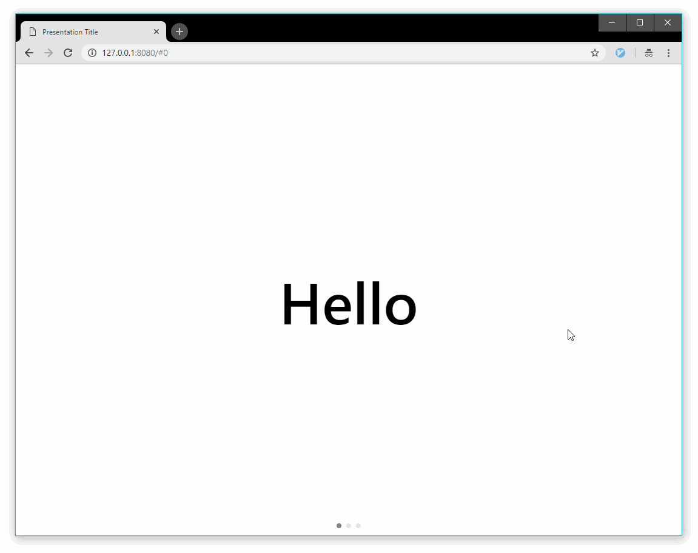

## なにこれ

[mdx-deck](https://github.com/jxnblk/mdx-deck)と[code-surfer](https://github.com/pomber/code-surfer)を使って、[mdx](https://github.com/mdx-js/mdx)ファイルで簡単にリッチなスライドが作れるので試してみました。作ったスライドは下記、または[GitHub Pages](https://takumon.github.io/mdx-deck-sample)をご覧ください。<br>
<small>スマホだと小っちゃいのでPCで見てください:dizzy_face:</small>

<iframe 
  src="https://takumon.github.io/mdx-deck-sample" 
  width="600" 
  height="400"
  ></iframe>


スライドに大体書いてあるので本記事では補足情報を下記に示します。


## MDXとは

簡単に言うとJSXのマークダウン版です。
JSXはJavaScriptファイル中にReactコンポーネントを記述できますが、
MDXはマークダウンファイル中にReactコンポーネントを記述できます。
最初見た時は「なんじゃコリャ!?」と思いましたが慣れると良いです。


````jsx:title=mdxサンプル

### マークダウンのセクション

コードブロックなども、もちろん使える

```jsx
import { Image } from 'mdx-deck'
<Image src='./images/sample-background.jpg' size='cover'/>
```

---

#### Reactコンポーネントを埋め込める

import { Image } from 'mdx-deck'

<Image src='./images/sample-background.jpg' size='cover'/>

````


## mdx-deckとは

<blockquote class="twitter-tweet" data-lang="ja">
  <p lang="en" dir="ltr">MDX-based presentation decks<a href="https://t.co/tuTpxlVjUL">https://t.co/tuTpxlVjUL</a> <a href="https://t.co/HCR9E72OPP">pic.twitter.com/HCR9E72OPP</a>
  </p>
  &mdash; Brent Jackson (@jxnblk) <a href="https://twitter.com/jxnblk/status/1023667155324346373?ref_src=twsrc%5Etfw">2018年7月29日</a>
</blockquote>
<script async src="https://platform.twitter.com/widgets.js" charset="utf-8"></script>


上記のように爆速でスライドが作れるライブラリです。
マークダウンベースのスライド作成ライブラリとしてはReveal.jsやRemark.jsなどありますが、
mdx-deckはMDXベースというのが特徴です。<br>
ちょっと使ってみた感想を...:arrow_down:

### 利点

* 📝 マークダウンだけでプレゼンが作れる
    * HTMLなど不用
    * 0コンフィグですぐ始められる
* ⚛️ マークダウンにReactコンポーネントがインポートできる
    * Webサイトのようにリッチな表現が可能(後述するcode-surfaceとか)
* 💅 テーマやReactコンポーネントがカスタマイズできる
* 💁パワポのように発表時に便利な機能がある
    *  発表者モード
    *  発表者用ノート
    *  PDF出力


### 欠点

* HTMLタグの中にマークダウン記法をネストできない(Reactコンポーネントの書き方しか許容できない)
* 最新盤のmdx-deckやcode-surferだとビルドがうまくいかない
  * ビルド時に画像が出力されないので、npm scriptでコピペするようにした


### mdx-deckの始め方

とにかくすぐ始められます。

* プロジェクト生成
  ```
  npm init deck mdx-deck-sample
  ```
* 起動
  ```
  cd mdx-deck-sample
  npm start
  ```
* 勝手にブラウザで`http://127.0.0.1:8080`が開かれてスライドショーが見れます！
  


## code-surferとは

mdx-deckで使えるReactコンポーネントです。コードプレビューをリッチにしてくれます。
アニメーションで指定した行や単語をハイライトしてくれるという優れものです。
またスライドでコード量が多くて全部載せきれない時って結構あると思うのですが、アニメーションで指定行をズーム・スクロールをしてくれるので、コード量が多い場合でも、説明が聴衆に伝わりやすいスライドを作ることができます。
またソースコードは[raw-loader](https://github.com/webpack-contrib/raw-loader)を使えば別ファイルに切り出せる点も魅力的です。<br>

code-surferは言葉で説明するよりも実際のスライドを見たほうがいいので、[なにこれ](#なにこれ)のスライドの最後のほうをご覧ください。


## mdx-deckを調べたきっかけ

もともとブログとスライドが一元管理できれば楽かなと思い、
自分のブログ(Gatsby製)でスライドショーが作れる方法をあるかを調べていたところ、
@chrisbiscardi さんのつぶやきを見つけました。

<blockquote class="twitter-tweet" data-lang="ja">
  <p lang="en" dir="ltr">Experimental integration with mdx-deck for gatsby-mdx. Build presentations right inside your personal website. Use the power of gatsby to pull in data.<a href="https://t.co/O3jCjb0Yij">https://t.co/O3jCjb0Yij</a><br> <br>cc/ <a href="https://twitter.com/jxnblk?ref_src=twsrc%5Etfw">@jxnblk</a> <a href="https://t.co/2ZuxlU2dxE">pic.twitter.com/2ZuxlU2dxE</a>
  </p>&mdash; :party-corgi: (@chrisbiscardi) <a href="https://twitter.com/chrisbiscardi/status/1026305119652958209?ref_src=twsrc%5Etfw">2018年8月6日</a>
</blockquote>
<script async src="https://platform.twitter.com/widgets.js" charset="utf-8"></script>

* [デモページ](https://deploy-preview-43--gatsby-mdx-kitchen-sink.netlify.com/)
* [リポジトリ](https://github.com/ChristopherBiscardi/gatsby-mdx/tree/master/examples/kitchen-sink)

ただ上記は未完成らしくビルドが一部うまくいかないようです。
ちょっと残念だと思いつつ、gatsby-deckの要素技術として使っていたのがmdx-deckだったので、将来に備えmdx-deckを調べてみることにしました。


## まとめ

mdx-deckは比較的新しいライブラリなので、現状だとビルドエラーが起きたり、コンポーネントの種類が少なかったりしますが、これから整備がすすんでいくものと思われます。
スライド用のReactコンポーネントが増えてきて、GUIで作れるようなツールが出てきて...みたいになると楽しそうですね🍅


## 参考

* [jxnblk/mdx-deck | GitHub](https://github.com/jxnblk/mdx-deck)
* [Make Fast & Beautiful Presentations with MDX-Deck | YouTube](https://www.youtube.com/watch?v=LvP2EqCiQMg)
* [mdx-deckのサンプル](https://github.com/kentcdodds/simply-react)
* [mdx-deck: slide decks powered by markdown and react](https://blog.kentcdodds.com/mdx-deck-slide-decks-powered-by-markdown-and-react-bfc6d6af20da)
* [code-surfer](https://github.com/pomber/code-surfer)
* スライド作成ライブラリ
    * [spectalc](https://github.com/FormidableLabs/spectacle)
    * fusuma
        * [Markdownだけで綺麗なスライドを作るCLIを作っている](https://blog.hiroppy.me/entry/fusuma)
        * [Introducing Fusuma: A helper for creating slides with markdown](https://dev.to/abouthiroppy/introduce-fusuma-that-is-a-helper-for-creating-a-slide-536)

