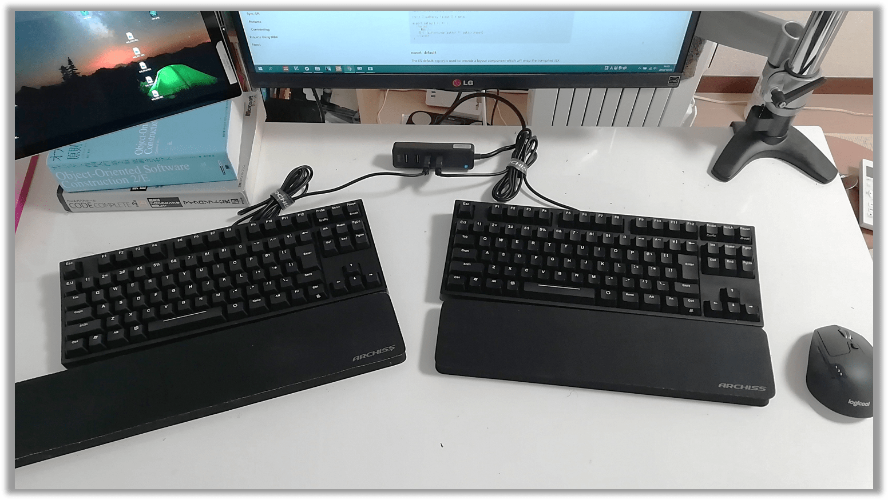

## なにこれ

パソコンで肩こりに悩まされている方は比較的多いと思います。その要因の1つがキーボードです。自分に合わないキーボードを使い続けていると、手首、肩、腰など体に負担がかかり、肩こりの原因になるといわれています。 

市場には楽にタイピングができる静電容量無接点方式のキーボードや、肩を開いてタイピングができるセパレートタイプのキーボードなどさまざまな商品が出ています。ただ結構いいお値段するので、自分に合わなかった場合のリスクを考えると、購入を躊躇してしまう方も多いのではないでしょうか。 

そんな方にはデュアルキーボードがオススメです。
以下では、実際に自分がデュアルキーボードを導入してみて感じたメリット・デメリットを踏まえながら、なぜ低コストで肩こりを解消するならデュアルキーボードがオススメなのかについてご説明します。 

## デュアルキーボードの始め方

いま手元にあるキーボードをもうひとつ購入し、USBでつなぐ!　ただそれだけで始められます!
自分はこんな感じです:arrow_down: キーボードは[Progress Touch Retor TKL 日本語配列 茶軸](http://www.archisite.co.jp/products/archiss/progres-touch/retro-tkl-jp/)です。

## 自分でやってみた感想

最初は両手が離れる違和感でタイピングがおぼつきませんでが、[寿司打](http://typing.sakura.ne.jp/sushida/)や[皿打](http://neutralx0.net/sarada/)でカタカタすると1時間程度で慣れました。普段から使っているキーボードだからというのが大きな理由だと思います。今は両手が離れてもそれほどタイピングに違和感はありません。
1週間ほど使ってみて下記のようなメリデメがあると感じました。

* メリット
    1. 安い＆低リスク
    2. 肩が楽
    3. 自分のベストポジションを設定できる
    4. 逆手でもキーボード操作できる（セパレートキーボードとの比較）
    5. もしものときの冗長化構成
    6. コクピットの操作をしているみたいで楽しい 
* デメリット
    1. マウスからホームポジションへ戻るのが手間になる
    2. スペースをとる
    3. もの珍しげに見られる

以下で詳細を説明します。

## :blush:メリット:blush:

### 安い＆低リスク

自分の使い慣れたキーボードを、もう1つ追加するだけなので、「買ってみたら使いにくかった」となるリスクがありません。
また冒頭でも述べたように、肩こり解消のためにセパレートキーボード（1つのキーボードが2つに割れたようなキーボード）も選択肢の1つとして挙げられますが、大体が2万円以上する高価なものだったり、キーボードの配列が普段使っているものと違ったりします。　それに比べて、今あるキーボードをもう1つ追加購入するだけなら、値段も安く抑えることができるでしょう。

※ただ自宅キーボードが[REALFORCE](https://www.pfu.fujitsu.com/rfkeyboard/)とか[HHKB](https://www.pfu.fujitsu.com/hhkeyboard/)だとデュアルにするのは高くついてしまいますが:cry:

### 肩が楽

両手が離れたことにより、肩甲骨当たりがとてもリラックスした状態でタイピングできるようになりました。デュアルキーボード導入前は両手を近くに寄せて肩を丸めるような姿勢をとる必要があったので、ココはスグに感じたメリットでした。

### 自分のベストポジションを設定できる

2つのキーボードの置き方は自由です。まっすぐに置いたり、ハの字においたり、自分のベストポジションを見つけることができます。また気分に応じて座り方を変えるのと同じように、キーボードの位置を変えて、気分転換も可能になります。

### 逆手でもキーボード操作できる（セパレートキーボードとの比較）

セパレートキーボードと比較してデュアルキーボードの場合、本来右手で打つようなキーも左手で打てたりします。　自分の癖だったり、タイピングの流れで、どうしても逆手で打ちたくなるようなケースがあった場合でもデュアルキーボードなら対応できるのです。

### もしものときの冗長化構成

これは後付けのメリットですが、デュアルキーボードにすると「1つキーボードが壊れても大丈夫!」という冗長化構成が実現できます。

### コクピットの操作をしているみたいで楽しい

自然体で手を机に置いて通常の2倍のキーを操作しているので、宇宙船のコクピットを操縦しているみたいで、なんだかカッコイイです。

## :astonished:デメリット:astonished:

一方でデメリットに感じた部分も2点あります。

### マウスからホームポジションへ戻るのが手間になる

右手でマウスからホームポジションへ戻る際に、少し時間がかかります。
デュアルキーボードの場合は置き方しだいで位置が変わるので、「J」キーの位置を把握しづらくマウスから手を戻すときに右手人差し指で「J」キーをちょこちょこ探しながら戻す必要があります。

### スペースをとる

必然的に結構なスペースを取ります。「デュアル」の名の通り2倍です。
自分の机は横120cmですが、左に書籍、右にマウスを置いて若干余裕があるかなという程度なので、**机幅は100cm以上ないと厳しいと思います。**

### もの珍しげに見られる

会社でデュアルキーボードにしていると否応なしに目立つので、
「キーボードが2つの人」のように変な形で認知されるかもしれません。

<small>自分は会社にはまだ導入していませんが、「デュアルキーボード家に導入したんだ～。」と会社の同僚に行ったら、「あぁ....」みたいな反応をされました。</small>

## まとめ

多少のデメリットはありながらも、安く＆低コストで肩こりを解消できるメリットがデュアルキーボードにはあります。
パソコンで肩こりに悩んでいる人は、是非デュアルキーボードを導入してみてはいかがでしょうか。
少しでもデュアルキーボード人口が増えることを願っています🍅

## 参考

* [デュアルキーボードを始めよう | santmove.com](https://santmove.com/info.php?info_id=35)
* [いますぐデュアルキーボードを始めるべき7つの理由と3つの注意点 | Aiming Developer Blog](https://developer.aiming-inc.com/misc/dual-keyboard/)
* [デュアルキーボードを始めた| ぶていのログでぶログ](https://buty4649.hatenablog.com/entry/2017/02/15/223232)
