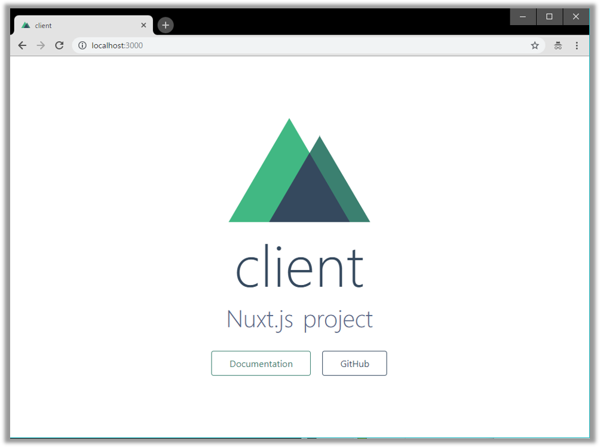
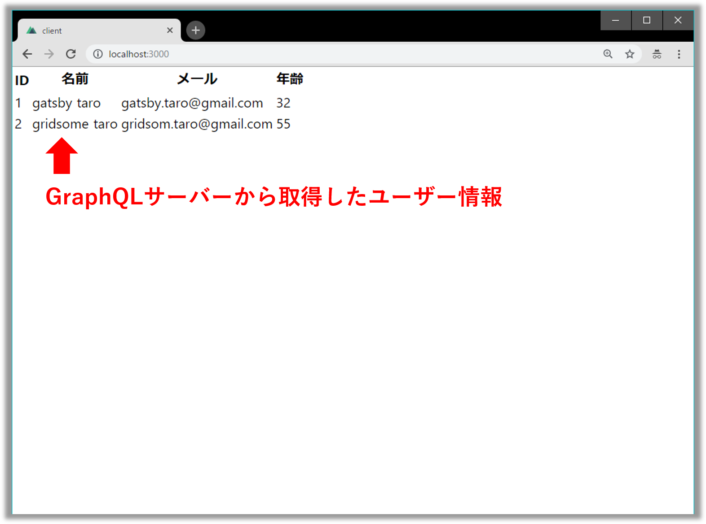
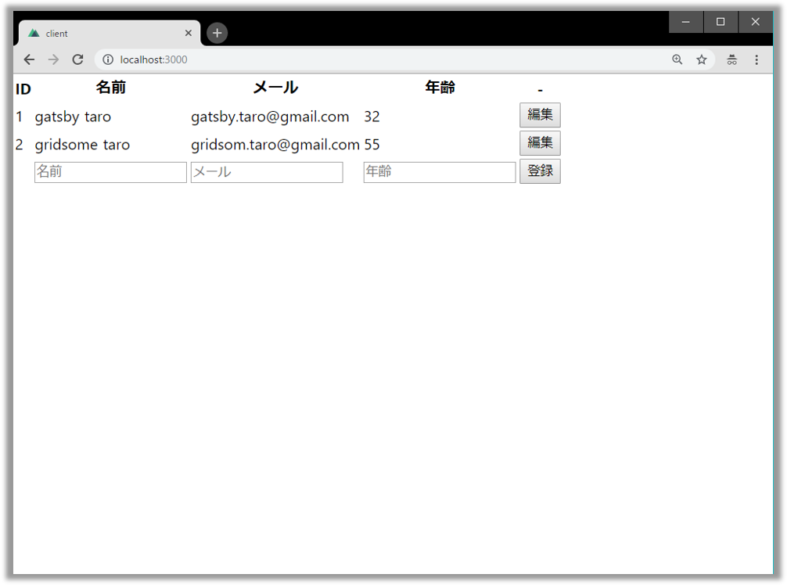
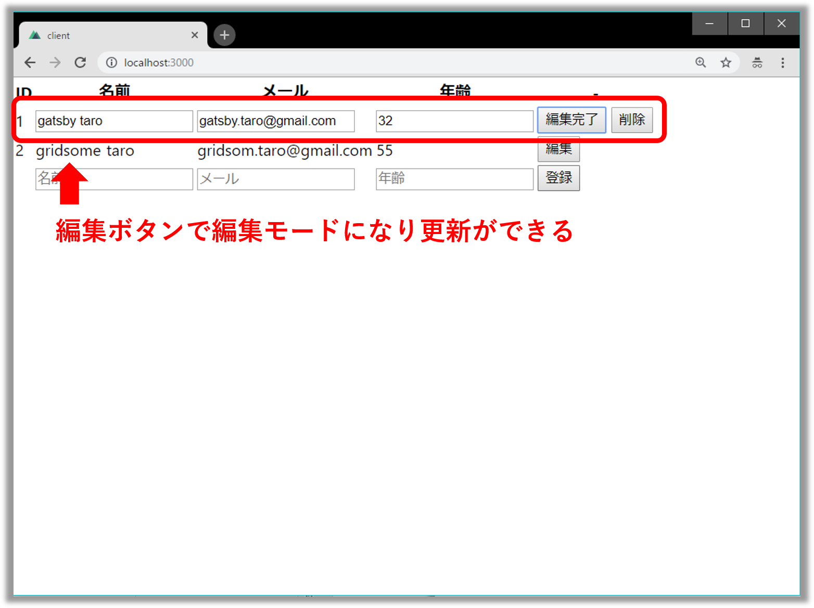
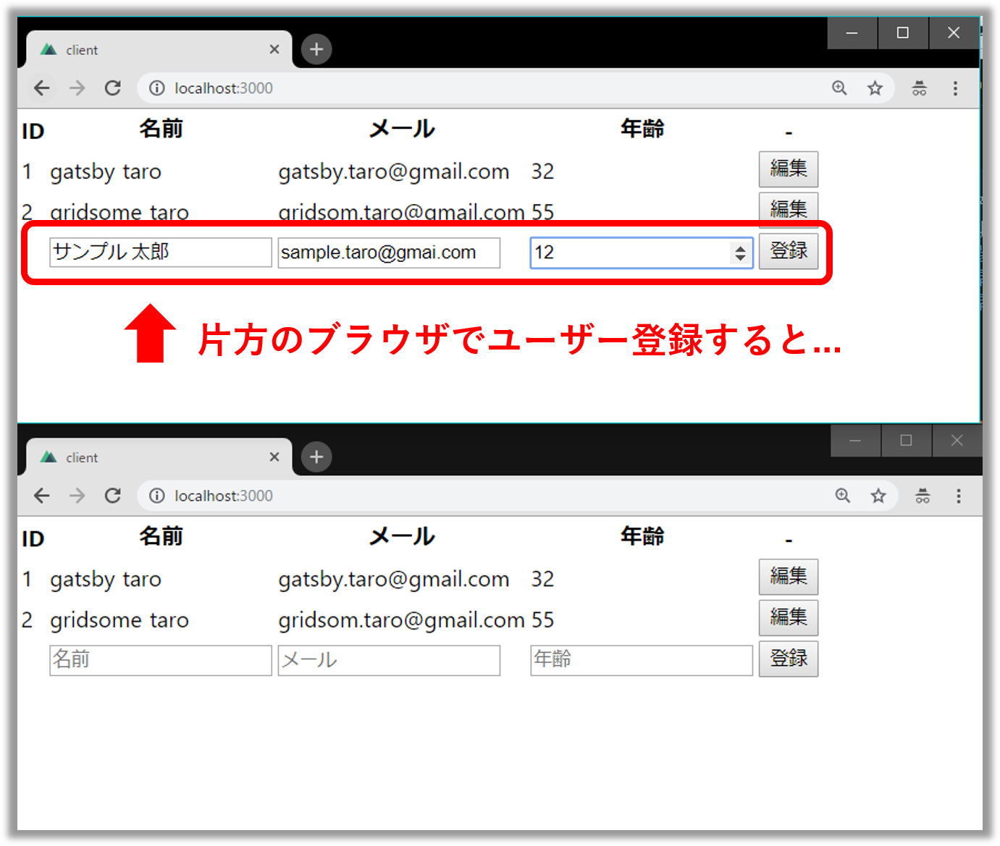
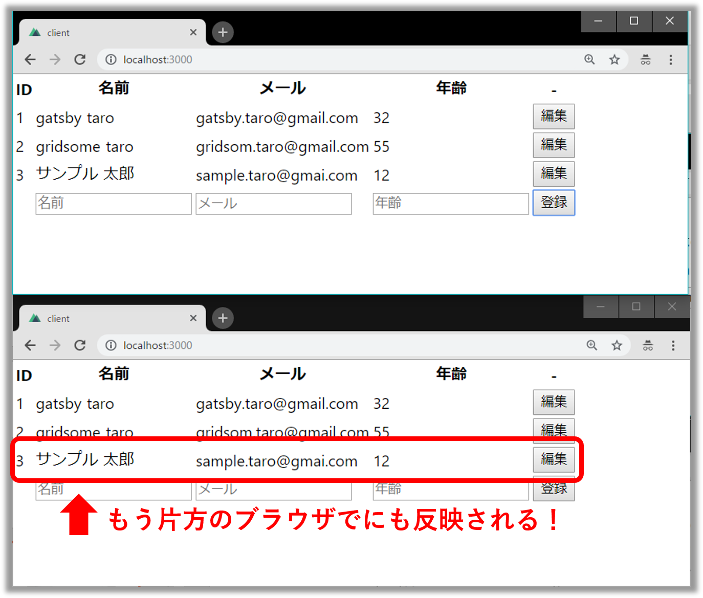

## なにこれ

**「とりあえずクライアント側と同じJavaScriptで手っ取り早くGraphQLサーバ立てたい！」**<br/>

このようなユースケースに[Graphpack](https://github.com/glennreyes/graphpack)はピッタリです。
設定いらずのNode製GraphQLサーバーで**「GraphQLのスキーマとリゾルバーを定義するだけでOK」**、さらに**「[GraphQL Playground IDE](https://github.com/prisma/graphql-playground)が標準搭載」**なのでクライアント側を自前で実装せずとも動作確認できます。<br/>
今回は、この[Graphpack](https://github.com/glennreyes/graphpack)の使い方について以下の3ステップでご紹介します。
おまけで最後にNuxt.js+Apolloによりクライアント側実装も載せておきます。

* 🔰 Graphpackを使ってみる
* 💪 GraphpackでQuery, Mutation, Subscriptionを実装する・動作確認する
* ✨ [Nuxt.js](https://ja.nuxtjs.org/)+[Apollo Client](https://www.apollographql.com/docs/react/api/apollo-client.html)でクライアント側を実装する（おまけ）


## Graphpackとは

[**「A minimalistic zero-config GraphQL server」**](https://github.com/glennreyes/graphpack)

Node.js製のゼロコンフィグなミニマルGraphQLサーバで[**「Webpack」**](https://github.com/webpack/webpack),[**「Nodemon」**](https://github.com/remy/nodemon),[**「Apollo Server」**](https://github.com/apollographql/apollo-server) をイイ感じにまとめたライブラリです。感触を掴むだけなら[CodeSandboxのお試し環境](https://codesandbox.io/s/k3qrkl8qlv)が用意されているので、そちらを触ってみるとよいでしょう。
[README](https://github.com/glennreyes/graphpack/README.md)では以下8つの特徴をうたっています。

* 📦 **設定いらず**（**ZERO-CONFIG**）！
* 🚦 ライブリロード機能組み込み済！
* 🚨 わかりやすいエラーメッセージ！
* 🎮 [GraphQL Playground IDE](https://github.com/prisma/graphql-playground) 標準装備！
* ⭐️ SDLでスキーマ定義可能（[GraphQL imports](https://github.com/prisma/graphql-import)）
* 💖 TypeScriptをサポート
* 🔥 爆速ビルド
* ⚡️ ES module importsとdynamic importをサポート


## 1. Graphpackを使ってみる

### 実装

* プロジェクト雛形を作成し、`graphpack` を開発環境用ライブラリとしてインストールします。

```
mkdir graphpack-sample
cd graphpack-sample
npm init
npm i -D graphpack
```
<br/>

* `src/schema.graphql`と`src/resolver.js`を作成します。

```txt:title=プロジェクト構成
graphpack-sample
└── src
     ├── resolvers.js
     └── schema.graphql
```
<br/>

```graphql:title=src/scheme.graphql
type Query {
  hello: String
}
```
<br/>


```javascript:title=src/resolvers.graphql
const resolvers = {
  Query: {
    hello: () => 'world!',
  },
};

export default resolvers;
```
<br/>


* `package.json`に以下のスクリプトを追記します。

```json:title=package.jsonの一部
  "scripts": {
    "dev": "graphpack",
    "build": "graphpack build"
  },
```
<br/>

### 動作確認

* サーバを`npm run dev`で起動して、ブラウザで http://localhost:4000/graphql を開くとGraphQL Playground IDEが表示されます。


* 試しに以下のQueryを実行してみましょう。

```
query {
  hello
}
```
<br/>

* `world!`が返ってきます！


とても簡単にGraophQLサーバーができ上がりました。


## 2. GraphpackでQuery, Mutation, Subscriptionを実装する

ユーザー情報（ID、名前、メール、年齢）を扱う処理を例に実装方法を説明します。

### Query
#### 実装
スキーマ定義をして

```graphql:title=src/schema.graphql
type Query {
  users: [User!]!
  user(id: ID!): User!
}

type User {
  id: ID!
  name: String!
  email: String!
  age: Int
}
```
<br/>

仮のデータとしてユーザー情報を用意しましょう。

```javascript:title=src/db.js
export let users = [
  {
    id: 1,
    name: 'gatsby taro',
    email: 'gatsby.taro@gmail.com',
    age: 32
  },
  {
    id: 2,
    name: 'gridsome taro',
    email: 'gridsom.taro@gmail.com',
    age: 55
  },
];
```
<br/>


最後にリゾルバーを定義します。データは前手順で作成したものを使います。

```javascript:title=src/resolvers.js
import { users } from './db';

const resolvers = {
  Query: {
    // 一件検索
    user: (parent, { id }, context, info) => users.find(user => user.id == id),
    // 複数件検索（簡単のため全件検索としている）
    users: (parent, args, context, info) => users
  },
};
```
<br/>


#### 動作確認

実装できたら`npm run dev`でサーバ起動して http://localhost:4000/graphql を開いて
以下のクエリを発行します。

```graphql:title=全権検索用Query
query {
  users {
    id
    name
    email
    age
  }
}
```
<br/>

すると以下のようにユーザー一覧が取得できます。


一件検索の場合は以下のようなクエリを発行します。

```graphql:title=一件検索用Query
query {
  user(id: 1) {
    id
    name
    email
    age
  }
}
```
<br/>

すると以下のように指定したIDのユーザー情報が取得できます。


### Mutation

ユーザー情報の取得はできたので、次にユーザー情報の登録・更新・削除を実装します。

#### 実装

スキーマ定義にMutationを追記します。

```graphql:title=src/schema.graphqlの一部
type Mutation {
  // 登録
  createUser(
    name: String!,
    email: String!,
    age: Int
  ): User!
  
  // 更新
  updateUser(
    id: ID!,
    name: String!,
    email: String,
    age: Int
  ): User!
  
  // 削除
  deleteUser(
    id: ID!
  ): User!
}

```
<br/>


ユーザー情報を定義しているJavaScriptファイルに
ユーザー情報のID採番用ロジックを追記します。
初期状態でユーザー情報が2件なので、採番用IDは3から始まるようにします。

```javascript{16-20}:title=src/db.js
export let users = [
  {
    id: 1,
    name: 'gatsby taro',
    email: 'gatsby.taro@gmail.com',
    age: 32
  },
  {
    id: 2,
    name: 'gridsome taro',
    email: 'gridsom.taro@gmail.com',
    age: 55
  },
];

// 採番用ID(3から始まるようにする)
let idSequence = 2;
// 採番処理
export const generateId = () => ++idSequence;
```
<br/>


リゾルバーにMutationを追記します。

```javascript{7-26}:title=src/resolvers.jsの一部
import { users, generateId } from './db';

const resolvers = {
  Query: {
    // ・・・
  },
  Mutation: {
    createUser: (parent, { name, email, age }, context, info) => {
      const newUser = { id: generateId(), name, email, age};
      users.push(newUser);
      return newUser;
    },
    updateUser: (parent, { id, name, email, age }, context, info) => {
      const updatedUser = users.find(user => user.id == id);
      updatedUser.name = name;
      updatedUser.email = email;
      updatedUser.age = age;
      return updatedUser;
    },
    deleteUser: (parent, { id }, context, info) => {
      const userIndex = users.findIndex(user => user.id == id);
      if (userIndex === -1) throw new Error('User not found');
      const [deletedUser] = users.splice(userIndex, 1);
      return deletedUser;
    }
  },
  // ・・・
};
```
<br/>


#### 動作確認

実装できたら`npm run dev`でサーバ起動して http://localhost:4000/graphql を開きます。


##### 登録

以下のようなMutationを発行すると、登録したユーザー情報がレスポンスとして返ってきます。<br/>
※ユーザー情報を取得すると、`nuxt taro`も取得できることが確認できます。

```graphql:title=登録用Muatation
mutation {
  createUser(
    name: "nuxt taro"
    email: "nuxt.taro@gmail.com"
    age: 43
  ) {
    id
    name
    email
    age
  }
}
```


##### 登録

今度は'nuxt taro'を更新してみましょう。
以下のようなMutationを発行すると、更新されたユーザー情報が返ってきます。<br/>
※一覧を取得すると`nuxt taro`が`nuxt updatedtaro`になっていることを確認できます。

```graphql:title=更新用Muatation
mutation {
  updateUser(
    id: 3
    name: "nuxt updatedtaro"
    email: "nuxt.updatedtaro@gmail.com"
    age: 44
  ) {
    id
    name
    email
    age
  }
}
```


##### 削除

最後に'nuxt updatedtaro'を削除してみましょう。
以下のようなMutationを発行すると、削除されたユーザーがレスポンスとして帰ってきます。<br/>
※一覧を取得すると`nuxt updatedtaro`がなくなっていることが確認できます。

```graphql:title=削除用Mutation
mutation {
  deleteUser(
    id: 3
  ) {
    id
    name
    email
    age
  }
}
```


### Subscription

#### 実装

GraphpackではSubscriptionはデフォルトoffになっています。
そのためココだけは設定ファイルを作成する必要があります。
プロジェクトのルートフォルダ直下に`graphpack.config.js`を作成しましょう。


```javascript:title=graphpack.config.js
module.exports = {
  server: {
    subscriptions: {
      // Subscriptionのエンドポイントとして
      // QueryとMutationと同じパスを設定します。
      path: `/graphql`
    }
  },
};
```
<br/>

スキーマ定義にSubscriptionを追記します。

```graphql:title=src/schema.graphqlの一部
type Subscription {
    userCreated: User!
    userUpdated: User!
    userDeleted: User!
}
```
<br/>

リゾルバーでSubscriptionを定義し、Mutationも修正します。
Mutation処理が完了後にSubscriptionを発行できるようにするためです。


```javascript{1-3,5,7-10,20,29,38,42-52}:title=src/resolvers.jsの一部
// Subscriptionのやりとりには`apollo-server`のPubSubを使る
// `graphpack`の場合、`apollo-server`は入っている
import { PubSub } from 'apollo-server';
import { users, generateId } from './db';
const pubsub = new PubSub();

const EVENT = {
    USER_CRAETED: 'userCreated',
    USER_UPDATED: 'userUpdated',
    USER_DELETED: 'userDeleted',
};

const resolvers = {    
  // ・・・
  Mutation: {
    createUser: (parent, { name, email, age }, context, info) => {
      const newUser = { id: generateId(), name, email, age};
      users.push(newUser);
            
      pubsub.publish(EVENT.USER_CRAETED, {[EVENT.USER_CRAETED]: newUser});
      return newUser;
    },
    updateUser: (parent, { id, name, email, age }, context, info) => {
      const updatedUser = users.find(user => user.id == id);
      updatedUser.name = name;
      updatedUser.email = email;
      updatedUser.age = age;

      pubsub.publish(EVENT.USER_UPDATED, {[EVENT.USER_UPDATED]: updatedUser});
      return updatedUser;
    },
    deleteUser: (parent, { id }, context, info) => {
      const userIndex = users.findIndex(user => user.id == id);
      
      if (userIndex === -1) throw new Error('User not found');
      const [deletedUser] = users.splice(userIndex, 1);
      
      pubsub.publish(EVENT.USER_DELETED, {[EVENT.USER_DELETED]: deletedUser});
      return deletedUser;
    }
  },
  Subscription: {
    [EVENT.USER_CRAETED]: {
      subscribe: () => pubsub.asyncIterator([EVENT.USER_CRAETED])
    },
    [EVENT.USER_UPDATED]: {
      subscribe: () => pubsub.asyncIterator([EVENT.USER_UPDATED])
    },
    [EVENT.USER_DELETED]: {
      subscribe: () => pubsub.asyncIterator([EVENT.USER_DELETED])
    },
  },
  // ・・・
};
```
<br/>

#### 動作確認

実装できたら`npm run dev`でサーバ起動して http://localhost:4000/graphql を開きます。

`userCreated`の動作確認をしましょう。
以下のようなSubscriptionを発行します。


```:title=登録用Muatation
subscription {
  userCreated {
    id
    name
    email
    age    
  }
}
```
<br/>


すると実行結果（画面右半分）にローディングアイコンが表示され、監視状態となります。


この状態で別タブを開き...


登録用のMutaitonを発行してみましょう。


これで、元のタブに戻ると、登録された情報がレスポンスで返ってきていれば成功です。


<br/>

今回は紹介しませんが、**userUpdated**と**userDeleted**も同様の方法で動作確認できるのでやってみてください。


## 3. Nuxt.js + Apollo Client でクライアント側を実装する

Graphpackだけでも備え付けの[GraphQL Playground IDE](https://github.com/prisma/graphql-playground)で、動作確認できますが、
せっかくなのクライアント側も作成してアプリっぽくしましょう。
今回は[Nuxt.js](https://ja.nuxtjs.org/)+[Apollo Client](https://www.apollographql.com/docs/react/api/apollo-client.html)で作ります✨

### プロジェクト雛形作成

[nuxt-community/starter-template](https://github.com/nuxt-community/starter-template)で雛形を作成します。
`vue-cli`（雛形作成用コマンド）が入ってない場合はグローバルインストールしましょう。

```
npm i -g vue-cli
vue init nuxt-community/starter-template graphpack-client-sample
cd graphpack-client-sample
npm i
npm run dev
```
<br/>

http://localhost:3000 にアクセスして以下の画面が表示されればOKです。




### @nuxtjs/apollo導入

[@nuxtjs/apollo](https://www.npmjs.com/package/@nuxtjs/apollo)をインストールします。

```
npm i @nuxtjs/apollo
```
<br/>


`nuxt.config.js`に以下設定を追加します。

```javascript:title=nuxt.config.js
module.exports = {
  mode: 'spa',
  modules: [
    '@nuxtjs/apollo',
  ],
  apollo: {
    clientConfigs: {
      default: {
        // Graphpack側のエンドポイントを指定します。
        httpEndpoint: 'http://localhost:4000/graphql',
        // Subscription用にWebSocketの設定も追加します。
        wsEndpoint: 'ws://localhost:4000/graphql',
        websocketsOnly: true, 
      }
    }
  },
  // ・・・
}
```
<br/>

これで下準備は整いました。
次からは本格的な実装に入っていきます。


#### Query

ユーザー情報取得用のクエリ`apollo/queries/getUsers.gql`を作成します。
※今回は`apollo/queries`や`apollo/mutation`などの配下にgqlファイルを作成することにします。

```qql:title=apollo/queries/getUsers.gql
query GetUsers {
    users {
        id
        name
        email
        age
    }
}
```
<br/>


次に`pages/index.vue`を修正します。
ここでは[SmartQuery](https://github.com/Akryum/vue-apollo/blob/master/docs/api/smart-query.md)とよばれる、
「コンポーネントにapolloオブジェクトを定義してApollo Clientを呼び出す」方法を使っています。
※今回は見た目の話はしないので`<style>`タグ自体削除しています。


```javascript:title=pages/index.vue
<template>
  <table>
    <tr>
      <th>ID</th> 
      <th>名前</th> 
      <th>メール</th> 
      <th>年齢</th>
    </tr>

    <tr v-for="user in users" :key="user.id">
      <td>{{user.id}}</td>
      <td>{{user.name}}</td>
      <td>{{user.email}}</td>
      <td>{{user.age}}</td>
    </tr>
  </table>
</template>

<script>
import getUsersGql from '~/apollo/queries/getUsers.gql'

export default {
  data() {
    return {
      users: [],
    }
  },
  apollo: {
    users: {
      query: getUsersGql,
    }
  },
}
</script>
```
<br/>

そうしたら
1. Graphpack側のサーバを起動
2. `npm run dev`でクライアントを起動
3. ブラウザでhttp://localhost:3000 にアクセスして以下の画面が表示されればOKです。




#### Mutation

ユーザー一覧ができたので、登録、更新、削除処理を追加します。

```gql:title=apollo/mutations/createUser.gql
mutation($name: String!, $email: String!, $age: Int) {
  createUser(name: $name, email: $email, age: $age) {
    id
    name
    email
    age
  }
}
```
<br/>

```gql:title=apollo/mutations/updateUser.gql
mutation($id: ID!, $name: String!, $email: String!, $age: Int) {
  updateUser(id: $id,name: $name,email: $email,age: $age) {
    id
    name
    email
    age
  }
}
```
<br/>

```gql:title=apollo/mutations/deleteUser.gql
mutation($id: ID!) {
  deleteUser(id: $id) {
    id
    name
    email
    age
  }
}
```
<br/>

次にユーザー一覧で、登録、更新、削除ができるようにします。
index.vueを修正しましょう。


```javascript:title=pages/index.vueの一部
<template>
  <table>
    <tr>
      <th>ID</th> 
      <th>名前</th> 
      <th>メール</th> 
      <th>年齢</th>
      <th>-</th>
    </tr>

    <tr v-for="user in users" :key="user.id">
      <template v-if="user.editable">
        <td>{{user.id}}</td>
        <td><input type="text" v-model="user.name"></td>
        <td><input type="email" v-model="user.email"></td>
        <td><input type="number" v-model="user.age"></td>
        <td>
          <button @click="updateUser(user)">編集完了</button>
          <button @click="deleteUser(user.id)">削除</button>
        </td>
      </template>
      <template v-else>
        <td>{{user.id}}</td>
        <td>{{user.name}}</td>
        <td>{{user.email}}</td>
        <td>{{user.age}}</td>
        <td>
          <button @click="chengeEditMode(user)">編集</button>
        </td>
      </template>
    </tr>

    <tr>
      <td></td>
      <td><input type="text" v-model="newUser.name" placeholder="名前"></td>
      <td><input type="email" v-model="newUser.email" placeholder="メール"></td>
      <td><input type="number" v-model="newUser.age" placeholder="年齢"></td>
      <td>
        <button @click="createUser(newUser)">登録</button>
      </td>
    </tr>
  </table>
</template>

<script>
import getUsersGql from '~/apollo/queries/getUsers.gql'
import createUserGql from '~/apollo/mutations/createUser.gql'
import updateUserGql from '~/apollo/mutations/updateUser.gql'
import deleteUserGql from '~/apollo/mutations/deleteUser.gql'

export default {
  data() {
    return {
      users: [],
      // 新規登録用ユーザ情報
      newUser: {
        name: null,
        email: null,
        age: null,
      }
    }
  },
  apollo: {
    users: {
      query: getUsersGql,
    }
  },
  methods: {
    async createUser({name, email, age}) {

      const { data, error } = await this.$apollo.mutate({
        mutation: createUserGql,
        variables: {
          name,
          email,
          age,
        },
        // 登録後に、データを再取得したい場合に定義する
        refetchQueries: [{
          query: getUsersGql,
        }]
      })

      if (error) {
        console.log(error);
        return;
      }

      this.$apollo.queries.users.refresh()

      // 入力フォーム初期化
      this.newUser.name = null;
      this.newUser.email = null;
      this.newUser.age = null;
    },
    async updateUser(user) {

      const { data, error } = await this.$apollo.mutate({
        mutation: updateUserGql,
        variables: {
          id: user.id,
          name: user.name,
          email: user.email,
          age: user.age,
        },
        // 更新後に、データを再取得したい場合に定義する
        refetchQueries: [{
          query: getUsersGql,
        }]
      });

      if (error) {
        console.log(error);
        return;
      }

      // 編集を終了
      this.chengeEditMode(user);
    },
    async deleteUser(id) {

      const { data, error } = await this.$apollo.mutate({
        mutation: deleteUserGql,
        variables: {
          id
        },
        // 削除後に、データを再取得したい場合に定義する
        refetchQueries: [{
          query: getUsersGql,
        }]
      })

      if (error) {
        console.log(error);
        return;
      }
    },
    chengeEditMode(user) {
      const i = this.users.findIndex(u => u.id == user.id)
      if (i === -1 ) {
        throw new Error('該当するユーザは存在しません');
      }

      this.$set(this.users, i, {
        ...user,
        editable: !user.editable
      });
    }
  }
}
</script>
```
<br/>


ブラウザを開いてみてください。
それぞれの以下のようにして操作ができます。
* **登録：**　最下行に名前、メール、年齢を入力し、登録ボタンをクリック
* **更新：**　編集ボタンをクリックで編集モードになり、名前、メール、年齢を入力し、編集完了ボタンをクリック
* **削除：**　編集ボタンをクリックで編集モードになり、削除ボタンをクリック





#### Subscription

Subscriptionを使って、ユーザー情報を他の人が編集したときにリアルタイムで編集が反映されるようにします。

```gql:title=apollo/subscriptions/userCreated.gql
subscription {
  userCreated {
    id
    name
    email
    age
  }
}
```
<br/>

```gql:title=apollo/subscriptions/userUpdated.gql
subscription {
  userDeleted {
    id
    name
    email
    age
  }
}
```
<br/>


```gql:title=apollo/subscriptions/userDeleted.gql
subscription {
  userUpdated {
    id
    name
    email
    age
  }
}
```
<br/>

index.vueでSubscriptionを実装します。
templateには一切手をいれません。scriptタグのみ修正します。

```javascript:title=pages/index.vueの一部
import getUsersGql from '~/apollo/queries/getUsers.gql'
import createUserGql from '~/apollo/mutations/createUser.gql'
import updateUserGql from '~/apollo/mutations/updateUser.gql'
import deleteUserGql from '~/apollo/mutations/deleteUser.gql'
import userCreatedGql from '~/apollo/subscriptions/userCreated.gql'
import userUpdatedGql from '~/apollo/subscriptions/userUpdated.gql'
import userDeletedGql from '~/apollo/subscriptions/userDeleted.gql'

export default {
  data() {
    return {
      users: [],
      newUser: {
        name: null,
        email: null,
        age: null,
      }
    }
  },
  apollo: {
    users: {
      query: getUsersGql,
      // サーバ側でイベントが発行された時の処理を定義する
      subscribeToMore: [
        {
          document: userCreatedGql,
          updateQuery: (prev, { subscriptionData }) => {
            if (!subscriptionData.data) {
              return prev;
            }

            const newUser = subscriptionData.data.userCreated;
            return prev.users.push(newUser);
          }
        },
        {
          document: userUpdatedGql,
          updateQuery: (prev, { subscriptionData }) => {
            if (!subscriptionData.data) {
              return prev;
            }

            const updatedUser = subscriptionData.data.userUpdated;
            const targetUser = prev.users.find(user => user.id == updatedUser.id);
            targetUser.name = updatedUser.name;
            targetUser.email = updatedUser.email;
            targetUser.age = updatedUser.age;

            return prev.users;
          }
        },
        {
          document: userDeletedGql,
          updateQuery: (prev, { subscriptionData }) => {
            console.log('fdasfadfadfad')
            if (!subscriptionData.data) {
              return prev;
            }

            const deletedUser = subscriptionData.data.userDeleted;
            const userIndex = prev.users.findIndex(user => user.id == deletedUser.id);

            if (userIndex === -1) throw new Error('User not found');

            prev.users.splice(userIndex, 1);

            return prev.users;
          }
        }
      ]
    }
  },
  methods: {
    async createUser({name, email, age}) {

      const { data, error } = await this.$apollo.mutate({
        mutation: createUserGql,
        variables: {
          name,
          email,
          age,
        },
        // refetchQueriesは削除します
        // refetchQueriesの代わりにSubscriptionでユーザー情報を更新するためです
      })

      if (error) {
        console.log(error);
        return;
      }

      this.$apollo.queries.users.refresh()

      // 入力フォーム初期化
      this.newUser.name = null;
      this.newUser.email = null;
      this.newUser.age = null;
    },
    async updateUser(user) {

      const { data, error } = await this.$apollo.mutate({
        mutation: updateUserGql,
        variables: {
          id: user.id,
          name: user.name,
          email: user.email,
          age: user.age,
        },
        // refetchQueriesは削除します
        // refetchQueriesの代わりにSubscriptionでユーザー情報を更新するためです
      });

      if (error) {
        console.log(error);
        return;
      }

      // 編集を終了
      this.chengeEditMode(user);
    },
    async deleteUser(id) {

      const { data, error } = await this.$apollo.mutate({
        mutation: deleteUserGql,
        variables: {
          id
        },
        // refetchQueriesは削除します
        // refetchQueriesの代わりにSubscriptionでユーザー情報を更新するためです
      })

      if (error) {
        console.log(error);
        return;
      }
    },
    chengeEditMode(user) {
      const i = this.users.findIndex(u => u.id == user.id)
      if (i === -1 ) {
        throw new Error('該当するユーザは存在しません');
      }

      this.$set(this.users, i, {
        ...user,
        editable: !user.editable
      });
    }
  }
}
```
<br/>


2つブラウザを開いてみて、片方で操作してみてください。
リアルタイムでもう一方のブラウザにユーザー情報の変更が反映されていればOKです。





## まとめ


クライアント側はとサーバ側で扱う言語を統一できとりあえず簡単にGraphQLを使うことができる[Graphpack](https://github.com/glennreyes/graphpack)を是非使ってみてはいかがでしょうか。


## 参考
* [A Beginner’s Guide to GraphQL - DEV Community 👩‍💻👨‍💻](https://dev.to/leonardomso/a-beginners-guide-to-graphql-3kjj)
  * GraphpackでQuery、Mutationの実装方法を紹介している記事です。
* [Logo design for Graphpack | Steemit](https://steemit.com/utopian-io/@richardbmx/logo-design-for-graphpack-approved-and-used-in-the-project)
  * Gpraphpackのロゴをどういうふうに作ったかのお話です。
* [GraphQL と Nuxt.js でチャットを作る](https://www.aintek.xyz/posts/graphql-nuxt-chat)
* [Levvel Blog - A Guide to Subscriptions in GraphQL with Apollo](https://www.levvel.io/our-ideas/A-Guide-to-Subscriptions-in-GraphQL-with-Apollo)
* [the-road-to-graphql/fullstack-apollo-subscription-example: A minimal Apollo Server 2 with Apollo Client 2 with Subscriptions application.](https://github.com/the-road-to-graphql/fullstack-apollo-subscription-example)
* [bmsantos/apollo-graphql-subscriptions-example: Apollo GraphQL Subscriptions issue](https://github.com/bmsantos/apollo-graphql-subscriptions-example)


## 関連記事

GraphQL関連の記事は、他にも書いているので参考にしてみてください。

<div class="iframely-embed"><div class="iframely-responsive" style="padding-bottom: 49.943%; padding-top: 120px;"><a href="https://takumon.com/hello-nuxt-graphql-with-apollo-client" data-iframely-url="//cdn.iframe.ly/z7eXyM3"></a></div></div>