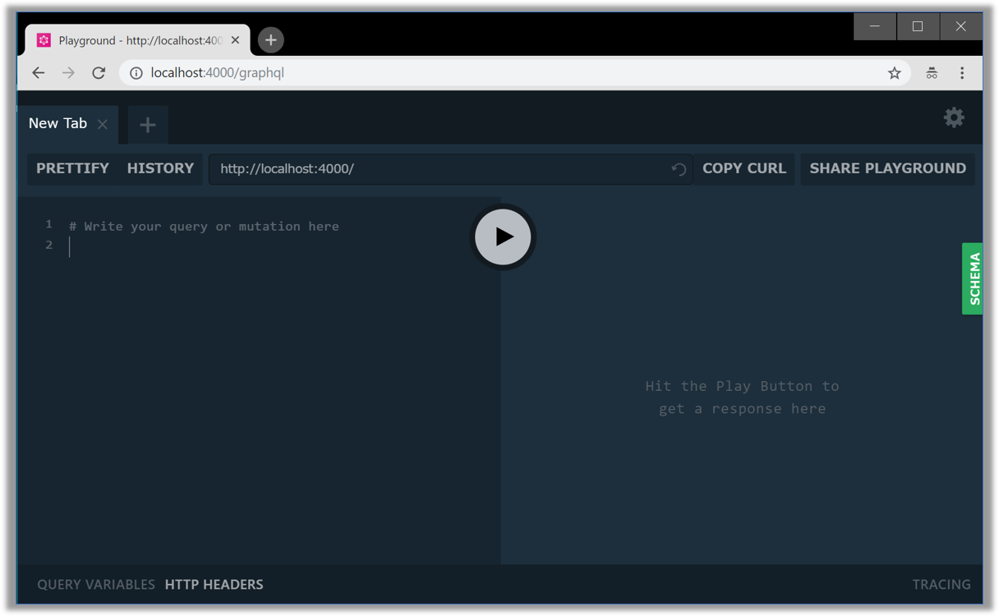
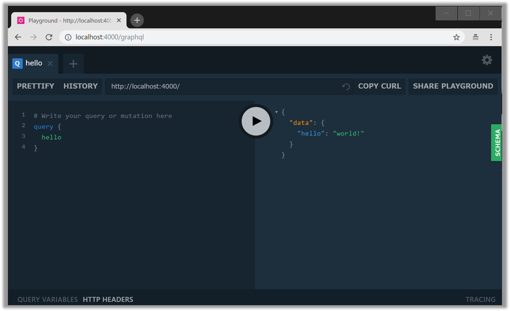
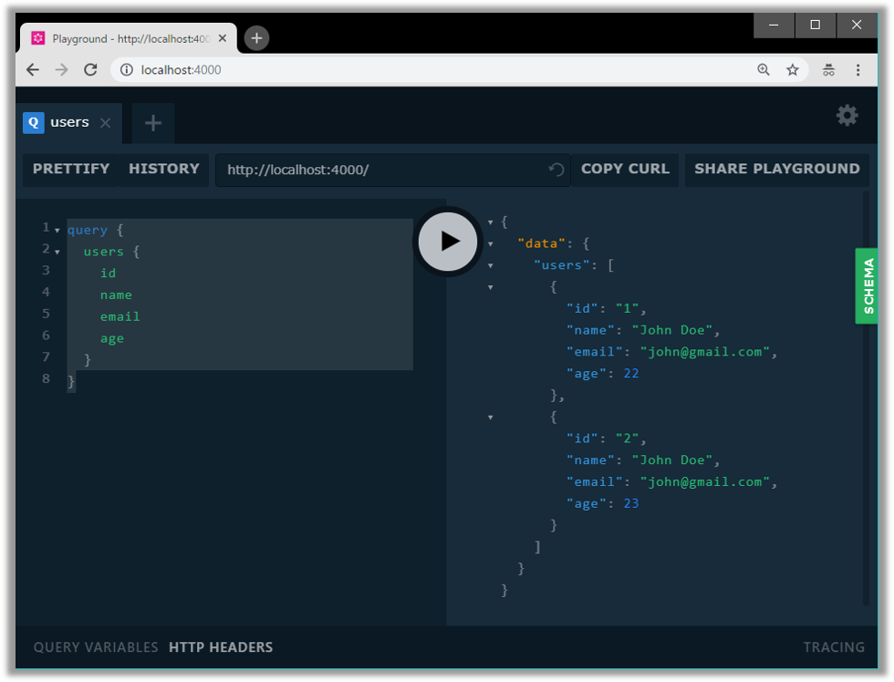
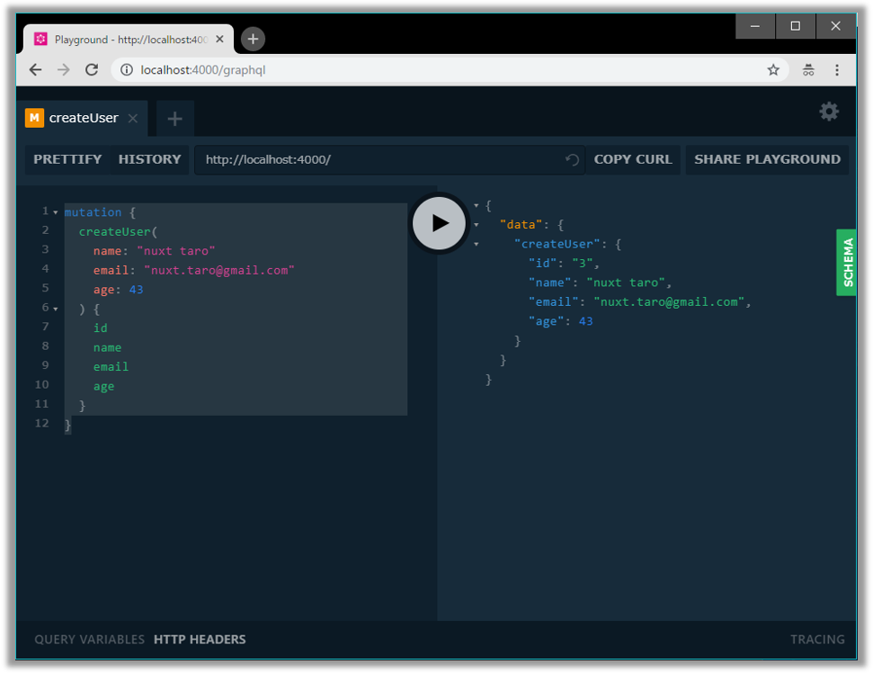
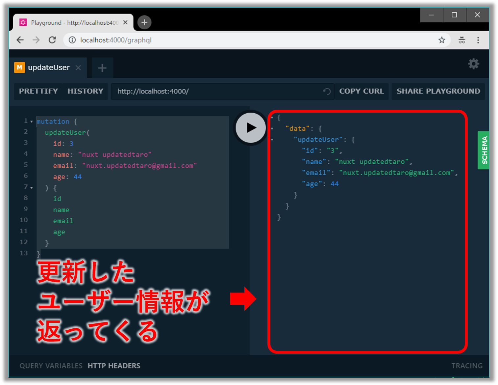
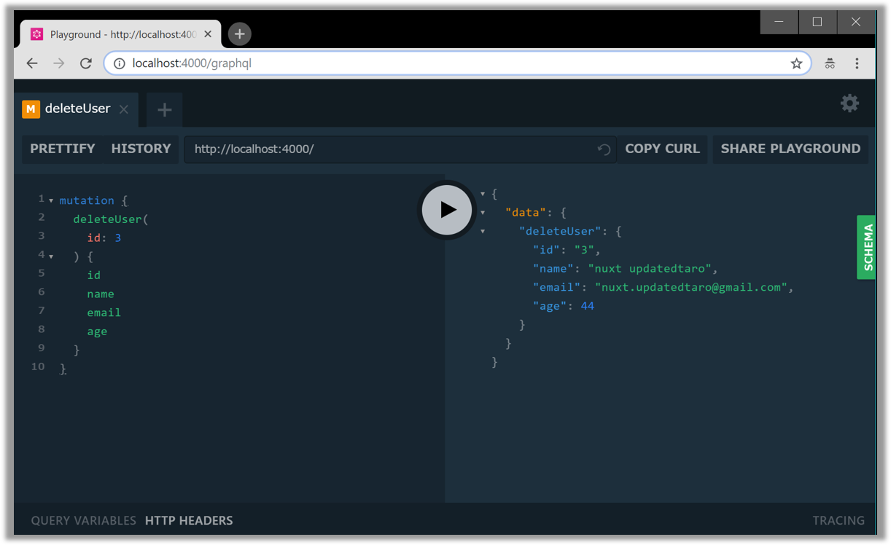
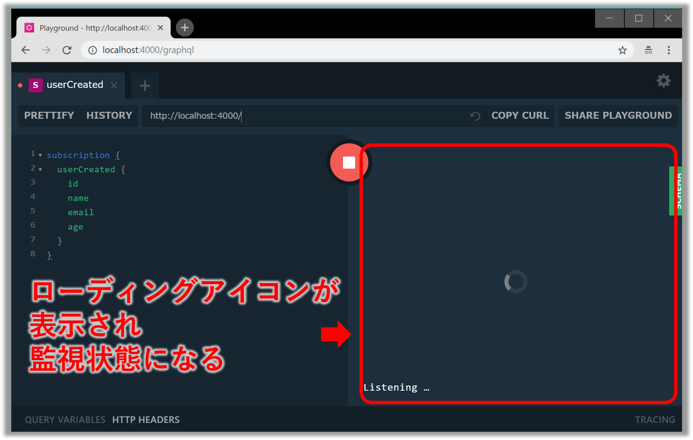
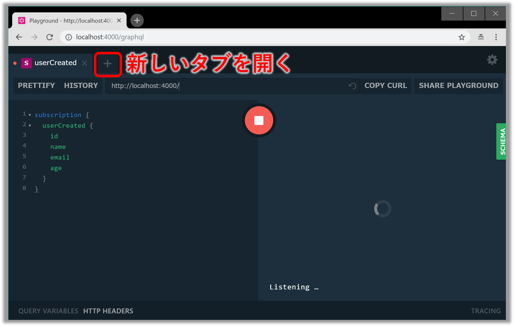
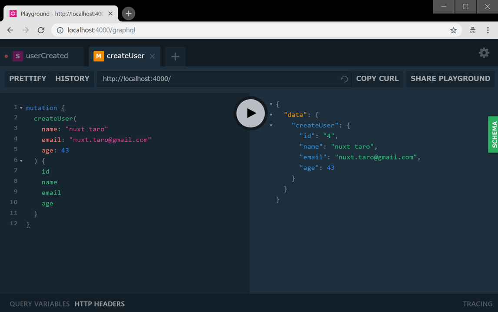
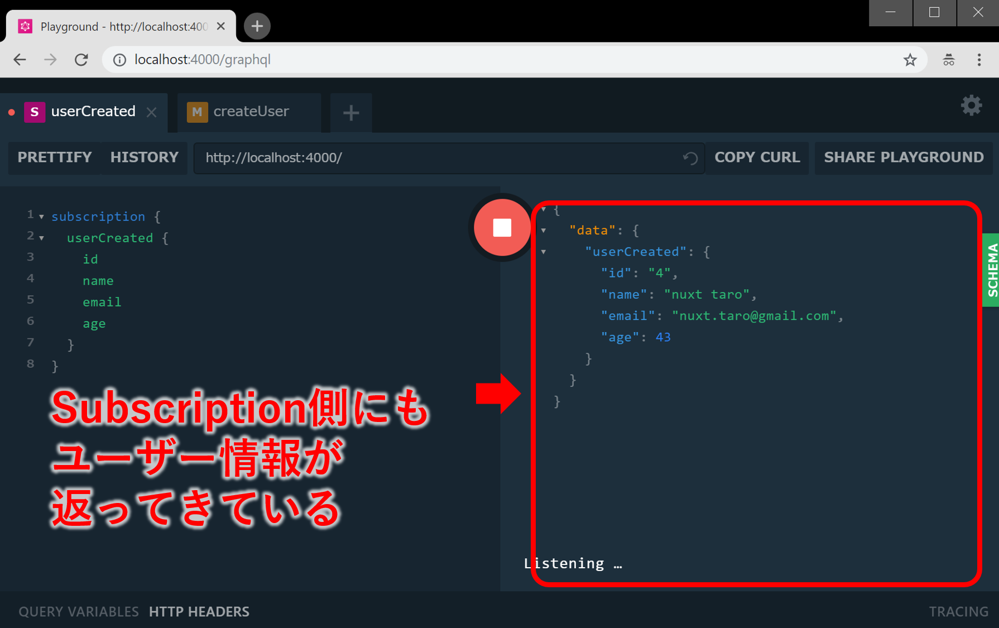

## なにこれ

**「とりあえずクライアント側と同じJavaScriptで手っ取り早くGraphQLサーバー立てたい！」**<br/>

このようなユースケースに[Graphpack](https://github.com/glennreyes/graphpack)はピッタリです。
設定いらずのNode製GraphQLサーバーで **「GraphQLのスキーマとリゾルバーを定義するだけでOK」**、さらに **「[GraphQL Playground IDE](https://github.com/prisma/graphql-playground)が標準搭載」**なのでクライアント側を自前で実装せずとも動作確認できます。<br/>
今回は、この[Graphpack](https://github.com/glennreyes/graphpack)の使い方について以下の5ステップでご紹介します。<br/>
※ここで紹介するソースコードはGitHub([Takumon/nuxt-graphpack-sample](https://github.com/Takumon/nuxt-graphpack-sample))にもあるので参考にしてみてください。

* [🔰 Graphpackとは](#1-graphpackとは)
* [💪 Graphpackを使ってみる](#2-graphpackを使ってみる)
* [💖 GraphpackでQueryを実装・動作確認する](#3-graphpackでqueryを実装・動作確認する)
* [✨️ GraphpackでMutationを実装・動作確認する](#4-graphpackでmutationを実装・動作確認する)
* [💎 GraphpackでSubscriptionを実装・動作確認する](#5-graphpackでsubscriptionを実装・動作確認する)

## 1. Graphpackとは

Node.js製のゼロコンフィグなミニマルGraphQLサーバーで[Webpack](https://github.com/webpack/webpack)、[Nodemon](https://github.com/remy/nodemon)、[Apollo Server](https://github.com/apollographql/apollo-server) をイイ感じにまとめたライブラリです。感触を掴むだけなら[CodeSandboxのお試し環境](https://codesandbox.io/s/k3qrkl8qlv)が用意されているので、そちらを触ってみるとよいでしょう。
[README](https://github.com/glennreyes/graphpack/README.md)では以下8つの特徴をうたっています。

* 📦 **設定いらず**（**ZERO-CONFIG**）！
* 🚦 ライブリロード機能組み込み済！
* 🚨 わかりやすいエラーメッセージ！
* 🎮 [GraphQL Playground IDE](https://github.com/prisma/graphql-playground) 標準装備！
* ⭐️ SDLでスキーマ定義可能（[GraphQL imports](https://github.com/prisma/graphql-import)）
* 💖 TypeScriptをサポート
* 🔥 爆速ビルド
* ⚡️ ES module importsとdynamic importをサポート


## 2. Graphpackを使ってみる

### 実装してみる

* プロジェクト雛形を作成し、`graphpack` を開発環境用ライブラリとしてインストールします。

```
mkdir graphpack-sample
cd graphpack-sample
npm init
npm i -D graphpack
```
<br/>

* `src/schema.graphql`と`src/resolver.js`を作成します。

```txt:title=プロジェクト構成
graphpack-sample
└── src
     ├── resolvers.js
     └── schema.graphql
```
<br/>

```graphql:title=src/scheme.graphql
type Query {
  hello: String
}
```
<br/>


```javascript:title=src/resolvers.graphql
const resolvers = {
  Query: {
    hello: () => 'world!',
  },
};

export default resolvers;
```
<br/>


* `package.json`に以下のスクリプトを追記します。

```json:title=package.jsonの一部
  "scripts": {
    "dev": "graphpack",
    "build": "graphpack build"
  },
```
<br/>

### 動作確認してみる

* サーバーを`npm run dev`で起動して、ブラウザで `http://localhost:4000/` を開くとGraphQL Playground IDEが表示されます。



* 試しに以下のQueryを実行してみましょう。

```
query {
  hello
}
```
<br/>

* `world!`がレスポンスとして返ってきます。



こんな感じで、とても簡単にGraphQLサーバーが立てられます。


## 3. GraphpackでQueryを実装・動作確認する

ユーザー情報（ID、名前、メール、年齢）を扱う処理を例に実装方法を説明します。

### 実装

* ユーザー情報のスキーマ定義します。

```graphql:title=src/schema.graphql
type Query {
  users: [User!]!
  user(id: ID!): User!
}

type User {
  id: ID!
  name: String!
  email: String!
  age: Int
}
```
<br/>

* 仮のユーザー情報を用意しましょう。

```javascript:title=src/db.js
export let users = [
  {
    id: 1,
    name: 'gatsby taro',
    email: 'gatsby.taro@gmail.com',
    age: 32
  },
  {
    id: 2,
    name: 'gridsome taro',
    email: 'gridsom.taro@gmail.com',
    age: 55
  },
];
```
<br/>


* 最後にリゾルバーを定義します。データは前手順で作成したものを使います。

```javascript:title=src/resolvers.js
import { users } from './db';

const resolvers = {
  Query: {
    // 1件検索
    user: (parent, { id }, context, info) => users.find(user => user.id == id),
    // 複数件検索（簡単のため全件検索としている）
    users: (parent, args, context, info) => users
  },
};
```
<br/>


### 動作確認

* 実装できたら`npm run dev`でサーバー起動して `http://localhost:4000/` を開いて
以下のクエリを発行します。するとユーザー一覧が取得できます。

```graphql:title=ユーザー一覧取得用Query
query {
  users {
    id
    name
    email
    age
  }
}
```
<br/>




* 1件検索の場合は以下のようなクエリを発行しましょう。指定したIDのユーザー情報が取得できます。

```graphql:title=ユーザー情報1件検索用Query
query {
  user(id: 1) {
    id
    name
    email
    age
  }
}
```


## 4. GraphpackでMutationを実装・動作確認する


ユーザー情報が取得できたので、次はユーザー情報の登録・更新・削除を実装します。

### 実装

スキーマ定義にMutationを追記します。

```graphql:title=src/schema.graphqlの一部
type Mutation {
  // 登録
  createUser(
    name: String!,
    email: String!,
    age: Int
  ): User!
  
  // 更新
  updateUser(
    id: ID!,
    name: String!,
    email: String,
    age: Int
  ): User!
  
  // 削除
  deleteUser(
    id: ID!
  ): User!
}

```
<br/>


これはGraphQLとは関係ありませんが、ユーザー情報登録時のID採番用ロジックを`db.js`に追記します。
初期状態でユーザー情報が2件なので、採番用IDは3から始まるようにします。

```javascript{16-20}:title=src/db.js
export let users = [
  {
    id: 1,
    name: 'gatsby taro',
    email: 'gatsby.taro@gmail.com',
    age: 32
  },
  {
    id: 2,
    name: 'gridsome taro',
    email: 'gridsome.taro@gmail.com',
    age: 55
  },
];

// 採番用ID(3から始まるようにする)
let idSequence = 2;
// 採番処理
export const generateId = () => ++idSequence;
```
<br/>


リゾルバーにMutationを追記します。

```javascript{7-26}:title=src/resolvers.jsの一部
import { users, generateId } from './db';

const resolvers = {
  Query: {
    // ・・・
  },
  Mutation: {
    createUser: (parent, { name, email, age }, context, info) => {
      const newUser = { id: generateId(), name, email, age};
      users.push(newUser);
      return newUser;
    },
    updateUser: (parent, { id, name, email, age }, context, info) => {
      const updatedUser = users.find(user => user.id == id);
      updatedUser.name = name;
      updatedUser.email = email;
      updatedUser.age = age;
      return updatedUser;
    },
    deleteUser: (parent, { id }, context, info) => {
      const userIndex = users.findIndex(user => user.id == id);
      if (userIndex === -1) throw new Error('User not found');
      const [deletedUser] = users.splice(userIndex, 1);
      return deletedUser;
    }
  },
  // ・・・
};
```
<br/>


### 動作確認

実装できたら`npm run dev`でサーバー起動して `http://localhost:4000/` を開きます。


#### 登録の動作確認

以下のようなMutationを発行すると、登録したユーザー情報が返ってきます。<br/>
<small>※登録後にユーザー一覧を取得すると、`nuxt taro`が取得できます。</small>


```graphql:title=登録用Muatation
mutation {
  createUser(
    name: "nuxt taro"
    email: "nuxt.taro@gmail.com"
    age: 43
  ) {
    id
    name
    email
    age
  }
}
```




#### 更新の動作確認

今度は`nuxt taro`を更新してみましょう。
以下のようなMutationを発行すると、更新されたユーザー情報が返ってきます。<br/>
<small>※更新後にユーザー一覧を取得すると`nuxt taro`が`nuxt updatedtaro`になっていることを確認できます。</small>

```graphql:title=更新用Muatation
mutation {
  updateUser(
    id: 3
    name: "nuxt updatedtaro"
    email: "nuxt.updatedtaro@gmail.com"
    age: 44
  ) {
    id
    name
    email
    age
  }
}
```




#### 削除の動作確認

最後に`nuxt updatedtaro`を削除してみましょう。
以下のようなMutationを発行すると削除されたユーザー情報が返ってきます。<br/>
<small>※削除後にユーザー一覧を取得すると`nuxt updatedtaro`がなくなっていることが確認できます。</small>

```graphql:title=削除用Mutation
mutation {
  deleteUser(
    id: 3
  ) {
    id
    name
    email
    age
  }
}
```




## 5. GraphpackでSubscriptionを実装・動作確認する


### 実装

GraphpackではSubscriptionはデフォルトoffになっています。
そのためココだけは設定ファイルを作成する必要があります。
プロジェクトのルートフォルダ直下に`graphpack.config.js`を作成しましょう。


```javascript:title=graphpack.config.js
module.exports = {
  server: {
    subscriptions: {
      // Subscriptionのエンドポイントとして
      // QueryとMutationと同じパスを設定します。
      path: `/graphql`
    }
  },
};
```
<br/>

スキーマ定義にSubscriptionを追記します。

```graphql:title=src/schema.graphqlの一部
type Subscription {
    userCreated: User!
    userUpdated: User!
    userDeleted: User!
}
```
<br/>

リゾルバーでSubscriptionを定義し、Mutationも修正します。
Mutationも修正するのは、登録・更新・削除完了後にSubscriptionを発行できるようにするためです。


```javascript{1-3,5,7-10,20,29,38,42-52}:title=src/resolvers.jsの一部
// Subscriptionのやりとりには`apollo-server`のPubSubを使る
// `graphpack`の場合、`apollo-server`は入っている
import { PubSub } from 'apollo-server';
import { users, generateId } from './db';
const pubsub = new PubSub();

const EVENT = {
    USER_CRAETED: 'userCreated',
    USER_UPDATED: 'userUpdated',
    USER_DELETED: 'userDeleted',
};

const resolvers = {    
  // ・・・
  Mutation: {
    createUser: (parent, { name, email, age }, context, info) => {
      const newUser = { id: generateId(), name, email, age};
      users.push(newUser);
            
      pubsub.publish(EVENT.USER_CRAETED, {[EVENT.USER_CRAETED]: newUser});
      return newUser;
    },
    updateUser: (parent, { id, name, email, age }, context, info) => {
      const updatedUser = users.find(user => user.id == id);
      updatedUser.name = name;
      updatedUser.email = email;
      updatedUser.age = age;

      pubsub.publish(EVENT.USER_UPDATED, {[EVENT.USER_UPDATED]: updatedUser});
      return updatedUser;
    },
    deleteUser: (parent, { id }, context, info) => {
      const userIndex = users.findIndex(user => user.id == id);
      
      if (userIndex === -1) throw new Error('User not found');
      const [deletedUser] = users.splice(userIndex, 1);
      
      pubsub.publish(EVENT.USER_DELETED, {[EVENT.USER_DELETED]: deletedUser});
      return deletedUser;
    }
  },
  Subscription: {
    [EVENT.USER_CRAETED]: {
      subscribe: () => pubsub.asyncIterator([EVENT.USER_CRAETED])
    },
    [EVENT.USER_UPDATED]: {
      subscribe: () => pubsub.asyncIterator([EVENT.USER_UPDATED])
    },
    [EVENT.USER_DELETED]: {
      subscribe: () => pubsub.asyncIterator([EVENT.USER_DELETED])
    },
  },
  // ・・・
};
```
<br/>

### 動作確認

実装できたら`npm run dev`でサーバー起動して `http://localhost:4000/` を開きます。

`userCreated`の動作確認をしましょう。
以下のようなSubscriptionを発行します。


```:title=登録用Muatation
subscription {
  userCreated {
    id
    name
    email
    age    
  }
}
```
<br/>


すると実行結果（画面右半分）にローディングアイコンが表示され、監視状態となります。



この状態で別タブを開き...




登録用のMutaitonを発行してみましょう。




これで、元のタブに戻ると、登録された情報がレスポンスで返ってきていれば成功です。



<br/>


以上でSubscriptionの動作確認は終了です。
今回は紹介しませんが、**userUpdated**と**userDeleted**も同様の方法で動作確認できるのでやってみてください。


## まとめ

今回はNode製GraphQLサーバー「Graphpack」の使い方について紹介しました。
上記で紹介した通り非常に簡単ですので、「とりあえずGraphQLサーバーを立ててみたい！」という方はGraphpackを検討してみてはいかがでしょうか🍅


## 参考
* [A Beginner’s Guide to GraphQL - DEV Community 👩‍💻👨‍💻](https://dev.to/leonardomso/a-beginners-guide-to-graphql-3kjj)
  * GraphpackでQuery、Mutationの実装方法を紹介している記事です。
* [Logo design for Graphpack | Steemit](https://steemit.com/utopian-io/@richardbmx/logo-design-for-graphpack-approved-and-used-in-the-project)
  * Gpraphpackロゴ作成の舞台裏です。
