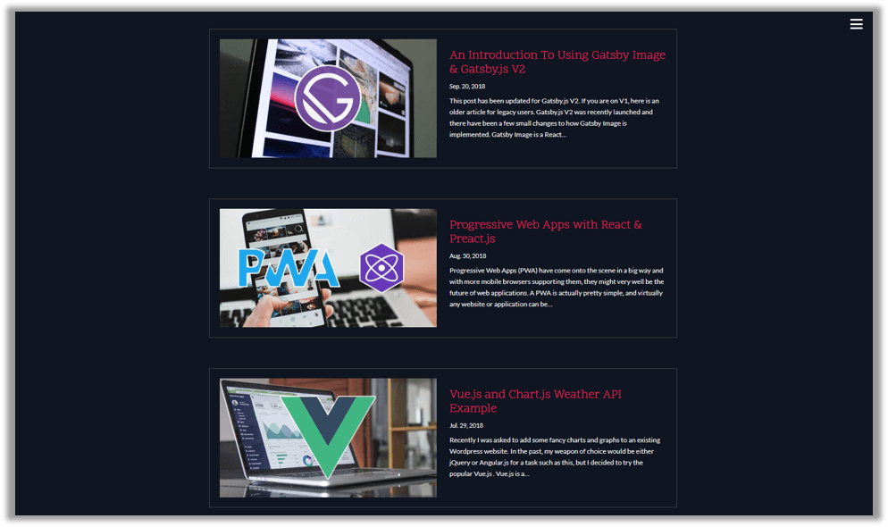
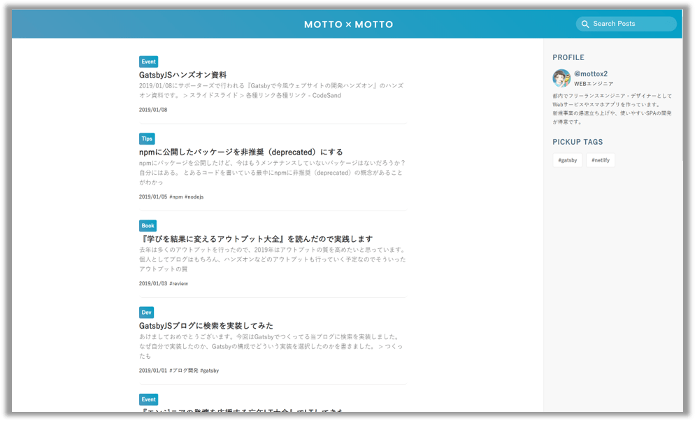

## なにこれ

Gatsbyの公式サイトには[ショーケース](https://www.gatsbyjs.org/showcase/)なるものがあって、
**世の中に公開されているGatsby製のWebサイトを一覧で見ることができます。**
実はこの[ショーケース](https://www.gatsbyjs.org/showcase/)、**けっこう簡単に自分のWebサイトを登録できる**ということに最近気づきました。<br/>
今回は、Gatsbyでブログやポートフォリオなどを作っている人向けに、[ショーケースの活用方法](#gatsbyショーケース活用方法)とあわせて、**[「ショーケースに自分のWebサイトを登録する方法」](#gatsbyショーケース登録方法)**についてご紹介します。


## Gatsbyショーケース活用方法

Gatsbyショーケースは、いろんなGatsby製のWebサイトが見れるのでUIを参考にできますし、
なかにはソースコードを公開しているWebサイトもあるので、実装についても参考にできます。<br/>
そのため**「自分のGatsby製Webサイトをどうやってカスタマイズしていこう？」と迷っている時などに見ると、何かヒントが見つかる**かもしれません。


またカテゴリでフィルターもできるので、自分の興味のあるカテゴリ（たとえばブログなど）に絞って見ることもできます。


## お気に入りのGatsby製Webサイト

[ショーケース](https://www.gatsbyjs.org/showcase/)を見て、僕もいくつか気になったWebサイトがあったので以下でご紹介します。


### CODE Bushi

**ブログURL：** https://codebushi.com/
<br/>
伏見稲荷大社の千本鳥居をバックに、日本を意識したデザインのWebサイトです。
右上のボタンによるメニュー開閉のアニメーションもカッコいいです。


<br/>

記事一覧も、それぞれの記事にアイキャッチが配置されており非常に見やすいデザインになっています。




### Sean Coker's Blog

**ブログURL：** https://sean.is/
<br/>

名前「Sean Coker」の部分にマウスカーソルを合わせると、「Sean Coker」の文字がクルクル回転したり、
白背景をクリックすると〇、△、□などオブジェクトが散乱したり、凝ったデザインになっています。
  

<br/>

シンプルですが、洗練されたモノトーンのデザインがカッコいいです。


### Yuuniworks Portfolio / Blog

**ブログURL：** https://www.yuuniworks.com/
<br/>
**ソースURL：** https://github.com/junkboy0315/yuuni-web
<br/>

島根のフルスタックエンジニアの方のポートフォリオ兼ブログです。<br/>
マテリアルデザインで統一されており、画面遷移やマウスホバー時のアニメーションにも凝っています。
UIについてもストレスなくWebサイト内を回遊できるように考えられているなぁと感じました。<br/>
なんとコチラ、[ソースコード](https://github.com/junkboy0315/yuuni-web)を公開してくれています:blush:

**記事一覧**

<br/>

**記事一覧**

<br/>

**記事詳細**

<br/>


### MOTTO x MOTTO

**ブログURL：** https://mottox2.com/
<br/>
**ソースURL：** https://github.com/mottox2/website
<br/>

水色がアクセントカラーのすっきりしたデザインです。
画面右上の検索窓から気になる記事を検索できたり、
記事詳細の最下部には最近投稿した記事へのリンクが貼られていたり、Webサイト内を回遊しやすいような工夫がされています。<br/>
なんとコチラも、[ソースコード](https://github.com/mottox2/website)を公開してくれています。非常に助かります:blush:

**記事一覧**

<br/>

**記事詳細**

<br/>

みなさんも[ショーケース](https://www.gatsbyjs.org/showcase/)でお気に入りのGatsby製Webサイトを見つけてみてください。


## Gatsbyショーケース登録方法

本題について説明します。<br/>
Gatsbyはショーケースの登録情報を[sites.yml](https://github.com/gatsbyjs/gatsby/blob/master/docs/sites.yml)で管理しています。登録する場合はこのsites.ymlを編集します。<br/>
<br/>
詳しく手順を見ていきましょう。

* **(1)** まずは[Gatsbyのリポジトリ](https://github.com/gatsbyjs/gatsby)をフォークします。
* **(2-1)** 次にフォークしたリポジトリで、リポジトリの`docs`配下にある`sites.yml`を編集します。`sites.yml`は必ず下記プロパティを記載しましょう。

```yaml:title=sites.ymlに最低限記載する項目
- title: Takumon blog # Webサイトのタイトル
  main_url: "https://takumon.com" # WebサイトのメインページのURL
  url: "https://takumon.com" # WebサイトのURL
  featured: false # 最初はfalseにしておきます。Gatsby側で4半期に１回判定があり、「注目サイト」に認定されるとtrueになります。
  categories: # Webサイトのカテゴリーを複数指定します。 
    - Blog
```
<br/>

* **(2-1)** `sites.yml`はオプションで下記も記載できます。

```yaml:title=sites.ymlにオプションで記載する項目
  source_url: "https://github.com/Takumon/blog" # ブログのソースコードを公開していればGitHubなどのURLを記載
  description: Java Engineer's tech blog. # Webサイトの説明
  built_by: Takumon # Webサイト作成者名
  built_by_url: "https://twitter.com/inouetakumon" # Webサイト作成者のURL
```
<br/>


* **(3)** 自分のリポジトリで編集が終わったら、フォーク元にプルリクを出します。プルリク先はmasterブランチでOKです。プルリクについては[他の方のプルリク](https://github.com/gatsbyjs/gatsby/pulls?utf8=%E2%9C%93&q=is%3Apr+is%3Aclosed+sites.yml)や[僕のプルリク](https://github.com/gatsbyjs/gatsby/pull/10941)を参考にしてください。


以上で登録手順は終了です。<br/>
この後は、Gatsby側で「プルリクマージ」→「Gatsbyショーケースに反映」されます。
プルリクはすぐにマージされますが、Gatsbyショーケースへの反映には最大1日かかります。即時反映ではないので注意してください。
<br/>

登録されると[Gatsbyショーケース](https://www.gatsbyjs.org/showcase/)で自分のWebサイトが確認できます（達成感があります！！）


なお登録後に自分のWebサイトに変更があった場合は、`sites.yml`の定義を更新してプルリクを送ればよいです。

※詳細はGatsby公式サイトの[Submit to Site Showcase](https://www.gatsbyjs.org/docs/site-showcase-submissions/)に記載されているのでご確認ください。<br/>

## まとめ

Gatsbyショーケースに自分のWebサイトを登録する方法についてご紹介しました。
現時点で「Blog」カテゴリに登録されている日本の方のブログは、わずか3つです。
登録手順はとても簡単なので、GatsbyでWebサイトを作っている方は、ぜひ登録してみてはいかがでしょうか🍅
