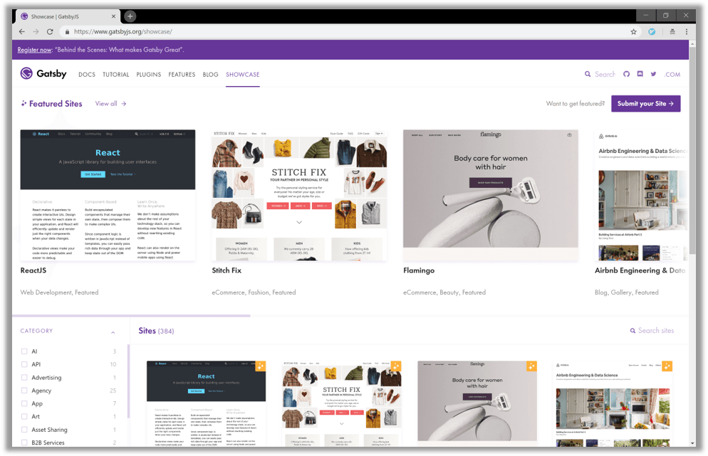
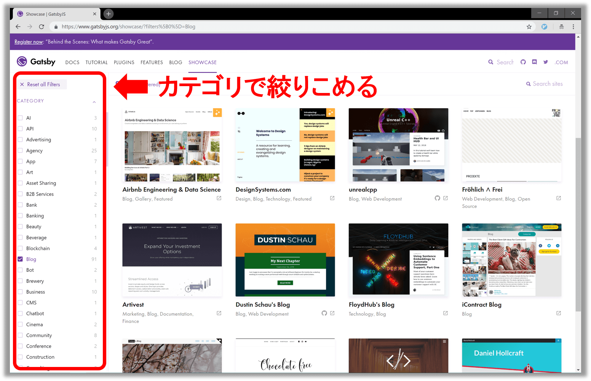
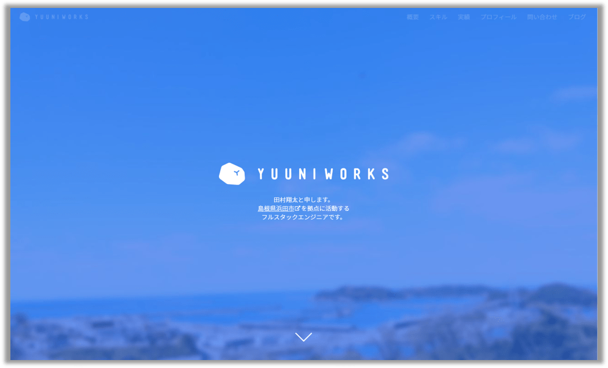

## なにこれ

Gatsbyの公式サイトには[ショーケース](https://www.gatsbyjs.org/showcase/)なるものがあって、
**世の中に公開されているGatsby製のWebサイトを一覧で見ることができます。**
実はこの[ショーケース](https://www.gatsbyjs.org/showcase/)、けっこう簡単に自分のWebサイトを登録できます。（ということに最近気づきました。）<br/>
今回は**[「Gatsbyショーケースの活用方法」](#gatsbyショーケース活用方法)**とあわせて、**[「Gatsbyショーケースに自分のWebサイトを登録する方法」](#ショーケース登録方法)**についてご紹介します。


## Gatsbyショーケース活用方法

いろんなWebサイトが見れるので、UIを参考にできますし、
なかにはソースコードを公開してくれている場合もあるので、実装についても参考にできます。<br/>
そのため**「自分のGatsby製Webサイトをどうやってカスタマイズしていこう？」と迷っている時などに見ると良い**です。




またカテゴリでフィルターもできるので、自分の気になるカテゴリ（たとえばブログ）などに絞って見ることもできます。




## お気に入りのGatsby製Webサイト

[ショーケース](https://www.gatsbyjs.org/showcase/)を見て、僕もいくつか気になったWebサイトがあったので以下でご紹介します。


### CODE Bushi

**ブログURL：** https://codebushi.com/
<br/>
伏見稲荷大社の千本鳥居をバックに、日本を意識したデザインのWebサイトです。
右上ボタンによるメニューの開閉のアニメーションもカッコ良いです。


<br/>

記事一覧も、それぞれの記事にアイキャッチが配置されており非常に見やすいデザインになっています。


### Sean Coker's Blog

**ブログURL：** https://sean.is/
<br/>

名前「Sean Coker」の部分にマウスカーソルを合わせると、「Sean Coker」の文字がクルクル回転したり
白背景をクリックすると、〇、△、□などオブジェクトが散乱したり、凝った作りになっています。
  

<br/>

シンプルですが、洗練されたモノトーンのデザインがかっこいいです。


### Yuuniworks Portfolio / Blog

**ブログURL：** https://www.yuuniworks.com/
<br/>
**ソースURL：** https://github.com/junkboy0315/yuuni-web
<br/>

島根のフルスタックエンジニアの方のポートフォリオ兼ブログです。<br/>
マテリアルデザインで統一されており、画面遷移やマウスホバーのアニメーションにも凝っています。
UIについてもストレスなくWebサイト内を回遊できるように考えられているなぁと感じました。<br/>
なんと[ソースコード](https://github.com/junkboy0315/yuuni-web)を公開してくれています。ありがたいです:blush:

**記事一覧**

<br/>

**記事一覧**

<br/>

**記事詳細**

<br/>


### MOTTO x MOTTO

**ブログURL：** https://mottox2.com/
<br/>
**ソースURL：** https://github.com/mottox2/website
<br/>

水色がアクセントカラーのすっきりしたデザインです。
ヘッダー右に検索窓から気になる記事を検索できたり、
記事詳細の下部には直近記事3つが一覧表示されているなど、Webサイト内を回遊しやすいような工夫がされています。<br/>
またPCとモバイルの両方で見やすいデザインになっています。<br/>
なんとコチラも、[ソースコード](https://github.com/mottox2/website)を公開してくれています。ありがたや～:blush:

**記事一覧**

<br/>

**記事詳細**

<br/>

みなさんもお気に入りのGatsby製Webサイトを見つけてみてください。


## Gatsbyショーケース登録方法

本題について説明します。<br/>
Gatsbyはショーケースの登録情報を[sites.yml](https://github.com/gatsbyjs/gatsby/blob/master/docs/sites.yml)で管理しています。登録する場合はコチラを編集すればOKです。<br/>
<br/>
詳しく手順を見ていきましょう。

* **(1)** まずは[Gatsby](https://github.com/gatsbyjs/gatsby)リポジトリをフォークしましょう。
* **(2-1)** 次にフォークした自分のリポジトリで`sites.yml`(`プロジェクトルート/docs/sites.yml`)を編集します。sites.ymlは最低限下記を追記すればOKです。

```yaml:title=sites.ymlに最低限追記する項目
- title: Takumon blog # Webサイトのタイトル
  main_url: "https://takumon.com" # WebサイトのメインページのURL
  url: "https://takumon.com" # WebサイトのURL
  featured: false # 最初はfalseにしておきます。Gatsby側で4半期に１回判定があり、「注目サイト」に認定されるとtrueになります。
  categories: # Webサイトのカテゴリーを複数指定します。 
    - Blog
```
<br/>

* **(2-1)** `sites.yml`はオプションで下記も記載できます。`source_url`プロパティについては**ソースコード公開しても大丈夫な方は記載したほう良い**かなぁと思います。

```yaml:title=sites.ymlにオプションで追記する項目
  source_url: "https://github.com/Takumon/blog" # ブログのソースコードを公開していればGitHubなどのURLを記載
  description: Java Engineer's tech blog. # Webサイトの説明
  built_by: Takumon # Webサイト作成者名
  built_by_url: "https://twitter.com/inouetakumon" # Webサイト作成者のURL
```
<br/>


* **(3)** 自分のリポジトリで編集が終わったら、フォーク元にプルリクを出します。プルリク先はmasterブランチでOKです。プルリクについては[他の方のプルリク](https://github.com/gatsbyjs/gatsby/pulls?utf8=%E2%9C%93&q=is%3Apr+is%3Aclosed+sites.yml)や[僕のプルリク](https://github.com/gatsbyjs/gatsby/pull/10941)を参考にしてください。


これで登録手順は終了です。<br/>
この後は、Gatsby側の人が「プルリクマージ」→「Gatsbyショーケースに反映」してくれます。
プルリクは割とすぐにマージされます。自分は10分程度でマージされました。
Gatsbyショーケースには最大1日程度待てば反映さるはずです。即時反映ではないので注意してください。
<br/>

登録されると自分のWebサイトがGatsbyショーケースで確認できます（達成感があります！！）


なお登録後に自分のWebサイトに変更があった場合は、再度`sites.yml`を編集してプルリクを送ればよいです。

※詳細はGatby公式サイトの[Submit to Site Showcase](https://www.gatsbyjs.org/docs/site-showcase-submissions/)をご確認ください。<br/>

## まとめ

Gatsbyショーケースに自分のWebサイトを登録する方法についてご紹介しました。
現時点で「Blog」カテゴリに日本の人のブログは、わずか3個です。
しかし今回紹介したように登録手順はとても簡単なので、Gatsbyでブログを書いている方は、ぜひ登録してみてはいかがでしょうか。
