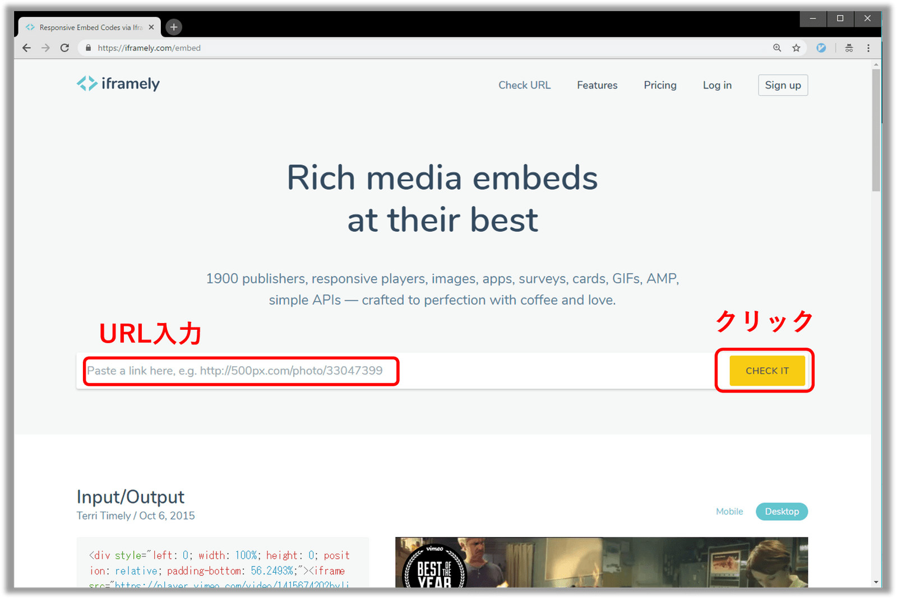
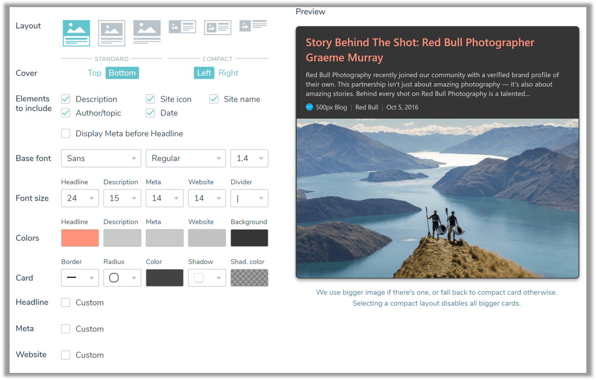

## なにこれ

SNSのコンテンツ、動画といった外部コンテンツを自分のブログに載せる場合、
単純にリンクを張り付けるよりも、以下のようにHTMLの**埋め込みコード**を張り付けたほうがビジュアル面で効果的です。

<div class="iframely-embed">
    <div class="iframely-responsive" style="height: 168px; padding-bottom: 0;">
        <a 
            href="https://takumon.com" 
            data-iframely-url="//cdn.iframe.ly/uqqhvR3">
        </a>
    </div>
</div>

<br/>

ただTwitterやYouTubeなどの埋め込み対応サイトでも、**サイトごとに埋め込みコードを取得する方法が異なる**ため結構めんどくさかったりします。
また埋め込みコードに対応していないサイトも多いのが現状です。
<br/>

**[「Iframely」](https://iframely.com/)**は、そのような問題を一挙に解決してくれるWebサービスです。
実際このブログでも[Iframely](https://iframely.com/)を使って外部コンテンツを埋め込んでいますが、かなり便利です。<br/>
今回は、**「Iframelyでどんなことができるか」**、**「実際使ってみた感想」**などについてご紹介したいと思います。
最後のほうに**[「GatsbyでIframelyを使う方法」](#gatsbyの場合)**も紹介しています。

## Iframelyとは

<div class="iframely-embed"><div class="iframely-responsive" style="height: 168px; padding-bottom: 0;"><a href="https://iframely.com/" data-iframely-url="//cdn.iframe.ly/KGpjY3"></a></div></div>
<br/>


埋め込みコードを生成してくれるWebサービスです。<br/>
**「アカウント登録なし」**、**「無料」**で以下の基本機能が使えます。

* あらゆるWebサイトにおいて、IframelyにURLを張り付けるだけで埋め込みコードを生成してくれる
* 埋め込み未対応のWebサイトでもイイ感じの埋め込みコードを生成してくれる

またアカウントを登録すれば**「埋め込みコードのデザインをカスタマイズできる」**ようになります。
デザインをカスタマイズした埋め込みコードは1000リクエスト/月までなら無料です。


## Iframelyの使い方


* まずは[Iframely](https://iframely.com/embed)にアクセスしましょう。
* 次に、埋め込みたいURLを入力欄に張り付け`CHECK IT`ボタンをクリックします。



* すると埋め込みコードとそのプレビューが表示されます。`COPY CODE`ボタンをクリックして埋め込みコードをコピーしましょう。


* コピーした埋め込みコードを、自分のブログ記事に張り付けます。

```markdown{3-8}
# Iframly埋め込みコードお試し記事

<iframe 
    src="https://hatenablog-parts.com/embed?url=http%3A%2F%2Fblog.hatenablog.com%2Fentry%2F2018%2F12%2F28%2F140000" 
    style="border: 0; width: 100%; height: 190px;" 
    allowfullscreen 
    scrolling="no" 
    allow="autoplay; encrypted-media"></iframe>
```

<br/>
これだけでブログに外部コンテンツを埋め込むことができます。


## Iframelyの実例

いろんなWebサイトをいい感じに埋め込んでくれます。何個か実例を見ていきましょう。


### はてなブログの場合

<iframe
    src="https://hatenablog-parts.com/embed?url=http%3A%2F%2Fblog.hatenablog.com%2Fentry%2F2018%2F12%2F28%2F140000" 
    style="border: 0; width: 100%; height: 190px;" 
    allowfullscreen 
    scrolling="no" 
    allow="autoplay; 
    encrypted-media">
</iframe>

```html:title=埋め込みコード
<iframe
    src="https://hatenablog-parts.com/embed?url=http%3A%2F%2Fblog.hatenablog.com%2Fentry%2F2018%2F12%2F28%2F140000" 
    style="border: 0; width: 100%; height: 190px;" 
    allowfullscreen 
    scrolling="no" 
    allow="autoplay; 
    encrypted-media">
</iframe>
```


### CodePenの場合

<iframe 
    src="https://codepen.io/dudleystorey/embed/preview/HrFBx?height=300&amp;slug-hash=HrFBx&amp;default-tabs=css,result&amp;host=https://codepen.io" 
    style="border: 0; width: 100%; height: 300px;" 
    allowfullscreen 
    allow="autoplay; encrypted-media">
</iframe>


```html:title=埋め込みコード
<iframe 
    src="https://codepen.io/dudleystorey/embed/preview/HrFBx?height=300&amp;slug-hash=HrFBx&amp;default-tabs=css,result&amp;host=https://codepen.io" 
    style="border: 0; width: 100%; height: 300px;" 
    allowfullscreen 
    allow="autoplay; encrypted-media">
</iframe>
```

### SoundCloudの場合

<iframe 
    src="https://w.soundcloud.com/player/?visual=true&amp;url=http%3A%2F%2Fapi.soundcloud.com%2Ftracks%2F411487752&amp;show_artwork=true" 
    style="border: 0; width: 100%; height: 400px;" 
    allowfullscreen 
    allow="autoplay; encrypted-media">
</iframe>

```html:title=埋め込みコード
<iframe 
    src="https://w.soundcloud.com/player/?visual=true&amp;url=http%3A%2F%2Fapi.soundcloud.com%2Ftracks%2F411487752&amp;show_artwork=true" 
    style="border: 0; width: 100%; height: 400px;" 
    allowfullscreen 
    allow="autoplay; encrypted-media">
</iframe>
```


### Gistの場合

題名、行番号などを表示してくれます。

<div class="iframely-embed">
    <div class="iframely-responsive" style="padding-bottom: 100%;">
        <a 
            href="https://gist.github.com/Takumon/72c51d0145c84d149748ea9f256ec6cd" 
            data-iframely-url="//cdn.iframe.ly/5awFZ6V">
        </a>
    </div>
</div>

```html:title=埋め込みコード
<div class="iframely-embed">
    <div class="iframely-responsive" style="padding-bottom: 100%;">
        <a 
            href="https://gist.github.com/Takumon/72c51d0145c84d149748ea9f256ec6cd" 
            data-iframely-url="//cdn.iframe.ly/5awFZ6V">
        </a>
    </div>
</div>
<script async src="//cdn.iframe.ly/embed.js" charset="utf-8"></script>
```


### Amazonの場合

書評の記事なんかに便利です。

<div class="iframely-embed">
    <div class="iframely-responsive" style="padding-bottom: 52.5%; padding-top: 120px;">
        <a 
            href="https://www.amazon.co.jp/%25E8%2580%2583%25E3%2581%2588%25E3%2582%258B%25E6%258A%2580%25E8%25A1%2593%25E3%2583%25BB%25E6%259B%25B8%25E3%2581%258F%25E6%258A%2580%25E8%25A1%2593%25E2%2580%2595%25E5%2595%258F%25E9%25A1%258C%25E8%25A7%25A3%25E6%25B1%25BA%25E5%258A%259B%25E3%2582%2592%25E4%25BC%25B8%25E3%2581%25B0%25E3%2581%2599%25E3%2583%2594%25E3%2583%25A9%25E3%2583%259F%25E3%2583%2583%25E3%2583%2589%25E5%258E%259F%25E5%2589%2587-%25E3%2583%2590%25E3%2583%25BC%25E3%2583%2590%25E3%2583%25A9-%25E3%2583%259F%25E3%2583%25B3%25E3%2583%2588/dp/4478490279" 
            data-iframely-url="//cdn.iframe.ly/uI9bmG0">
        </a>
    </div>
</div>

<br/>

```html:title=埋め込みコード
<div class="iframely-embed">
    <div class="iframely-responsive" style="padding-bottom: 52.5%; padding-top: 120px;">
        <a 
            href="https://www.amazon.co.jp/%25E8%2580%2583%25E3%2581%2588%25E3%2582%258B%25E6%258A%2580%25E8%25A1%2593%25E3%2583%25BB%25E6%259B%25B8%25E3%2581%258F%25E6%258A%2580%25E8%25A1%2593%25E2%2580%2595%25E5%2595%258F%25E9%25A1%258C%25E8%25A7%25A3%25E6%25B1%25BA%25E5%258A%259B%25E3%2582%2592%25E4%25BC%25B8%25E3%2581%25B0%25E3%2581%2599%25E3%2583%2594%25E3%2583%25A9%25E3%2583%259F%25E3%2583%2583%25E3%2583%2589%25E5%258E%259F%25E5%2589%2587-%25E3%2583%2590%25E3%2583%25BC%25E3%2583%2590%25E3%2583%25A9-%25E3%2583%259F%25E3%2583%25B3%25E3%2583%2588/dp/4478490279" 
            data-iframely-url="//cdn.iframe.ly/uI9bmG0">
        </a>
    </div>
</div>
<script async src="//cdn.iframe.ly/embed.js" charset="utf-8"></script>
```

## 埋め込みコードのデザインをカスタマイズできる

アカウント登録すれば、カードのデザインをカスタマイズできます。
以下のようにカードの形式、色、フォント、記載する情報など細かいチューニングが可能です。




自分はブログのデザインと合うように、リンクの色やカードの背景色などをカスタムしています。

<div class="iframely-embed">
    <div class="iframely-responsive" style="padding-bottom: 52.5%; padding-top: 120px;">
        <a 
            href="https://www.amazon.co.jp/%25E8%2580%2583%25E3%2581%2588%25E3%2582%258B%25E6%258A%2580%25E8%25A1%2593%25E3%2583%25BB%25E6%259B%25B8%25E3%2581%258F%25E6%258A%2580%25E8%25A1%2593%25E2%2580%2595%25E5%2595%258F%25E9%25A1%258C%25E8%25A7%25A3%25E6%25B1%25BA%25E5%258A%259B%25E3%2582%2592%25E4%25BC%25B8%25E3%2581%25B0%25E3%2581%2599%25E3%2583%2594%25E3%2583%25A9%25E3%2583%259F%25E3%2583%2583%25E3%2583%2589%25E5%258E%259F%25E5%2589%2587-%25E3%2583%2590%25E3%2583%25BC%25E3%2583%2590%25E3%2583%25A9-%25E3%2583%259F%25E3%2583%25B3%25E3%2583%2588/dp/4478490279" 
            data-iframely-url="//cdn.iframe.ly/api/iframe?url=https%3A%2F%2Fwww.amazon.co.jp%2F%25E8%2580%2583%25E3%2581%2588%25E3%2582%258B%25E6%258A%2580%25E8%25A1%2593%25E3%2583%25BB%25E6%259B%25B8%25E3%2581%258F%25E6%258A%2580%25E8%25A1%2593%25E2%2580%2595%25E5%2595%258F%25E9%25A1%258C%25E8%25A7%25A3%25E6%25B1%25BA%25E5%258A%259B%25E3%2582%2592%25E4%25BC%25B8%25E3%2581%25B0%25E3%2581%2599%25E3%2583%2594%25E3%2583%25A9%25E3%2583%259F%25E3%2583%2583%25E3%2583%2589%25E5%258E%259F%25E5%2589%2587-%25E3%2583%2590%25E3%2583%25BC%25E3%2583%2590%25E3%2583%25A9-%25E3%2583%259F%25E3%2583%25B3%25E3%2583%2588%2Fdp%2F4478490279&amp;key=0658bf78be97cafcf2b0b9f96c1270ee">
        </a>
    </div>
</div>


<br/>

```html:title=埋め込みコード
<div class="iframely-embed">
    <div class="iframely-responsive" style="padding-bottom: 52.5%; padding-top: 120px;">
        <a 
            href="https://www.amazon.co.jp/%25E8%2580%2583%25E3%2581%2588%25E3%2582%258B%25E6%258A%2580%25E8%25A1%2593%25E3%2583%25BB%25E6%259B%25B8%25E3%2581%258F%25E6%258A%2580%25E8%25A1%2593%25E2%2580%2595%25E5%2595%258F%25E9%25A1%258C%25E8%25A7%25A3%25E6%25B1%25BA%25E5%258A%259B%25E3%2582%2592%25E4%25BC%25B8%25E3%2581%25B0%25E3%2581%2599%25E3%2583%2594%25E3%2583%25A9%25E3%2583%259F%25E3%2583%2583%25E3%2583%2589%25E5%258E%259F%25E5%2589%2587-%25E3%2583%2590%25E3%2583%25BC%25E3%2583%2590%25E3%2583%25A9-%25E3%2583%259F%25E3%2583%25B3%25E3%2583%2588/dp/4478490279" 
            data-iframely-url="//cdn.iframe.ly/api/iframe?url=https%3A%2F%2Fwww.amazon.co.jp%2F%25E8%2580%2583%25E3%2581%2588%25E3%2582%258B%25E6%258A%2580%25E8%25A1%2593%25E3%2583%25BB%25E6%259B%25B8%25E3%2581%258F%25E6%258A%2580%25E8%25A1%2593%25E2%2580%2595%25E5%2595%258F%25E9%25A1%258C%25E8%25A7%25A3%25E6%25B1%25BA%25E5%258A%259B%25E3%2582%2592%25E4%25BC%25B8%25E3%2581%25B0%25E3%2581%2599%25E3%2583%2594%25E3%2583%25A9%25E3%2583%259F%25E3%2583%2583%25E3%2583%2589%25E5%258E%259F%25E5%2589%2587-%25E3%2583%2590%25E3%2583%25BC%25E3%2583%2590%25E3%2583%25A9-%25E3%2583%259F%25E3%2583%25B3%25E3%2583%2588%2Fdp%2F4478490279&amp;key=XXXXXXXXXXXXXXXXXXXXXXXXXX">
        </a>
    </div>
</div>
<script async src="//cdn.iframe.ly/embed.js" charset="utf-8"></script>
```


## Webサイトのあらゆるメタ情報がチェックできる

Iframelyには[デバッグページ](http://iframely.com/debug)があり、
対象のWebサイトが**「oEmbedに対応しているか」**、**「Twitterカードに対応しているか」**などを調べることができます。
たとえば、[2018年のはてなブログを振り返る！ 「年間総合はてなブックマーク数ランキング」トップ100と「注目エントリー」](http://blog.hatenablog.com/entry/2018/12/28/140000)だと以下のように確認できます。


## SPAなどでIframelyを使う方法

ReactやAngularなどのSPAフレームワークや、その他ツールでも使えます。
実装方法は[Iframelyドキュメント > 「GUIDES」](https://iframely.com/docs)に載っています。
以下でReactの場合と、Gatsbyの場合について、ご紹介します。

### Reactの場合

ReactでIframelyを使うには、以下のようなコンポーネントを作成します。

* (1) コンポーネントでIframelyを読み込む
* (2) 埋め込みコードをHTMLに埋め込む
* (3) コンポーネント読み込み完了時に、埋め込みコードを描画する

```jsx{9-11,13,19-21}:title=Iframely用コンポーネント
import React from 'react';
import Helmet from 'react-helmet';

export default class Iframely extends React.Component {
    render: function () {
        return (
            <div>
                {/* (1) コンポーネントでIframelyを読み込む */}
                <Helmet>
                  <script type="text/javascript" src="https://cdn.iframe.ly/embed.js" charset="utf-8"/>
                </Helmet>
                {/* (2) 埋め込みコードをHTMLに埋め込む */}
                <div dangerouslySetInnerHTML={this.getIframelyHtml()} />
            </div>
        )
    },

    // (3) コンポーネント読み込み完了時に、埋め込みコードを描画する
    componentDidMount: function() {
        window.iframely && iframely.load();
    },
    
    getIframelyHtml: function() {
        // URLのパラメータには &iframe=1&omit_script=1 を付けます。
        return {__html: '<a href="' + this.url + '" data-iframely-url></a>'};
    },
}
```

### Gatsbyの場合

GatsbyはReactの応用で行けます。
まずはIframely用のコンポーネントを作成します。

```jsx{7-11,17-19}:title=Iframely用コンポーネント
import React from 'react';
import Helmet from 'react-helmet';

export default class Iframely extends React.Component {

  // 記事ページから古い記事に遷移したときにもロードされるようにする
  componentDidMount () {
    if (window.iframely) {
      window.iframely.load();
    }
  }

  // マークダウンファイルにembed.jsのスクリプトタグを記述しても読み込まれないため
  // コンポーネントでReact Helmetを使って読み込む
  render() {
      return (
        <Helmet>
          <script type="text/javascript" src="https://cdn.iframe.ly/embed.js" charset="utf-8"/>
        </Helmet>
    );
  }
}
```

<br/>

次に記事（マークダウンファイル）にIframelyで生成した埋め込み用コードを貼り付けますが、その際2点だけ修正が必要になります。

* `data-iframely-url`の末尾に`&omit_script=1`を追加
    * 埋め込みコードの描画はIframely用コンポーネントで行うため、画面初期表示時の描画を抑止します。
* `embed.js`の読み込みを削除
    * Iframely用コンポーネントで読み込むため、記事での読み込みは削除します。

```markdown{3-9}:title=記事
## Iframlyお試し

<div class="iframely-embed">
  <div class="iframely-responsive" style="height: 168px; padding-bottom: 0;">
    <a 
      href="https://booth.pm/ja/items/1045830" 
      data-iframely-url="//cdn.iframe.ly/api/iframe?url=https%3A%2F%2Fbooth.pm%2Fja%2Fitems%2F1045830&key=XXXXXXXXXXXXXX&omit_script=1"></a>
  </div>
</div>
```

<br/>

Gatsbyにも簡単にIframelyを導入できますね。


## まとめ

今回はブログにあらゆる外部コンテンツを埋め込めるWebサービス「Iframely」を紹介しました。
ReactやGatsbyなどのSPAでも手軽に使えて、アカウント登録すれば自分の好みのデザインにカスタムできます。
そんな「Iframely」をぜひ使ってみてはいかがでしょうか🍅
