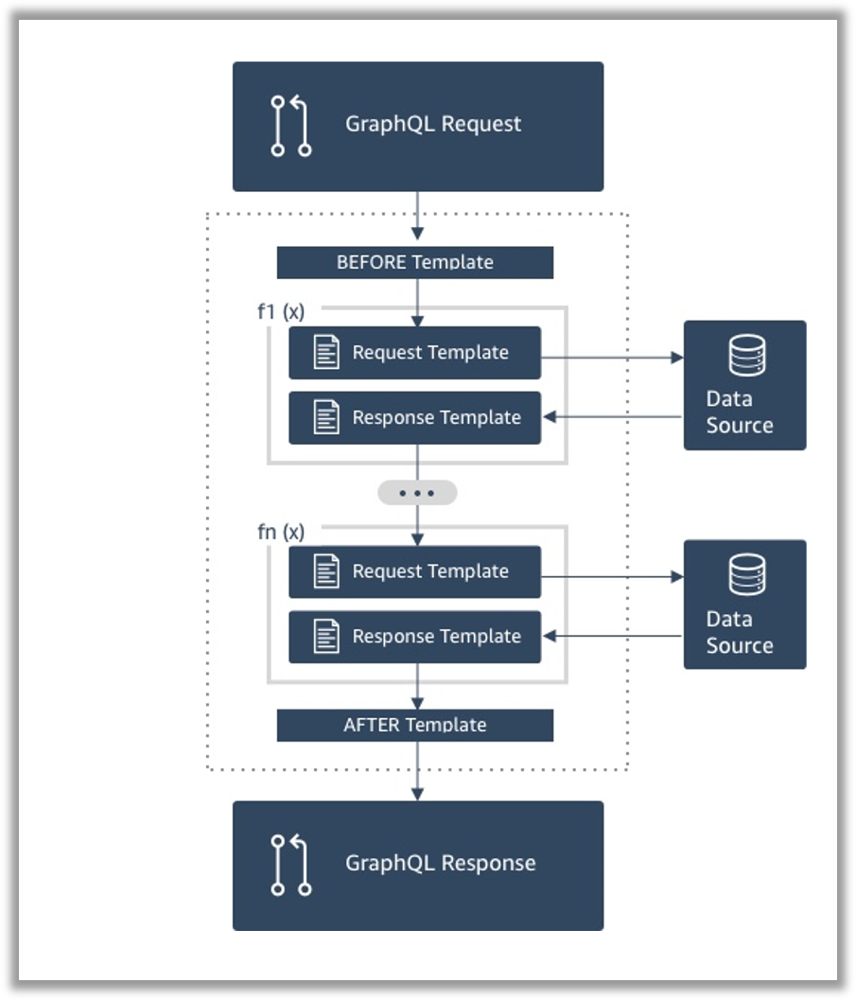

## なにこれ 

AWSのGraphQLフルマネージドサービス[「AppSync」](https://aws.amazon.com/jp/appsync/)で複数のデータリソースを扱う場合は**「Pipeline Resolver」**という機能を使います。
これは、1つのデータリソースを扱うファンクションを定義し、それらを組み合わせるという仕組みです。
ファンクションではデータリソースのCRUD操作や操作結果の加工などを[**VTL（Apatch Verocity Template Language）**](http://velocity.apache.org/engine/1.7/vtl-reference.html)で記述します。
今回は、**Pipeline Resolverを使って複数のデータリソース（DynamoDBの複数テーブル）から情報を取得する場合のVTLの書き方について以下2パターンをご紹介します。**


* [🔰 1対1で紐づく2つのDynamoDBのテーブルから1件情報を取得する場合](#1対1で紐づく2つのdynamodbのテーブルから1件情報を取得する場合)
* [💪 1対Nで紐づく2つのDynamoDBのテーブルから複数件情報を取得する場合](#1対nで紐づく2つのdynamodbのテーブルから複数件情報を取得する場合)

<small>※この記事ではあくまでもVTLの書き方に注力して説明します。GraphQLのスキーマ・リゾルバー、AppSyncのリクエストマッピングテンプレート・レスポンスマッピングテンプレートの概要については知っている前提です。</small>

## Pipeline Resolverの概要

少しだけ説明します。


* Pileline Resolverの中で、どのファンクションをどの順番で呼び出すか指定します。
* ファンクションは「データリソース、リクエストマッピングテンプレート、レスポンスマッピングテンプレート」のセットです。
* 柔軟性が高く、処理の共通化なども可能です。


## 1対1で紐づく2つのDynamoDBのテーブルから1件情報を取得する場合

### APIとデータリソースの仕様

<details><summary>コチラをクリックしたら見れます。リゾルバーとあわせてご覧ください。</summary><div>
<br/>

`{"id":"1000"}`を引数にAPIを呼び出すと以下レスポンスが返ってくる想定です。

```json:title=APIのレスポンス
{
    "id": "1000",
    "name": "ギャッツビー太郎",
    "departmentId": "9001",
    "departmentName": "総務部"
}
```

#### Queryのスキーマ

```
type Sample1 {
    id: ID!
    name: String!
    departmentId: String!
    departmentName: String
}

query {
    sample1(id: ID!): Sample1
}
```

#### 取得対象データ

```markdown:title=従業員テーブル（Employeeテーブル） ※簡単のため１件のみ
* id: 100
* name: ギャッツビー太郎
* departmentId: 9001
```

```markdown:title=部署テーブル（Departmentテーブル） ※簡単のため１件のみ
* id: 9001
* name: 総務部
```


</div></details>
<br/>


### リゾルバーの書き方
「従業員情報 + 従業員に紐づく部署情報」を1件取得する場合、以下のようなVTLを作成します。


#### 1. 従業員テーブルに対するファンクション

```vtl:title=リクエストマッピングテンプレート
# 従業員IDを指定してDynamoDBから1件情報を取得します。
{
    "version": "2017-02-28",
    "operation": "GetItem",
    "key": {
        "id": $util.dynamodb.toDynamoDBJson($ctx.args.id),
    },
}
```

```vtl:title=レスポンスマッピングテンプレート
# 従業員情報をレスポンスに設定します。
$util.toJson($context.result)
```


#### 2. 部署テーブルに対するファンクション

```vtl:title=リクエストマッピングテンプレート
# 前ファンクションの結果（従業員情報）に紐づく部署情報を取得します。
{
    "operation": "GetItem",
    "key": {
        # 前ファンクションの結果は $ctx.prev.resultで参照できます。
        # 部署IDを指定してDynamoDBから1件情報を取得します。
        "id": $util.dynamodb.toDynamoDBJson($ctx.prev.result.departmentId),
    }
}
```


```vtl:title=レスポンスマッピングテンプレート
#if($ctx.error)
        $util.error($ctx.error.message, $ctx.error.type)
#end

# 前ファンクションの結果（従業員情報）と今回の結果（部署情報）をマージします。
# オブジェクトに新しくプロパティを追加する場合は putメソッドを使います。
# putメソッドを使う場合は $util.qr で囲む必要があります。
$util.qr($ctx.prev.result.put("departmentName", $ctx.result.name))

# マージ結果をレスポンスに設定します。
$util.toJson($ctx.prev.result)
```


## 1対Nで紐づく2つのDynamoDBのテーブルから複数件情報を取得する場合

### APIとデータリソースの仕様

<details><summary>コチラをクリックしたら見れます。リゾルバーとあわせてご覧ください。</summary><div>
<br/>

`{ "contractor":"ギャッツビー太郎"}`を引数にAPIを呼び出すと以下のレスポンスが返ってくる想定です。

```json:title=APIのレスポンス
{
    "contracts": {
        "items": [
            {
            	"id": "1000",
                "name": "〇〇〇案件",
                "contractor": "ギャッツビー太郎",
                "productIds": [
                    "2001",
                    "2002"
                ],
                "products": [
                    {
                        "id": "2001",
                        "name": "トマト"
                    },
                    {
                        "id": "2002",
                        "name": "ナス"
                    }
                ]
            },
            {
            	"id": "1001",
                "name": "△△△案件",
                "contractor": "ギャッツビー太郎",
                "productIds": [
                    "2002",
                    "2003"
                ],
                "products": [
                    {
                        "id": "2002",
                        "name": "ナス"
                    },
                    {
                        "id": "2003",
                        "name": "キュウリ"
                    }
                ]
            }
        ]
    }
}
```

#### Queryのスキーマ

```
type Contracts {
    items: [Contract]
}

type Contract {
    id: ID!
    name: String!
    contractor: String!
    productIds: [ID]
    products: [Product]
}

type Product {
    id: ID!
    name: String
}

query {
    getContracts(contractor: String!): Contracts
}
```

#### 取得対象データ

```markdown:title=契約テーブル（Contractテーブル） 2件
* id: 1000
* name: 〇〇〇案件
* contractor: ギャッツビー太郎
* productIds: [2001,2002]

* id: 1001
* name: △△△案件
* contractor: ギャッツビー太郎
* productIds: [2002,2003]
```

```markdown:title=商品テーブル（Productテーブル） 3件
* id: 2001
* name: トマト

* id: 2002
* name: ナス

* id: 2003
* name: キュウリ
```

</div></details>
<br/>


### リゾルバーの書き方

「契約情報 + 契約に紐づく商品情報」を複数件取得する場合、以下のようなVTLを作成します。


### 1. 契約テーブルに対するファンクション

```vtl:title=リクエストマッピングテンプレート
{
    "operation" : "Scan",
    # 複数件検索ではfilterで検索条件を指定します。
    "filter" : {
        # 具体的な検索条件はexpressionで定義します。
        # 今回は契約者名が一致することが条件です。
        "expression": "contractor = :contractor",
        # 検索条件で使う変数はあらかじめexpressionValuesで初期化します。
        "expressionValues" : {
            ":contractor" : $util.dynamodb.toDynamoDBJson($ctx.args.contractor)
        }
    }
}
```

```vtl:title=レスポンスマッピングテンプレート
# 契約情報をレスポンスに設定します。
$util.toJson($context.result)
```


### 2. 商品テーブルに対するファンクション

```vtl:title=リクエストマッピングテンプレート
# 前ファンクションで取得した契約情報から商品IDを抽出します。
#set($productIds = [])
#set($contracts = $ctx.prev.result.items)
#foreach($c in $contracts)
    #foreach( $id in $c.productIds )
        #if(!$productIds.contains($id))
            $util.qr($productIds.add($id))
        #end
    #end
#end

{
    "version" : "2017-02-28",
    "operation" : "Scan",
    "filter" : {
        # 「複数の値のどれかに一致する」という条件はcontains関数で実現します。
        "expression": "contains(:ids, id)",
        "expressionValues" : {
            ":ids" : $util.dynamodb.toDynamoDBJson($productIds)
        }
    }
}
```


```vtl:title=レスポンスマッピングテンプレート

#if($ctx.error)
        $util.error($ctx.error.message, $ctx.error.type)
#end

# 前ファンクションの結果（契約情報）と今回の結果（商品情報）をマージします。
#foreach($c in $ctx.prev.result.items)
    #set($products = [])    
    # 商品情報をイテレート
    #foreach( $p in $ctx.result.items )
        # 契約情報に含まれる商品が見つかったら
        #if($c.productIds.contains($p.id))
            # $productsにaddします。
            $util.qr($products.add($p))
        #end
    #end
        
    # 商品情報を契約情報に追加します。
    #set($temp = { "items": $products })
    $util.qr($contract.put("products", $temp))
#end

# マージした情報をレスポンスに設定します。
$util.toJson($ctx.prev.result)
```


## まとめ

今回、AppSyncで複数のデータリソースから情報を取得する場合のVTLの書き方についてを紹介しました。
ここで紹介した方法さえ覚えておけば、データリソースが3つ以上になった場合もファンクションを追加していけば良いだけです。
またデータリソースがDynamoDBではなくRDB、Lambdaの場合もデータ取得APIを置き換えれば良いだけです。

それにしてもAppSyncのリゾルバー定義は、なぜVTL縛りなのでしょうか。Lambdaのように好きな言語で実装させてくれてもいいのに... いずれは、そうなることを期待しています🍅


## 参考
* [AWS AppSyncの新機能！Pipeline Resolver、Aurora Serverless Data Source、Delta Syncがサポートされました！ ｜ DevelopersIO](https://dev.classmethod.jp/cloud/aws/appsync-updates-11-21/)
* [チュートリアル: パイプラインリゾルバー - AWS AppSync](https://docs.aws.amazon.com/ja_jp/appsync/latest/devguide/tutorial-pipeline-resolvers.html)

