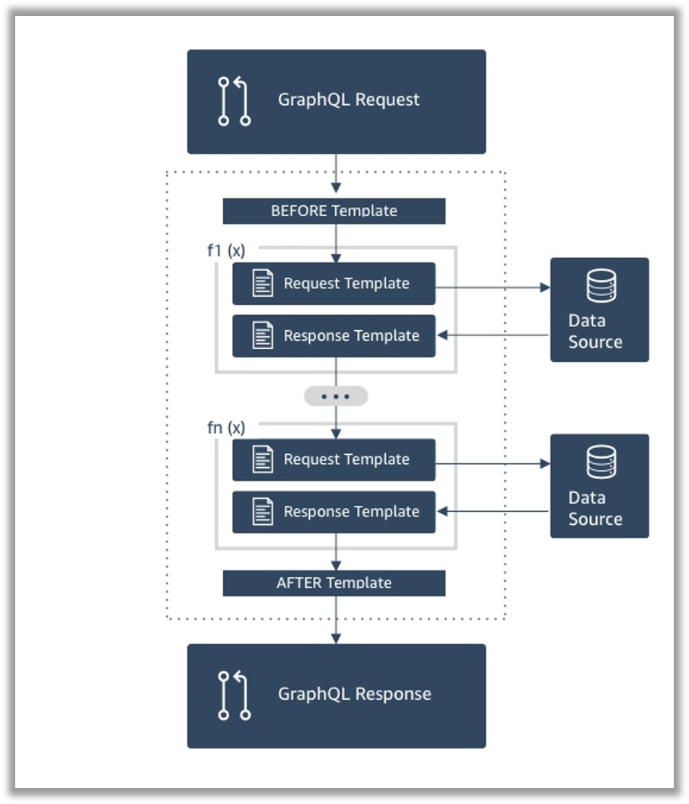

## なにこれ 

AWSのGraphQLフルマネージドサービス[「AppSync」](https://aws.amazon.com/jp/appsync/)で複数のデータリソースを扱う場合は**「Pipeline Resolver」**という機能を使います。
これは、1つのデータリソースを扱うファンクションを定義し、それらを組み合わせるという仕組みです。
ファンクションではデータリソースのCRUD操作や操作結果のデータ加工などを[**VTL（Apatch Verocity Template Language）**](http://velocity.apache.org/engine/1.7/vtl-reference.html)で記述します。
今回は、**Pipeline Resolverを使って複数のデータリソース（DynamoDBの複数テーブル）から情報を取得する場合のVTLの書き方について以下2パターンをご紹介します。**


* [🔰 1対1で紐づく2つのDynamoDBのテーブルから1件情報を取得する場合](#1対1で紐づく2つのdynamodbのテーブルから1件情報を取得する場合)
* [💪 1対Nで紐づく2つのDynamoDBのテーブルから複数件情報を取得する場合](#1対nで紐づく2つのdynamodbのテーブルから複数件情報を取得する場合)

<small>※この記事ではあくまでもVTLの書き方に注力して説明します。GraphQLのスキーマ・リゾルバー、AppSyncのリクエストマッピングテンプレート・レスポンスマッピングテンプレートの概要については知っている前提です。</small>

## Pipeline Resolverの概要

少しだけ説明します。


* Pileline Resolverの中で、どのファンクションをどの順番で呼び出すか指定します。
* ファンクションは「データリソース、リクエストマッピングテンプレート、レスポンスマッピングテンプレート」のセットです。
* 柔軟性が高く、処理の共通化なども可能です。


## 1対1で紐づく2つのDynamoDBのテーブルから1件情報を取得する場合

### APIとデータリソース仕様

<details><summary>コチラをクリックしたら見れます。リゾルバーとあわせてご覧ください。</summary><div>
<br/>

`{"id":"1000"}`を引数にAPIを呼び出すと以下の結果がレスポンスで返ってくる想定です。

```json:title=APIのレスポンス
{
    "id": "1000",
    "name": "ギャッツビー太郎",
    "departmentId": "9001",
    "departmentName": "総務部"
}
```

#### Queryのスキーマ

```
type Sample1 {
    id: ID!
    name: String!
    departmentId: String!
    departmentName: String
}

query {
    sample1(id: ID!): Sample1
}
```

#### 取得対象データ

```markdown:title=従業員テーブル（employeeテーブル） ※簡単のため１件のみ
* id: 100
* name: ギャッツビー太郎
* departmentId: 9001
```

```markdown:title=部署テーブル（departmentテーブル） ※簡単のため１件のみ
* id: 9001
* name: 総務部
```


</div></details>
<br/>


### リゾルバーの書き方
従業員に紐づく部署情報もあわせて取得する場合、以下のようなVTLを作成します。


#### 1. 従業員テーブルに対する関数

```vtl:title=リクエストマッピングテンプレート
# この関数はいたって単純でDynamoDBから1件情報を取得するだけです。
{
    "version": "2017-02-28",
    "operation": "GetItem",
    "key": {
        "id": $util.dynamodb.toDynamoDBJson($ctx.args.id),
    },
}
```

```vtl:title=レスポンスマッピングテンプレート
# 従業員テーブルから取得した情報をレスポンスに設定します。
$util.toJson($context.result)
```


#### 2. 部署テーブルに対する関数

```vtl:title=リクエストマッピングテンプレート
# 前関数で取得した従業員情報に紐づく部署情報を取得します。
# 前関数での取得結果は $ctx.prev.resultで参照できます。
#set($args={"id": $ctx.prev.result.departmentId})
{
        "operation": "GetItem",
        "key": {
                # 部署IDをもとに部署テーブルを検索するような処理を記述します。
                "id": $util.dynamodb.toDynamoDBJson($ctx.prev.result.departmentId),
        }
}
```


```vtl:title=レスポンスマッピングテンプレート
# 取得した部署情報を前の関数で取得した結果とマージしてレスポンスとして返します。

#if($ctx.error)
        $util.error($ctx.error.message, $ctx.error.type)
#end

# オブジェクトに新しくプロパティを追加する場合は putメソッドを使います
# putメソッドを使う場合は $util.qr で囲む必要があります。
$util.qr($ctx.prev.result.put("departmentName", $ctx.result.name))

# マージした情報をレスポンスに設定します。
$util.toJson($ctx.prev.result)
```


## 1対Nで紐づく2つのDynamoDBのテーブルから複数件情報を取得する場合

### APIとデータリソース仕様

<details><summary>コチラをクリックしたら見れます。リゾルバーとあわせてご覧ください。</summary><div>
<br/>

まずは想定するAppSyncのスキーマとデータリソースを説明します。
`{ "contractor":"ギャッツビー太郎"}`を引数にAPIを呼び出すと以下の結果がレスポンスで返ってくる想定です。

```json:title=APIのレスポンス
{
    "contracts": {
        "items": [
            {
            	"id": "1000",
                "name": "〇〇〇案件",
                "contractor": "ギャッツビー太郎",
                "productIds": [
                    "2001",
                    "2002"
                ],
                "products": [
                    {
                        "id": "2001",
                        "name": "トマト"
                    },
                    {
                        "id": "2002",
                        "name": "ナス"
                    }
                ]
            },
            {
            	"id": "1001",
                "name": "△△△案件",
                "contractor": "ギャッツビー太郎",
                "productIds": [
                    "2002",
                    "2003"
                ],
                "products": [
                    {
                        "id": "2002",
                        "name": "ナス"
                    },
                    {
                        "id": "2003",
                        "name": "キュウリ"
                    }
                ]
            }
        ]
    }
}
```

#### Queryのスキーマ

```

type Contracts {
    items: [Contract]
}

type Contract {
    id: ID!
    name: String!
    contractor: String!
    productIds: [ID]
    products: [Product]
}

type Product {
    id: ID!
    name: String
}

query {
    getContracts(contractor: String!): Contracts
}
```

#### 取得対象データ

```markdown:title=契約テーブル（Contructテーブル） 2件
* id: 1000
* name: 〇〇〇案件
* contractor: ギャッツビー太郎
* productIds: [2001,2002]

* id: 1001
* name: △△△案件
* contractor: ギャッツビー太郎
* productIds: [2002,2003]
```

```markdown:title=商品テーブル（productテーブル） 3件
* id: 2001
* name: トマト

* id: 2002
* name: ナス

* id: 2003
* name: キュウリ
```

</div></details>
<br/>


### リゾルバーの書き方

契約者に紐づく契約を商品情報をあわせて取得する場合、以下のようなVTLを作成します。


### 1. 契約テーブルに対する関数

```vtl:title=リクエストマッピングテンプレート
{
    "operation" : "Scan",
    "filter" : {
        # 検索条件はexpressionで定義します。今回は契約者名が一致することが条件です
        "expression": "contractor = :contractor",
        # 検索条件で使う変数はあらかじめexpressionValuesで初期化します
        "expressionValues" : {
            ":contractor" : $util.dynamodb.toDynamoDBJson($ctx.args.contractor)
        }
    }
}
```

```vtl:title=レスポンスマッピングテンプレート
# 契約情報をレスポンスに設定します。
$util.toJson($context.result)
```


### 2. 商品テーブルに対する関数

```vtl:title=リクエストマッピングテンプレート
# 前の関数で取得した契約情報に紐づく商品情報を取得します

#set($productIds = [])
#set($contracts = $ctx.prev.result.items)
#foreach($c in $contracts)
    #foreach( $id in $c.productIds )
        #if(!$productIds.contains($id))
            $util.qr($productIds.add($id))
        #end
    #end
#end

{
    "version" : "2017-02-28",
    "operation" : "Scan",
    "filter" : {
        # 複数の値のどれかに一致する」といった検索条件を指定する場合は
        # contains関数を使います
        "expression": "contains(:ids, id)",
        "expressionValues" : {
            ":ids" : $util.dynamodb.toDynamoDBJson($productIds)
        }
    }
}
```


```vtl:title=レスポンスマッピングテンプレート
# 取得した部署情報を前の関数で取得した結果とマージしてレスポンスとして返します。

#if($ctx.error)
        $util.error($ctx.error.message, $ctx.error.type)
#end

# 契約情報(前関数の結果)に対して商品情報をくっつけていきます。
#foreach($c in $ctx.prev.result.items)
	#set($products = [])    
    # 今回の取得結果（商品）をいてレートして
    #foreach( $p in $ctx.result.items )
        # 対象の商品が見つかったら
        #if($c.productIds.contains($p.id))
            # $productsにaddします。
                $util.qr($products.add($p))
            #end
    #end
        
    # 最終的にproductsを契約情報に追加します。
    #set($temp = { "items": $products })
    $util.qr($contract.put("products", $temp))
#end

# マージした情報をレスポンスに設定します。
$util.toJson($ctx.prev.result)
```


## まとめ

今回、AppSyncで複数のデータリソースから情報を取得・マージする方法を紹介しました。
ここで紹介した方法さえ覚えておけば、データリソースが3つ以上になった場合も「リクエストマッピングテンプレート、レスポンスマッピングテンプレート」のセットを追加していけば良いだけです。
またデータリソースがDynamoDBではなくRDB、Elasticsearch、Lambdaの場合も同様です。

それにしてもAppSyncのリゾルバー定義は、なぜVTL縛りなのでしょうか。Lambdaのように好きな言語で実装させてくれてもいいのに... いずれは、そうなることを期待しています🍅


## 参考
* [AWS AppSyncの新機能！Pipeline Resolver、Aurora Serverless Data Source、Delta Syncがサポートされました！ ｜ DevelopersIO](https://dev.classmethod.jp/cloud/aws/appsync-updates-11-21/)
* [チュートリアル: パイプラインリゾルバー - AWS AppSync](https://docs.aws.amazon.com/ja_jp/appsync/latest/devguide/tutorial-pipeline-resolvers.html)

