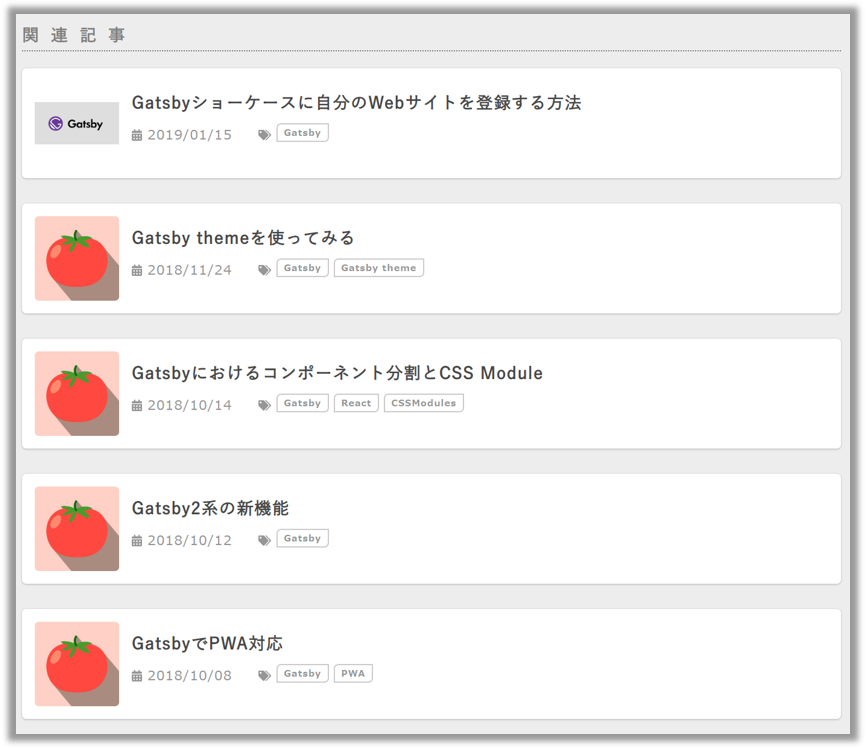

## なにこれ 

ブログでよく見かけるUIのひとつに**関連記事リンク**あります。
記事下部に関連記事リンクを設けておくと、記事を読み終えたユーザーが、また別の記事を見てくれる可能性が上がるので、
回遊率向上という観点で非常に効果的なUIです。

そんな関連記事リンクが[**Hugo**](https://gohugo.io/)（Go言語製静的サイトジェネレーター）には、デフォルトで用意されていることを、[mom0tomoさんのブログ](https://mom0tomo.github.io/)の記事[「HugoでRelated Content(関連記事)を表示する」](https://mom0tomo.github.io/post/hugo_related_posts/)を見て知りました。
自分が使っている[**Gatsby**](https://www.gatsbyjs.org/)（JavaScript製静的サイトジェネレーター）に、そのような機能はありません。うらやましい！

ということで、**Hugoの実装を真似して、Gatsbyで関連記事が表示できるようにしてみました。**実物はこのページの下部にあるのでご覧ください。
今回は、以下のような流れで、関連記事機能について説明したいと思います。

* [Hugoの関連記事機能](#hugoの関連記事機能)
* [関連記事機能イメージ](#関連記事表示イメージ)
* [関連記事機能ソース](#関連記事表示ソースコード)
* [関連記事機能使用にあたりマークダウンのFront Matterにキーワードを追加した](#関連記事機能使用にあたりマークダウンのfront-matterにキーワードを追加した)
* [関連記事機能の使い方](#関連記事機能の使い方)
* [関連記事機能の設定のコツ](#関連記事機能の設定のコツ)

プラグイン化はできていませんが、ソースコードを見れば真似して実装できると思います。
**Gatsbyでブログを作っている方は是非実装してみてください！**

* 関連記事取得処理：[blog/gatsby-related-post.js at master · Takumon/blog](https://github.com/Takumon/blog/blob/master/gatsby-related-post.js)
* 関連記事取得処理の呼び出し：[blog/gatsby-node.js at master · Takumon/blog](https://github.com/Takumon/blog/blob/master/gatsby-node.js#L107)


## Hugoの関連記事機能

記事の全文を解析するようなガッツリした機能ではなく、
マークダウンのFront Matter（日付、タイトル、タグ、キーワード、カテゴリなど）をもとに関連度を測るシンプルな機能です。
以下のようなチューニングが設定で可能です。

1. どれが一致した場合に関連とみなすか
2. 一致した場合の重みづけをどうするか
3. 関連度がどれくらい以上の場合に関連記事とみなすか

以下では設定方法と、実際にHugoの記事中で関連記事を表示されるためのメソッドについてご紹介します。

### インターフェース

3つのインターフェースが用意されています。

#### .Related PAGE

指定したページの関連記事を取得します。

```go
{{ $related := .Site.RegularPages.Related . }}
```

#### .RelatedIndices PAGE INDICE1 [INDICE2 …]

指定したページの関連記事を取得します。ただし指定した索引に限定して関連度を測ります。

```go
{{ $related := .Site.RegularPages.RelatedIndices . "tags" "date" }}
```

#### .RelatedTo KEYVALS [KEYVALS2 …]
 
指定した索引に関連する関連記事をコレクションで取得します。

```go
{{ $related := .Site.RegularPages.RelatedTo ( keyVals "tags" "hugo" "rocks")  ( keyVals "date" .Date ) }}
```


### 設定方法
以下のように設定します。
それぞれの項目について説明します。

```yaml
related:
  threshold: 80
  includeNewer: false
  toLower: false
  indices:
  - name: keywords
    weight: 100
  - name: date
    weight: 10
```

#### threshold
関連記事とみなすための関連度の最低値を指定します。
関連度がこの値未満のものは関連記事から除外されます。

#### includeNewer
対象の記事より新しい記事を関連記事として含めるかを指定します。
trueを指定すると、新しく記事を投稿した場合に、どんどん関連記事が増えていくことになります。

#### toLower

関連記事検索時に、大文字・小文字を区別するかを指定します。
trueの場合、若干パフォーマンスは下がりますご、より良い結果が得られます。

#### indices
関連度を評価する時に使う索引を指定します。
こちらは複数指定できます。

* `name`
    * 記事中に指定したfrontmatterのうちどれを関連度を測る索引として使うかを指定します。
* `weigth`
    * 関連度を計算する時の重み付けです。たとえば以下のように指定した場合、日付が一致するよりも、キーワードが一致するほうが関連度が高くなります。
      ```
      indices:
      - name: keywords
        weight: 100
      - name: date
        weight: 10
      ```

### 参考
公式ドキュメントに詳細が載っています。<br/>
<small>※ピンク眼鏡で若干うさんくさくなってるゴファーくんです。</small>
<div class="iframely-embed"><div class="iframely-responsive" style="padding-bottom: 50%; padding-top: 120px;"><a href="https://gohugo.io/content-management/related/" data-iframely-url="//cdn.iframe.ly/Y4ImVvB"></a></div></div>


<br />
関連記事取得ロジックのソースコードはコチラ

* [`related/inverted_index.go`（コアロジック）](https://github.com/gohugoio/hugo/blob/master/related/inverted_index.go)
* [`hugolib/pages_related.go`（インターフェース）](https://github.com/gohugoio/hugo/blob/master/hugolib/pages_related.go)


## 関連記事表示イメージ

たとえば、この記事だと以下のように表示されます。記事のキーワードがGatsbyなので、Gatsby関連の記事が表示されていますね。
ちなみに記事リンクの見た目は[SmartNewsさんのブログ](https://developer.smartnews.com/blog/)を参考にしました。
SmartNewsさんのブログはPC・モバイルともにカッコいいデザインです！




## 関連記事機能使用にあたりマークダウンのFront Matterにキーワードを追加した

関連記事機能は、記事のFront Matterをみて関連度を測ります。
自分の場合Front Matterにtagsしか定義していなかったため、
関連度測定精度向上目的でkeywords（その記事を一言で表すとなに？という単語）の定義を追加しました。
keywordsでもcategoryでもなんでもいいと思いますが、tagsしか定義していない場合は、
関連度をプラスアルファで測れるような指標を導入したほうが良いです。


## 関連記事機能の使い方

とりあえず自分のブログで使えればいいかなと考えていたので、Hugoの3つのインターフェースのうち1つ（Related）のみ移植しました。関数名は`extractRelatedPosts`に変えています。
Hugoの場合はページオブジェクトのメソッドなので`Related`だけでも意味が通るのですが、移植後は関数化したので、関数名だけで意味がわかるように変えました。

Gatsbyを使っている方は、以下参考にしていただければ関連記事表示機能を実装できると思います。
ただ自分のブログは  (1)frontmatterの取得方法が特殊 (2)関連記事のソートが関連度降順、公開日降順で固定　なのでそこを読み替えてください。

* 関連記事取得処理：[blog/gatsby-related-post.js at master · Takumon/blog](https://github.com/Takumon/blog/blob/master/gatsby-related-post.js)
* 関連記事取得処理の呼び出し：[blog/gatsby-node.js at master · Takumon/blog](https://github.com/Takumon/blog/blob/master/gatsby-node.js#L107)


実際には`gatsby-node.js`で以下のよう使います。
ページコンポーネントのコンテキストに関連記事ノードの配列を指定しています。


```js:title=gatsby-node.js
const relatedPost = require('./gatsby-related-post')

exports.createPages = ({ graphql, actions }) => {
  // ・・・

  // 関連記事取得
  const relatedPosts = relatedPost.extractRelatedPosts(
    allPostNodes, // 全記事のノード配列
    node,  // 対象の記事のノード
    relatedPost.defaultConfig // 設定
  ).slice(0,5) // この例では上位5件に絞っています

  // 記事ページを生成
  actions.createPage({
    // ・・・
    context: {
      // ・・・
      relatedPosts, // コンテキストに関連記事のノード配列を指定
      // ・・・
    },
  })
  // ・・・
}
```

<br/>

これで、関連記事ノード配列が記事コンポーネントで扱えるようになります。あとはよしなり画面に表示すればOKです。


## 関連記事機能の設定のコツ

設定値のチューニングは少しコツがあります。
**設定値に必ずタグやキーワードよりも小さいweigthを持った索引を指定しましょう。**

Hugoにおいて関連記事が閾値以上か判定している箇所は[ココ](https://github.com/gohugoio/hugo/blob/master/related/inverted_index.go#L369-L375)です。この中で呼ばれている[norm関数](https://github.com/gohugoio/hugo/blob/master/related/inverted_index.go#L390-L395)を見るとわかるのですが、このロジックだと、設定で指定した最小Weihtの索引がどれだけ一致していても関連記事とはみなされません。

今回はこのロジックをそのまま移植しているので、Hugoと同様に以下のような設定だとどれだけタグが一致しても関連記事とはみなされないことになります。

```js:title=🙅🏻‍♂️ダメな設定例
const relatedContentConfig = {
  threshold: 80,
  includeNewer: true,
  toLower: true,
  indices: [
    {
      name: 'keywords',
      weight: 100
    },
    {
      name: 'tags',
      weight: 50
    },
  ],
}
```

<br/>

必ずtagsやkeywordsよりも低いweigthの索引を指定してあげましょう。

```js{14-17}:title=🙆🏻‍♂️良い設定例
const relatedContentConfig = {
  threshold: 80,
  includeNewer: true,
  toLower: true,
  indices: [
    {
      name: 'keywords',
      weight: 100
    },
    {
      name: 'tags',
      weight: 50
    },
    {
      name: 'date',
      weight: 10
    },          
  ],
}
```
<br/>


## まとめ

単純なロジックですが、タグとキーワードを見直すことで、それなりに満足のいく関連記事機能となりました。
プラグイン化は、自分のブログ依存の処理（frontmatterの取得方法、ソートキー固定）を汎用化する必要があって少しめんどくさいので、時間があればやりたいくらいの気持ちです。
今回は関連記事を表示するだけでしたが、関連度の情報を使って、記事の関連度マップを作ると面白そうなので、次回は記事関連度マップを作ろうと思います🍅


