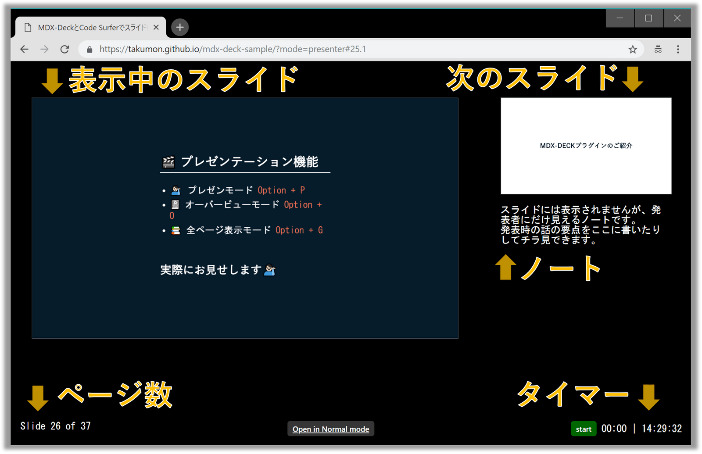

## なにこれ 
2019/2/1(金)、[WEBエンジニア勉強会 #11](https://web-engineer-meetup.connpass.com/event/115444/)でLTしてきました。
本記事では**自分のLTスライド**と、**10分の枠では伝えきれなかった補足情報**を紹介します。
また他の方のLTの様子や、勉強会の雰囲気なども**参加レポート**として書いています。

<div class="iframely-embed"><div class="iframely-responsive" style="padding-bottom: 40.8994%; padding-top: 120px;"><a href="https://web-engineer-meetup.connpass.com/event/115444/" data-iframely-url="//cdn.iframe.ly/YLILmaW"></a></div></div>


## LTの発表スライド

※スライドの右端をクリックするか、`→`をクリックすると次画面に遷移できます。<br>
※全画面で見る場合は[GitHub Pages](https://takumon.github.io/mdx-deck-sample/)をご覧ください。

<iframe 
  src="https://takumon.github.io/mdx-deck-sample" 
  width="600" 
  height="450"
  ></iframe>


※実はMDX-Deckについては以前の記事にも書いています。
LTのネタになりそうだとうことで、今回さらに深堀して整理したものをLTで発表しました。

<div class="iframely-embed"><div class="iframely-responsive" style="height: 168px; padding-bottom: 0;"><a href="https://takumon.com/2018/12/23/" data-iframely-url="//cdn.iframe.ly/vvP8pRK"></a></div></div>


## LTの反響

Twitterを見るとMDX-Deckに少しでも興味をもっていただけたようでうれしいです。

<blockquote class="twitter-tweet" data-partner="tweetdeck"><p lang="ja" dir="ltr">よく考えたらスライド作成ツールの紹介をするスライド作るのってハードル高くてしんどいよな・・・<br>こんな表現・アニメーションできるんだぜって見せつけなきゃいけないんだから、たくもんさんすごい  <a href="https://twitter.com/hashtag/web%E3%82%A8%E3%83%B3%E3%82%B8%E3%83%8B%E3%82%A2%E5%8B%89%E5%BC%B7%E4%BC%9A11?src=hash&amp;ref_src=twsrc%5Etfw">#webエンジニア勉強会11</a></p>&mdash; ngmt (@ngmt83) <a href="https://twitter.com/ngmt83/status/1091307490694713346?ref_src=twsrc%5Etfw">February 1, 2019</a></blockquote>

<blockquote class="twitter-tweet" data-partner="tweetdeck"><p lang="ja" dir="ltr">隣に座っている、みずりゅさんが手に持ったものを落としそうになるぐらいスゴイ、それが MDX-DECK！w　　<a href="https://twitter.com/hashtag/WEB%E3%82%A8%E3%83%B3%E3%82%B8%E3%83%8B%E3%82%A2%E5%8B%89%E5%BC%B7%E4%BC%9A11?src=hash&amp;ref_src=twsrc%5Etfw">#WEBエンジニア勉強会11</a></p>&mdash; いわしまん (@iwasiman) <a href="https://twitter.com/iwasiman/status/1091307489881055234?ref_src=twsrc%5Etfw">February 1, 2019</a></blockquote>


<blockquote class="twitter-tweet" data-partner="tweetdeck"><p lang="ja" dir="ltr">MDX-DECK、jsxでかけるのめっちゃよさそう <a href="https://twitter.com/hashtag/WEB%E3%82%A8%E3%83%B3%E3%82%B8%E3%83%8B%E3%82%A2%E5%8B%89%E5%BC%B7%E4%BC%9A11?src=hash&amp;ref_src=twsrc%5Etfw">#WEBエンジニア勉強会11</a></p>&mdash; Rin(しま) (@408rin) <a href="https://twitter.com/408rin/status/1091306260723449861?ref_src=twsrc%5Etfw">February 1, 2019</a></blockquote>


<blockquote class="twitter-tweet" data-partner="tweetdeck"><p lang="ja" dir="ltr">mdxカックイイ <a href="https://twitter.com/hashtag/WEB%E3%82%A8%E3%83%B3%E3%82%B8%E3%83%8B%E3%82%A2%E5%8B%89%E5%BC%B7%E4%BC%9A11?src=hash&amp;ref_src=twsrc%5Etfw">#WEBエンジニア勉強会11</a></p>&mdash; VTRyo@レベル0 (@3s_hv) <a href="https://twitter.com/3s_hv/status/1091305678143053824?ref_src=twsrc%5Etfw">February 1, 2019</a></blockquote>


## LT補足情報（😭ハマりポイント😭など）

LTではMDX-Deckのメリットを中心に話しましたが、実際使ってみるとハマりポイントがいくつかあります😭
ここでは、LTで話せなかった部分の説明と、MDX-Deckを使う上での注意事項とハマりポイントのワークアラウンドについてお話します。<br/>
ハマりポイントはありますが、一度作ってしまえば、テーマやコンポーネントなどは再利用できるので、MDX-Deck是非使ってみてください。

### コンポーネント

時間の都合上、紹介できなかったコンポーネントです。

#### Horizontal：横並びレイアウト

複数の画像や文章を横ならびに表示するレイアウトです。

```jsx
import { Horizontal} from 'mdx-deck/layouts'
export default Horizontal


### どんどん横に並んでいく
```


#### Head：メタ情報埋め込み

スライドをHTMLで公開する場合、HTMLのheadタグを指定できます。

```jsx
import { Head } from 'mdx-deck'
<Head>
  <title>mdx-deckとcode-surferでスライドを作ろう！</title>
</Head>
```

**😭ただコチラTwitterCardの設定はうまくいきませんでした😭**
今回どうしてもTwitterCardを設定したかったので、
ワークアラウンドとして、ビルド時に出力されたHTMLファイルを直接編集し
headタグに以下を埋め込んでからデプロイしました。

```title=ビルド後に出力されたindex.htmlの一部
<link rel="canonical" href="https://takumon.github.io/mdx-deck-sample/">
<meta name='viewport' content='width=device-width,initial-scale=1'>
<meta name="twitter:site" content="@inouetakumon">
<meta name="twitter:creator" content="@inouetakumon">
<meta name="twitter:card" content="summary_large_image">
<meta name='twitter:title' content="MDX-DeckとCode Surferでスライドを作ろう！ #WEBエンジニア勉強会11">
<meta name='twitter:image' content="https://takumon.github.io/mdx-deck-sample/images/card.png">
<meta name='twitter:description' content="MDX（Markdown + JSX）をベースとしたグラフィカルなスライドが作れるライブラリの紹介です。">

<meta property="og:title" content="MDX-DeckとCode Surferでスライドを作ろう！ #WEBエンジニア勉強会11">
<meta property="og:description" content="MDX（Markdown + JSX）をベースとしたグラフィカルなスライドが作れるライブラリの紹介です。">
<meta property="og:image" content="https://takumon.github.io/mdx-deck-sample/images/card.png">
```


### プレゼンテーション機能

LTではデモをお見せしただけだったので、
実際どんなものか説明します。

#### プレゼンモード




ショートカットキーは、Macだと`option + p`、Windowsだと`alt + p`です。<br>
タイマーやページ数などプレゼンに必要な機能がすべて確認できるモードです。
MDX-Deckは複数タブ間の画面遷移を同期する機能を持っています。
そのため手元のPCではプレゼンテーションモードで開いてスライドを遷移させながら、
プロジェクターには通常モードで開いて見せるといったことが可能です。


#### オーバービューモード


ショートカットキーは、Macだと`option + u`、Windowsだと`alt + u`です。
パワーポイントのように、左側にページ一覧が表示されるモードです。


#### 全ページ表示モード


ショートカットキーは、Macだと`option + g`、Windowsだと`alt + g`です。
全ページがグリッド表示されるモードです。発表後の、質問タイムなどに使えます。


### テーマ指定方法

テーマのカスタマイズについては[公式ドキュメント](https://github.com/jxnblk/mdx-deck/blob/master/docs/theming.md)を見ると良いです。
ここでは[僕のスライドのソースコード](https://github.com/Takumon/mdx-deck-sample/blob/master/components/theme.js)を例にしてにカスタマイズ方法を紹介します。

#### デフォルトテーマをカスタマイズする

```jsx:title=theme.js
import theme from 'mdx-deck/themes'

export default {
  ...theme,

  // カスタマイズしたいプロパティを定義
}
```


### セクションタイトルなどをレスポンシブ対応する

画面サイズに応じたスタイルを指定するには、メディアクエリを指定する必要があります。
テーマの設定においてメディアクエリは以下のような形で指定できます。

```jsx:title=theme.js
import theme from 'mdx-deck/themes'

export default {
  ...theme,
  h1: {
    textTransform: 'uppercase',
    fontWeight: 600,
    fontSize: '1rem',
    letterSpacing: '.02rem',
    '@media screen and (min-width:480px) and (min-height: 400px)': {
      fontSize: '1.5rem',
      letterSpacing: '.03rem',
    },
    '@media screen and (min-width:640px) and (min-height: 500px)': {
      fontSize: '2.5rem',
      letterSpacing: '.04rem',
    },
    '@media screen and (min-width:1020px) and (min-height: 830px)': {
      fontSize: '4rem',
      letterSpacing: '.05rem',
    }
  },
}
```

### 画面遷移方式をカスタマイズする

横スライドしかできませんが、
遷移における、速度変化の割合（CSSでいう`transition-timing-function`）と時間を指定できます。
自分の場合は、アニメーションをオフにしたかったので、時間は0にしました。

```jsx:title=theme.js
import theme from 'mdx-deck/themes'

export default {
  ...theme,
  // 横スライドするでデジ曲線のパターン
  transitionTimingFunction: 'linear',
  // スライドにかかる時間
  transitionDuration: '0s'
}
```

### ソースコードのシンタックスハイライトを指定する

[react-syntax-highlighter](https://www.npmjs.com/package/react-syntax-highlighter)をインストールして、以下のように指定します。
お好きなテーマを選びましょう。自分はatomDarkにしました。

```jsx:title=theme.js
import theme from 'mdx-deck/themes'
import atomDark from 'react-syntax-highlighter/styles/prism/atom-dark'

export default {
  ...theme,
  prism: {
    style: atomDark
  },
}
```

### ソースコードプレビューをレスポンシブ対応する

MDE-Deckのテーマは、`h1～h6`, `ul`, `ol`, `li`タグのスタイルは指定できるのですが、
**😭ソースコードプレビューのタグである`pre`の指定はテーマではできません😭**
そのためテーマではなく、レイアウトコンポーネントを作ることで対応しました。

```jsx:title=layout-aligne-center.js
import React from 'react'
import styled from 'styled-components'

const Wrapper = styled.main`
  width: 100vw;
  height: 100vh;
  padding: 1rem;
  display: flex;
  align-items: center;
  flex-direction: row;
  justify-content: center;
  position: relative;

  pre {
    max-width: 90vw;
    max-height: 80vh;
    font-size: 0.5rem;

    @media screen and (min-width:480px) and (min-height: 400px) {
      font-size: 0.8rem;
    }
    @media screen and (min-width:640px) and (min-height: 500px) {
      font-size: 1rem;
    }
    @media screen and (min-width:1020px) and (min-height: 830px) {
      font-size: 1.8rem;
    }
  }
`

const LayoutAlignCenter = ({ children }) => <Wrapper>{children}</Wrapper>

export default LayoutAlignCenter
```


### ビルド周りの注意点

#### HTMLに出力する

`mdx-deck build`では**😭mdxファイルで指定した画像を出力してくれません😭**
そのため以下のようにしてビルド時に自分でコピーする必要があります。
npmスクリプトは以下のようにしました。

```json
    "build": "mdx-deck build --no-html deck.mdx & cpx \"images/*\" ./dist/images",
```

#### PDFに出力する

npmスクリプトは以下の縦幅と横幅を指定して出力するようにしました。

```json
    "pdf": "mdx-deck pdf --width 1377 --height 756 deck.mdx",
```

**😭ただ文字の大きさなどのレイアウトが思い通りにいかない部分がありました😭**

* Code Surferのアニメーション非対応
  * ソースコードの全量が表示されるのみ、アニメーションごとの説明は表示されない
* Appearタグのアニメーション非対応
  * アニメーションごとにスライドを分けたりはできない。最終結果のみ表示される
* 左右分割レイアウト非対応
  * 何も表示されない。空白のページが出力される。
* 絵文字は白黒になる
* 文字が小さく表示される

#### スナップショットを出力する

MDX-Deckでは一枚目のスライドをPNGで出力できます。
npmスクリプトは以下の縦幅と横幅を指定して出力するようにしました。

```json
    "screenshot": "mdx-deck screenshot --width 1200 --height 630 deck.mdx",
```

**😭ただこれもPDFと同様に、レイアウトが思い通りにいきませんでした😭**
本当はTwitterカード用の画像をこの機能で作りたかったのですが、結局断念してパワポで作りました。

### シンタックス周りの注意点

2つほど注意点があります。

* HTMLタグやコンポーネントのタグ内に、マークダウンを記述しても素の文字列として認識されてしまう
* セクションタイトルを凝ったスタイルにしようとしてHTMLタグのh1 h2タグなどを使うと、テーマで指定したスタイルが有効にならない


### プレゼン時の注意事項

こちらも注意が必要です。<br/>
HTMLなので、レイアウトがディスプレイの解像度に左右されます。
レスポンシブデザインにしたとしても、**😭場合によっては文章が折り返されたりして、思い通りのレイアウトで表示されません😭**
そのため、プレゼンの前は、お試しでプロジェクターに映してレイアウトが崩れないか確認しましょう。
崩れる場合は、ブラウザの拡大率で調整すればOKです。


### MDXを使ったライブラリ

MDX-Deckの以外にも[MDX](https://mdxjs.com/)を使ったライブラリが何個かあります。

* [docz](https://www.docz.site/)
    * 手軽にReactコンポーネントガイドを作れるです。
* [gatsby-mdx](https://github.com/ChristopherBiscardi/gatsby-mdx)
    * Gatsbyのプラグイン。GatsbyでMDXが使えるようになります。


補足情報は以上です。


## 参加レポート

[OSCA](https://twitter.com/engineer_osca)さんが主催する勉強会で、今回で11回目の開催です。
今回の渋谷にある[ミクシィ](https://mixi.co.jp/)で行われました。広々としたスペースで夜景が見えるとても綺麗な会場でした。


<br/>
<br/>

技術領域を限定していないので、フロントエンドからバックエンドまで色々な技術ネタを聞くことができ、非常に楽しい勉強会でした。
以下にLT登壇者のスライドと感想を載せています。


### 写真共有アプリ「みてね」に見る簡潔な良UI/UX
**[ngmt](https://twitter.com/ngmt83)さん**

<div style="left: 0; width: 100%; height: 0; position: relative; padding-bottom: 74.9288%;"><iframe src="//speakerdeck.com/player/d7decad7104443288501c421631cc8a5" style="border: 0; top: 0; left: 0; width: 100%; height: 100%; position: absolute;" allowfullscreen scrolling="no" allow="autoplay; encrypted-media"></iframe></div>
<br/>

ミクシィさんが作っている写真共有アプリ「みてね」の紹介です。
実際ngmtさんが使ってみた感想を踏まえながら、
「みてね」のUI/UXのすばらしさについて聞くことができました。
「サービスとして『なんでも提供できる』は『何も提供していない』と同じ」という前提をもとに
「みてね」は想定ユーザーを限定し、そこに対して使いやすさを追求することで簡潔なUI/UXを実現できている
という話しの展開で、すごく納得させられるLTでした。

<br/>
<br/>


### WEBエンジニアが知っておきたい決済の仕組み
**[ykagano](https://twitter.com/ykagano)さん**

<div style="left: 0; width: 100%; height: 0; position: relative; padding-bottom: 69.1563%;"><iframe src="//speakerdeck.com/player/2f10fe62a6d541acb0a42deb95e3828b" style="border: 0; top: 0; left: 0; width: 100%; height: 100%; position: absolute;" allowfullscreen scrolling="no" allow="autoplay; encrypted-media"></iframe></div>
<br/>


通称「おーそり」と呼ばれる「オーソライゼーション」や「クリアリング」「セツルメント」までの決済の一連の流れと登場人物を
図解で説明してくれていて、決済システムに詳しくない自分でも理解することができました。
[ykagano](https://twitter.com/ykagano)さんのしゃべりは非常に聞きやすく、
、聴衆への視線の配り方、間の取り方などはぜひ参考にしたいところです。

<br/>
<br/>

### 心理的安全性とは？ 保ち方、壊し方 などについて
**[星 永亮](https://connpass.com/user/NagaakiHoshi/)さん**

<div style="left: 0; width: 100%; height: 0; position: relative; padding-bottom: 74.9288%;"><iframe src="//speakerdeck.com/player/10bca2b777d64c1296af7b63d695b427" style="border: 0; top: 0; left: 0; width: 100%; height: 100%; position: absolute;" allowfullscreen scrolling="no" allow="autoplay; encrypted-media"></iframe></div>
<br/>

最近はやりのワードについてのLTでした。
心理的安全性が高い状態に持っていくには、誰かが継続的に行動しないと実現できないんだなぁと実感しました。
「セーフティー」という言葉を社内に流行らせようとしている[星 永亮](https://connpass.com/user/NagaakiHoshi/)さんの行動はとても素晴らしいと思います！！

<br/>
<br/>


### なぜ僕はプログラミングが苦手なのか
**[VTRyo](https://twitter.com/3s_hv)さん**

<div style="left: 0; width: 100%; height: 0; position: relative; padding-bottom: 74.9288%;"><iframe src="//speakerdeck.com/player/94caa136a9b74483a9f897f41cff4220" style="border: 0; top: 0; left: 0; width: 100%; height: 100%; position: absolute;" allowfullscreen scrolling="no" allow="autoplay; encrypted-media"></iframe></div>
<br/>

「他の人が短時間で簡単に実現できることを、自分がそれの何倍も時間がかかってやっと実現できた」ときに「自分はセンスないな」と劣等感を抱いてしまいがちです。
しかしセンスの有無について以下のように解釈すると、劣等感を打破して前に進んでいけるというお話でした。
* センスある人 = これまでの経験により必要な感覚が備わっている
* センスがない人 = まだ習慣が備わってない人

自分も新人のころ「自分はセンスない」と落ち込んだりしたことがあるので、非常に共感させられるLTでした。
<br/>
<br/>


### gRPC入門
**[みずりゅ](https://twitter.com/mzryuka)さん**


<iframe 
  src="https://esa-pages.io/p/sharing/10496/posts/38/86b73fd543ff1f842540-slides.html" 
  width="600" 
  height="450"
  ></iframe>
<br/>

いろんな言語でgRPCを試したという内容でした。
スライドが[esa](https://esa.io/)のプレゼンモードで、
画面遷移時に、**↓↓esaのキャラクター↓↓**がにゅにゅにゅっと動くのがかわいかったです。


<br/>
<br/>

### Word Cloudでツイートを可視化してみた
**[なおと](https://twitter.com/naoto_7713)さん**

<div style="left: 0; width: 100%; height: 0; position: relative; padding-bottom: 75.0019%; padding-top: 38px;"><iframe src="https://www.slideshare.net/slideshow/embed_code/key/3LF05HDXS8WFos" style="border: 0; top: 0; left: 0; width: 100%; height: 100%; position: absolute;" allowfullscreen scrolling="no" allow="autoplay; encrypted-media"></iframe></div>
<br/>

WEBエンジニア勉強会#11に関するツイートをワードクラウド化するデモが印象的でした。

<blockquote class="twitter-tweet" data-lang="ja"><p lang="ja" dir="ltr">LT楽しかったです。セーフティーですね<br>ツイート数の合計は368でした！！また、word cloudしたものです。<a href="https://twitter.com/hashtag/web%E3%82%A8%E3%83%B3%E3%82%B8%E3%83%8B%E3%82%A2%E5%8B%89%E5%BC%B7%E4%BC%9A11?src=hash&amp;ref_src=twsrc%5Etfw">#webエンジニア勉強会11</a> <a href="https://t.co/Ytx1JAPDMA">pic.twitter.com/Ytx1JAPDMA</a></p>&mdash; なおと (@naoto_7713) <a href="https://twitter.com/naoto_7713/status/1091364920807964673?ref_src=twsrc%5Etfw">2019年2月1日</a></blockquote>
<br/>

Twitter APIと形態素解析のライブラリとWord Cloudを組み合わせだそうで、比較的簡単に実装できそうなので自分でも試してみたいです。
[Qiita](https://qiita.com/turmericN/items/04cd0b40f91076f0ef42)にも投稿されてますね！

<br/>
<br/>

### フロントエンドコーディングにおけるPageSpeed Insights対策
**[kkoudev](https://twitter.com/kkoudev)さん**

<div style="left: 0; width: 100%; height: 0; position: relative; padding-bottom: 56.1987%;"><iframe src="//speakerdeck.com/player/0c7e921dcb7041e898071b8c8690b8c1" style="border: 0; top: 0; left: 0; width: 100%; height: 100%; position: absolute;" allowfullscreen scrolling="no" allow="autoplay; encrypted-media"></iframe></div>
<br/>

[超速本](https://www.amazon.co.jp/dp/B07JJ344WK/ref=dp-kindle-redirect?_encoding=UTF8&btkr=1)を思い出す内容でした。フロントエンドのパフォーマンスを改善するための具体的な方法の紹介でしたが、
ちょいちょい「IE11だけは～」みたいな話がありIE11の闇を感じました。

<br/>
<br/>


## まとめ（初LTの感想）

正式な登壇枠でのLTは、実は今回が初でした。
なんとなく「LTやりたい」と思っていた状態から実行に移せたのは、ひとえに周りの方々のおかげです。
背中を押してくれた[@kakakakakku](https://twitter.com/kakakakakku)さん、<br/>
資料レビューをしてくれた \#write\_blog\_every\_week の皆さん、<br/>
誤字脱字を隅々までチェックして、練習に付き合ってくれた会社の後輩くん、<br>
本当にありがとうございました。
今後も別の勉強会でLTしたり、[WEBエンジニア勉強会](https://web-engineer-meetup.connpass.com/)に参加したいと思います🍅


