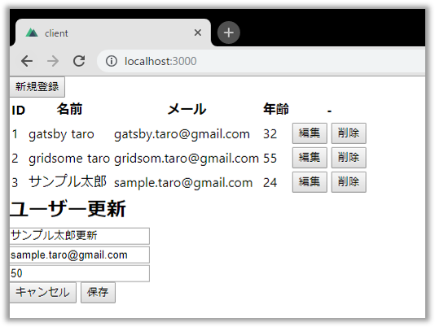
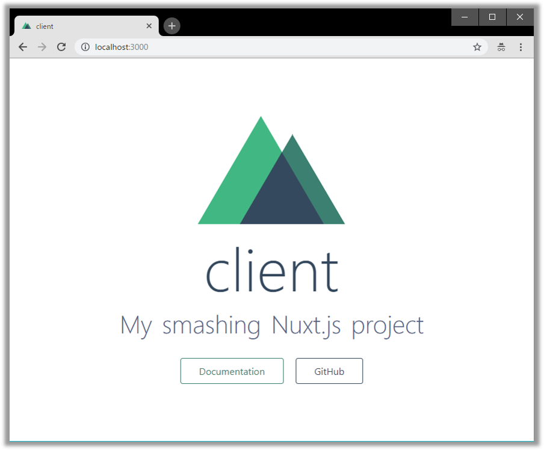
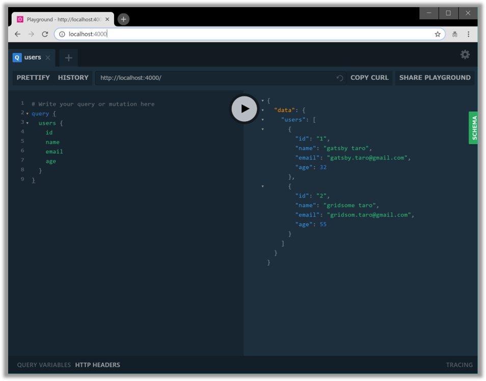
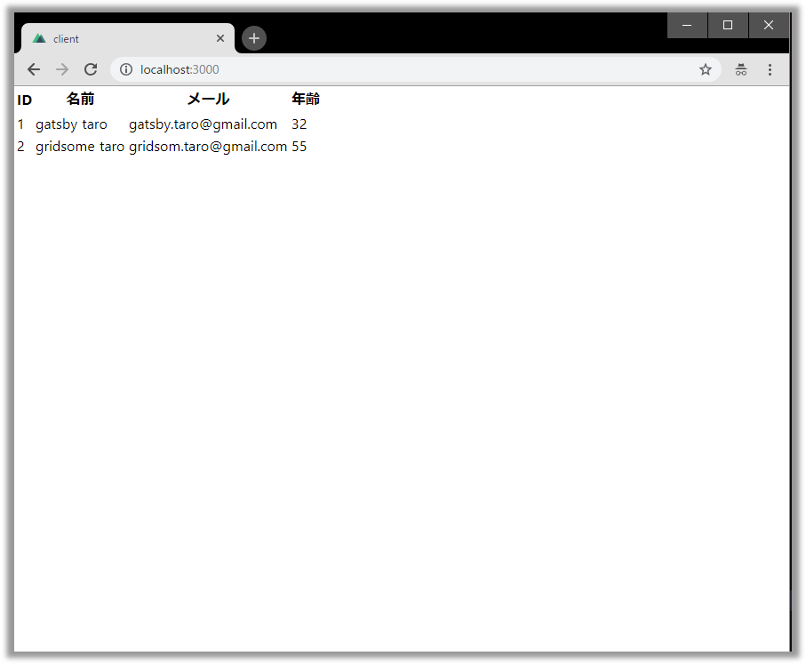
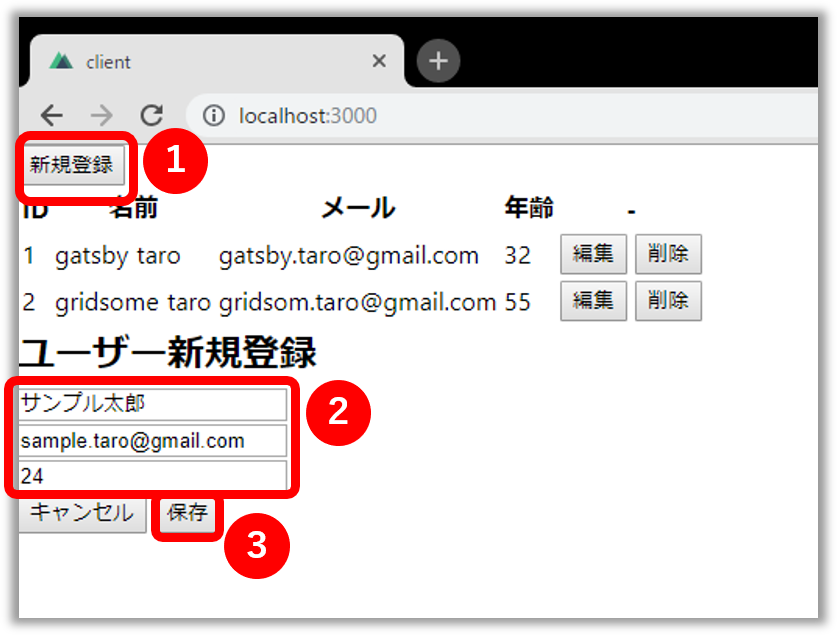
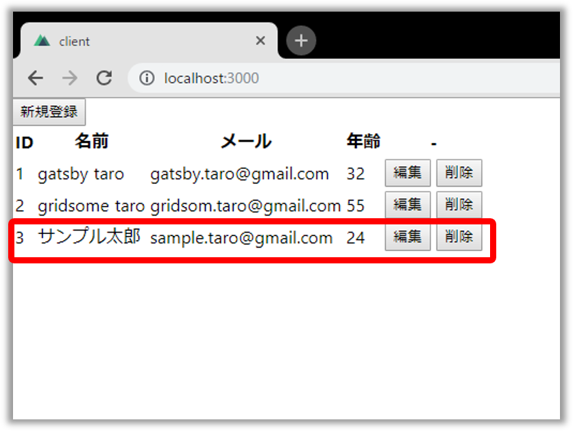
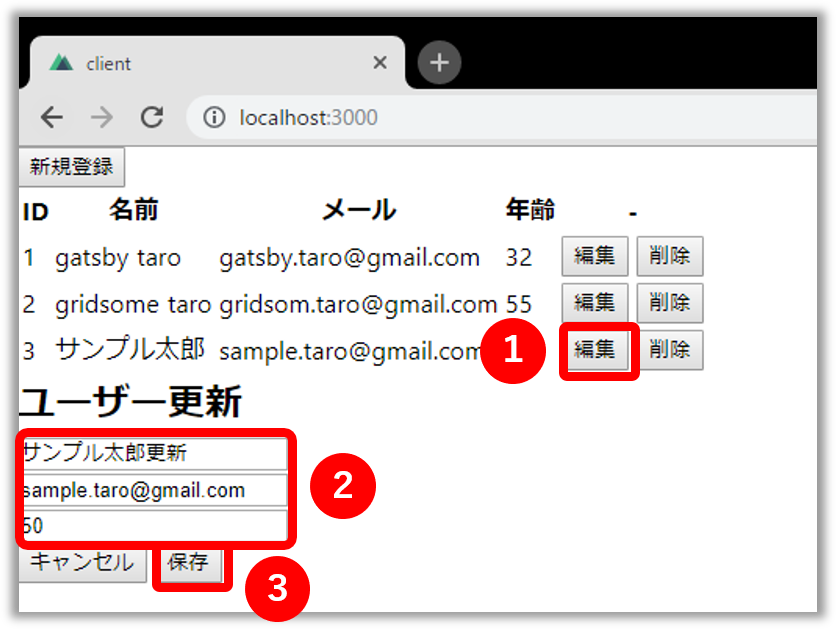
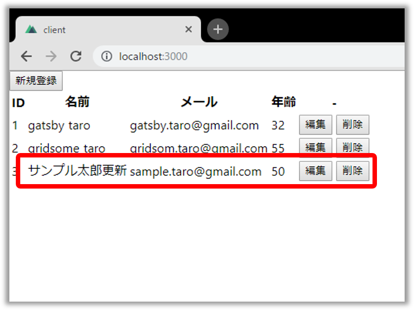
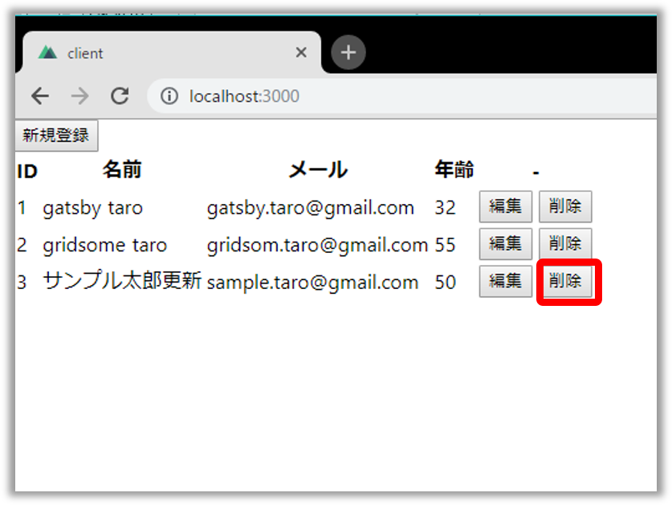
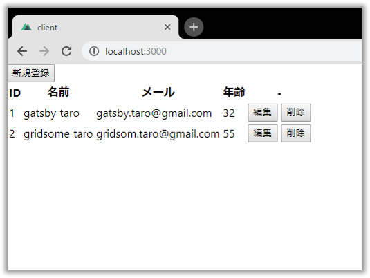

## なにこれ 

以前の記事[設定いらずのNode製GraphQLサーバー「Graphpack」の使い方](graphpack-graphql-zero-config-server)でGraphQLのサーバー側を実装を紹介しました。
Graphpackは備え付けの[GraphQL Playground IDE](https://github.com/prisma/graphql-playground)で動作確認できますが、せっかくなので今回はクライアント側も作成してみました。
本記事では**[Nuxt.js](https://ja.nuxtjs.org/)と[Apollo Client](https://www.apollographql.com/docs/react/api/apollo-client.html)を使って簡単なユーザー管理画面を作成する方法をチュートリアル形式でご紹介します。**<br/>
最終的にはQuery, Mutation, Subscription全てを実装しますが、
以下のようにステップを分けて、少しずつ実装していきましょう✨
* [🔰 プロジェクトのひな型を作成する](#プロジェクトのひな型を作成する)
* [💪 Queryを実装する](#queryを実装する) → ユーザー情報が一覧で表示できる
* [💖 Mutationを実装する](#mutationを実装する) → ユーザーの登録・更新・削除ができる
* [💎 Subscriptionを実装する](#subscriptionを実装する) → 他ブラウザとリアルタイムでユーザー情報が同期する


完成イメージ


完成品はGitHubに置いております。躓いたときは参考にしてください。

<div class="iframely-embed"><div class="iframely-responsive" style="height: 168px; padding-bottom: 0;"><a href="" data-iframely-url="//cdn.iframe.ly/HQ2E77R"></a></div></div>


## プロジェクトのひな型を作成する

* create-nuxt-appで雛形を作成します。

```
npx create-nuxt-app client
```

<br/>

* 何個か質問されるので以下のように答えます。`Author name`は読み替えてください。

```
? Project name client
? Project description My amazing Nuxt.js project
? Use a custom server framework none
? Choose features to install
? Use a custom UI framework none
? Use a custom test framework none
? Choose rendering mode Single Page App
? Author name Takumon
? Choose a package manager npm
```
<br/>


* アプリを起動しましょう。

```
cd client
npm run dev
```
<br/>


* `http://localhost:3000`にアクセスして以下の画面が表示されればOKです。




* 次にApollo Clientを導入します。[@nuxtjs/apollo](https://www.npmjs.com/package/@nuxtjs/apollo)をインストールしましょう。

```
npm i @nuxtjs/apollo
```
<br/>


* `nuxt.config.js`に以下設定を追加します。

```javascript:title=nuxt.config.js
module.exports = {

  /* (中略) */

  modules: [
    '@nuxtjs/apollo',
  ],
  apollo: {
    clientConfigs: {
      default: {
        // Graphpack側のエンドポイントを指定します。
        httpEndpoint: 'http://localhost:4000/graphql',
        // Subscription用にWebSocketの設定も追加します。
        wsEndpoint: 'ws://localhost:4000/graphql',
        websocketsOnly: true, 
      }
    }
  },

  /* (中略) */

}
```
<br/>

これで準備は整いました。
次からは本格的な実装に入っていきます。


## Queryを実装する

### 実装

* ユーザー情報取得用のクエリ`apollo/queries/getUsers.gql`を作成します。今回は`apollo/queries`配下にgqlファイルを作成することにします。

```graphql:title=apollo/queries/getUsers.gql
query GetUsers {
    users {
        id
        name
        email
        age
    }
}
```
<br/>


* 次に`pages/index.vue`を修正します。ここでは[SmartQuery](https://github.com/Akryum/vue-apollo/blob/master/docs/api/smart-query.md)を使い、コンポーネントにapolloオブジェクトを定義してApollo Clientを呼び出す方法を使います。 <small>※今回デザインは一切気にしないので`<style>～</style>`の部分を削除しています。</small>


```javascript:title=pages/index.vue
<template>
  <table>
    <tr>
      <th>ID</th>
      <th>名前</th>
      <th>メール</th>
      <th>年齢</th>
    </tr>
    <tr v-for="item in users" :key="item.id">
      <td>{{ item.id }}</td>
      <td>{{ item.name }}</td>
      <td>{{ item.email }}</td>
      <td>{{ item.age }}</td>
    </tr>
  </table>
</template>

<script>
import getUsersGql from '~/apollo/queries/getUsers.gql'

export default {
  data() {
    return {
      users: []
    }
  },

  apollo: {
    users: {
      query: getUsersGql
    }
  }
}
</script>
```
<br/>


### 動作確認

#### サーバー側起動

* GraphQLサーバを起動します。以下2通り、お好きなほうで起動してください。
    * サーバー側を作成する
        * [以前のGraphpackの記事](graphpack-graphql-zero-config-server)にしたがって作成
        * 作成したアプリに移動
        * `npm run dev`
    * [本記事のサンプルコード](https://github.com/Takumon/nuxt-graphpack-sample)を使う
        * `git clone https://github.com/Takumon/nuxt-graphpack-sample.git`
        * `cd nuxt-graphpack-sample/server`
        * `npm i`
        * `npm run dev`


* GraphQLサーバーの起動確認をします。`http://localhost:4000/`にアクセスして以下のクエリを発行しユーザー情報が返ってくればOKです。

```graphql:title=サーバー動作確認用クエリ
query {
  users {
    id
    name
    email
    age
  }
}
```
<br/>



#### クライアント側起動

* サーバーの準備が整ったら、クライアント側を`npm run dev`で起動します。
* ブラウザでhttp://localhost:3000 にアクセスして以下の画面が表示されればOKです。




## Mutationを実装する

### 実装

* ユーザー一覧ができたので、登録、更新、削除処理を追加します。

```gql:title=apollo/mutations/createUser.gql
mutation($name: String!, $email: String!, $age: Int) {
  createUser(name: $name, email: $email, age: $age) {
    id
    name
    email
    age
  }
}
```
<br/>

```gql:title=apollo/mutations/updateUser.gql
mutation($id: ID!, $name: String!, $email: String!, $age: Int) {
  updateUser(id: $id,name: $name,email: $email,age: $age) {
    id
    name
    email
    age
  }
}
```
<br/>

```gql:title=apollo/mutations/deleteUser.gql
mutation($id: ID!) {
  deleteUser(id: $id) {
    id
    name
    email
    age
  }
}
```
<br/>

* 次にユーザー一覧で、登録、更新、削除ができるようにします。index.vueを修正しましょう。


```javascript:title=pages/index.vueの一部
<template>
  <div>
    <!-- テーブル上部に登録ボタンを設置します。 -->
    <button @click="isShowEditArea = true">
      新規登録
    </button>

    <!-- テーブルに編集ボタンと削除ボタンの列を追加します。 -->
    <table>
      <tr>
        <th>ID</th>
        <th>名前</th>
        <th>メール</th>
        <th>年齢</th>
        <th>-</th>
      </tr>

      <tr v-for="item in users" :key="item.id">
        <td>{{ item.id }}</td>
        <td>{{ item.name }}</td>
        <td>{{ item.email }}</td>
        <td>{{ item.age }}</td>
        <td>
          <button @click="editItem(item)">
            編集
          </button>
          <button @click="deleteItem(item)">
            削除
          </button>
        </td>
      </tr>
    </table>

    <!-- 登録と更新の両方で使う編集エリアです。 -->
    <!-- 登録か更新かの判定はeditedIndexを見ます。 -->
    <div v-if="isShowEditArea">
      <h2>{{ formTitle }}</h2>
      <div>
        <input v-model="editedItem.name" type="text" placeholder="名前">
      </div>
      <div>
        <input v-model="editedItem.email" type="email" placeholder="メール">
      </div>
      <div>
        <input v-model="editedItem.age" type="number" placeholder="年齢">
      </div>
      <div>
        <button @click="close">
          キャンセル
        </button>
        <button @click="save">
          保存
        </button>
      </div>
    </div>
  </div>
</template>

<script>
import getUsersGql from '~/apollo/queries/getUsers.gql'
// 今回定義したgqlファイルをインポートします。
import createUserGql from '~/apollo/mutations/createUser.gql'
import updateUserGql from '~/apollo/mutations/updateUser.gql'
import deleteUserGql from '~/apollo/mutations/deleteUser.gql'

export default {
  data() {
    return {
      users: [],

      // 登録・更新用の編集エリア表示非表示のためのフラグです
      isShowEditArea: false,

      // 登録か更新かを判定するための値です。
      // -1の場合は登録
      // それ以外の場合は更新　と判定します。
      editedIndex: -1,

      // 編集エリア用のモデルです。
      editedItem: {
        id: null,
        name: null,
        email: null,
        age: null
      },

      // 編集エリア用のモデルを初期化用モデルです。
      // 初期化時に
      // this.editedItem = Object.asigne({}, this.defaultEditedItem)
      // のように使います。
      defaultEditedItem: {
        id: null,
        name: null,
        email: null,
        age: null
      }
    }
  },

  // 更新の場合、更新対象が何番目かをeditedIndexにセットしているので
  // editedIndexの値によって、更新か登録かを判断し
  // 編集エリアのタイトルを出しわけます。
  computed: {
    formTitle() {
      return this.editedIndex === -1
        ? 'ユーザー新規登録'
        : 'ユーザー更新'
    }
  },

  apollo: {
    users: {
      query: getUsersGql
    }
  },

  methods: {
    //登録処理です。
    async createItem({
      name,
      email,
      age
    }) {
      // mutationを発行する場合は、Smart Queryではなく
      // $apolloを使って処理します。
      const { error } = await this.$apollo.mutate({
        mutation: createUserGql,
        variables: {
          name,
          email,
          age
        },
        // refetchQueriesは処理完了後に発行するGraphQLの操作を指定できます。
        // ここでは登録後に、データを再取得してユーザー一覧をリフレッシュしています。
        refetchQueries: [{
          query: getUsersGql
        }]
      })

      if (error) {
        // エラー処理
      }

      // 編集エリアを非表示にします。
      this.close()
    },

    // 更新処理です。
    // 登録処理とほぼ同様の処理なので説明は割愛します。
    async updateItem({
      id,
      name,
      email,
      age
    }) {
      const { error } = await this.$apollo.mutate({
        mutation: updateUserGql,
        variables: {
          id,
          name,
          email,
          age
        },
        refetchQueries: [{
          query: getUsersGql
        }]
      })

      if (error) {
        // エラー処理
      }

      this.close()
    },

    // 削除処理です。
    // 登録処理とほぼ同様の処理なので説明は割愛します。
    async deleteItem(item) {
      if (!confirm(`ユーザー(${item.name})を削除しますか?`)) {
        return
      }

      const { error } = await this.$apollo.mutate({
        mutation: deleteUserGql,
        variables: {
          id: item.id
        },
        refetchQueries: [{
          query: getUsersGql
        }]
      })

      if (error) {
        // エラー処理
      }
    },

    // 一覧の編集ボタンクリック時の処理です
    // 編集エリアの変数に値を代入して、編集エリアを表示します。
    editItem(item) {
      this.editedIndex = this.users.indexOf(item)
      this.editedItem = Object.assign({}, item)
      this.isShowEditArea = true
    },

    // 編集エリアを非表示にする処理です。
    // 編集エリアのモデルの初期化もあわせて実施します。
    close() {
      this.isShowEditArea = false
      setTimeout(() => {
        this.editedItem = Object.assign({}, this.defaultEditedItem)
        this.editedIndex = -1
      }, 300)
    },

    // 編集エリアで保存ボタンをクリックした場合の処理です。
    // editedIndexをみて登録か更新かを判断します。
    save() {
      if (this.editedIndex > -1) {
        this.updateItem(this.editedItem)
      } else {
        this.createItem(this.editedItem)
      }
    }
  }
}
</script>
```
<br/>


### 動作確認

ブラウザを開いてみてください。
それぞれの以下のようにして操作ができます。

#### 登録

1. 右上の新規登録ボタンをクリック
2. 名前、メール、年齢を入力
3. 保存ボタンをクリック


<br/>

ユーザー一覧に登録したユーザが追加されます。


#### 更新

1. 更新したい行の編集ボタンをクリック
2. 名前、メール、年齢を入力
3. 保存ボタンをクリック


<br/>

ユーザー一覧のユーザー情報が更新されています。


#### 削除

削除したい行の削除ボタンをクリック


<br/>

ユーザー一覧から削除したユーザーがなくなっています。



これでユーザ一覧でCRUD操作ができるようになりました。


## Subscriptionを実装する

Subscriptionを使って、ユーザー情報を他の人が編集したときにリアルタイムで同期するようにしてみましょう。

### 実装

```gql:title=apollo/subscriptions/userCreated.gql
subscription {
  userCreated {
    id
    name
    email
    age
  }
}
```
<br/>

```gql:title=apollo/subscriptions/userUpdated.gql
subscription {
  userUpdated {
    id
    name
    email
    age
  }
}
```
<br/>


```gql:title=apollo/subscriptions/userDeleted.gql
subscription {
  userDeleted {
    id
    name
    email
    age
  }
}
```
<br/>

* index.vueでSubscriptionを実装します。templateには一切手をいれません。scriptタグのみ修正します。

```javascript:title=pages/index.vueの一部
/* (中略) */
// 今回定義したgqlファイルをインポートします。
import userCreatedGql from '~/apollo/subscriptions/userCreated.gql'
import userUpdatedGql from '~/apollo/subscriptions/userUpdated.gql'
import userDeletedGql from '~/apollo/subscriptions/userDeleted.gql'

export default {

  /* (中略) */

  apollo: {
    users: {
      query: getUsersGql,

      // SubscriptionはSmart QueryのsubscribeToMoreで指定します。
      subscribeToMore: [
        // 登録時の処理です
        {
          document: userCreatedGql,
          // Subscription発生時の処理をupdateQueryに定義します。
          // 第一引数は前回のusers
          // 第二引数はサーバーからのレスポンス情報　です。
          updateQuery: (prev, { subscriptionData }) => {
            if (!subscriptionData.data) {
              return prev
            }

            const newUser = subscriptionData.data.userCreated
            // ここで返した値がusersに代入されます。
            return prev.users.push(newUser)
          }
        },

        // 更新時の処理です。
        // 登録時とほぼ同様の処理なので説明は割愛します。
        {
          document: userUpdatedGql,
          updateQuery: (prev, { subscriptionData }) => {
            if (!subscriptionData.data) {
              return prev
            }

            const updatedUser = subscriptionData.data.userUpdated
            const targetUser = prev.users.find(user => user.id + '' === updatedUser.id + '')
            targetUser.name = updatedUser.name
            targetUser.email = updatedUser.email
            targetUser.age = updatedUser.age
            return prev.users
          }
        },

        // 削除時の処理です。
        // 登録時とほぼ同様の処理なので説明は割愛します。
        {
          document: userDeletedGql,
          updateQuery: (prev, { subscriptionData }) => {
            if (!subscriptionData.data) {
              return prev
            }

            const deletedUser = subscriptionData.data.userDeleted
            const userIndex = prev.users.findIndex(user => user.id + '' === deletedUser.id + '')

            if (userIndex === -1) throw new Error('User not found')

            prev.users.splice(userIndex, 1)
            return prev.users
          }
        }
      ]
    }
  },
  methods: {
    async createItem({
      name,
      email,
      age
    }) {
      const { error } = await this.$apollo.mutate({
        mutation: createUserGql,
        variables: {
          name,
          email,
          age
        }
        // mutation実装時はrefetchQueriesを定義していましたが
        // Subscriptionがそれにとってかわるので
        // 今回はrefetchQueriesは定義しません。
      })

      if (error) {
        // エラー処理
      }

      this.close()
    },
    async updateItem({
      id,
      name,
      email,
      age
    }) {
      const { error } = await this.$apollo.mutate({
        mutation: updateUserGql,
        variables: {
          id,
          name,
          email,
          age
        }
        // mutation実装時はrefetchQueriesを定義していましたが
        // Subscriptionがそれにとってかわるので
        // 今回はrefetchQueriesは定義しません。
      })

      if (error) {
        // エラー処理
      }

      this.close()
    },
    async deleteItem(item) {
      if (!confirm(`ユーザー(${item.name})を削除しますか?`)) {
        return
      }

      const { error } = await this.$apollo.mutate({
        mutation: deleteUserGql,
        variables: {
          id: item.id
        }
        // mutation実装時はrefetchQueriesを定義していましたが
        // Subscriptionがそれにとってかわるので
        // 今回はrefetchQueriesは定義しません。
      })

      if (error) {
        // エラー処理
      }
    },

    /* (中略) */

  }
}
```
<br/>


### 動作確認

2つブラウザを開いてみて、片方で操作してみてください。
リアルタイムでもう一方のブラウザにユーザー情報の変更が反映されていればOKです。


## まとめ

簡単ではありますが、Nuxt.js+Apollo Clientで簡単なアプリの作り方をご紹介しました。
せっかくのクライアントアプリなので、UIフレームワークを使ってリッチにしてみるのも良いかもしれません。
一応Vue.jsのマテリアルデザインのUIフレームワーク[「Vuetify」](https://vuetifyjs.com/ja/)を使った版も以下においておりますので、参考にしてみてください🍅

<div class="iframely-embed"><div class="iframely-responsive" style="height: 168px; padding-bottom: 0;"><a href="https://github.com/Takumon/nuxt-graphpack-sample/tree/master/client_vuetify" data-iframely-url="//cdn.iframe.ly/9B6aV8g"></a></div></div>


## 参考

* [How to build a real-time editable data table in Vue.js](https://medium.freecodecamp.org/how-to-build-a-real-time-editable-data-table-in-vue-js-46b7f0b11684)
* [GraphQL と Nuxt.js でチャットを作る](https://www.aintek.xyz/posts/graphql-nuxt-chat)
* [the-road-to-graphql/fullstack-apollo-subscription-example: A minimal Apollo Server 2 with Apollo Client 2 with Subscriptions application.](https://github.com/the-road-to-graphql/fullstack-apollo-subscription-example)
* [bmsantos/apollo-graphql-subscriptions-example: Apollo GraphQL Subscriptions issue](https://github.com/bmsantos/apollo-graphql-subscriptions-example)
* [Levvel Blog - A Guide to Subscriptions in GraphQL with Apollo](https://www.levvel.io/our-ideas/A-Guide-to-Subscriptions-in-GraphQL-with-Apollo)


