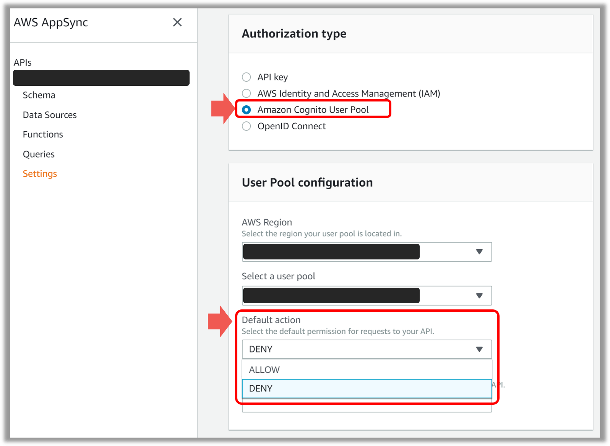
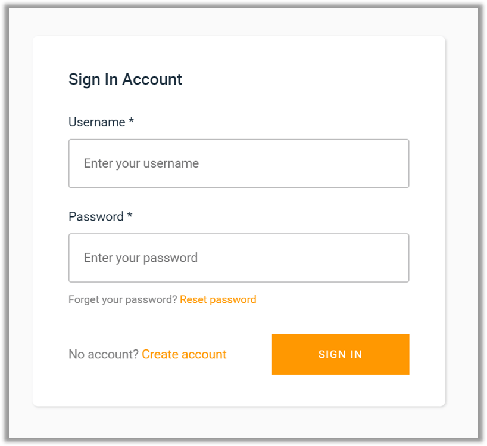

## なにこれ
AppSyncはCognitoと連携して認可制御ができます。
今回はそのやり方についてご紹介します。
ざっくりいうと以下のようなことが実現可能です。
* [✨スキーマ定義におけるQueryやMutationごとの認可制御（ユーザーグループ）](#スキーマ定義におけるqueryやmutationごとの認可制御（ユーザーグループ）)
* [💎リゾルバーにおける項目ごとの認可制御（ユーザーグループ）](#リゾルバーにおける項目ごとの認可制御（ユーザーグループ）)
* [🎊リゾルバーにおける細かな認可制御（ユーザーグループ、ユーザー名）](#リゾルバーにおける細かな認可制御（ユーザーグループ、ユーザー名）)


## スキーマ定義におけるQueryやMutationごとの認可制御（ユーザーグループ）

`@aws_auth`アノテーションをQueryやMutationに付与します。
以下の例ではCognitoのユーザーグループごとに
* `管理者`は登録、参照、更新、削除
* `営業`は登録、参照、更新
* `一般メンバー`は参照

のように認可制御しています。

```graphql{3-6,8-11,13-15,20-24}:title=スキーマ定義における@aws_authを使った認可制御の例
type Mutation {
  createTask(input: CreateTaskInput): CraeteTaskPayload
    @aws_auth(cognito_groups: [
      "admin",
      "sales",
    ])
	updateTask(input: UpdateTaskInput): UpdateTaskPayload
    @aws_auth(cognito_groups: [
      "admin",
      "sales",
    ])
  deleteTask(input: DeleteTaskInput): DeleteTaskPayload
    @aws_auth(cognito_groups: [
      "admin",
    ])
}

type Query {
  getTask(id: ID!): Task
    @aws_auth(cognito_groups: [
      "admin",
      "sales",
      "member"
    ])
}
```
<br/>

### デフォルトの認可制御
AppSyncではエンドポイントごとに`@aws_auth`未定義の場合の挙動を以下2つから選択できます。
* **ALLOW**
  * 認証済ユーザーであれば、すべてのユーザーを許可する
* **DENY**
  * 認証済ユーザーであっても、すべてのユーザーを許可しない　※`@aws_auth`を定義しないとアクセスできない


<br/>


## リゾルバーにおける項目ごとの認可制御（ユーザーグループ）

リゾルバー中でユーザーグループを参照できるので、それを使って項目ごとの認可制御ができます。
以下の例では、`管理者`、`営業`、`一般ユーザー`のCognitoユーザーグループがある場合に、
タスク情報の登録日と更新日については、`管理者`と`営業`のみが参照可能できるように制御しています。

```jsx{2,14-17}:title=ユーザーグループごとにレスポンス項目を制御する例
## 一般メンバーか判定
#foreach($group in $context.identity.claims.get("cognito:groups"))
    #if($group == "member")
        #set($isMember = true)
    #end
#end

#set($result={})
$util.qr($result.put("id", $ctx.result.id))
$util.qr($result.put("discription", $ctx.result.discription))
$util.qr($result.put("owner", $ctx.result.owner))

## 一般メンバーには返さない(管理者と営業のみ参照できる)
#if(!$isMember)
  $util.qr($result.put("created", $ctx.result.created))
  $util.qr($result.put("updated", $ctx.result.updated))
#end

$util.toJson($result)
```


## リゾルバーにおける細かな認可制御（ユーザーグループ、ユーザー名）
ユーザーグループだけではなくユーザー名でも認可制御が可能です。
例えば「`一般ユーザー`は自分が登録した情報のみ参照でき、`管理者`はすべて参照できる」のような要件を実現する場合です。
ここではAppSync + Cognito + Dynamoの例を考えます。
まずタスクテーブルに「owner」カラムを設けて、タスクを登録者のCognitoユーザー名を登録しておきます。

**タスクテーブル**

| id | description | owner |
|--|--|--|
|123|今週のブログ書く|takumon|
|124|CodeBuildとGitHubのプルリク連携を調べる|takumon|
|125|今週のGoogle Cloud Platform Podcast聞く|inoue|

<br/>

そして更新用レスポンスマッピングテンプレートで以下のようにします。


```jsx{2,15}:title=ユーザーグループとユーザー名で認可制御する例
## 管理者か判定
#foreach($group in $context.identity.claims.get("cognito:groups"))
  #if($group == "admin")
    #set($isAdmin = true)
  #end
#end

#set($result = [])
## 管理者はすべてのタスクを参照できる
#if($isAdmin)
  #set($result = $context.result.items)
#else
  ## 一般ユーザーは自分が登録したタスクのみ参照できる
  #foreach($item in $context.result.items)
    #if($item.owner == $context.identity.username)
      #set($myResults.add($item))
    #end
  #end
#end
$utils.toJson($results)
```
<br/>


これで`takumon`の場合は2件、`inoue`の場合は1件、`管理者`の場合は3件参照できるようになります。
なお`$util.unauthorized()`を使えば認可エラーを返せます。
リゾルバーの書き方しだいで複雑な要件も実現できるでしょう。


## クライアント側

なおCognitoと連携する場合、クライアント側も対応が必要です。

### Vue + Apmlifyの場合
Vue + Apmlifyの場合は以下のようにします。[参考ソースコード](https://github.com/Takumon/vue-amplify-sample/blob/master/src/main.js)

 
```javascript:title=Vue + Apmlifyの場合のCognito連携設定
import Amplify, { Auth } from 'aws-amplify';
import { AmplifyPlugin } from 'aws-amplify-vue';

// 環境変数から読み込み
const config = {
  aws_project_region: process.env.VUE_APP_AWS_PROJECT_REGION,
  aws_appsync_graphqlEndpoint: process.env.VUE_APP_AWS_APPSYNC_GRAPHQLENDPOINT,
  aws_appsync_region: process.env.VUE_APP_AWS_APPSYNC_REGION,
  aws_appsync_authenticationType: process.env.VUE_APP_AWS_APPSYNC_AUTHENTICATIONT_TYPE,
  Auth: {
    identityPoolId: process.env.VUE_APP_AWS_COGNIT_IDENTITY_POOL_ID,
    region: process.env.VUE_APP_AWS_COGNIT_REGION,
    identityPoolRegion: process.env.VUE_APP_AWS_COGNIT_IDENTITY_POOL_REGION,
    userPoolId: process.env.VUE_APP_AWS_COGNIT_USER_POOL_ID,
    userPoolWebClientId: process.env.VUE_APP_AWS_COGNIT_USER_POOL_WEB_CLIENT_ID,
  },
};

Amplify.configure(config);
Vue.use(AmplifyPlugin, Amplify);
```
<br/>

次にログイン画面を作ります。
Amplifyが用意している`<amplify-authenticator>`タグで簡単に実現できます。[参考ソースコード](https://github.com/Takumon/vue-amplify-sample/blob/master/src/views/Home.vue#L3-L5)


<br/>


### AWSコンソールの場合
手っ取り早く試すなら、AppSyncのQuery実行画面に認証機能があるので、そちらで試しましょう。

* Query実行画面の実行ボタン左側の`Login with User Pools`というボタンをクリックします。


<br/>

* ログインモーダルが出てきます。接続先のCognitのクライアントID、ユーザー名、パスワードを入力すればOKです。


<br/>

* あとは通常のAppSyncのQuery実行画面と同じようにQueryやMutaitonを発行すれば認可制御されたレスポンスが確認できます。


## まとめ
今回はAppSync + Cognitoによる認可制御について紹介しました。<br/>
QueryとMutation単位の認可制御であれば`@aws_auth`を使い、
項目単位の認可制御はリゾルバーに任せるのがポイントです。

余談ですが、`@aws_auth`は今のところユーザーグループ単位の認可制御しかできません。
ただ構文的にはユーザーグループ以外でも認可制御ができそうなので将来的に機能が追加されるのかもしれませんね🍅

## 参考
* [AWS公式ドキュメント > AppSync > セキュリティ](https://docs.aws.amazon.com/ja_jp/appsync/latest/devguide/security.html#amazon-cognito-user-pools-authorization)
* [AWS公式ドキュメント > AppSync > セキュリティ > 認証のユースケース](https://docs.aws.amazon.com/ja_jp/appsync/latest/devguide/security-authorization-use-cases.html)