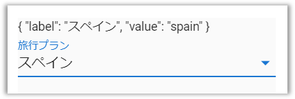

## なにこれ

最近Vue.jsのマテリアルデザインのUIフレームワーク[「Vuetify」](https://vuetifyjs.com/)を使っています。
とても便利で、管理アプリのようにデザインにこだわる必要がなければ、CSSをほとんど書かずに済むくらいコンポーネントが充実しています。
ただSelectタグでlabelとvalueを出しわける際に初期値を設定する場合は少しだけ注意点があるので、この記事ではそちらを紹介します。

## return-objectを使いましょう

Selectタグでlabelとvalueを出しわけるときに初期値を設定する場合、v-modelで設定します。
以下のような実装です。


```html:title=うまくいかない例
<template>
  <div>
    {{ selectedPlan }}
    <v-select
      v-model="selectedPlan"
      item-text="label"
      item-value="value"
      :items="plans"
      label="旅行プラン"
    />
  <div>
</template>
<script>
export default {
  data() {
    return {
      // 最初はドイツを選択済にする
      selectedPlan: { label: 'ドイツ'   , value: 'germany'  },
      plans: [
        { label: 'ドイツ'   , value: 'germany'  },
        { label: 'スペイン' , value: 'spain'    },
        { label: 'フランス' , value: 'france'   },
      ],
    };
  },
}
</script>
```
<br/>

ただしこれだと、初期表示は以下のようになりますが、


セレクトボックスで他を選択すると、以下のようにオブジェクトではなくvalueが`selectedPlan`に代入されてしまいます。


これを防ぐためには**return-object**を使いましょう。
以下のように`v-select`タグに`return-object`属性を追加してあげます。

```html{10}:title=うまくいく例
<template>
  <div>
    {{ selectedPlan }}
    <v-select
      v-model="selectedPlan"
      item-text="label"
      item-value="value"
      :items="plans"
      label="旅行プラン"
      return-object
    />
  <div>
</template>
<script>
export default {
  data() {
    return {
      // 最初はドイツを選択済にする
      selectedPlan: { label: 'ドイツ'   , value: 'germany'  },
      plans: [
        { label: 'ドイツ'   , value: 'germany'  },
        { label: 'スペイン' , value: 'spain'    },
        { label: 'フランス' , value: 'france'   },
      ],
    };
  },
}
</script>
```
<br/>

こうすることで、セレクトタグで初期値から値を変えても`selectedPlan`にはオブジェクトが代入されるようになります。



以上です🍅
