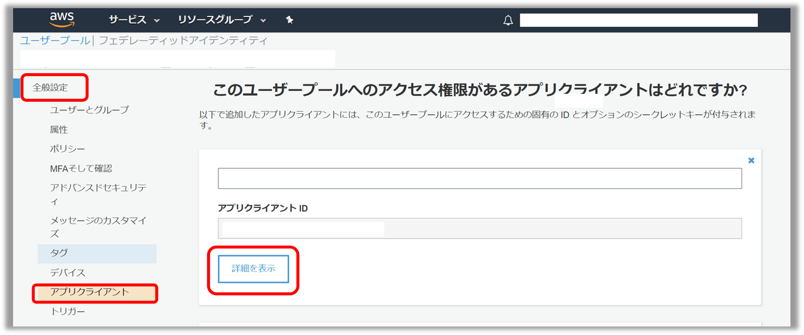
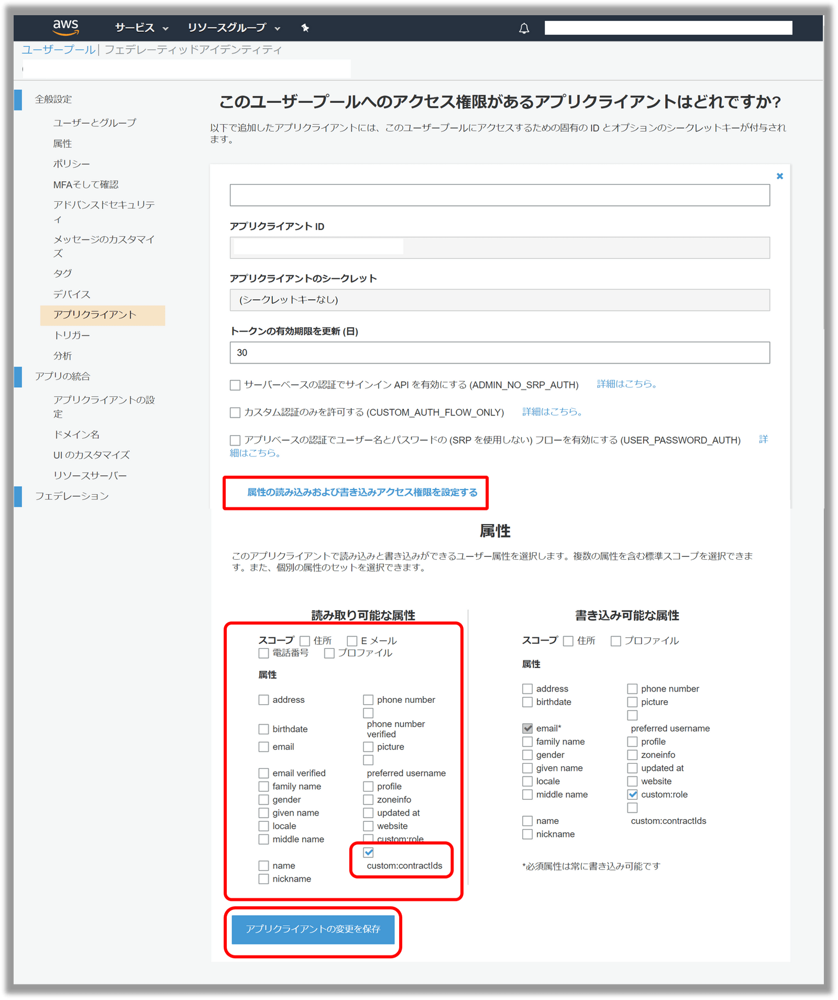

## なにこれ
AppSync + Cognitoにおける認可制御について[以前の記事](https://takumon.com/aws-appsync-auth-with-cognito)で説明しました。
今回は、ユーザーのカスタム属性を使った認可制御（AppSyncのリゾルバーでカスタム属性を取得する方法）についてご紹介します。

## TL;DR
AppSyncとCognitoを連携済みであれば、3ステップで実現できます。

1. [サーバー側：Cognitoの設定でカスタム属性をReadableに設定](#1-cognitoの設定でカスタム属性をreadableに設定)
2. [サーバー側：AppSyncのリゾルバーにて`$ctx.identity.claims.get("custom:sampleCustomAttr")`を記述](#2-appsyncのリゾルバーにてctxidentityclaimsgetcustomsamplecustomattrを記述)
3. [クライアント側：Amplifyのライブラリの中身の`getAccessToken`の部分を`getIdToken`に置換](#3-amplifyのライブラリの中身のgetaccesstokenの部分をgetidtokenに置換)

以下で詳しく説明します。

## 1. Cognitoの設定でカスタム属性をReadableに設定

この方法は認証時にIDトークンを使うことが前提です。<br/>
IDトークンを使えば、ユーザー情報がAppSyncのリゾルバー取得できます。<br/>
ただしカスタム属性はデフォルトだと取得できないので、AWSコンソールにて以下のように設定しましょう。

* `AWSコンソール` > `Cognitoのユーザープール` > `全般設定` > `アプリクライアント` > `詳細を表示` を選択


<br/>


* `属性の読み込みおよび書き込みアクセス権限を設定する` > `読み取り可能な属性`　にて取得したいカスタム属性にチェックを入れて`アプリクライアントの変更を保存`


<br/>


## 2. AppSyncのリゾルバーにて$ctx.identity.claims.get("custom:sampleCustomAttr")を記述

以下のようにして取得します。

```verocity:AppSyncのリゾルバー
  #set($sampleCustomAttr = $ctx.identity.claims.get("custom:sampleCustomAttr"))
```
<br/>

## 3. Amplifyのライブラリの中身のgetAccessTokenの部分をgetIdTokenに置換

手順2までを実施した場合、、AppSyncのQueryコンソール上では正常動作しますが、
クライアント側からAmplify経由でクエリをたたいた場合は正常動作しません。

なぜならAppSyncのQueryコンソールは認証時にIDトークンを使いますが、
Amplify経由の場合はアクセストークンを使うからです。

そのため、Amplify側の認証をIDトークンに切り替える必要があります。
少し無理やりですが以下のようにAmplifyのライブラリを直接書き換えます。<br/>
プロジェクトのnode_modules配下にて、以下のように修正します。

```diff:title=node_modules/@aws-amplify/api/dist/aws-amplify-api.js
- Authorization: session.getAccessToken().getJwtToken() 
+ Authorization: session.getIdToken().getJwtToken() 
```
<br/>
これでクエリが正常動作するようになります。<br/>
ただ直接依存ライブラリを書き換えるので、本番環境デプロイ時は、CIに忘れずに書き換え処理を追加しましょう。<br/>

※この方法は、Amplipy側のGraphQLスキーマ定義で`@auth`を使っている場合に一部機能が正常動作しなくなるので注意してください。

## まとめ

今回はAppSync + Cognitoにおいて、AppSyncのリゾルバーでユーザーのカスタム情報を取得する方法をご紹介しました。
Amplify側は直接ライブラリを書き換えるので、多少無理やりな対応ですが、一応これでできます。
ユーザーごとの認可情報をカスタム属性に持たせる場合は、この方法を試してみてください🍅


## 参考
* [リゾルバーのマッピングテンプレートのコンテキストリファレンス - AWS AppSync](https://docs.aws.amazon.com/ja_jp/appsync/latest/devguide/resolver-context-reference.html#aws-appsync-resolver-context-reference-identity)
* [Include custom attributes in cognito claims](https://maketips.net/tip/175/include-custom-attributes-in-cognito-claims)
* [Aws Amplify appsync API graphql cognito custom attribute · Issue #1772 · aws-amplify/amplify-js](https://github.com/aws-amplify/amplify-js/issues/1772)
* [Clarify security implications of using ID Token vs. Access Token for AppSync authorization · Issue #456 · aws-amplify/amplify-cli](https://github.com/aws-amplify/amplify-cli/issues/456)
