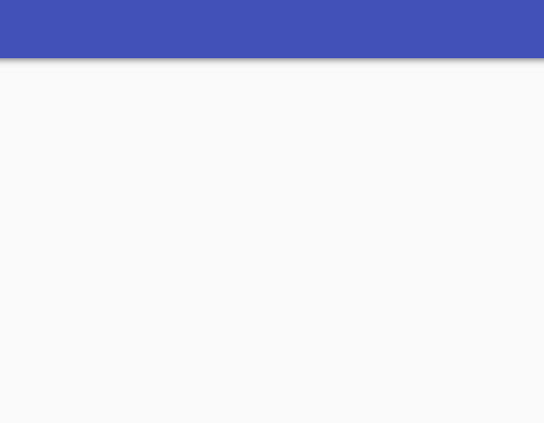

## なにこれ
VuetifyのSnackbarはメッセージを1つしか表示できません。こちらGitHubでもissueになっています。

<div class="iframely-embed"><div class="iframely-responsive" style="height: 140px; padding-bottom: 0;"><a href="https://github.com/vuetifyjs/vuetify/issues/2384" data-iframely-url="//cdn.iframe.ly/vKsahN0"></a></div></div>
<br/>

ただUIとしてはメッセージを複数表示できたほうが便利なので、今回はVuetifyのSnackbarをベースにメッセージを複数表示できるようにカスタムしてみました。
※Snackbarはアプリ共通で呼び出すことが多いので、今回のサンプル実装でもSnackbarのメッセージはVuexで管理しています。

## 見た目

1つでもメッセージがあるとSnackbarが表示され、
複数同時に追加可能で、あとから追加することもできます。
メッセージの表示時間は個別で管理できるようにしています。
たとえばINFOメッセージはしばらくたったら自動で削除されますが、
エラーメッセージは×ボタンを押さないかぎり削除されないなどの制御が可能です。




## 仕様

ざっくり登場人物とその責務を...

### ストア
* Snackbarに表示するメッセージ配列を管理します。
* メッセージ配列の要素は、メッセージテキスト以外にも以下のような情報を保持します。
  * メッセージテキスト
  * メッセージカラー
      * error, info, warn, successなど ※VuetifyのSnackbarの仕様に沿ったものです。
  * メッセージ表示時間
      * 必須ではないです。
      * 指定しない場合、×ボタンを押さない限りずーっと表示し続けます。

### 複数メッセージ表示用コンポーネント

* VuetifyのSnackbarをラップしたコンポーネントです。
* VuetifyのSnackbarのメッセージ領域に、無理やり複数メッセージをねじ込むようなDOM構造＆スタイルを実装しています。
* 個々のメッセージの識別と削除、Snackbar自体の表示制御を担います。
* 個々のメッセージ表示は子コンポーネントに任せます。

### メッセージ表示用コンポーネント

* 削除タイミングの管理（表示時間の管理、削除ボタン）を担います。
* メッセージの削除自体は親コンポーネントに委譲しています。


## 実装

最初にストアの実装です。<br/>


```js:title=ストア
import Vue from 'vue';
import Vuex from 'vuex';
// 個々のメッセージ識別するためのid採番用に使う
import uuidv4 from 'uuid/v4';

Vue.use(Vuex);


export default new Vuex.Store({

  state: {
    messages: [],
  },

  getters: {
    // メッセージが1つもない場合はSnackbarを表示しない
    isShow: state => state.messages.legth === 0,
    getMessages: state => state.messages,
  },

  actions: {
    /**
     * Snackbarにメッセージ(複数指定可)を表示する
     */
    ADD_MESSAGES({ commit }, payload) {
      commit('addMessages', payload);
    },

    /**
     * 指定したメッセージをSnackbarから削除する
     */
    REMOVE_MESSAGE({ state, commit }, payload) {
      commit('removeMessage', payload);
    },
  },

  mutations: {

    addMessages(state, payload) {
      // メッセージをストアに加える際に、個々のメッセージが識別できるようにidを加える
      state.messages = [...state.messages, ...payload.messages.map(m => Object.assign(m, { id: uuidv4() }))];
    },

    removeMessage(state, payload) {
      const { id } = payload;
      state.messages.forEach((v, index) => {
        if (v.id === id) {
          state.messages.splice(index, 1);
        }
      });
    },
  },
});
```
<br/>
<br/>


次に、複数メッセージの受け皿となるコンポーネントです。
個々のメッセージコンポーネントの生成、削除、Snackbarの表示制御を担います。


```html:title=複数メッセージ表示用コンポーネント
<template>
  <!--
    タイムアウトの管理は、大枠ではせずメッセージ毎に行う
    全てのメッセージが消えたら大枠を消す
    大枠を消す処理はStoreに実装する
  -->
  <v-snackbar
    v-model="isShow"
    color="white"
    :timeout="0"
    top
    auto-height
  >
    <!-- メッセージを縦並びにするためdivタグでラップする -->
    <div style="margin: -14px auto; width: 100%;">
      <div style="margin: 0 -24px">
        <template v-for="(message, index) in getMessages">
          <snackbarMessage
            :key="message.id"
            @remove="removeMessage({ id: message.id })"
            :message="message"
          />
          <div
            style="margin:1px 0;"
            v-if="index != lastIndex"
            :key="`${message.id}-divider`"
          />
        </template>
      </div>
    </div>
  </v-snackbar>
</template>

<script>
import { mapGetters, mapActions } from 'vuex';
// メッセージ表示用コンポーネント
import snackbarMessage from './snackbar-message.vue';

export default {

  components: {
    snackbarMessage,
  },

  computed: {
    ...mapGetters([
      'isShow'
      'getMessages'
    ]),

    lastIndex() {
      return this.messages.length - 1;
    },
  },

  methods: {
    ...mapActions({
      removeMessage: actionType.snackbar.REMOVE_MESSAGE,
    }),
  },
};
</script>
```
<br/>
<br/>


最後に個々のメッセージ用コンポーネントです。
削除タイミングの管理（表示時間の管理、削除ボタン）を担い、メッセージの削除自体は親に委譲しています。

```html:title=メッセージ表示用コンポーネント
<template>
  <v-card
    style="display: flex;padding: 6px 12px;"
    :color="message.state.color"
  >
    <div style="display: flex;align-items: center;">{{ message.text }}</div>
    <v-spacer></v-spacer>
    <v-btn
      icon
      depressed
      @click="remove()"
    >
      <v-icon color="rgba(51, 51, 51, 0.3)">cancel</v-icon>
    </v-btn>
  </v-card>
</template>

<script>
export default {
  props: {
    message: Object,
  },

  data() {
    return {
      activeTimeout: -1,
    };
  },

  mounted() {
    // メッセージコンポーネントがマウントされた時点からカウント開始
    this.setTimeout();
  },

  methods: {

    setTimeout() {
      window.clearTimeout(this.activeTimeout);
      const { timeout } = this.message.state;
      // タイムアウト時間が設定されている場合は
      if (timeout) {
        // 指定時間後にremoveを呼び出す
        this.activeTimeout = window.setTimeout(() => {
          this.remove();
        }, timeout);
      }
    },

    // 親コンポーネントにremoveを発火
    remove() {
      this.$emit('remove');
    },
  },
};
</script>
```
<br/>


## まとめ

今回はVuetifyのSnackbarで複数メッセージが表示できるようにする方法をご紹介しました。
現在だと、[複数表示できるようにするための拡張ライブラリ](https://www.npmjs.com/package/@tozd/vue-snackbar-queue)も出ているようです。
ライブラリを使ってもいいかもしれませんが、UIの細かな部分はシステムに依存すると思うので、カスタムで作る際は是非参考にしてみてください🍅

