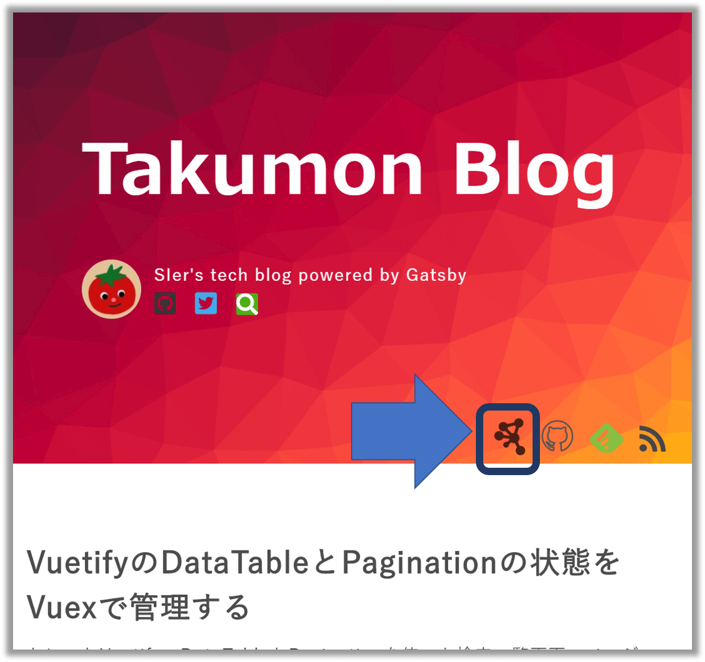
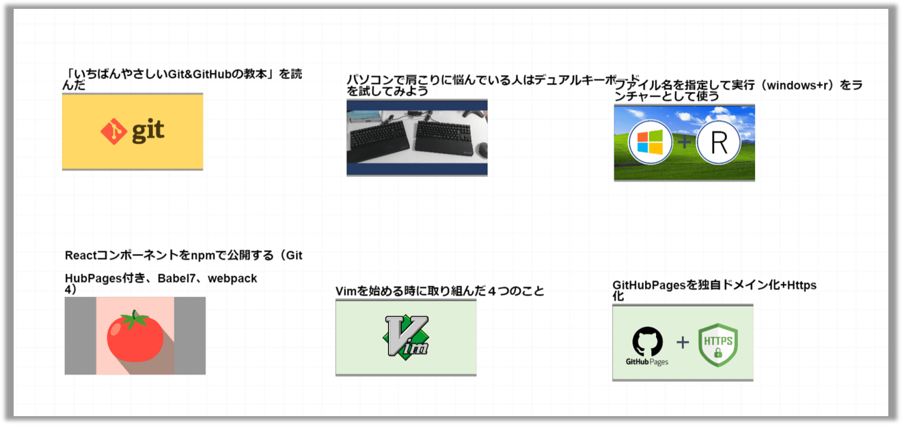

## なにこれ

[以前の記事](https://takumon.com/gatsby-related-posts-like-hugo)で紹介した**タグとキーワードから関連記事を算出するロジック**と、[**Cytoscape.js**](http://js.cytoscape.org/)を用いて記事の関連情報を視覚的に確認できるマップを作りました。
今回はそのマップの紹介とCytoscape.jsを使ってみた感想です。

## 記事関連マップ

### 使い方
URL: https://takumon.com/map <br/>
遷移方法: 一覧ページのCytoscapleアイコンから遷移できます。 <br/>

<br/>


記事のサムネイル画像が、タグ・キーワードの関連線でつながっています。
記事はドラッグ＆ドロップでグリグリ動かせます。


関連線はタグよりもキーワードのほうが太くなっています。


記事にマウスカーソルを合わせると拡大され、関連線が青にハイライトされたり...

<br/>

記事関連マップをフルスクリーン表示できたり...

<br/>


記事クリックで記事ページに遷移できたりします。


### 過去記事を視覚的に俯瞰できるのでとても良い

以前から関連記事機能は実装していましたが、記事関連マップにすると俯瞰できるので、改めて気付いたことがありました。
記事関連マップを見る限り自分のブログのメインコンテンツとしては以下ですね。フロントエンド多めです。
* Gatsby(ちょっとReact)
* Vue.js + AppSync
* Angular

また、まったく関連が存在しない記事も幾つかあることがわかります（Git,Vimあたり）。


<br/>

知識は点よりも線にしたほうが強みになるので、今後記事を書く際は、そこらへんの記事の関連線を増やしていく方向で学習を進めようと思います。


### 今後の予定
現在、関連度算出はタグとキーワードの重み付けという非常に簡素なロジックです。
今後は、記事本文を解析して関連度を詳細に出したり、記事の傾向を解析したり、WordCloudを出したりと色々機能追加できそうです。

## Cytoscape.jsを使ってみた感想

### 概要

公式ドキュメントは充実しているので実装方法に悩むことはありません。
Canvasで描画するので、オブジェクトのスタイル指定でCSSは使えないのが若干もどかしいですが、CSSに似たプロパティ設定することで非常に細かいレイアウト調整ができます。
またオブジェクト毎にイベント発火時（hover, click, mouseover, etc...）の処理を指定できます。こちらはjQueryっぽい実装です。


### テーマ

公式サイトでは多くのテーマが紹介されています。
インストールしてuseするだけで簡単に使えます。


```javascript:title=テーマの使い方
import cytoscape from 'cytoscape';
import coseBilkent from 'cytoscape-cose-bilkent';

cytoscape.use( coseBilkent );
```
<br/>

テーマごとに豊富なオプションが用意されており、以下のように調査できます。

```jsx:title=テーマの調整
<CytoscapeComponent
  layout={{
    name: 'cose-bilkent',
    // Whether to include labels in node dimensions. Useful for avoiding label overlap
    nodeDimensionsIncludeLabels: false,
    // number of ticks per frame; higher is faster but more jerky
    refresh: 30,
    // Whether to fit the network view after when done
    fit: true,
    // Padding on fit
    padding: 10,
    // Whether to enable incremental mode
    randomize: true,
    // Node repulsion (non overlapping) multiplier
    nodeRepulsion: 100000000,
    // Ideal (intra-graph) edge length
    idealEdgeLength: 700,
    // Divisor to compute edge forces
    edgeElasticity: 0.45,
    // Nesting factor (multiplier) to compute ideal edge length for inter-graph edges
    nestingFactor: 0.1,
    // Gravity force (constant)
    gravity: 0.20,
    // Maximum number of iterations to perform
    numIter: 2500,
    // Whether to tile disconnected nodes
    tile: true,
    // Type of layout animation. The option set is {'during', 'end', false}
    animate: 'end',
    // Amount of vertical space to put between degree zero nodes during tiling (can also be a function)
    tilingPaddingVertical: 400,
    // Amount of horizontal space to put between degree zero nodes during tiling (can also be a function)
    tilingPaddingHorizontal: 300,
    // Gravity range (constant) for compounds
    gravityRangeCompound: 1.5,
    // Gravity force (constant) for compounds
    gravityCompound: 1.0,
    // Gravity range (constant)
    gravityRange: 3.8,
    // Initial cooling factor for incremental layout
    initialEnergyOnIncremental: 0.5,
  }}
/>
```
<br/>


### 拡張機能

拡張機能も豊富です。ただ一部jQuery依存の拡張機能もあります。たとえば、ズーム機能を提供する[cytoscape.js-panzoom](https://github.com/cytoscape/cytoscape.js-panzoom)などです。今回jQueryは使えないので（GatsbyでReactベースなので）、ズーム機能は自前実装しました。スタイルや細かい挙動など設定項目が非常に多く、結構手間なので自前実装はオススメしません。


### react-cytoscape.jsハマりポイント

GatsbyでCytoscape.jsを使えるようにするため[react-cytoscape.js](https://github.com/plotly/react-cytoscapejs)を採用しました。
ただ2点ハマりポイントがあったので紹介します。


#### 1. wheelsensitivityが使えない
Cytoscape.jsは、wheelsensitivityというプロパティを指定すれば、マウスホイールで拡大・縮小する時の拡大率を調整できます。これを設定しないとマウスホイールで拡大したときに、急に拡大されて、自分が今どこにいるのかわからなくなります。wheelsensitivityを使えば拡大率を調整できるので、それを防ぐことができます。
ただコレreact-cytoscapeではサポートしていません。そのため今回は拡大率調整を断念しました。

#### 2. Gatsbyビルド時にエラー
`WebpackError: ReferenceError: window is not defined`というエラーが出ます。react-cytoscape.jsではwindowオブジェクトを直参照しており、Gatsbyビルド時に、webpackに怒られます。Gatsbyではwindowオブジェクトを直参照できないようです。

対策は[GatsbyのIssue](https://github.com/gatsbyjs/gatsby/issues/309#issuecomment-302043875)にもあがっており、以下のようにライブラリの中身を直接書き換えました。

* `node_modules\react-cytoscapejs\dist\react-cytoscape.js`を書き換えます。
* `window`を`windowGlobal `に置換します
* 冒頭に`const windowGlobal = typeof window !== 'undefined' && window;`を追記します

これでビルドが通ります。ただ手動でやるのは無理やり感があるので、npmのpostinstallのスクリプトで書き換える方法を検討中です。


## まとめ
今回は、記事関連マップの紹介と[Cytoscape.js](http://js.cytoscape.org/)の使用感をご紹介しました。業務でもWebアプリでデータを可視化したいという要件は割とある気がするので、そんなときはCytoscape.jsの導入を検討しようと思います🍅