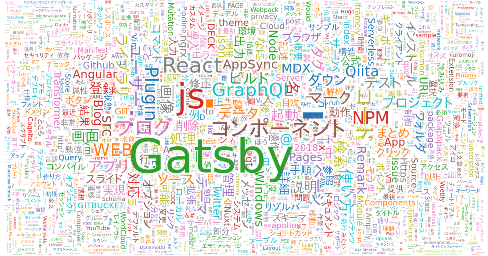
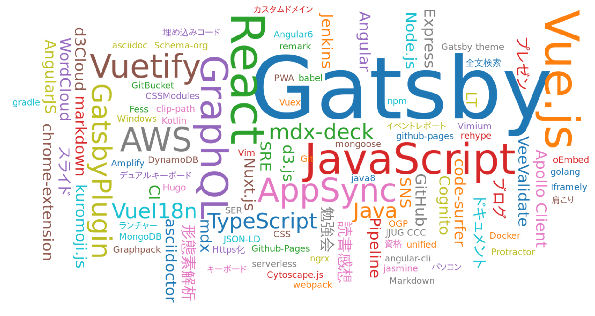

## なにこれ

[前回記事](/wordcloud-with-kuromoji-d3cloud-nodejs)ではNode.jsでWordCloudを出力しました。
今回は、[前回のサンプル](https://github.com/Takumon/playbox2019/blob/master/node-kuromoji-d3cloud-sample/index.js)をベースに自分のブログ（Gatsby製のブログ）にWordCloudを取り入れてみたので、その時の実装方法のメモです。

※ソースコードは以下です。<br/>
https://github.com/Takumon/blog/blob/master/gatsby-node.js

## WordCloudどんなかんじ？

(1)記事全文をインプットにしたものと、(2)記事のタグをインプットにしたものの2つを生成しました。[全記事解析ページ](./map)で見れます。

### (1)記事全文をインプットにしたもの

キーワード以外にも、「登録」「実現」「まとめ」のような何回も使う表現がノイズとして混ざるのであまり満足度は高くありません。それでも「Gatsby」「React」が目立って表示されているので、形だけはWordCloudになっています。


<br/>


### (2)記事のタグをインプットにしたもの

上記を作ってみて満足いかなかったので、試しに記事のタグをインプットにしたものを作ってみたら、思いのほかそれっぽくなりました。自分の直感とも一致していているので、「どんなブログ書いてるの？」という質問の答えとして十分使えそうです。


<br/>


## 処理概要

Gatsbyを使う場合、画面に必要なデータはビルド時に生成するのがベーシックなやり方です。
そのためSVG生成は、表示時のReactコンポーネントではなくビルド時の処理（gatsby-node.js）にて行いました。
ビルドはNode.jsの世界ですから、前回記事の[Node.jsでWordCloudのSVG画像を出力するサンプル](https://github.com/Takumon/playbox2019/blob/master/node-kuromoji-d3cloud-sample/index.js)が、ほぼそのまま使えるわけです。サンプルと、Gatsbyビルド処理のお作法（gatsby-node.jsの書き方）を考慮して以下のような手順でSVG画像のデータを生成します。


* 記事全文のWordCloud生成
    * 記事全文を取得 ☚Gatsbyビルド処理のお作法
    * 記事全文をインプットにkuromoji.jsで形態素解析
    * 解析結果をインプットにD3-Cloudでフォーマット
    * 解析結果をインプットにd3.jsでSVG文字列生成
    * Gatsbyページ生成時にContextのプロパティとして渡す ☚Gatsbyビルド処理のお作法

* 記事全タグのWordCloud生成
    * 記事全タグを取得 ☚Gatsbyビルド処理のお作法
    * 記事全タグをインプットにタグ出現回数を算出
    * 解析結果をインプットにD3-Cloudでフォーマット
    * 解析結果をインプットにd3.jsでSVG文字列生成
    * Gatsbyページ生成時にContextのプロパティとして渡す ☚Gatsbyビルド処理のお作法


そして表示時にコンポーネントでSVGデータを取得し画面に表示します。

## 処理のチューニングポイント

WordCloudの品質を上げるために以下のようなチューニングを実施しました。

* 「Gatsby」[gatsby」などは同じ単語とみなしてカウントしています。
    * 文章中で前後文脈によって大文字小文字の差があるものは、同じ単語としてカウントしています。
    * 最終的にWordCloudに表示する単語は一番大文字の数が多い単語（「Gatsby」[gatsby」なら「Gatsby」）を採用するようにしました。
* 記事全文は、マークダウンではなくHTMLをインプットにして、HTMLタグを除外、さらにpreタグは中身ごと除外してから形態素解析のインプットとして渡しています。
    * マークダウンはリンク、スタイルなどメタ情報が多いため、いったんHTMLに変換したものからHTMLタグを抜くことで純粋な文書だけを抽出しています。
    * またソースコードには同じような表現が多く含まれ、WordCloudの対象にするにはノイズが大きく、大事な単語であればソースコード外の文章中に出てくるという前提のもと、ソースコードはすべて除外しています
    * 「時」「場合」など言い回しとして何度も出てくる単語はWordCloudの情報にしても意味がないので除外しています。


## 処理詳細（実装）

ちょっと長いですが、
ソースコード中のコメントにて詳細を説明します。

```javascript:title=gatsby-node.jsからWordCloud生成処理抜粋
/** HTML形式の記事本文からHTMLタグを削除するために使う */
const striptags = require('striptags')

/** 仮想DOM d3.js D3-CloudはDOMがある前提なのでNode.js実行時でも正常動作するように仮想Canvasを使う */
const { createCanvas } = require('canvas')
/** 仮想DOM d3.js D3-CloudはDOMがある前提なのでNode.js実行時でも正常動作するように仮想DOMを使う */
const { JSDOM } = require('jsdom')

/** 形態素解析のために使う */
const kuromoji = require('kuromoji')

/** WordCloudのSVG文字列作成用 */
const d3 = require('d3')

/** WordCloudのSVG文字列作成用 */
const cloud = require('d3-cloud')

/** createPageにてWordCloud生成処理を実装する */
exports.createPages = ({ graphql, { createPage } }) => {

  return new Promise((resolve, reject) => {

    /** (略)ページコンポーネント呼び出し */

    graphql(/** (略)記事情報呼び出しクエリ */).then(result => {

      /** (略)もろもろのページ作成 */


      // WordCloud用データ加工処理

      /** (略)resultから記事全文の配列(allPostHtmlTexts)を取得する処理 */

      // 記事全文文字列取得
      const allPostTexts = allPostHtmlTexts
        .map(allHtmlTexts => {
          // HTML文字列からタグを除外
          // ただしpreタグは、中身をWordCloud解析対象外とするためここではあえて残している
          const stripedAllText = striptags(allHtmlTexts, '<pre>')

          // そのためpreタグとその中身を除外する。
          // preタグの中見はソースコード。
          // キーワードはソースコード外の文章中に記述していることを想定して
          // WordCloudの対象から外す。
          return replace(/<pre[\s\S]+?>[\s\S]+?<\/pre>/g, '').trim()
        })
        // 改行でつなぐ
        .join('\n')
      

      /** (略)resultから記事全タグの配列(allPostTags)を取得する処理 */

      // 記事タグ取得
      const tagDatas = []

      // 記事全タグ情報からどのタグが何回出現するか算出
      allPostTags.forEach(tags => {
        tags.forEach(t => {

          const targetData = tagDatas.find(data => data.text === t)
          if (targetData) {
            targetData.size = targetData.size + 1
          } else {
            tagDatas.push({
              text: t,
              size: 1,
            })
          }
        })
      })


      // タグ出現回数をインプットにWordCloud生成
      // タグ情報の場合形態素解析せずとも単語ごとの出現回数が算出できるので
      // 形態素解析はスキップしている
      createWordCloud({
        words: tagDatas,
        w: 1200,
        h: 630,
        fontSizePow: 0.8,
        fontSizeZoom: 18,
        padding: 2,
      }).then(tagSvg => { // タグをインプットにしたSVGが出来上がる

        // 記事全文文字列をインプットに単語出現回数を算出
        createWordCount(alltext)
          .then(data => {

            // 記事全文の単語出現回数をインプットにWordCloud生成
            return createWordCloud({
              words: data,
              w: 1200,
              h: 630,
              fontSizePow: 0.6,
              fontSizeZoom: 3.1,
              padding: 0.2,
            })
          })
          .then(textSvg => { // 記事全文をインプットにしたSVGが出来上がる

            // ページ生成時にSVGをContextのプロパティとして渡す
            createPage({
              path: '/map/',
              component: postRelationMapPage,
              context: {
                allPostRelations,
                wordCloudText : textSvg,
                wordCloudTag: tagSvg,
              },
            })

            // すべてのcreatePageを呼び終わったあとにresolveを呼んで処理終了
            resolve('OK')
          })
      })
    })

  })
}

/**
 * ２つの単語の大文字小文字の違いをカウントする
 */
function countDiff(a, b) {
  return a
    .split('')
    .map((charA, i) => charA === b[i] ? 0 :1)
    .reduce((a, b) => a + b, 0)
}


/**
 * 指定した文字列を形態素解析して単語ごとの出現回数を返す
 */
function createWordCount(text) {

  // よく出る言い回しでWordCloudから除外したい単語を列挙  
  const excludeWords = [
    '指定',
    '時',
    '追加',
    /** (略)除外したい単語 */
  ]


  /** kuromoji.jsにバンドルされている辞書の格納場所 */
  const DIC_URL = 'node_modules/kuromoji/dict'

  /** WordCloudでカウントする品詞（助詞・助動詞などは省く） */
  const TARGET_POS = ['名詞']

  /** kuromoji.jsで該当プロパティの値が存在しない場合に設定されている値 */
  const NO_CONTENT = '*'

  // kuromoji.jsで形態素解析
  // 単語ごとの出現回数を出力
  return new Promise((resolve, reject) => {

    kuromoji.builder({ dicPath: DIC_URL }).build((err, tokenizer) => {
      if(err){
        return reject(err)
      }

      // 単語ごとの出現回数を出力
      const words = tokenizer.tokenize(text)
        .filter(t => TARGET_POS.includes(t.pos))
        .map(t => t.basic_form === NO_CONTENT ? t.surface_form : t.basic_form)
        .reduce((data, text) => {
          // 大文字と小文字を区別せず出現回数をカウントする
          const upperText = text.toUpperCase()
          if (excludeWords.includes(upperText)) {
            return data
          }

          const target = data.find(c => c.text === upperText)

          // 出現回数は大文字小文字を区別しないが、実際の生の単語は後の処理で使うためとっておく
          if(target) {
            target.size = target.size + 1
            if(!target.rawTexts.includes(text)) {
              target.rawTexts.push(text)
            }
          } else {
            data.push({
              text: upperText,
              rawTexts: [ text ],
              size: 1,
            })
          }
          return data
        }, [])
        .map(data => {

          // 上記処理で保持しておいた生の単語をもとに、一番大文字が多い単語をWordCloudの単語として採用する
          // 例えばGatsbyとgatsbyであればGatsbyを採用
          const almostSameText = data.rawTexts.map(text => {
              return {
                text,
                diff: countDiff(text, data.text),
              }
            })
            .reduce((a, b) => a.diff <= b.diff ? a : b) // 大文字に近いほうを採用する
            .text
          
          return {
            text: almostSameText,
            size: data.size,
          }
        })

      resolve(words)
    })
  })
}

/**
 * 単語出現回数をもとにWordCloudのSVG文字列を返す
 */
function createWordCloud({
  words, // 単語出現回数
  w, // SVGの幅(単位px)
  h, // SVGの高さ(単位px)
  fontSizePow, // WordCloudの文字の大きさの比率調整用係数
  fontSizeZoom, // WordCloudの文字の大きさの係数
  padding, // WordCloudの文字間の隙間
}) {

  // D3-Cloudによる解析
  return new Promise((resolve, reject) => {
    cloud().size([w, h])
      .canvas(() => createCanvas(w, h))
      .words(words)
      .rotate(word => word.size % 2 === 1 ? 0 : 90) // 出現回数に応じて縦か横向きに表示
      .fontWeight(word => Math.pow(word.size, fontSizePow) * fontSizeZoom)
      .fontSize(word => Math.pow(word.size, fontSizePow) * fontSizeZoom)
      .font('meiryo')
      .padding(padding)
      .on('end', wordsForCloud => {

        resolve(wordsForCloud)
      })
      .start()
  })
  // d3.jsによる解析
  .then(wordsForCloud => {
    return new Promise((resolve, reject) => {
      /** 仮想DOM */
      const document = new JSDOM(`<body></body>`).window.document

      d3.select(document.body)
        .append('svg')
          .attr('class', 'ui fluid image')
          .attr('viewBox', `0 0 ${w} ${h}`)
          .attr('width', '100%')
          .attr('height', '100%')
        .append('g')
          .attr('transform', `translate(${w/2},${h/2})`)
        .selectAll('text')
          .data(wordsForCloud)
        .enter().append('text')
          .style('font-size', d => `${d.size}px`)
          .style('font-family', d => d.font)
          .attr('transform', d => `translate(${d.x}, ${d.y})rotate(${d.rotate})`)
          .style('fill', (d, i) => d3.schemeCategory10[i % 10])
          .attr('text-anchor', 'middle')
          .text(d => d.text)
      
      // 最終的にSVGの文字列を返す
      resolve(document.body.innerHTML)
    })
  })
}
```
<br/>


## まとめ

自分のブログにWordCloudを導入したいと思い立ち、WordCloudについて3回にわたりブログを書いてきましたが、各種ライブラリのおかげで、すんなりと導入できました。
人に自分のブログを紹介するときのネタとしてはとても効果的だと思います。<br/>
なお形態素解析やWordCloud生成は重い処理なので、ビルドに時間がかかるようになってしまいますが、画面表示に関してはパフォーマンスに影響はありません。<br/>
あと本来であればプラグイン化して配布したいところですが、プラグイン化のためには、まだまだ汎用性を高る必要があって、それは今後の課題です🍅