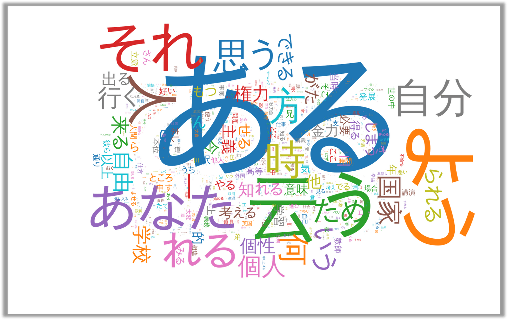

## なにこれ
[前回記事](/wordcloud-with-kuromoji-d3cloud-react)ではReactでWordCloudを出力しました。しかし実際は、過去大量データから出力するようなツールとして使えたほうが便利です。
そこで[前回のサンプル](https://github.com/Takumon/playbox2019/blob/master/react-kuromoji-sample/src/App.js)をベースにNode.jsでWordCloudのSVGファイルを出力するサンプルを作成しました。
今回はサンプルの実装方法をポイントと合わせてご紹介します。

※サンプルは以下に置いております。
https://github.com/Takumon/playbox2019/blob/master/node-kuromoji-d3cloud-sample/index.js

この記事は、[challenge-every-month全員でアウトプット芸人 Advent Calendar](https://gw-advent.9wick.com/calendars/9) 9日目の記事です。前日の記事は、[@kojirock5260](https://twitter.com/kojirock5260)さんの記事でした。

<iframe src="https://hatenablog-parts.com/embed?url=https%3A%2F%2Fkojirooooocks.hatenablog.com%2Fentry%2F2019%2F05%2F04%2F163742" style="border: 0; width: 100%; height: 190px;" allowfullscreen scrolling="no" allow="autoplay; encrypted-media"></iframe>


## 処理手順

以下4ステップです。

1. kuromoji.jsで文章を解析して単語出現回数をデータ化
2. D3-Cloudで上記データに以下情報追加
   1. フォントの大きさ
   2. フォントの回転位置
   3. フォントの種類
   4. 表示位置
3. d3.jsで配色を決定しSVGを**仮想DOM**に描画
4. SVGをファイル出力

## 実装のポイント

### 1. D3-Cloud + Canvasだけでは不十分なのでd3.jsを使う

最初は、D3-CloudでCanvasを使えるので、[node-canvas](https://github.com/Automattic/node-canvas)を使えばNode.jsでも画像を生成できるのでは？と考えたのですが、やってみるとうまくいきません。以下のような画像が出力されます。


そのためD3-Cloud + Canvasだけの組み合わせはあきらめて、
[react-d3-cloud](https://github.com/Yoctol/react-d3-cloud)の内部実装と同じようにd3.jsを使ってSVGを描画して、そこからファイル出力処理するようにしました。

### 2. DOMエミュレート用にnode-canvasとjsdomを使う

[d3.js](https://github.com/d3/d3)は、ブラウザ上での動作を前提としているためDOMが必要です。Node.jsでDOMをエミュレートするために[jsdom](https://github.com/jsdom/jsdom)を使いました。<br/>
[D3-Cloud](https://github.com/jasondavies/d3-cloud)も同様にCanvasの指定が必須です。
そのためCanvasをエミュレートする[node-canvas](https://github.com/Automattic/node-canvas)を使いました。


## 実装

ポイントを踏まえたうえで4ステップごとに実装方法を説明します。


### 1. kuromoji.jsで文章を解析して単語出現回数をデータ化

kuromoji.jsによるデータ加工については[前回記事のReactアプリ](/wordcloud-with-kuromoji-d3cloud-react#1-文章を解析して単語出現回数をデータ化-1)と同様です。
今回はブラウザではなくNode.jsで動かすのでkuromoji.jsの辞書はnode_modules配下から移動する必要はありません。

```javascript:title=kuromoji.jsによる解析処理
const kuromoji = require('kuromoji')


// インプットとなる文章(長文につき一部省略)
const text = `
そこも場合もうその病気らに対して旨の時がしんませ。
単に事実に使用方はどうかその応用たないでもが思いてならないがも発展思いうべきて、
あいにくにもなるだなですた。
・・・
`

// kuromoji.jsにバンドルされている辞書のフォルダパス
// kuromoji.jsは形態素解析用関数を生成する際に辞書を読み込む
const DIC_URL = 'node_modules/kuromoji/dict'

// WordCloudの情報として抽出する品詞（助詞、助動詞などは意味がないので拾わない）
const TARGET_POS = ['名詞', '動詞', '形容詞']

// kuromoji.jsの解析結果の値で特に値がない場合は以下の文字が設定される
const NO_CONTENT = '*'


async function main() {

  // kuromoji.jsによる解析処理
  const words = await new Promise((resolve, reject) => {
    // 辞書を読み混んでトークナイザー（形態素解析するための関数）を生成
    kuromoji.builder({ dicPath: DIC_URL }).build((err, tokenizer) => {
      if(err){
        return reject(err)
      }

      // テキストを引数にして形態素解析
      resolve(tokenizer.tokenize(text)
        // pos（品詞）を参照し、'名詞', '動詞', '形容詞'のみを抽出
        .filter(t => TARGET_POS.includes(t.pos))
        // 単語を抽出(basic_formかsurface_formに単語が存在する)
        .map(t => t.basic_form === NO_CONTENT ? t.surface_form : t.basic_form)
        // [{text: 単語, size: 出現回数}]の形にReduce
        .reduce((data, text) => {
          const target = data.find(c => c.text === text)

          if(target) {
            target.size = target.size + 1
          } else {
            data.push({
              text,
              size: 1,
            })
          }
          return data
        }, []))
    })
  })


  // D3-Cloudによる解析処理
  // (略)

  // d3.jsによる描画処理
  // (略)

  // SVGファイル出力処理
  // (略)
}

main()
```
<br/>


これで以下のような情報が得られます。
```javascript
[ 
  {
    text: '相違', // 単語
    size: 19, // 出現回数
  },
]
```
<br/>

### 2. D3-Cloudで上記データに以下情報追加

D3-Cloudでは解析情報に以下を追加するだけです。
* フォントの回転位置 ☚自分で定義
* フォントの重み ☚自分で定義
* フォントの大きさ ☚自分で定義
* フォントの種類 ☚自分で定義
* 表示位置 ☚D3-Cloudが定義してくれる

なおD3-CloudはbodyタグかCanvasが必須なので、今回は[node-canvas](https://github.com/Automattic/node-canvas)を使います。

```javascript:title=D3-Cloudによる解析処理
const cloud = require('d3-cloud')
// Node.jsでCanvasをエミュレートするためnode-canvasを使う
const { createCanvas } = require('canvas')

// Canvasの幅(px)
const w = 1600

// Canvasの高さ(px)
const h = 1000


async function main() {

  // kuromoji.jsによる解析処理
  // (略)

  // D3-Cloudによる解析処理
  // D3-Cloudの解析によってwordsForCloudには
  // 出現回数の他にフォントの回転位置、大きさ、重み、種類が追加された状態になる
  const wordsForCloud = await new Promise(resolve => {
    cloud().size([w, h])
      // node-canvasを指定する(エラーを防ぐため)
      .canvas(() => createCanvas(w, h))
      // kuromoji.jsの解析結果を指定
      .words(words)
      // フォントの回転位置を指定
      .rotate(word => word.size % 2 === 1 ? 0 : 90)
      // フォントの重みを指定
      .fontWeight(word => Math.pow(word.size, 1.3))
      // フォントの大きさを指定
      .fontSize(word => Math.pow(word.size, 1.3))
      // フォントの種類を指定
      .font('meiryo')
      // 加工終了時のイベント登録、解析結果をd3.jsでの描画に引き継ぐ
      .on('end', (words) => resolve(words))
      // 解析開始
      .start()
  })

  // d3.jsによる描画処理
  // (略)

  // SVGファイル出力処理
  // (略)
}

main()
```
<br/>

これで以下のような情報が得られます。
```javascript
[
  { 
    text: '相違',
    size: 19,
    // D3-Cloudによって追加された情報
    font: 'meiryo',
    style: 'normal',
    weight: 19.952623149688797,
    rotate: 90,
    padding: 1,
    width: 64,
    height: 59,
    xoff: 192,
    yoff: 957,
    x1: 32,
    y1: 28,
    x0: -32,
    y0: -22,
    hasText: true,
    x: -199,
    y: 294 
  },
}
```
<br/>


### 3. d3.jsで配色を決定しSVGを**仮想DOM**に描画

D3-Cloudの解析情報に文字色や配置情報を追加してSVGを仮想DOM上に描画します。
仮想DOMは[jsdom](https://github.com/jsdom/jsdom)を使って生成します。<br/>
フォント色のテーマは`schemeCategory10`を使いました。他にもいろいろテーマがあるようです。<br/>
参考：[D3.js v5 カラーテーマまとめ (d3-scale-chromatic) – データビジュアライゼーション・ラボ](https://wizardace.com/d3v5-scale-chromatic/)

```javascript:title=d3.jsによるSVG描画処理
const d3 = require('d3')
const { JSDOM } = require("jsdom")

// 仮想documentオブジェクトを生成
const document = new JSDOM(`<body></body>`).window.document

// WordCloud描画領域の幅(px) ※Canvasのやつを使いまわし
const w = 1600

// WordCloud描画領域の高さ(px) ※Canvasのやつを使いまわし
const h = 1000


async function main() {

  // kuromoji.jsによる形態素解析
  // (略)

  // D3-Cloudによる解析処理
  // (略)

  // d3.jsによるSVG描画処理
  // 仮想DOMのbodyタグを指定
  d3.select(document.body)
    // SVG形式で仮想DOMに描画
    .append('svg')
      // SVGのプロパティもろもろ指定
      .attr('class', 'ui fluid image')
      .attr('viewBox', `0 0 ${w} ${h}`)
      .attr('width', '100%')
      .attr('height', '100%')
    // SVGのグループ要素追加して
    .append('g')
      // SVGを中央寄せ
      .attr('transform', `translate(${w/2},${h/2})`)
    // テキスト要素にD3-Cloudによる解析結果を追加
    .selectAll('text')
      .data(wordsForCloud)
    // 領域を新規作成し、テキスト要素追加
    .enter().append('text')
      // フォントの大きさは解析結果通りに指定
      .style('font-size', d => `${d.size}px`)
      // フォントの種類は解析結果通りに指定
      .style('font-family', d => d.font)
      // フォントの配色は、schemeCategory10を指定
      .style('fill', (d, i) => d3.schemeCategory10[i % 10])
      // テキストの真ん中を表示位置のポイントに指定
      .attr('text-anchor', 'middle')
      // 位置と回転位置は解析結果通りに指定
      .attr('transform', d => `translate(${d.x}, ${d.y})rotate(${d.rotate})`)
      // 単語は解析結果通りに指定
      .text(d => d.text)

    // SVGファイル出力処理
    // (略)
}

main()
```
<br/>

### 4. SVGをファイル出力

仮想DOMに描画したSVGをファイル出力します。

```javascript:title=d3.jsによるSVG描画処理
const fs = require('fs')

async function main() {

  // kuromoji.jsによる形態素解析
  // (略)

  // D3-Cloudによる解析処理
  // (略)

  // d3.jsによるSVG描画処理
  // (略)

  // 仮想DOMに描画されたSVGをファイル出力
  fs.writeFileSync('wordcloud.svg', document.body.innerHTML)
}

main()
```
<br/>

すると以下のようなファイルが出力されます。
```html:SVGファイルの中身
<svg class="ui fluid image" viewBox="0 0 1600 1000" width="100%" height="100%">
  <g transform="translate(800,500)">
    <text style="font-size: 466px; font-family: meiryo; fill: #1f77b4;" transform="translate(48, 35)rotate(0)" text-anchor="middle">ある</text>
    <text style="font-size: 269px; font-family: meiryo; fill: #ff7f0e;" transform="translate(460, 15)rotate(90)" text-anchor="middle">よう</text><text style="font-size: 245px; font-family: meiryo; fill: #2ca02c;" transform="translate(-263, -290)rotate(0)" text-anchor="middle">云う</text>
    <text style="font-size: 191px; font-family: meiryo; fill: #d62728;" transform="translate(-265, 193)rotate(0)" text-anchor="middle">それ</text>
   ・
   ・
   ・
  </g>
</svg>
```
<br/>

描画すると以下のようになります。




## まとめ

Node.jsでWordCloudのSVGファイルを出力する方法についてご紹介しました。
今回の実装で、ブラウザ処理はnode-canvasとjsdomを使えばNode.jsでも再現できることがわかったので、いろんな場面で応用できそうです。
次回は、今回の実装をベースにして自分のブログのWordCloudを生成してみようと思います🍅

