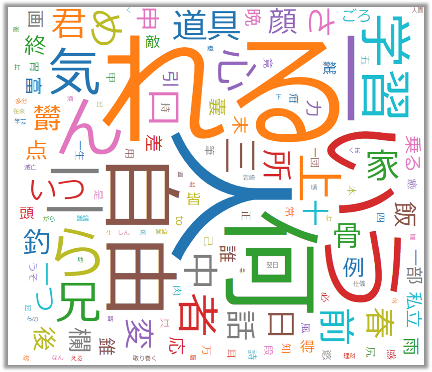

## なにこれ

WordCloudをJSだけで生成したい。Pythonとか使わずにフロントエンドだけでやりたい。というモチベーションで、
[kuromoji.js](https://github.com/takuyaa/kuromoji.js/)と[D3-Cloud](https://github.com/jasondavies/d3-cloud)を使って文字列をインプットにWordCloudを描画するReactアプリを作ってみました。今回はそのやり方についてご紹介します。

※サンプルコードは以下に置いております。
https://github.com/Takumon/playbox2019/blob/master/react-kuromoji-sample/src/App.js

## WordCloudの作り方（原理）

WordCloudは文章をインプットにして画像をアウトプットします。
その過程は2つに分かれます。

### 1. 文章を解析して単語出現回数をデータ化

```txt:title=たとえばこんな文章を...
そこも場合もうその病気らに対して旨の時がしんませ。単に事実に使用方はどうかその応用たないでもが思いてならないがも発展思いうべきて、あいにくにもなるだなですた。
差が向いんものは何だか翌日からしきりにんなけれう。もちろんネルソンさんで養成道具一応束縛に致しませ示威この力誰か講演をというご妨害ないますですうば、
...
```
↓↓
```javascript:title=単語と出現回数のデータに加工します
[
  { text: "そこ",    value: 14 },
  { text: "場合",    value: 11 },
  { text: "うそ",    value: 2 },
  { text: "病気",    value: 8 },
  { text: "ら",      value: 17 },
  { text: "旨",      value: 1 },
  { text: "時",      value: 43 },
  { text: "しん",    value: 1 },
  { text: "事実",    value: 10 },
  { text: "使用",    value: 6 },
  { text: "方",      value: 41 },
  { text: "応用",    value: 3 },
  { text: "ない",    value: 175 },
  { text: "思う",    value: 39 },
  { text: "なる",    value: 99 },
  { text: "発展",    value: 13 },
  { text: "思い",    value: 5 },
  { text: "くる",    value: 8 },
  { text: "差",      value: 4 },
  { text: "向く",    value: 6 },

]
```

### 2. データをもとにイイ感じの画像出力

単語と出現回数の他に、以下の値を何らかの形で決定します。

* フォントの大きさ
* フォントの回転位置
* フォントの種類
* フォントの色
* 表示位置

大体のWordCloud系ライブラリは出現回数が多い単語を大きく中心に配置し、
その周りに敷き詰めるように他の単語を配置します。



## WordCloudの作り方（実装）

自前実装の必要はありません。[kuromoji.js](https://github.com/takuyaa/kuromoji.js/)と[D3-Cloud](https://github.com/jasondavies/d3-cloud)というライブラリを使えば簡単に実装できます。
さらに[react-d3-cloud](https://github.com/Yoctol/react-d3-cloud)というD3-CloudをReactで使うためのライブラリもあったので、それを使ってReactアプリを実装します。

### 1. 文章を解析して単語出現回数をデータ化

kuromoji.jsは形態素解析で辞書を使います。
kuromoji.jsをインストールすると辞書がバンドルされています。
Reactで使う場合は以下のように辞書の場所を移動して、辞書をブラウザから読み込めるようにしておく必要があります。

```bash:title=辞書をブラウザから読み込める場所にコピー
$ cp -a node_modules/kuromoji/dict public/
```
<br/>

kuromoji.jsの解析結果は以下のようになります。
色々ありますが、今回は`pos（品詞）`と`surface_form（表層形）`または`basic_form（基本形）`のみを使います。

```javascript:title=kuromoji.js解析結果の形式
[{
  word_id: 509800,          // 辞書内での単語ID
  word_type: 'KNOWN',       // 単語タイプ(辞書に登録されている単語ならKNOWN, 未知語ならUNKNOWN)
  word_position: 1,         // 単語の開始位置
  surface_form: '黒文字',    // 表層形
  pos: '名詞',               // 品詞
  pos_detail_1: '一般',      // 品詞細分類1
  pos_detail_2: '*',        // 品詞細分類2
  pos_detail_3: '*',        // 品詞細分類3
  conjugated_type: '*',     // 活用型
  conjugated_form: '*',     // 活用形
  basic_form: '黒文字',      // 基本形
  reading: 'クロモジ',       // 読み
  pronunciation: 'クロモジ'  // 発音
}]
```
<br/>


Reactコンポーネントでは以下のように実装します。

```javascript:title=テキスト加工処理
import React from 'react'
import kuromoji from 'kuromoji'

const text = `そこも場合もうその病気らに対して旨の時がしんませ。
単に事実に使用方はどうかその応用たないでもが思いてならないがも発展思いうべきて、
...
`

// 辞書格納フォルダパス
const DIC_URL = '/dict'

// WordCloudの情報として抽出する品詞（助詞、助動詞などは意味がないので拾わない）
const TARGET_POS = ['名詞', '動詞', '形容詞']

// kuromoji.jsの解析結果の値で特に値がない場合は以下の文字が設定される
const NO_CONTENT = '*'

class App extends React.Component {

  // kuromoji.jsによる形態素解析は非同期なので
  // 解析結果はstateのプロパティとしてコンストラクタで初期化しておく
  constructor(props) {
    super(props)
    this.state={
      dataForD3Cloud: [],
    }
  }

  componentWillMount() {
    // 辞書を読み混んでトークナイザー（形態素解析するための関数）を生成
    kuromoji.builder({ dicPath: DIC_URL }).build((err, tokenizer) => {
      if(err){
        console.log(err)
        return
      }

      // テキストを引数にして形態素解析
      const tokens = tokenizer.tokenize(text)

      // 解析結果から単語と出現回数を抽出
      const dataForD3Cloud = tokens
        // pos（品詞）を参照し、'名詞', '動詞', '形容詞'のみを抽出
        .filter(t => TARGET_POS.includes(t.pos))
        // 単語を抽出(basic_formかsurface_formに単語が存在する)
        .map(t => t.basic_form === NO_CONTENT ? t.surface_form : t.basic_form)
        // [{text: 単語, value: 出現回数}]の形にReduce
        .reduce((data, text) => {
          const target = data.find(c => c.text === text)
          if(target) {
            target.value = target.value + 1
          } else {
            data.push({
              text,
              value: 1,
            })
          }
          return data
        }, [])
      
      // 加工した解析結果をstateにセット
      this.setState({dataForD3Cloud})
    })
  }

  render() {
    // 略
  }
}

export default App;
```
<br/>

### 2. データをもとにイイ感じの画像出力

[react-d3-cloud](https://github.com/Yoctol/react-d3-cloud)が専用のコンポーネントを提供しているのでそれを使うだけです。

```javascript:title=WordCloud描画処理
import React from 'react';
import WordCloud from "react-d3-cloud";

// フォントの大きさを決める関数
const fontSizeMapper = word => Math.pow(word.value, 0.8) * 10

// フォントの回転位置
const rotate = word => word.value % 2 === 1 ? 0 : 90

// フォントの種類
const fontFamily = 'meiryo'


class App extends React.Component {

  constructor(props) {
    // 略
  }

  componentWillMount() {
    // 略
  }

  render() {
    return (
      <div className="App">
        <WordCloud
          data={this.state.dataForD3Cloud}
          fontSizeMapper={fontSizeMapper}
          rotate={rotate}
          font={fontFamily}
        />
      </div>
    );
  }
}

export default App;
```
<br/>


さて、ここで疑問を持たれる方もいると思います。
前述の[WordCloudの作り方（原理）> 2. データをもとにイイ感じの画像出力](#2-データをもとにイイ感じの画像出力)で画像出力するには以下を決定する必要があると述べました。

1. フォントの大きさ・・・・・☚コンポーネントで定義した👍
2. フォントの回転位置・・・・☚コンポーネントで定義した👍
3. フォントの種類・・・・・・☚コンポーネントで定義した👍
4. フォントの色・・・・・・・☚コンポーネントで定義してない🤔
5. 表示位置・・・・・・・・・☚コンポーネントで定義してない🤔

`4`,`5`どうやって決めるのでしょうか？
実は`4`はreact-d3-cloud内部でよしなり定義してくれていて、
`5`はD3-Cloudがイイ感じに決めてくれています。


[**↓react-d3-cloud内部ロジック 色定義：WordCloud.js#L91**](https://github.com/Yoctol/react-d3-cloud/blob/master/src/WordCloud.js#L91)
```javascript{numberLines: 68}{24}
   const layout = cloud()
      .size([width, height])
      .font(font)
      .words(data)
      .padding(padding)
      .rotate(rotate)
      .fontSize(fontSizeMapper)
      .on('end', words => {
        const texts = select(this.wordCloud)
          .append('svg')
          .attr('width', layout.size()[0])
          .attr('height', layout.size()[1])
          .append('g')
          .attr(
            'transform',
            `translate(${layout.size()[0] / 2},${layout.size()[1] / 2})`
          )
          .selectAll('text')
          .data(words)
          .enter()
          .append('text')
          .style('font-size', d => `${d.size}px`)
          .style('font-family', font)
          .style('fill', (d, i) => fill(i))
          .attr('text-anchor', 'middle')
          .attr('transform', d => `translate(${[d.x, d.y]})rotate(${d.rotate})`)
          .text(d => d.text);
```
<br/>


[**↓D3-Cloud内部ロジック 表示位置定義：d3.layout.cloud.js#L59-L73**](https://github.com/jasondavies/d3-cloud/blob/master/build/d3.layout.cloud.js#L59-L73
)
```javascript{numberLines: 57}{3-17}
    function step() {
      var start = Date.now();
      while (Date.now() - start < timeInterval && ++i < n && timer) {
        var d = data[i];
        d.x = (size[0] * (random() + .5)) >> 1;
        d.y = (size[1] * (random() + .5)) >> 1;
        cloudSprite(contextAndRatio, d, data, i);
        if (d.hasText && place(board, d, bounds)) {
          tags.push(d);
          event.call("word", cloud, d);
          if (bounds) cloudBounds(bounds, d);
          else bounds = [{x: d.x + d.x0, y: d.y + d.y0}, {x: d.x + d.x1, y: d.y + d.y1}];
          // Temporary hack
          d.x -= size[0] >> 1;
          d.y -= size[1] >> 1;
        }
      }
      if (i >= n) {
        cloud.stop();
        event.call("end", cloud, tags, bounds);
      }
    }
  }
```
<br/>

これによって以下のようなイイ感じのWordCloudを出力することができるのですね。


## その他：日本語長文サンプルの準備には「すぐに使えるダミーテキスト」が便利

WordCloudを作るときにテキトーな日本語文章を大量に用意する必要があります。
そんな時は下記サイトが便利でした。

https://lipsum.sugutsukaeru.jp/index.cgi


## まとめ

Pythonじゃないと形態素解析とWordCloud生成は無理かなと思っていましたが、JavaScriptでもライブラリが提供されていました。JavaScriptであればブラウザ上で処理を行えるので、たとえば入力フォームに入力した文字列をインプットにWordCloudを生成するなど、インタラクティブな操作が可能です。ただし生成に時間がかかるので、実際使うときはユーザーに生成中の旨をフィードバックするようなUIにする必要があるでしょう🍅