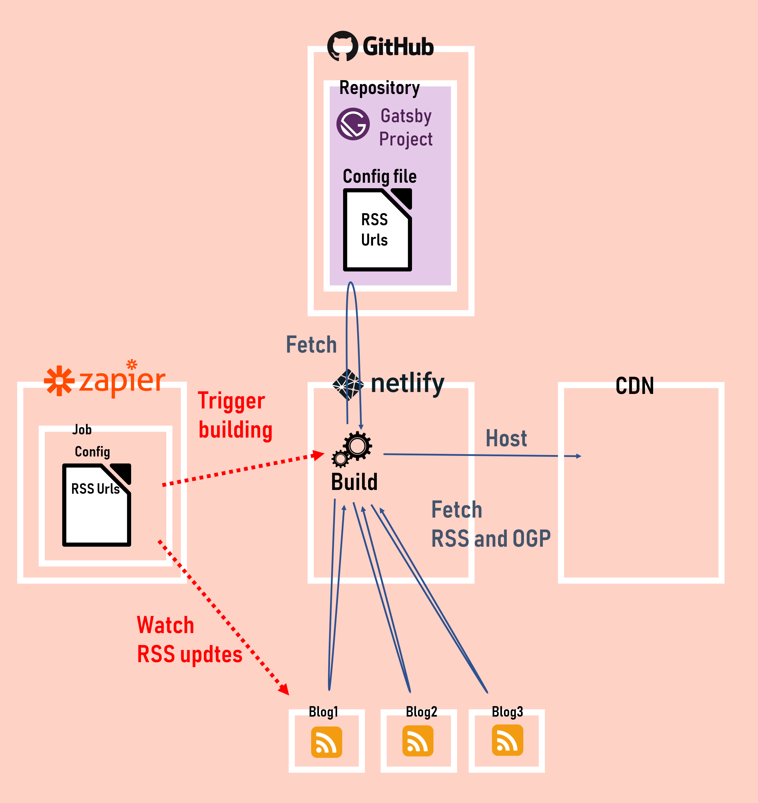

## なにこれ

自分専用のRSSリーダーを[Gatsby](https://gatsbyjs.org) + [Netlify](https://netlify.com) + [Zapier](https://zapier.com/)を使って作りました。Gatsbyビルド時にRSSとOGPを取得して、Webサイトに表示しています。
今回はこのWebサイトのビルドの仕組みと、GatsbyビルドでRSS+OGPを取得する方法をご紹介します。

サイトはコチラ↓

<div class="iframely-embed"><div class="iframely-responsive" style="height: 140px; padding-bottom: 0;"><a href="https://favorite-blogs.netlify.com//" data-iframely-url="//cdn.iframe.ly/api/iframe?url=https%3A%2F%2Ffavorite-blogs.netlify.com&key=0658bf78be97cafcf2b0b9f96c1270ee"></a></div></div>

<br/>

ソースはコチラ↓

<div class="iframely-embed"><div class="iframely-responsive" style="height: 140px; padding-bottom: 0;"><a href="https://github.com/Takumon/blog-rss" data-iframely-url="//cdn.iframe.ly/B8twzEh"></a></div></div>

<br/>


## ビルドの仕組み



以下時系列で説明します。

* Zapier
  * ジョブで定義したRSSを監視
  * RSSに更新があったらNetlifyビルドをトリガー
* Netlify
  * ビルドでGitHubからGatsbyプロジェクトのリポジトリをフェッチ
  * Gatsbyプロジェクトのビルドを実行
  * Gatsbyプロジェクトのビルドの中で、設定ファイルに定義したRSSをフェッチ
  * ビルドが終わったらCDNにホスティング


### NetlifyとGitHubの連携

Netlify上でGitHubリポジトリをビルド＆ホストできるようにしておきます。
連携はNelityのGUIで簡単にできます。

### ZapierとNetlifyの連携

RSSリーダーは「RSSが更新されたらビルドをトリガーする」ような仕組みが必要です。この仕組みはNetlifyとZapierで実現できます。
Zapierはいろんなサービスやアプリを連携させて自動化できるWebサービスで、Netlifyにも対応しています。
Zapierの画面上で、監視したいRSSをポチポチ登録すると「RSSが更新されたらNetlifyのビルドをトリガーする」が簡単に実現できます。


## RSS + OGP取得

さてビルドの仕組みを整えたので、次はGatsbyのビルドでRSSを取得する方法について説明します。

どのRSSを引っ張ってくるかは、GitHubリポジトリに設定ファイルにて定義します（[実際の設定ファイル](https://github.com/Takumon/blog-rss/blob/master/favorite-blog-rss.js)）。
ただコレ、ZapierのジョブのRSS定義と二重管理になるのが難点です。Zapierのタスクがyamlで書けるようになったら一元管理できるかもですが...


```javascript:title=gatsby-node.js
const striptags = require('striptags');
const axios = require('axios');
const cheerio = require('cheerio');
const crypto = require("crypto");
const Parser = require('rss-parser');
const parser = new Parser({
  headers: {'User-Agent': 'something different'},
});

const INTERNAL_TYPE_BLOG = 'blog';
const INTERNAL_TYPE_BLOG_POST = 'blogPost';


// RSSのような外部リソースを
// GatsbyでGraphQLのデータとして扱うためには
// sorceNodeで処理する
exports.sourceNodes = async ({ actions, createNodeId, store, cache }) => {
  const feeds = [];
  
  // 設定ファイルかなにかしらの方法でRSSのURLを読み込む
  const blogUrls = ['rss-url-1', 'rss-url-2', ];

  for(const blogUrl of blogUrls) {
  
    // rss-parserでRSS情報を取得する
    const feed = await parser.parseURL(blogUrl).then(feed => {

      return {
        ...feed,
        items: feed.items.map(item => ({
          title: item.title,
          excerpt: excerpt(item.content, 120),
          content: item.content,
          pubDate: new Date(item.pubDate).toISOString(),
          link : item.link,
        }))
      }
    });

    feeds.push(feed);
  }


  // ブログごとにノード生成
  feeds
    .map(feed => ({
      title: feed.title,
      description: feed.description,
      link: feed.link,
      lastBuildDate: feed.lastBuildDate,
    }))
    .forEach(b => {
      const contentDigest = crypto.createHash(`md5`)
        .update(JSON.stringify(b))
        .digest('hex');
      
      actions.createNode({
        ...b,
        id: createNodeId(`${INTERNAL_TYPE_BLOG}${b.link}`),
        children: [],
        parent: `__SOURCE__`,
        internal: {
          type: INTERNAL_TYPE_BLOG,
          contentDigest,
        },
      });
    });

  // RSSに加えて、OGPを取得
  const rssPosts = feeds.map(feed => feed.items).reduce((a,b) => [...a, ...b]);
  const rssPostsWithImageUrl = [];
  // Promise.allでやると503になるのでfor文を使う
  for (const p of rssPosts) {
    const pWithImageUrl = await axios.get(p.link, {
      headers: {'User-Agent': 'something different'},
    }).then(res => {

      // 取得したHTMLからOGPを取得
      const $ = cheerio.load(res.data)
      let imageUrl;
      $('head meta').each((i, el) => {
        const property = $(el).attr('property')
        const content = $(el).attr('content')
        if (property === 'og:image') {
          imageUrl = content
        }
      });

      // 記事情報にOGPのURLを追加
      return {
        ...p,
        imageUrl,
      };
    });

    rssPostsWithImageUrl.push(pWithImageUrl);
  }


  // OGP画像のノードを生成
  // 重複を考慮してユニークにしてから処理する
  const imageUrls = _uniq(rssPostsWithImageUrl.filter(p => p.imageUrl).map(p => p.imageUrl));

  await Promise.all(imageUrls.map(async imageUrl => {
    const fileNode = await createRemoteFileNode({
      url: imageUrl,
      cache,
      store,
      createNode: actions.createNode,
      createNodeId: createNodeId,
    });

    await actions.createNodeField({
      node: fileNode,
      name: 'ThumbnailImage',
      value: 'true',
    });
    await actions.createNodeField({
      node: fileNode,
      name: 'link',
      value: imageUrl,
    });

    return fileNode;
  }));


  // ブログ記事ごとのノード生成
  rssPostsWithImageUrl.forEach(p => {
    const contentDigest = crypto.createHash(`md5`)
      .update(JSON.stringify(p))
      .digest('hex');
    
    const excerpt = 
    actions.createNode({
      ...p,
      id: createNodeId(`${INTERNAL_TYPE_BLOG_POST}${p.link}`),
      children: [],
      parent: `__SOURCE__`,
      internal: {
        type: INTERNAL_TYPE_BLOG_POST,
        contentDigest,
      },
    });
  });
};


// 記事要約は記事本文から抽出
function excerpt(html, maxLength) {
  const rowText = striptags(html, '<pre>')
    .replace(/<pre[\s\S]+?>[\s\S]+?<\/pre>/g, '')
    .replace(/\n/g, '')
    .replace(/ /g, '')
    .trim();
  return rowText.length >= maxLength
    ? rowText.substring(0, maxLength) + '...'
    : rowText;
}
```
<br/>


OGP画像をGatsbyで扱う処理は今も参考にしてみてください。

<div class="iframely-embed"><div class="iframely-responsive" style="padding-bottom: 52.5%; padding-top: 120px;"><a href="https://takumon.com/gatsby-image-of-remote-in-building-by-using-create-remote-file-node" data-iframely-url="//cdn.iframe.ly/r1GTW3Y"></a></div></div>


### リソース取得は間隔を置かないと503になる

ビルド時にRSSやらOGPやらを引っ張ってくるために、大量のリクエストを発行しますが、サイトによっては時間当たりのリクエスト上限に引っかかって503エラーになることがあります。
対処法としては、`Promise.all`で一度にリクエストを投げずに、for文でリクエスト1つずつawaitしながら投げて、適度に間隔を開けるのが良いと思います。


## まとめ

RSSリーダーのようなものをSPAだけで作ろうとすると、フロント側の高負荷処理で画面描画が遅くなってしまいますが、
Gatsbyを使えばビルド時に重い処理を流せるので、パフォーマンスの向上が期待できます。
また今回のように、NetlifyやZapierなど他サービスと連携することで、作れる静的サイトの幅も広がります。
SPA(Single Page Application)でこのような静的サイトを作っている方は一度Gatsbyを導入してみてはいかがでしょうか🍅
