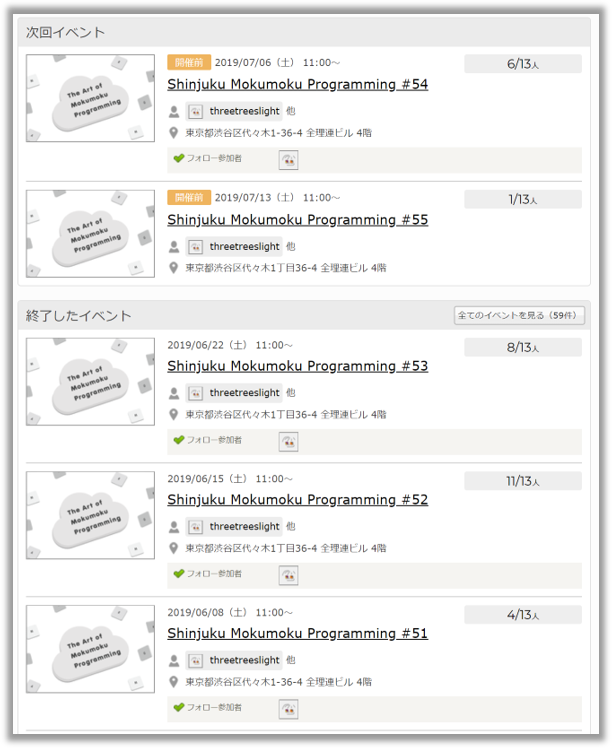
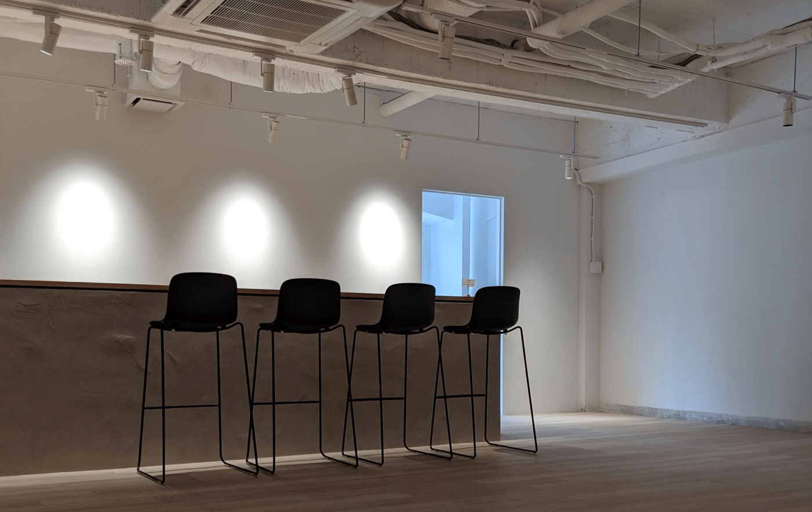

## なにこれ

一時期いろんな勉強会に行きましたが、「勉強会に参加すると勉強している気になるだけで実際そうじゃない」ので最近はモクモク会にしか顔を出さなくなりました。
その中でも[Shinjuku Mokumoku Programming](https://shinjuku-moku.connpass.com/)(通称「新宿もくもく」)にはほぼ毎週参加していた覚えがあります。
僕は2019年6月に転勤で東京を離れてしまって行けなくなりましたが、一番お気に入りの勉強会だったので、この記事で紹介したいと思います。

## 必ず毎週開催される

[コンパスイベントページ](https://shinjuku-moku.connpass.com/)

を見るとわかりますが、週次で開催されています。
勉強会のなかには開催が不定期で開催予定日を常にウォッチしておく必要がありますが、
新宿もくもくはほぼ毎週欠かさず開催されるのでウォッチ不要です。
自分の生活の一部として週一モクモク会参加を習慣化できます。

## 1回の時間が長い

朝11:00から夕方6:00と比較的長めです。
途中にランチ、最後に成果発表がありますが、実質**5時間**は作業できます。
せっかく来たならガッツリもくもくしたい！という人にピッタリです。

## 最初にやること宣言、最後に成果発表

まず勉強会の最初に、以下リポジトリに本日やることをプッシュして自己紹介を兼ねて各自宣言します。
そして最後に、成果をプッシュして成果発表をします。
成果発表では[GitPitch](https://gitpitch.com/)を使って2～3分程度みんなの前で発表します。
このような仕組みによって自分に適度なプレッシャーを与え、効率的に作業を進められます。

## ランチのお店がおいしい

午前中に勉強会Slackにて、ランチのお店の候補が提示されるので各自行きたいお店を選んで昼1:00になったらランチに行きます。
候補は、寿司、和食、パスタ、カレー、中華などいろんなお店があって、どのお店もめっちゃおいしい料理が出てきます。

午前中2時間もくもくして、おいしいランチを食べて、午後また集中してもくもくするといった流れです。
立て込んでいる場合はランチに行かずに会場に残って作業することもできます。

## おいしいコーヒ

電源、Wifiはもちろん用意されているのですが、ウォーターサーバーとコーヒーサーバーもあります。
コーヒーサーバーはちょっと高級なものらしく、とてもおいしいコーヒーが飲めます。

## 会場は代々木駅から徒歩１分、最近できた素敵なフロア

勉強会の名前自体は「新宿もくもく」なんですが、開催場所は代々木です。
会場提供は[Repro](https://www.wantedly.com/companies/repro?aql=gaFxpXJlcHJv)さん。
2019年6月からは、オフィス拡張に伴い新設したフロアでやっているらしいです。
僕は6月に転勤になって東京を離れてしまったのでフロア移動後の勉強会には参加していませんが、
5月に工事中のフロアを見せてもらった時は、こんなに素敵な空間でもくもく会できるなんて！と思いました。

## まとめ

みなさん是非、[新宿もくもく](https://shinjuku-moku.connpass.com/)に参加してみてください🍅
