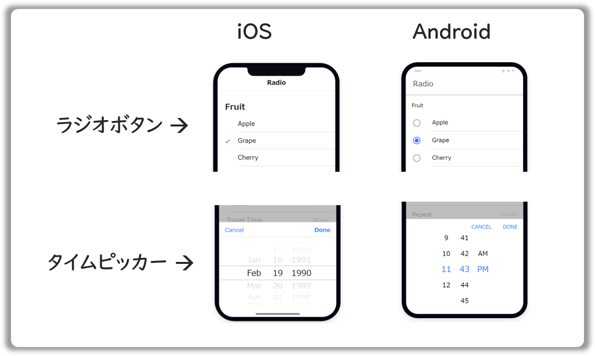
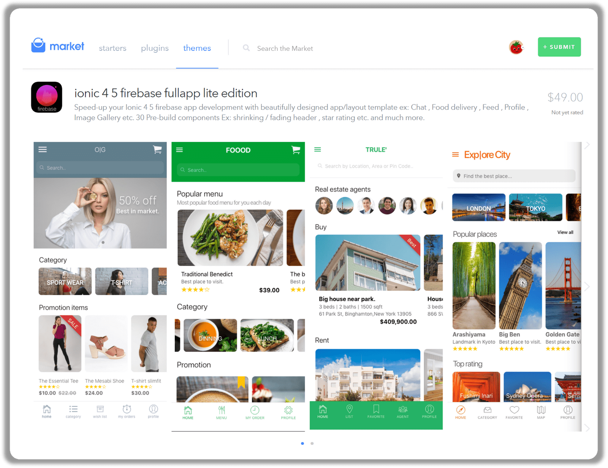
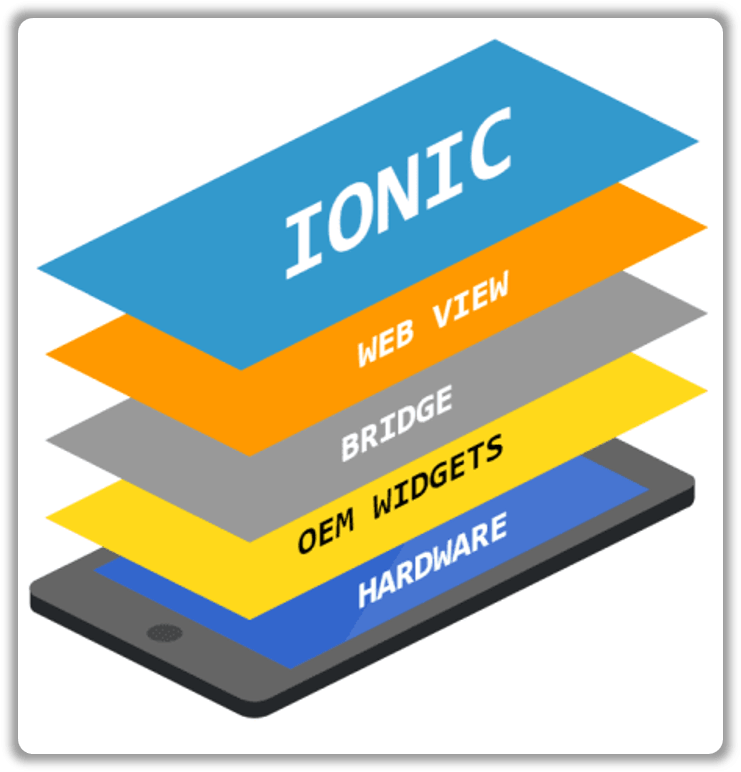
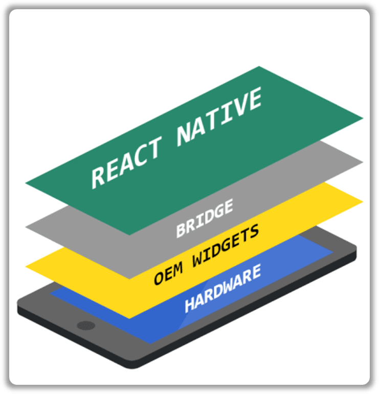
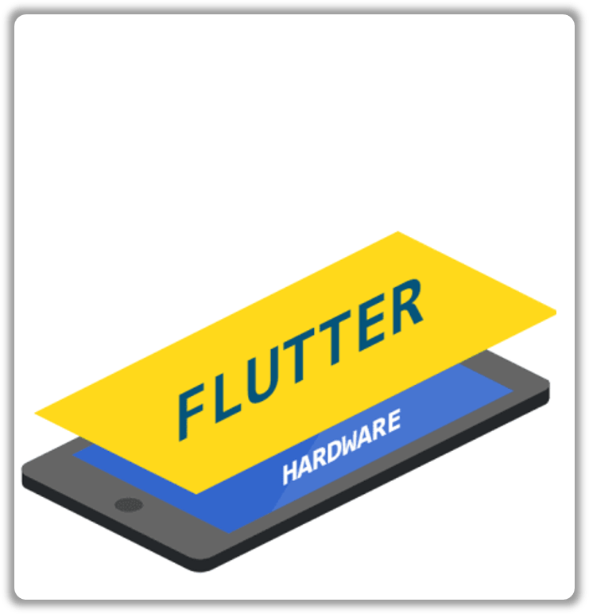

## なにこれ

クロスプラットフォームアプリを開発する手段はいくつかありますが、とっつきやすそうなIonicについて調査しました。実装方法というよりは、全体像と、React Native・Flutterとの比較についてまとめています。

<small>
📝私はWeb開発の経験はありますが、Ionicの経験があるわけではなく、これからやってみようという段階です。
そのため本記事はあくまでも調査結果をまとめたもので、実際の開発の経験に基づくものではありません。
</small>

## Ionic概要

クロスプラットフォームアプリをWebの技術（HTML/CSS/JS）を使って作るためのフレームワークです。
iOS・Android・Electron・Web(PWA)などの複数の環境で動作させ、ネイティブ機能にアクセスするための**Capacitor**と、
WebComponentベースのネイティブ風な**UI Component**から構成されます。
UI Componentは、素のHTML/CSS/JSでも使えますし、SPAフレームワーク（Angular/React/Vue）とあわせても使えます。
それ以外にも、CLIやCI/CD自動化ツール、マーケットといった開発を支えるための周辺機能や、企業向け有償サポートも提供しています。

## Ionic全体像

アプリ開発からストア公開までの手順の中でIonicが提供する機能は以下の図の青背景・青文字で示してある部分です。

以下で機能ごとの概要を説明します。

### UI Component
<small>参考: [Ionic公式ドキュメント: UI Component](https://ionicframework.com/docs/components)</small>

コア機能はWebComponentで作られており、素のHTML/CSS/JSでも使えますし、アダプターを使えばAngularやReactでも使えます（Vueは現在Beta版）。
以下の図のようにアプリが動作するプラットフォームによってCSSが切り替わるので、AndroidだとAndroid風、iOSだとiOS風のコンポーネントが表示されます。ダークモードにも対応しています。
クロスプラットフォーム開発の際、AndroidとiOS両方のスタイルに準拠したUIを設計するのは大変ですが、Ionicのようにあらかじめ双方のスタイルに対応したUIフレームワークを提供してくれているのはありがたいですね。

### Capacitor
<small>参考: [Capacitor公式ドキュメント](https://capacitor.ionicframework.com/docs/)</small>

クロスプラットフォームでアプリを動作させるためのライブラリです。ビルド時にはプラットフォームごとにWebViewを表示するネイティブアプリが生成され、WebView上でHTML/CSS/JSが動作します。
またGPSやカメラといったネイティブ機能にアクセスするためのAPIをプラグインとして提供しています。
プラグインには、Ionicが提供するプレミア版（企業向け有償サポートのみで使用可能）と、有志が提供するコミュニティ版の2種類があります。
Capacitor自身のプラグインだけでなく、Cordovaのプラグインも使用可能です。

### Ionic CLI
<small>参考: [Ionic公式ドキュメント: Ionic CLI](https://ionicframework.com/docs/cli)</small>

アプリの生成から、ビルド、実機プレビューまでの一連の操作ができます。
ビルド資産はプラットフォームごとにソースコードとバイナリが生成され、それ以降はAndroid StudioとXCodeで作業しますが、CLIはそれらIDEを起動するところまでやってくれます。
Angularで開発する場合は、`ionic generate`コマンドでコンポーネントやサービスといったソースコードを自動生成できる強力な機能があります。
npmで提供されており、グローバルインストールの必要はなく、プロジェクトごとにローカルインストールして使えます。

### Appflow
<small>参考: [Ionic公式ドキュメント: Welcome to Appflow](https://ionicframework.com/docs/appflow)</small>

複数のIonicアプリを管理できるWeb上のダッシュボードです。
アプリの作成からストアへの申請・公開までのすべての工程を管理し、それらを自動化できます。
一度公開したアプリは、Web資産（HTML/CSS/JS）であればストアの審査を介さずにリアルタイムで更新可能です（[参考記事](https://ionicframework.com/resources/articles/how-hybrid-app-development-helps-deliver-great-ux)）。
Appflowはかなり強力なツールですが有料プランでしか使えないのが残念です。

### Ionic Studio
<small>参考: [Ionic公式ドキュメント: Welcome to Studio](https://ionicframework.com/docs/studio)</small>

GUIでIonicアプリを開発できるIDEです。
こちらも有料プランでしか使えません。
今のところ、Angular Ionic 4.x+ にしか対応しておらず、個人的にはReactに対応したら使って見たいという気持ちです。

### Ionic Market

<small>参考: [Ionic公式ブログ: Introducing the Ionic Market: Buy and sell Ionic starters, plugins, and themes](https://ionicframework.com/blog/introducing-the-ionic-market-buy-and-sell-ionic-starters-plugins-and-themes/)</small>

Ionicのスターター、プラグイン、テーマが公開されているマーケットです。
無料のもの、有料のもの豊富に用意されており、自分で公開することもできます。
お高いですが作りこまれたものも用意されていますので、効率的に開発をすすめる上で見ておいて損はないと思います。

### Enterprise Support

<small>参考: [Ionic公式ドキュメント: Pricing](https://ionicframework.com/pricing/enterprise)</small>

サブスクリプションは、HOBBY（無料）・LAUNCH（42ドル/月）・GROWTH（102ドル/月）の3種類で、それとは別に企業向け有償サポートを用意しています。Appflowのフル機能、Capacitorプレミアプラグイン（生体認証、オフラインストレージ、シングルサインオン含む）に加えて、Ionicのエキスパートによるコンサル、教育、コードレビューを受けられ、連絡窓口も用意されます。

### 公式ページ・コミュニティなど

公式ドキュメントに、大体の情報が載っており、参考記事へのリンクも多く掲載されているので、ココを起点に情報をたどるのが良さそうです。

- [★公式ドキュメント](https://ionicframework.com/docs/)
- [公式ブログ](https://ionicframework.com/blog/)
- [GitHub](https://github.com/ionic-team/ionic)
- [YouTube](https://www.youtube.com/channel/UChYheBnVeCfhCmqZfCUdJQw/)
- [Twitter](https://twitter.com/ionicframework)
- [Forum](https://forum.ionicframework.com/)
- [Slack](https://ionicworldwide.herokuapp.com/)
- 日本語情報
  - [公式ドキュメント(日本語版)](https://ionicframework.jp/docs/) ※訳されてない部分もある
  - [日本ユーザーグループ イベントページ(Connpass)](https://ionic-jp.connpass.com/)
  - [日本ユーザーグループ Slack](https://ionic-jp.herokuapp.com/)

## Ionic、React Native、Flutter比較

|                   | Ionic                                                                                                                 | React Native                                                                                                                                                                                                       | Flutter                                                                                                                   |
|-------------------|-----------------------------------------------------------------------------------------------------------------------|--------------------------------------------------------------------------------------------------------------------------------------------------------------------------------------------------------------------|---------------------------------------------------------------------------------------------------------------------------|
| 開発元               | Ionic  ([2012年設立](https://ionicframework.com/about))                                                             | Facebook                                                                                                                                                                                                           | Google                                                                                                                    |
| GitHubスター         | 40.9k                                                                                                                 | 86.8k                                                                                                                                                                                                              | 91.5k                                                                                                                     |
| 言語                | TypeScript, JavaScript                                                                                                | TypeScript, JavaScript                                                                                                                                                                                             | Dart                                                                                                                      |
| 使えるSPAフレームワーク     | Angular, React, Vue（Beta版）                                                                                            | -                                                                                                                                                                                                                  | -                                                                                                                         |
| プラットフォーム          | iOS, Android, Web（PWAも対応可能）, Electron                                                                                 | iOS, Android, Web                                                                                                                                                                                                  | iOS, Android, Web, Windows, Mac, Linux                                                                                    |
| UI                | Web Component  （WebView上で動作）                                                                                     | ネイティブUI                                                                                                                                                                                                            | 独自UI                                                                                                                      |
| 採用事例              | `NASA`、 `McDonald's`、 `Diesel`、 `MarketWatch`、 `Pacifica`、 `Sworkit`                                                  | `Facebook`、`Skype`、`Instagram`、`Walmart`、`Uber Eats`、~~`Airbnb`~~    <small>📝AirbnbはReact Nativeからネイティブ開発にシフトしています。[参考記事](https://medium.com/airbnb-engineering/sunsetting-react-native-1868ba28e30a)</small> | `Alibaba`, `Tencent`, `Square`, `Groupon`, `ebay`, `Google Assistant` , `Grab`                                            |
| ネイティブ上で動作する時のレイヤー |  |                                                                                 |  |
| Qiitaの記事数とフォロワー数  | 546記事、290人                                                                                                            | 1501記事、741人 <small>タグが`reactnative`と`react-native`に分かれていたので実際はこれより多いかもしれません。</small>                                                                                                                           | 1585記事、1155人                                                                                                              |

### Ionic

👍 「現在世の中に広く普及しているWebの技術をつかって、1つのコードを書けばどこでも動くアプリ」というのがIonicのコンセプトにもなっているので、最大限Web開発の恩恵を受けることができます。SPAフレームワークやさまざまなHTML/CSS/JSライブラリ、Webを取り巻くエコシステム、チームで培ってきたWeb開発のやり方やノウハウ、これらを全て活かせますし、採用面においてもWeb開発のエンジニアを雇うことは、React NativeやFlutterのエンジニアを雇うより容易です。またフレームワークだけでなくCI/CD自動化やマーケットなども充実しており、企業向け有償サポートもあります。
Web開発をしてきた企業がモバイル開発に取り組む際は有力な選択肢の1つとなるでしょう。

❌ WebViewのためレンダリングパフォーマンスに限界があります。ゲームなどを作る場合は他2つを検討したほうが良さそうです。

<small>📝ネイティブ機能の呼び出しに関しては、[この記事](https://dev.to/rubensdemelo/flutter-react-native-ionic-and-native-platform-a-visual-guide-2ff8)のMike Hartingtonさんのコメントいはく「アプリ起動時のCordovaプラグインのロードが遅いと言われていたが、Capacitorプラグインになってから解消されている」らしいです。</small>

### React Native
👍 ネイティブのUIを使っているのでサクサク動きます。Reactの有識者であれば学習コストは低いです。Facebookをバックにした強大なコミュニティ、Instagramなど大手での採用事例も魅力です。日本語記事も多くあります。

❌ 用意されていないオリジナルのUIを作る場合はNativeの知識（Swift/iOS Kotlin/Android）が必要です。あとReact Nativeは`JSスレッド <===> ブリッジ <===> ネイティブスレッド`のような仕組みで動作しますが、実装方法によってはJSスレッドに負荷がかかって遅くなることがあります。アニメーションにはとくに気を付けなければいけません。実際、パフォーマンスチューニング系の記事は多数あるのでハマりやすいポイントなのでしょう。

### Flutter

👍 ネイティブのUIを使わずに独自のレンダリングエンジンでGPUを使って描画しているためパフォーマンスがネイティブ並みかそれ以上です。Googleという強大なバック、Alibabaなどの大手での採用事例があります。

❌ 2018年にv1.0がリリースで、まだ枯れていません。バージョンアップによる仕様変更もありえます。またFlutterで採用されているDartはまだあまり普及していない言語なので、学習コストがかかるうえに、独自のエコシステムを使う必要があります。採用面からみてもDart/Flatterエンジニアを雇うのは、他2つと比べて難しいでしょう。またUIがマテリアルデザイン固定なので、iOSユーザーからすると慣れないUIを使わされることになります。

## まとめ

三者ともメリ・デメリがあってコンセプトも異なるので、自分たちの環境や重視する要素によってどれを選択するのかは変わってくると思います。Web開発に慣れ親しんだ私にとっては、学習コストが一番低いIonicでクロスプラットフォームアプリ開発を始めてみるのが良さそうだと感じました🍅

## 参考

**Ionic公式ブログ**
- [What is Hybrid App Development?](https://ionicframework.com/resources/articles/what-is-hybrid-app-development)
- [Ionic vs. Everyone: Comparing Cross-Platform Frameworks](https://ionicframework.com/resources/articles/ionic-vs-react-native-a-comparison-guide)
- [Ionic React vs React Native](https://ionicframework.com/resources/articles/ionic-react-vs-react-native)
- [Ionic vs Flutter: A Comparison](https://ionicframework.com/resources/articles/ionic-vs-flutter-comparison-guide)

**その他**
- [Medium: React Native vs. Ionic vs. Flutter: Comparison of Top Cross-Platform App Development Tools](https://codeburst.io/react-native-vs-ionic-vs-flutter-comparison-of-top-cross-platform-app-development-tools-71c8011309ac)
- [Dev.to: Flutter, React Native, Ionic and Native platform: A visual guide](https://dev.to/rubensdemelo/flutter-react-native-ionic-and-native-platform-a-visual-guide-2ff8)
