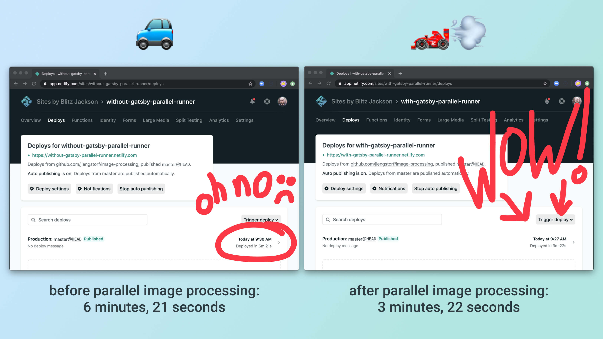

## なにこれ

自分のブログ(Gatsby製)のビルドが遅すぎてNetlifyでタイムアウトしてしまうので、ビルドチューニングをしました。
15分以上かかっていたビルドが7分以下になり50%短縮できたので、その時の知見をまとめます。
割と地味な作業が多いですが、Gatsbyのビルド時間短縮に関するTipsを効果がある順にご紹介します。

- 🚀[1. 画像生成処理を並列化する](#1-%E7%94%BB%E5%83%8F%E7%94%9F%E6%88%90%E5%87%A6%E7%90%86%E3%82%92%E4%B8%A6%E5%88%97%E5%8C%96%E3%81%99%E3%82%8B)
- 🚅[2. 必要な画像だけクエリで取得する](#2-%E5%BF%85%E8%A6%81%E3%81%AA%E7%94%BB%E5%83%8F%E3%81%A0%E3%81%91%E3%82%AF%E3%82%A8%E3%83%AA%E3%81%A7%E5%8F%96%E5%BE%97%E3%81%99%E3%82%8B)
- 🚂[3. 生成画像の種類を減らす](#3-%E7%94%9F%E6%88%90%E7%94%BB%E5%83%8F%E3%81%AE%E7%A8%AE%E9%A1%9E%E3%82%92%E6%B8%9B%E3%82%89%E3%81%99)
- 🚗[4. 画像の縦横サイズを最適化する](#4-%E7%94%BB%E5%83%8F%E3%81%AE%E7%B8%A6%E6%A8%AA%E3%82%B5%E3%82%A4%E3%82%BA%E3%82%92%E6%9C%80%E9%81%A9%E5%8C%96%E3%81%99%E3%82%8B)
- 🚴🏻[5. 画像のファイルサイズを圧縮する](#5-%E7%94%BB%E5%83%8F%E3%81%AE%E3%83%95%E3%82%A1%E3%82%A4%E3%83%AB%E3%82%B5%E3%82%A4%E3%82%BA%E3%82%92%E5%9C%A7%E7%B8%AE%E3%81%99%E3%82%8B)
- 🏃🏻[6. 生成する画像をシンプル＆低クオリティにする](#6-%E7%94%9F%E6%88%90%E3%81%99%E3%82%8B%E7%94%BB%E5%83%8F%E3%82%92%E3%82%B7%E3%83%B3%E3%83%97%E3%83%AB%EF%BC%86%E4%BD%8E%E3%82%AF%E3%82%AA%E3%83%AA%E3%83%86%E3%82%A3%E3%81%AB%E3%81%99%E3%82%8B)
- 🏊🏻[7. netlify-plugin-gatsby-cacheを使う](#7-netlify-plugin-gatsby-cache%E3%82%92%E4%BD%BF%E3%81%86)
- 💎[番外編1: Circle CIでビルドしてNetlifyにデプロイする](#%E7%95%AA%E5%A4%96%E7%B7%A81-circle-ci%E3%81%A7%E3%83%93%E3%83%AB%E3%83%89%E3%81%97%E3%81%A6netlify%E3%81%AB%E3%83%87%E3%83%97%E3%83%AD%E3%82%A4%E3%81%99%E3%82%8B)

## なぜビルドが遅いのか → 画像生成に時間がかかっている

ビルド時間の内訳を見たところ、`Generating image thumbnails`に10分以上かかっており大半を締めていました。
これは[gatsby-image](https://www.gatsbyjs.org/packages/gatsby-image/)で様々なブラウザ幅に最適化するために、サイズ違いの画像を複数枚生成するための処理です。

gatsby-imageまわりのビルドチューニングについて、日本の記事をあまり見かけませんが、
英語の記事やGitHubでは、画像生成が遅いという記事をちらほら見かけました。
- [Improve Gatsby Build Speeds With Parallel Image Processing](https://www.netlify.com/blog/2020/02/25/gatsby-build-speed-improvements-with-parallel-image-processing/)
- [Gatsby build on Netlify fails(Image generation): Command did not finish within the time limit · Issue #8056 · gatsbyjs/gatsby](https://github.com/gatsbyjs/gatsby/issues/8056)
- [Gatsby stuck on generating image thumbnails · Issue #23033 · gatsbyjs/gatsby](https://github.com/gatsbyjs/gatsby/issues/23033)

あとGatsbyの公式ドキュメントでも画像の取り扱いについて言及されています。
- [Preoptimizing Your Images | GatsbyJS](https://www.gatsbyjs.org/docs/preoptimizing-images/)

そのため、本記事では、いかに画像生成処理の時間を短縮するかをメインにTipsを紹介していきます。


## 1. 画像生成処理を並列化する

[gatsby-parallel-runner](https://github.com/netlify/gatsby-parallel-runner)で画像生成処理を並列化します。
何をやっているかというと、gatsby buildで一番重い画像生成処理を、[Google Cloud Platform](https://console.cloud.google.com/)(以降GCP)に投げて、並列で処理して結果を受け取るというプラグインです。GCPのアカウントが必要ですが、この方法が一番楽に劇的にビルド時間を短縮できます。
[Netlifyの記事](https://www.netlify.com/blog/2020/02/25/gatsby-build-speed-improvements-with-parallel-image-processing/)では6分21秒かかっていたビルドが3分22秒、およそ半分になったそうです。



設定方法は[Netlifyの記事](https://www.netlify.com/blog/2020/02/25/gatsby-build-speed-improvements-with-parallel-image-processing/)にキャプチャ付きで詳しく載っているので、そちらをご覧いただければ簡単に設定できると思います。GCPの環境をCLIで構築してNetlifyに環境変数を設定すればすぐに使えるようになります。


## 2. 必要な画像だけクエリで取得する

フィルタを全く指定しないクエリは、全ての画像を取得してしまうのでビルド時間が大幅に増えてしまいます。
そのため、クエリで取得する画像は他画像とフォルダを分けて、クエリのフィルタ条件を指定するなりしましょう。
そうすることで不必要に画像を取得せずに済み、ビルド時間を短縮できます。

```diff:title=フィルタ条件を付けて必要な画像だけ取得する
query {
-  // 全画像を取得してしまう
-  allFile {
+  // 検索条件を指定して必要な画像だけ取得するようにする
+  allFile(filter: {relativePath: {regex: "/^thumbnail/*/"}}) {
    edges {
      node {
        childImageSharp {
          fluid {
            ...GatsbyImageSharpFluid
          }
        }
      }
    }
  }
}
```
<br/>


### クエリのフィルタ条件をContext経由で指定する

例えば、トップページの上部にピックアップした３つ記事のサムネイル付きで表示する場合、
3つのサムネイル画像だけ取得するクエリを定義したいところですが、クエリに画像のパスをフィルタ条件としてハードコードしたくはないので、一旦、全てのサムネイルをクエリで取得して、JS(コンポーネント)中で3つにフィルタするようなケースがあります。この場合、不必要な画像も取得してしまうのでビルド時間が増えます。


StaticQueryなどは、その名の通りStaticなのでJS中の変数をフィルタ条件として使うことができませんが、
ページテンプレートに指定しているコンポーネントのクエリではContextの値がフィルタ条件として使えます。
これを利用して以下のように、3つの画像だけ取得するクエリを定義でき、不必要に画像を生成せずに済み、ビルド時間を短縮できます。


```js:title=config/featured-posts.js(クエリのフィルタ条件を設定ファイルに定義する)
// 設定ファイルで3つの画像パスを指定する
module.exports = {
  featuredPosts: [
    '/blog/2019/05/09',
    '/blog/2018/05/08',
    '/blog/2016/03/18'
  ],
};
```
<br/>

```js{1-2,7,12}:title=gatsby-node.js(Contextにクエリのフィルタ条件を指定する)
// 設定ファイルを読み込む
const { featuredPosts } = require('./config/featured-posts.js');

exports.createPages = ({ graphql, actions }) => {
  // 中略
  
  // ページ生成時にContextとして渡す
  createPage({
    path,
    component: postTemplate,
    context: {
      featuredPostPathList: featuredPosts,
    },
  });

  // 中略
});
```
<br/>


```jsx{3-4}:title=src/templates/post.jsx(Contextに指定した値をクエリのフィルタ条件に指定する)
// 中略
export const query = graphql`
  query($featuredPostPathList: [String]) {
    allMarkdownRemark(filter: { frontmatter: { path: { in: $featuredPostPathList } } }) {
      edges {
        node {
          frontmatter {
            cover {
              childImageSharp {
                fluid {
                  ...GatsbyImageSharpFluid
                }
              }
            }
          }
        }
      }
    }
  }
`;
// 中略
```
<br/>


なお`src/pages/index.jsx`のように`gatsby-node.js`で明示的にページ生成しないようなコンポーネントでも、以下のように`gatsby-node.js`の`onCreatePage`でページを再生成することでContextを指定できます。

```js{17-18}:title=gatsby-node.js
exports.onCreatePage = ({ page, actions }) => {
  const { createPage, deletePage } = actions

  // ルートページの場合のみ処理継続
  if (page.path !== '/') {
    return;
  }

  // いったんルートページを削除
  deletePage(page)

  // pageオブジェクトをもとにルートページを再生成
  createPage({
    ...page,
    context: {
      ...page.context,
      // Contextにクエリのフィルタ条件を指定
      featuredPostPathList: featuredPosts,
    },
  })
}
```
<br/>


## 3. 生成画像の種類を減らす

以下のように同じ画像でも、記事埋め込み用、OGP画像用などに違う縦横サイズ、クオリティを指定していると、画像生成枚数が増えて、ビルド時間も増えてしまいます。
少しの違いであれば、ある程度妥協して同じ縦横サイズ、クオリティを指定して、生成画像枚数を減らしましょう。
これにより、大幅にビルド時間を短縮できます。


```diff:title=縦横幅、クオリティを統一して生成画像枚数を減らす
  query {
    images: allFile(filter: {relativePath: {regex: "/^thumbnail/*/"}}) {
      edges {
        node {
          childImageSharp {
-            // 記事の最大幅にあわせた少し小さめで低品質な画像を取得
-            fluid(maxWidth: 800, quality: 50, pngQuality: 50) {
+            // 生成画像枚数を減らすために、あえて縦横幅、クオリティをサムネイルに合わせる
+            fluid(maxWidth: 1200, quality: 90, pngQuality: 90) {
              ...GatsbyImageSharpFluid
            }
          }
        }
      }
    }
  }

  // OGP画像用に少し大きめで高品質な画像を取得
  query {
    images: allFile(filter: {relativePath: {regex: "/^thumbnail/*/"}}) {
      edges {
        node {
          childImageSharp {
            fluid(maxWidth: 1200, quality: 90, pngQuality: 90) {
              ...GatsbyImageSharpFluid
            }
          }
        }
      }
    }
  }
```
<br/>


## 4. 画像の縦横サイズを最適化する

画像のサイズが大きいとビルド時間は指数関数的に増加します。
そのため、表示幅に併せて画像の縦横比を縮小しましょう。
例えば記事中で最大800pxで表示するような場合、Retina対応も考慮すると最大幅は800px * 2 = 1600pxで十分です。
そのためビルド前に1600pxより幅が大きい画像は全て1600pxに縮小しましょう。
[Sharp](https://github.com/lovell/sharp)というライブラリを使えばできます。
以下のようなスクリプトを定義して、package.jsonに`optimizeImages`のようなnpm scriptsを定義しましょう。

```javascript:title=scripts/optimize-images.js(画像縦横サイズ最適化スクリプト)
const sharp = require(`sharp`)
const glob = require(`glob`)
const fs = require(`fs`)
// 最適化したい画像のパスを正規表現で指定
const matches = glob.sync(`src/pages/**/*.{png,jpg,jpeg}`)
// Retinaを考慮し2倍にする
const MAX_WIDTH = 800 * 2

Promise.all(
  matches.map(async match => {
    const stream = sharp(match)
    const info = await stream.metadata()

    if (info.width <= MAX_WIDTH) {
      return
    }

    // 画像幅をMAX_WIDTHまで縮小して上書き
    const outputBuffer = await stream.resize(MAX_WIDTH).toBuffer()
    fs.writeFileSync(match, outputBuffer)
    console.log(`success resize markdown image. ${info.width} -> ${MAX_WIDTH}, ${match}`)

    return 'Success'
  })
)
```
<br/>

```json:title=package.jsonのnpm scripts
  "scripts": {
    // 中略
    "optimizeImages": "node ./scripts/optimize-images.js",
    // 中略
  }
```
<br/>

こうすれば`npm run optimizeImages`で画像の縦横サイズを最適化できます。


## 5. 画像のファイルサイズを圧縮する

写真は無駄に高画質でファイルサイズが大きくなりがちです。
この場合、[imagemin](https://github.com/imagemin/imagemin)を使って画像のファイルサイズを圧縮しましょう。
以下のようなスクリプトを定義して、package.jsonに`compressImages`のようなnpm scriptsを定義しましょう。
jpegは[imagemin-mozjpeg](https://www.npmjs.com/package/imagemin-mozjpeg)、pngは[imagemin-pngquant](https://www.npmjs.com/package/imagemin-pngquant)を使えば画質をそれほど落とすことなく圧縮できます。


```javascript:title=scripts/compress-images(画像ファイルサイズ最適化スクリプト)
const glob = require(`glob`);
const fs = require(`fs`);
const path = require("path");
const imagemin = require('imagemin');
const imageminMozjpeg = require('imagemin-mozjpeg');
const imageminPngquant = require('imagemin-pngquant');

const addSizeInfo = (filePath) => {
  const state = fs.statSync(filePath);
  return {
    size: state.size,
    filePath
  }
};


(async () => {
  const matchesThumbnail = glob.sync(`src/images/thumbnail/**/*.{png,jpg,jpeg}`);
  const matchesPage = glob.sync(`src/pages/**/*.{png,jpg,jpeg}`);

  [...matchesThumbnail, ...matchesPage].map(addSizeInfo).forEach(async(factor) => {
    const filePath = factor.filePath;
    const fileDir = path.dirname(filePath)
    const fileExt = path.extname(filePath)

    if(['.png'].includes(fileExt)) {

      await imagemin([filePath], {
        destination: fileDir, // overwrite
        plugins: [
          imageminPngquant()
        ]
      });

      const compressedSize = fs.statSync(filePath).size;    
      console.log(`${factor.size} -> ${compressedSize} ${filePath}`);  

    } else if(['.jpg','.jpeg'].includes(fileExt)){

      await imagemin([filePath], {
        destination: fileDir, // overwrite
        plugins: [
          imageminMozjpeg()
        ]
      });

      const compressedSize = fs.statSync(filePath).size;    
      console.log(`${factor.size} -> ${compressedSize} ${filePath}`);  
    } else {
      console.log("Can't optimize", filePath)
    }
  })
})();
```
<br/>

```json:title=package.jsonのnpm scripts
  "scripts": {
    // 中略
    "compressImages": "node ./scripts/compress-images.js",
    // 中略
  }
```
<br/>

こうすれば`npm run compressImages`で画像のファイルサイズを圧縮できます。


## 6. 生成する画像をシンプル＆低クオリティにする

[gatsby-image](https://www.gatsbyjs.org/packages/gatsby-image/#gatsby-transformer-sharp)では、生成する画像の種類を以下のように選択できます。
レスポンシブ対応する場合`Fluid`系の画像の指定が必須ですが、
`GatsbyImageSharpFluid_tracedSVG`や`GatsbyImageSharpFluid_withWebp`はSVGやWebpなどの画像も併せて生成することになるので、ビルド時間は長くなってしまいます。　特にこだわりがなければ一番シンプルな`GatsbyImageSharpFluid`を選択するとビルド時間が短縮できるでしょう。

- `GatsbyImageSharpFixed` ← Fixed系はレスポンシブだと使えない
- `GatsbyImageSharpFixed_noBase64`
- `GatsbyImageSharpFixed_tracedSVG`
- `GatsbyImageSharpFixed_withWebp`
- `GatsbyImageSharpFixed_withWebp_noBase64`
- `GatsbyImageSharpFixed_withWebp_tracedSVG`
- `GatsbyImageSharpFluid` ← シンプル
- `GatsbyImageSharpFluid_noBase64` ← 最初に表示するBase64のぼかし画像がないが、それでいいなら一番シンプル
- `GatsbyImageSharpFluid_tracedSVG` ← SVGを生成するのでビルド時間が長くなる
- `GatsbyImageSharpFluid_withWebp` ← Webpを生成するのでビルド時間が長くなる
- `GatsbyImageSharpFluid_withWebp_noBase64`
- `GatsbyImageSharpFluid_withWebp_tracedSVG` <-SVGとWebpを生成するのでビルド時間がかなり長くなる
- `GatsbyImageSharpFluidLimitPresentationSize`

また、クエリで生成画像のクオリティを指定できます。
クオリティある程度妥協できるならば、低い値を指定することでビルド時間を短縮できます。

```graphql{8-9}:title=クオリティを下げることでビルド時間を短縮する
  query {
    images: allFile(filter: {relativePath: {regex: "/^thumbnail/*/"}}) {
      edges {
        node {
          childImageSharp {
            fluid(
              maxWidth: 800,
              quality: 50,
              pngQuality: 50
            ) {
              ...GatsbyImageSharpFluid
            }
          }
        }
      }
    }
  }
```
<br/>


## 7. netlify-plugin-gatsby-cacheを使う

Netlifyでビルド＆ホストしているなら、[netlify-plugin-gatsby-cache](https://github.com/jlengstorf/netlify-plugin-gatsby-cache)が使えます。
これは前回ビルド時のキャッシュを用いてビルド時間を短縮するためのNetlifyプラグインです。
**自分は、コレを導入したおかげで、記事を追加するだけならビルド時間が2分程度で済むようになりました。**

以下のように`netlify.toml`を設定し、package.jsonのnpm scriptで`gatsby build`にちょっとした引数を指定するだけキャッシュが有効になります。


```toml:title=netlify.toml(Netlifyの設定ファイル)
// 中略
[[plugins]]
  package = "netlify-plugin-gatsby-cache"
// 中略
```
<br/>

```json:title=package.jsonのnpm scripts
  "scripts": {
    // 中略
    "build": "GATSBY_EXPERIMENTAL_PAGE_BUILD_ON_DATA_CHANGES=true gatsby-parallel-runner build --log-pages",
    // 中略
  }

```
<br/>

ただ、こちらはキャッシュを使ったビルド時間短縮方法ですので、初回のビルドは短縮されません。
Netlifyのビルドでタイムアウトを解決したい場合の根本的な解決策にはならないので、気をつけてください。
キャッシュでビルド時間がタイムアウト時間以内に収まっていたとしても、ドラスティックな機能改修でほとんどキャッシュが効かない場合や、なんらかの不具合でキャッシュなしでクリーンビルドが必要になった場合、結局タイムアウトが発生してしまいます。
この場合は先にあげた1～6のTipsを実施して、根本的なビルド時間の短縮を図ってください。


## 番外編1: Circle CIでビルドしてNetlifyにデプロイする

本線からは少し脱線しますが、どうしてもNetlifyでタイムアウト問題が克服できない or ビルド時間が安定しない時はCircleCIを使ってビルドすると良いです。Netlify側でコケても、CircleCIでビルド検証ができるようになります。
CircleCIはタイムアウトになる心配もないし、Netlifyより少しビルドが早くなります。

開発用依存ライブラリに[netlify-cli](https://github.com/netlify/cli)して以下のスクリプトを定義しましょう。
なるべくキャッシュして次回以降のビルド時間を短縮するようにしています。
ビルドが終わったら、netlify-cliでビルド資産をNetlifyにdeployしています。
masterブランチの場合は`--prod`を指定して本チャンdeployになるようにしています。
deploy時は、Netlifyのトークンが必要になるので、事前にNetlifyでトークンを発行して、CircleCIの環境変数に設定してあげましょう。

```yaml:title=.circleci/config.yml(CircleCIの設定ファイル)
version: 2.1
executors:
  node-executor:
    docker:
      - image: circleci/node:12
commands:
  gatsby-build:
    steps:
      - checkout
      - restore_cache:
          keys:
            # when lock file changes, use increasingly general patterns to restore cache
            - node-v1-{{ .Branch }}-{{ checksum "package-lock.json" }}
            - node-v1-{{ .Branch }}-
            - node-v1-
      - run: npm install
      - save_cache:
          paths:
            - ~/usr/local/lib/node_modules  # location depends on npm version
          key: node-v1-{{ .Branch }}-{{ checksum "package-lock.json" }}
      - restore_cache:
          keys:
            - gatsby-public-cache-{{ .Branch }}
            - gatsby-public-cache-
      - run: GATSBY_CPU_COUNT=2 NODE_OPTIONS="--max-old-space-size=8192" npm run build
      - save_cache:
          key: gatsby-public-cache-{{ .Branch }}
          paths:
            - ./public
workflows:
  version: 2
  build-deploy:
    jobs:
      - build:
          filters:
            branches:
              ignore:
                - master
      - release:
          filters:
            branches:
              only:
                - master
jobs:
  build:
    executor: node-executor
    working_directory: ~/repo
    steps:
      - gatsby-build
        - run:
          name: Netlify Deploy
          command: ./node_modules/.bin/netlify deploy --dir=public --message "deploy preview from $CIRCLE_BRANCH" --auth $NETLIFY_ACCESS_TOKEN
  release:
    executor: node-executor
    working_directory: ~/repo
    steps:
      - gatsby-build
        - run:
          name: Netlify Deploy
          command: ./node_modules/.bin/netlify deploy --prod --dir=public --message "deploy from $CIRCLE_BRANCH" --auth $NETLIFY_ACCESS_TOKEN
```

## 番外編2:効果がみられなかった取り組み

ビルド時間短縮のためアレコレと試しましたが、効果がなかったものもあります。


### 画像取得系StaticQueryを集約する

複数箇所に散らばっていStaticQueryを１つコンポーネントに集約してみました。
確かにクエリの実行回数は減りましたが、画像生成枚数は変わらないのでビルド時間は短縮されませんでした。


### クエリをgatsby-node.jsに集約する

上記と似ていますが、すべてのクエリを`gatsby-node.js`で発行して、クエリの結果をContextで各ページのコンポーネントに渡すようにしても、ビルド時間は短縮されませんでした。

また`gatsby-node.js`にクエリを集約するのは、以下のような弊害もあるため、あまりオススメしません。
- `gatsby develop`時に`gatsby-node.js`を修正してもホットリロードされない
- ページのコンポーネントで使うデータを取得するためのクエリが、`gatsby-node.js`という離れた場所にあるので管理しづらい
- クエリでGraphQLのフラグメントが使えない 
  - gatsby-imagesのGatsbyImageSharpFluidなどが使えないので、以下のようにフラグメントに定義されてる全プロパティを書き出す必要があります。

```graphql{7-11}:title=gatsby-node.js中で画像取得クエリを書く場合はフラグメントが使えない
query {
  allFile(filter: {relativePath: {regex: "/^thumbnail/*/"}}) {
    edges {
      node {
        childImageSharp {
          fluid {
            base64
            aspectRatio
            src
            srcSet
            sizes
          }
        }
      }
    }
  }
}
```
<br/>


## まとめ

Gatsbyは割とgatsby-imageとの戦いで、画像の取り扱いが面倒くさく、ビルド時間も長くなりがちですが、
今回紹介したようなTipsを使えば、ある程度ビルド時間は短縮できます。
ただ、これらTipsを実施してもビルド時間が短縮できない場合は、いっそのことgatsby-imageを使うのをやめて、
他の画像ホスティングサービスを使うのもアリなんじゃないかと思います🍅


## 参考

- [Improve Gatsby Build Speeds With Parallel Image Processing](https://www.netlify.com/blog/2020/02/25/gatsby-build-speed-improvements-with-parallel-image-processing/)
- [Open source parallel processing for Gatsby - DEV Community 👩‍💻👨‍💻](https://dev.to/biilmann/open-source-parallel-processing-for-gatsby-270d)
- [Preoptimizing Your Images | GatsbyJS](https://www.gatsbyjs.org/docs/preoptimizing-images/)
- [Use Imagemin to compress images](https://web.dev/use-imagemin-to-compress-images/)
- [gatsby-plugin-sharp | GatsbyJS](https://www.gatsbyjs.org/packages/gatsby-plugin-sharp)
- [Enable Gatsby Incremental Builds on Netlify](https://www.netlify.com/blog/2020/04/23/enable-gatsby-incremental-builds-on-netlify/)
- [Building gatsby on CircleCi and deploying on Netlify — Orestis Ioannou](https://oioannou.com/build-on-circleci-deploy-netlify)
- [Use Imagemin to compress images](https://web.dev/use-imagemin-to-compress-images/)
- [5 Optimizations to Get Faster Gatsby Builds Today](https://www.netlify.com/blog/2020/06/11/5-optimizations-for-faster-gatsby-builds/)
