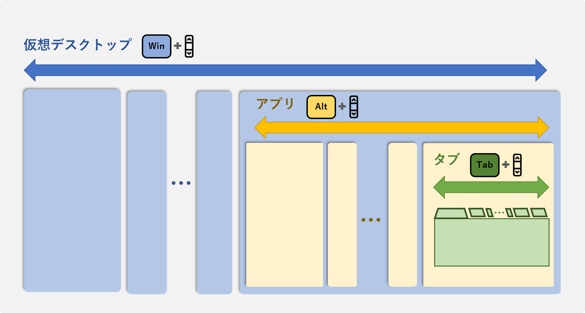

## なにこれ

Windowsでキーバインドをお気軽にいじれる[AutoHotkey](https://www.autohotkey.com/)の紹介です。３ヶ月使ってみて色々な設定を試した結果、その中でも特に便利だと感じたマウススクロールと修飾キーの組合せについてご紹介します。

## AutoHotkeyとは

Windows版で提供されているソフトウェアで、専用のプログラミング言語でキーバインドを定義すれば、任意のキー入力に対してスクリプトを実行できます。既存のキーに別のキーの割当てたり、複雑なショートカットコマンドの割当が可能です。

### 良い部分

**サクッと導入して合わなかったらサクッと廃止できます。**  
同じようなものでWindowsの[Change Key](https://forest.watch.impress.co.jp/library/software/changekey/)やMacの[Karabiner Elements](https://karabiner-elements.pqrs.org/)がありますが、AutoHotkeyはアプリレイヤーで制御するので、アプリを終了すれば通常操作に戻れて、レジストリをいじったりしなくて良いという手軽さが魅力です。

### イマイチな部分

**独自言語で設定します。**  
言語仕様はAutoHotkey公式リファレンスを見て学習が必要です。
少し独特な言語で処理をどこでreturnするか分かりづらい気がします。

**リモート接続PCでは効きません。**  
リモート接続先のPCの操作に対してはAutHotkeyの設定は有効になりません。テレワークでリモートPC操作がメインの方だとイマイチかもしれません。これはChange KeyもKarabiner Elementsも同じですが...

## 実例紹介：全体像

Windowsだと`Ctrl`+スクロールは拡大/縮小、`Shift`+スクロールは横スクロールになっています。
このノリを`Win`,`Alt`,`Tab`にも拡張する感じでAutoHotkeyで設定します。  
右手でマウススクロールしながら、左手で`Win`,`Alt`,`Tab`を押下することで、目的のデスクトップ・アプリ・タブに素早く直感的に移動できます。



## 実例紹介：ソースコード

まずはソースコード全量を示します。

```bash:title=AutoHotkey設定ファイルの実例
; 仮想デスクトップ間移動
~LWin & WheelUp::send,^#{Left}
~LWin & WheelDown::send,^#{Right}

; アプリ間移動
~LAlt & WheelDown::AltTab 
~LAlt & WheelUp::ShiftAltTab

; Tabの修飾キー化
$Tab::
  startTime := A_TickCount
  KeyWait, Tab
  keyPressDuration := A_TickCount - startTime
  If (A_ThisHotkey == "$Tab" and keyPressDuration < 200) {
    Send, {Blind}{Tab}
  }
Return

; タブ間移動：VSCode
#IfWinActive ahk_exe Code.exe
  ~Tab & WheelUp::send,^{PgUp}
  ~Tab & WheelDown::send,^{PgDn}
Return
#IfWinActiveW

; タブ間移動：Chrome
#IfWinActive ahk_exe chrome.exe
  ~Tab & WheelUp::send,^+{tab}
  ~Tab & WheelDown::send,^{tab}
Return
#IfWinActiveW
```

<br/>

以下で処理の塊ごとに説明します。

### 仮想デスクトップ間移動

`Win` + スクロール実行時に、`Win` + 左右矢印を発動するように設定します。
`Left`,`Right`の向きは好みによって変えてください。

```bash
~LWin & WheelUp::send,^#{Left}
~LWin & WheelDown::send,^#{Right}
```

### アプリ間移動

同じように`Alt`+ スクロール実行時に、`Alt`+`Tab`を発動するように設定します。

```bash
~LAlt & WheelDown::AltTab 
~LAlt & WheelUp::ShiftAltTab
```

<br/>

※ちなみに`Alt`+`Tab`のアプローチは複数選択肢がありますが、`Alt`を押し続ける必要があり、１つのキーで代替するのは難しく皆さん実現に苦労されているようです。

### タブ移動

Tabは修飾キー化が必要です。  

```bash
$Tab::
  startTime := A_TickCount
  ; 押し続けている限りリピートせず待機
  KeyWait, Tab
  keyPressDuration := A_TickCount - startTime
  ; 押下中に他のホットキーが発動した場合は入力無し い
  ; 長押しの場合も入力無し
  If (A_ThisHotkey == "$Tab" and keyPressDuration < 200) {
    Send, {Blind}{Tab}
  }
Return
```

<br/>

さらにアプリ毎にショートカットキーが異なるのでアプリ別に設定します。

```bash
;マウスホイールでタブ移動（VScode）
#IfWinActive ahk_exe Code.exe
  ~Tab & WheelUp::send,^{PgUp}
  ~Tab & WheelDown::send,^{PgDn}
Return
#IfWinActiveW

;マウスホイールでタブ移動（クローム）
#IfWinActive ahk_exe chrome.exe
  ~Tab & WheelUp::send,^+{tab}
  ~Tab & WheelDown::send,^{tab}
Return
#IfWinActiveW
```

## まとめ

今回紹介したのはスクロールとの組み合わせでしたが、AutoHotkeyは他にもさまざまな設定ができるので便利です。是非使ってみてください🍅
